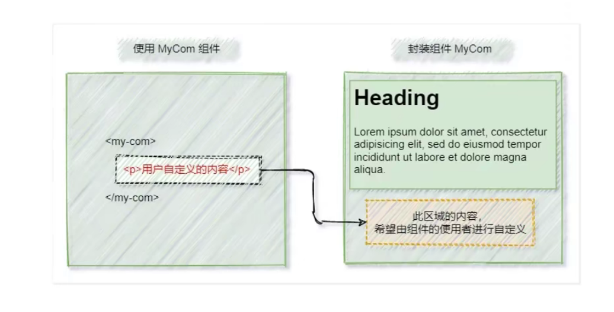
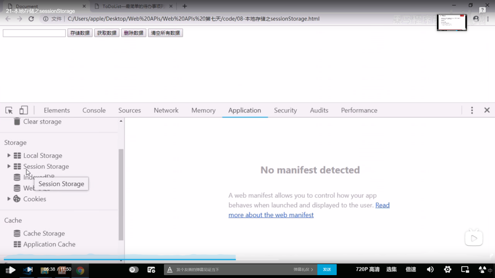

vue2

### 什么是vue

1. vue是构建用户界面的框架
   + 构建用户界面：vue往html页面填充数据
   + 框架：框架是一套现成的解决方案，程序员按照框架的规范去编写业务功能
2. vue是mvvm中的vm, 是连接数据与页面结构的桥梁

### vue的两个特性

1. 不用手动操作Dom元素就可以==数据驱动视图更新==

2. 与form表单配合，不用手动操作dom元素实现==数据双向绑定==

   + js里的数据变化，页面的数据就变化
   + 页面的数据变化，js的数据也跟着变化

   > 注意：vue的数据驱动视图和双向的数据绑定的底层原理就是MVVM(Model数据源  View页面结构  ViewModel就是vue实例对象)

### vue指令

> vue指令里面主要是写简单js表达式；比如，一个data里的变量，可以完全是字符串，字符串的拼接，模板语法，加减乘除；

#### 1. 内容渲染指令

+ `v-text`的缺点：会覆盖原有的内容，开发中用的比较少
+ `{{}}`：插值表达式，只是内容的占位符，不会覆盖原有的内容，开发中用的比较多
+ `v-html`：可以把带有标签的字符串渲染成真正的html内容

#### 2. 属性绑定指令

+ `v-bind`：可以为标签的属性动态绑定值，简写为英文的`:`    ；

  + 绑定的属性的值要写双引号，双引号里的单引号是字符串，没加单引号就是data里变量；

  + 属性绑定指令的双引号里和插值表达式的花括号里支持写简单的js语法；

    ```html
    <body>
      <div id="app">
        <!-- 把字符串转数组，把数组反转，再转字符串 -->
        {{ msg.split('').reverse().join('') }}
        <!-- 三元运算符 -->
        {{ flag ? 'yes' : 'no' }}
        <!-- 属性绑定指令里的js表达式 -->
        <div v-bind:class="cname + '-1'"></div>
        <div title="555">1111</div>
    
      </div>
    </body>
    <script src="../lib/vue.js"></script>
    <script>
      const vm = new Vue({
        el: "#app",
        data: {
          msg: 'hello',
          flag: 'true',
          cname: 'list'
        }
      })
    </script>
    ```

    

> 1. 注意：插值表达式只能用在标签的内容节点上，不能用在属性的节点上；
> 2. `array.reverse()`：反转数组的排序；
> 3. `alt`属性是在你的图片因为某种原因不能加载时在页面显示的提示信息，它会直接输出在原本加载图片的地方，而`title`属性是在你鼠标悬停在该图片上时显示一个小提示，鼠标离开就没有了；

#### 3. 事件绑定指令

+ `v-on`：绑定事件，为事件添加methods里的事件处理函数；简写为英文的`@`   ；

  ```html
  <body>
    <div id="app">
      {{count}}
      <button v-on:click="addCount">点击</button>
    </div>
  </body>
  <script src="../lib/vue.js"></script>
  <script>
    const vm = new Vue({
      el: "#app",
      data: {
        count: 0
      },
      methods: {
        addCount: function(){
          this.count++
        }
      },
    })
  </script>
  ```

  > 事件有：键盘事件，点击事件，输入事件。
  >
  > + input输入事件有：
  >
  > 1. onfocus  当input 获取到焦点时触发
  >
  > 2. onblur  当input失去焦点时触发，注意：这个事件触发的前提是已经获取了焦点再失去焦点的时候才会触发该事件，用于判断标签为空。
  >
  > 3. onchange 当input失去焦点并且它的value值发生变化时触发，个人感觉可以用于注册时的确认密码。
  >
  > 4. onkeydown 按下按键时的事件触发，
  >
  > 5. onkeyup 当按键抬起的时候触发的事件，在该事件触发之前一定触发了onkeydown事件--相当于一个按键，两个事件，没怎么用过
  >
  > 6. onclick  主要是用于 input type=button，input作为一个按钮使用时的鼠标点击事件
  >
  > 7. onselect  当input里的内容文本被选中后执行，只要选择了就会触发，不是全部选中
  >
  > 8. oninput  当input的value值发生变化时就会触发，（与onchange的区别是不用等到失去焦点就可以触发了）
  >
  > + 键盘事件：
  >
  > 1. onkeyup  按键抬起触发；
  > 2. onkeydown  按键按下触发；
  > 3. onpress  按键抬起和按下触发；
  >
  > + 点击事件：
  >
  > 1. onclick  鼠标点击事件；

+ vue绑定的事件，都要把原生的写法on去掉；

+ 事件对象

  + js原生的事件对象

    ```html
    <body>
      <button id="btn">+</button>
    </body>
    <script>
      var btn = document.getElementById('btn');
     
      btn.onclick = function(e) {
        //e是事件对象
        console.log(e);
        //e.target是指这个事件必须依赖于这个目标才可以被触发，就是button标签
        console.log(e.target);
      }
    </script>
    ```

  + vue内置的事件对象`$event`。

    > 注意：如果methods里的方法有一个形参，调用时没有输入实参，那么这个形参可以当成事件对象去使用；
    >
    > 如果调用时有输入参数，那么形参不再是事件对象，实参必须再传入$event代表事件对象，那么形参就有两个。
    >
    > 因为vue里的methods的函数是普通函数的形式，且被调用在vue绑定的范围内，应该认为是vue调用这个函数，而不是当前绑定的那个标签，所以this指向vue实例对象(详细看扩展的this指向问题)，因此在vue里不能用this代替e.target，只能是$event的形式；

    ```html
    <body>
      <div id="app">
        {{count}}
        <!-- 如果调用事件处理函数没有传入实参，就可以在函数定义时传入形参为e事件处理对象；如果函数调用时有传入
        实参，且要使用事件对象，就还要传入一个实参$event, 这是vue固定的内置参数，不能改； -->
        <!-- <button v-on:click="addCount">点击</button> -->
        <button v-on:click="addCount(2,$event)">点击</button>
      </div>
    </body>
    <script src="../lib/vue.js"></script>
    <script>
      const vm = new Vue({
        el: "#app",
        data: {
          count: 0
        },
        methods: {
          addCount: function(n, e){//注意形参的顺序要与实参的顺序对应，事件对象写在前面或者后面都可以，
            //只要与实参一一对应即可
            this.count += n;
            //e.target指这个事件所依赖的源头
            e.target.style.backgroundColor = 'red';
          }
        },
      })
    </script>
    ```

+ 事件修饰符

  + js原生的阻止事件冒泡和阻止默认事件；

    ```js
     var a = document.getElementById('a');
    
     
      a.onclick = function(e) {
        //阻止默认事件
        e.preventDefault();
    
        //阻止事件冒泡
        e.stopPropagation();
        
      }
    ```

  + `prevent`：阻止默认事件；

  + `stop`：阻止事件冒泡；

    ```html
    <body>
      <div id="app" @click="divHandler">
        <!-- 阻止默认事件又阻止事件冒泡 -->
        <a href="http://www.baidu.com" @click.prevent.stop="aHandler">百度</a>
      </div>
    </body>
    <script src="../lib/vue.js"></script>
    <script>
      const vm = new Vue({
        el: '#app',
        data: {
    
        },
        methods: {
          aHandler() {
            console.log('aHandler')
          },
          divHandler() {
            console.log('divHandler')
          }
        },
      })
    </script>
    ```

    > 事件冒泡：当子元素和父元素绑定的事件相同时，子元素的事件触发会往上冒泡触发父元素的事件。

  + `capture`：以捕获的模式触发当前的事件处理函数；

  + `once`：绑定的事件只触发一次；

  + `self`：只有当event.target是当前元素自身时才会触发事件处理函数，事件冒泡无法触发当前被self修饰的元素的事件；

+ 按键修饰符

  + 按键修饰符是修饰键盘事件的，因为某个元素只要绑定了键盘事件，按键盘的任意位置都可以触发键盘事件处理函数，添加了按键修饰符之后，就指定了某个固定的按键才可以触发键盘事件进而执行事件处理函数；

    > 注意：指定哪个按键触发键盘事件，就直接写该按键名即可，数字除外；

    ```html
    <body>
      <div id="app">
        <!-- 按下esc清除，如果事件处理函数调用时没有实参，定义函数时有形参，该形参可以当成事件对象使用，
        事件对象的target就是这个input元素-->
        <input type="text" @keyup.esc="clearInput" placeholder="按esc清除">
          <!-- 按k键触发键盘键盘事件 -->
        <input type="text" @keyup.k="k" placeholder="按k键输出kkk">
        <!-- 按enter键触发键盘键盘事件 -->
        <input type="text" @keyup.enter="enter" placeholder="按enter键输出enter">
    
      </div>
    </body>
    <script src="../lib/vue.js"></script>
    <script>
      const vm = new Vue({
        el: '#app',
        data: {
    
        },
        methods: {
          clearInput(e) {
            console.log('触发了clearInput');
            e.target.value = '';
          },
          k() {
            console.log('kkk')
          },
          enter() {
            console.log('enter')
          }
         
        },
      })
    </script>
    ```

#### 4. 数据双向绑定指令

+ `v-model`：在不操作DOM节点的前提下，可以实现表单的数据变化，data里的数据跟着变化；data里的数据变化，表单里的数据也跟着变化；(不然的话要先拿到表单的dom节点的value，去改变data里的数据；)

  + `v-model`：相当于是表单元素的value属性，但是，value无法驱动data里的数据改变，v-model可以；

  > 注意：要配合表单一起使用，input, select, textarea等表单元素一起使用；

  ```html
  <body>
    <div id="app">
      <input type="text" v-model="msg">
  
      <select v-model="city">
        <option value="">请选择城市</option>
        <option value="1">北京</option>
        <option value="2">上海</option>
        <option value="3">广州</option>
      </select>
    </div>
  </body>
  <script src="../lib/vue.js"></script>
  <script>
    const vm = new Vue({
      el: '#app',
      data: {
        msg: 'hello',
        city: ''
      }
    })
  </script>
  ```

+ `v-model`与复选框的配合

  ```html
  <body>
    <div id="app">
      <input type="checkbox" v-model="status">
      <p v-if="status">显示</p>
      <p v-else>关闭</p>
      <!-- v-model在复选框起作用，因为复选框可以多次改变当前的元素的状态，是被选中或不被选中；
      v-model是true代表被选中checked,false就是不选中；通过v-model改变status的布尔值进而改变
      被v-if控制标签控制的显示与否 -->
  
      <input type="radio" name="k">
      <input type="radio" name="k" v-model="status">
      <!-- v-model在单选框不起作用 -->
      <input type="radio" name="k">
      
    </div>
  </body>
  <script src="../lib/vue.js"></script>
  <script>
    const vm = new Vue({
      el: '#app',
      data: {
        status: true
      }
    })
  </script>
  ```

  

+ `v-model`的修饰符

  + 方便用户对输入的内容进行处理；

    + `.number`：因为用户在表单输入的值不论是数字还是字符串，最终通过value拿到的是字符串；虽然vue不再手动操作DOM节点，但是原理还是一样，v-model的值改变进而改变data里的值，data里值变成字符串；.number就是把字符串变成数字；

      ```html
      <body>
        <div id="app">
          <input type="text" v-model="n1"> + <input type="text" v-model="n2"> = {{ n1 + n2 }}
          <!-- 如果不加.number就会变成字符串的拼接 -->
          <hr>
          <input type="text" v-model.number="n3"> + <input type="text" v-model.number="n4"> = {{ n3 + n4 }}
          <!-- 加了.number就会把用户输入的值转化为数值类型 -->
        </div>
        
      </body>
      <script src="../lib/vue.js"></script>
      <script>
        const vm = new Vue({
          el: '#app',
          data: {
            n1: 0,
            n2: 0,
            n3: 0,
            n4: 0
          }
        })
      </script>
      ```

    + `.trim`：自动过滤用户输入的首尾空白符；只会过滤用户输入内容的首尾空白符，中间的空白符是不会过滤的；

      + 使用：`v-model.trim=" xxx "`

    + `.lazy`：在“change”时而非“input”时更新；输入事件change指用户输入后离开焦点才会触发；input指用户只要对输入框的值进行改变就会立马触发该事件；使用v-model时表单默认是绑定input事件，一旦输入框值改变就立马改变data里的值；所以使用`v-model.lazy=" xxx "`，就是变成绑定change事件，离开焦点才改变data里的值；

      > 注意：不论是原生 js 还是 vue ，只要页面有一个变量显示出来，一旦那个变量改变，页面就会重新渲染，更新变量值显示出来；使用`.lazy`可以防止输入数值过程中时时改变页面的值，只等失去焦点才改变页面值；

#### 5. 条件渲染指令

+ 通过对条件的判断，如果结果为 true 就显示元素，如果结果为 false 就隐藏元素；

  + `v-show`原理：通过对元素动态的添加或移除 display:none 来显示元素或隐藏元素；如果要对元素进行频繁的切换，`v-show`，性能更好；

  + `v-if`原理：通过对元素动态的创建或移除来显示或隐藏元素；如果刚开始指令的条件是 false ，被它控制的元素是没有被创建的，相对于`v-show`性能更好；

    + `v-if`的配套指令：

      ```html
      <body>
        <div id="app">
          <p v-if="type === 'A'">优秀</p>
          <p v-else-if="type === 'B'">良好</p>
          <p v-else-if="type === 'C'">一般</p>
          <p v-else>差</p>
          <!-- v-else就不用写判断条件了 -->
        </div>
      </body>
      <script src="../lib/vue.js"></script>
      <script>
        const vm = new Vue({
          el: '#app',
          data: {
           type: 'A'
          }
        })
      </script>
      ```

      

  > 注意：
  >
  > 1. 在实际的开发中，不用考虑性能问题，没必要，`v-if`被使用的比较多；
  >
  > 2. `v-if`与`v-else`只能是在兄弟标签之间一起使用，即两者作用的元素必须同级；否则就都通过`v-if`去判断；
  >
  >    

#### 6. 列表渲染指令

+ `v-for`：基于一个数组来循环渲染一个列表结构；

  + item, index既可以写在当前v-for控制的元素，也可以写在当前元素的子元素内；如果不需要index，就写一个item即可，可以把括号去掉；

  > 注意：使用`v-for`指令，官方推荐在该元素上再绑定一个 :key 的属性，且最好该属性的值为 item.id ；不要使用index作为该属性的值；key 值必须具有唯一性，即不能重复；key 值可以为字符串或数字，但是不建议用字符串；

  ```html
  <body>
    <div id="app">
      <ul>
        <li v-for="(item, index) in list" :title="item.name + index" :key="item.id">
          <span> {{ item.name }} </span>
        </li>
      </ul>
    </div>
  </body>
  <script src="../lib/vue.js"></script>
  <script>
    const vm = new Vue({
      el: '#app',
      data: {
        list: [
          {id: 1, name: '张三'},
          {id: 2, name: '李四'},
          {id: 3, name: '王五'},
          {id: 4, name: '小六'}
        ]
      }
    })
  </script>
  ```
  
  > 注意：
  >
  > 在使用`v-for`时，必须要绑定`:key`属性，且属性值为`item.id`，否则会报错；如果没有`item.id`，且又要防止报错，可以尝试使用索引绑定`key`值，虽然没意义，只是为了防止报错；
  >
  > ```vue
  >  
  > ```
  >
  > 

###  过滤器

+ 过滤器常用来对文本进行格式化，过滤器可以用在两个地方，插值表达式和v-bind属性绑定的地方；

+ 过滤器是一个函数，要 return 出一个返回值替代插值表达式的内容；

+ `|`：代表管道符，表示调用过滤器函数，管道符前面的变量是过滤器要格式化的文本，它永远是过滤器的第一个参数，当只用一个参数时默认函数调用时不用写实参；当函数定义时有两个形参，函数调用时要写一个实参；以此类推；

+ 如果全局过滤器和私有过滤器的名字冲突了，就近原则调用私有过滤器；

+ 过滤器分为私有过滤器和全局的过滤器；

  + 私有的过滤器( `filters` )

    ```html
    <body>
      <div id="app">
        <!-- 在插值使用过滤器 -->
        <p>{{ message | capitalize }}</p>
    
        <!-- 在属性绑定使用过滤器 -->
        <p :title="name | capitalize">这是p标签</p>
        
      </div>
    </body>
    <script src="../lib/vue.js"></script>
    <script>
      const vm = new Vue({
        el: '#app',
        data: {
         message: 'hello',
         name: 'ppp'
        },
        methods: {
         
        },
        filters: {
          //把字符串的首字母变成大写
          capitalize(val) {
            let first = val.charAt(0).toUpperCase();
            let other = val.substring(1);
            return first + other;
          }
          // capitalize: function(){}
        }
      })
    </script>
    ```

  + 全局过滤器( `filter` )，所有的vue实例都可以使用，一般都是使用全局过滤器；

    ```html
    <body>
      <div id="app">
       
        <p>{{ message | dd('你好') }}</p>
    
      </div>
    </body>
    <script src="../lib/vue.js"></script>
    <script>
      Vue.filter('dd', (val,val2) => {
        return val + val2
      })
        
      const vm = new Vue({
        el: '#app',
        data: {
         message: 'hello',
       
        },
        methods: {
         
        }
      })
    </script>
    ```

+ 可以连续调用多个过滤器

  

#### 使用 dayjs 插件格式化时间，日期

1. 先导入dayjs的库文件，就可以在window全局使用`dayjs()`方法；

2. 直接调用`dayjs()`得到的是当前的时间，还未格式化成我们想要的格式； 

3. 通过`dayjs(需要格式化的日期时间).format(最后的格式)`；

4. [dayjs的使用文档链接](https://dayjs.fenxianglu.cn/)

   ```html
   <body>
     <div id="app">
      
       <p>{{ date | dateFormat }}</p>
   
     </div>
   </body>
   <script src="../lib/vue.js"></script>
   <!-- 导入dayjs的库文件，在window全局就可以使用，dayjs()方法 -->
   <script src="../lib/dayjs.min.js"></script>
   <script>
     //全局过滤器
     Vue.filter('dateFormat', (val) => {
       return dayjs(val).format('YYYY-MM-DD HH:mm:ss')
       //格式的模板参照dayjs的文档
     })
   
     const vm = new Vue({
       el: '#app',
       data: {
   
        date: new Date(),
      
       }
     })
   </script>
   ```

   

> 注意：过滤器只有在vue2可以使用，在vue3已经没有这个功能了；

### watch侦听器

+ 要指明是侦听data里的哪个数据，把该数据名作为watch里的函数名，不用加this；

+ 侦听器是监听data里的数据，data里的数据一旦变化，就会立即执行处理函数；

+ 函数有两个形参，`newval`代表监听的数据变化后的新值，`oldval`代表监听的数据变化之前的旧值，新值在前，旧值在后；

  + 侦听器的典型应用场景：用户注册账户，时时判断该数据是否被注册，不用使用input事件；

  + ==方法格式的侦听器==：

    + 缺点1：一进入到页面不会触发执行处理函数，要侦听的数据变化才会执行处理函数；

    + 缺点2：如果侦听的data里的属性的值是一个对象或数组，对象中的属性值或数组的元素变化了，不会被侦听器侦听到（即只能侦听基本类型）；

      > 正常情况下是写成方法格式就可以了，除非方法格式侦听器满足不了我们的需求；

  ```html
  <body>
    <div id="app">
     
     <input type="text" v-model="username">
  
    </div>
  </body>
  <script src="../lib/vue.js"></script>
  <script src="../lib/jquery.js"></script>
  <script>
   
    const vm = new Vue({
      el: '#app',
      data: {
        username: ''
      },
      watch: {
        username(newval,oldval) {
          if(newval == '') return;//如果用户名为空就停止请求
  
          $.get('xxxxxxxxx' + newval,function(result){
            xxxxxxxxx
          })
  
        }
      }
    })
  </script>
  ```

  + ==对象格式的侦听器==；

    + 好处1：可以通过`immediate`选项为`true`让侦听器打开页面时自动触发一次，接着数据变化也同样触发处理函数；

      + 默认情况下，`immediate`的值是false;
      + `handler`是固定的写法；

      ```html
      <body>
        <div id="app">
         
         <input type="text" v-model="username">
      
        </div>
      </body>
      <script src="../lib/vue.js"></script>
      <script>
       
        const vm = new Vue({
          el: '#app',
          data: {
            username: 'admin'
          },
          watch: {
            //侦听username的变化
           username: {
      
             handler(newval, oldval) {  //处理函数
               console.log(newval, oldval)  //admin undefined
      
             },
            //  handler: function(newval, oldval){}
            immediate: true
           }
          }
        })
      </script>
      ```

    + 好处2：通过`deep`选项为`true`，开启深度监听，可以侦听到data里的属性的属性值是对象时，对象里的属性值变化会触发侦听器处理函数（可以侦听引用类型）；

      + 错误示范：

        ```html
        <script src="../lib/vue.js"></script>
        <script>
          const vm = new Vue({
            el: '#app',
            data: {
              username: {
                id: 1
              }
            },
            watch: {
              //侦听username的变化，这是方法格式侦听器，id变化侦听不到；
             username: function(newval, oldval){
              console.log(newval, oldval)
             }
            }
          })
        </script>
        ```

      + 正确示范：

        ```html
        <body>
          <div id="app">
            <input type="text" v-model="username.id">
          </div>
        </body>
        <script src="../lib/vue.js"></script>
        <script>
          const vm = new Vue({
            el: '#app',
            data: {
              username: {
                id: 1
              }
            },
            watch: {
              //侦听username的变化，这是对象格式侦听器，id变化可以侦听到；
              username: {
                handler(newval, oldval) {
                  console.log(newval.id, oldval.id)
                  //新值和旧值一样，都是新值，目前暂时不管；
                },
                //开启深度监听
                deep: true
              }
            }
          })
        </script>
        ```

+ 可以把深度监听的对象格式的侦听器改为方法格式的侦听器；

  + 开启深度监听是为了监听引用类型的数据（对象，数组）；如果直接监听对象的属性，且该属性是基本类型，就可以改为方法格式侦听器；

    ```html
    <body>
      <div id="app">
        <input type="text" v-model="username.id">
      </div>
    </body>
    <script src="../lib/vue.js"></script>
    <script>
      const vm = new Vue({
        el: '#app',
        data: {
          username: {
            id: 1
          }
        },
        watch: {
          //username.id是一个表达式，要加引号；
          'username.id'(newval, oldval) {
            console.log(newval, oldval)
          }
        }
      })
    </script>
    ```


### 计算属性

+ 计算属性是指经过一系列的运算之后return得到一个vue实例对象的属性；

+ 只要依赖的数据源发生了变化，计算属性就会重新进行计算；数据源可以是data里的数据；也可以没有data里的数据，全是字符串也可以；

+ 计算属性本质是一个函数，通过这个函数return出一个属性值；

+ 计算属性跟data里的属性一样，都是vue实例对象的属性，data里的数据怎么使用，计算属性就怎么使用；

+ 用途：当一个数据的值是由别的数据的变化决定的，就可以使用计算属性；

+ 特点：主要是实现了代码的==复用==；

  ```html
  <body>
    <div id="app" >
      <!-- 计算属性可以被用在属性绑定指令里，可以被用在插值表达式里 -->
      <p :style="{backgroundColor: color}">{{ color }}</p>
  
      <input type="text" v-model.number="r">
      <input type="text" v-model.number="g">
      <input type="text" v-model.number="b">
  
      <button type="button" @click="print">点击输出rgb</button>
  
    </div>
  </body>
  <script src="../lib/vue.js"></script>
  <script>
    const vm = new Vue({
      el: '#app',
      data: {
        r: '',
        g: '',
        b: ''
     
      },
      methods: {
        print() {
          // 通过this可以拿到计算属性
          console.log(this.color)
        }
      },
      computed: {
        color() {
          return `rgb(${this.r}, ${this.g}, ${this.b})`;
        }
        // color: function(){}
      }
    })
  </script>
  ```

### axios

+ `axios`：是前端圈最火的，专门用来的做数据请求的库；

+ 在npm 装axios ，在后面加 -S，表示在生产环境也要用到；

+ 在vue中一般都会用`axios`来做数据请求；

+ `axios`方法返回值是一个`promise`对象；

+ `axios`就像是服务器和浏览器之间的中间人，帮助浏览器建立请求给服务器，并接受返回值加了一层壳给浏览器；返回的数据要`result.data`拿到；

+ `axios`方法里的`params`的值是一个对象，里面是以查询字符串的方式传递的参数；

+ `axios`方法里的`data`的值是一个对象，里面是以请求体的方式传递的参数；

  + GET请求：

  ```js
   axios({
      method: 'GET',
      url: 'http://localhost:8080/axios',
      params: {
        dd: 555
      }
    }).then((result) => {
      console.log(result)
      console.log(result.data)//这个才是真实服务器返回的数据
    })
  
    // 因为axios方法的返回值是一个promise的对象，为什么要使用promise封装数据请求的方法，是为了不在请求完成
    // 之后回调函数嵌套回调函数；所以就要用.then()方法里面的成功之后的回调函数拿到返回的数据；
  ```

  + POST请求：

  ```js
   axios({
      method: 'POST',
      url: 'http://localhost:8080/axios',
      data: {
        dd: 555
      }
    }).then((result) => {
      console.log(result)
      console.log(result.data)
    })
  ```

  > 注意请求之前记得导入axios库文件；

+ `axios`请求的进化版本，使用`async await`：

  ```html
  <body>
    <button>点击发送请求</button>
  </body>
  <script src="./javascripts/axios.min.js"></script>
  <script>
    let btn = document.querySelector("button");
    btn.addEventListener('click', async function() {
        const result = await axios({
        method: 'POST',
        url: 'http://localhost:8080/axios',
        data: {
          dd: 555
        }
        })
      // 使用async await的好处就是可以直接得到resolve(数据)带出来的数据，不再使用then(function(数据){})，
      //去拿数据； 
        console.log(result)  
        console.log(result.data) //这便是服务器返回的数据  
  
    })
  </script>
  ```

+ `axios`请求的最终进化版本，使用`async await`加解构赋值：

  + 因为使用`async await`加`axios`方法最终的返回值是套了一层壳的响应值的对象，可以使用解构赋值得到这个对象里的服务器返回的真实值`data`，而省去用`.data`拿到；然后可以对`data`进行解构赋值重命名为`res`，服务器返回的对象还有一个`data`属性而出现`data.data`；

  ```html
  <body>
    <button>点击发送请求</button>
  </body>
  <script src="./javascripts/axios.min.js"></script>
  <script>
    let btn = document.querySelector("button");
    btn.addEventListener('click', async function() {
        const { data: res } = await axios({
        method: 'POST',
        url: 'http://localhost:8080/axios',
        data: {
          dd: 555
        }
        })
  
        console.log(res) //这个便是服务返回的真实值；
  
    })
  
  </script>
  ```

+ `axios`的get请求方法：

  + get方法里有两个参数，一个是url，一个是对象；如果要传参数就要写该对象，且该对象必须要有一个`params`属性，属性值也为对象；

    ```html
    <body>
      <button>点击发送请求</button>
    </body>
    <script src="./javascripts/axios.min.js"></script>
    <script>
      let btn = document.querySelector("button");
      btn.addEventListener('click', async function() {
    
        const { data: res } = await axios.get('http://localhost:8080/axios', { params: {
          id: 5
        } })
    
        console.log(res); //服务器返回的真实数据
      })
    </script>
    ```

+ `axios`的post请求方法：

  + post方法同样有两个参数，一个是url，一个是对象；如果要传参数就要写该对象，但是这个对象直接写要传递的参数就可以；

    ```html
    <body>
      <button>点击发送请求</button>
    </body>
    <script src="./javascripts/axios.min.js"></script>
    <script>
      let btn = document.querySelector("button");
      btn.addEventListener('click', async function() {
    
        const { data: res } = await axios.post('http://localhost:8080/axios', { id: 5 })
    
        console.log(res); //服务器返回的真实数据
      })
    </script>
    ```

    > 在`ajax`中：
    >
    > 1. `get`请求传递参数，只能以查询字符串的方式（在url的后面加`?xxx=xxx&xxx=xxx`），且不用设置`Content-Type`；
    > 2. `post`请求传递参数，既可以以查询字符串的方式，也可以以请求体的方式（正常都是请求体的方式）。
    >    + 以查询字符串的方式，同样不用设置`Content-Type`；
    >    + 以请求体的方式要设置请求头的`Content-Type`属性；
    >      + 传递的字符串为`xxx=xxx&xxx=xxx`格式，`Content-Type:application/x-www-form-urlencoded`；
    >      + 传递的字符串为对象的格式，`Content-Type:application/json`；


### 工程化开发的vue项目

#### vue-cli

+ 单页面应用程序：S(single)P(page)A(application)，顾名思义就是一个web网站只有唯一的一个html页面，页面的所有的功能与交互都是在这个唯一的页面完成的；

+ `vue-cli`：是vue.js开发的标准工具，简化了程序员基于webpack创建工程化的vue项目的过程，即不用自己去配置webpack；

+ 全局安装：`npm i -g @vue/cli`；

+ 基于`vue-cli`快速生成工程化的vue项目：`vue create 项目名称`；

  1. 选择一个想要放项目的文件夹；

  2. 点击进入文件夹，在路径上面输入`cmd`，回车；

     

  3. 在cmd面板输入`vue create 项目名称`；这个代码意思是在当前这个文件夹创建一个工程化vue项目文件夹；项目名称不要包含空格和中文；

  4. 初学者上下箭头选择`Manually select features`，代表自己选择要安装的模块等等；

  5. `) Choose Vue version   Babel  CSS Pre-processors`，目前先选择这三项；` Linter / Formatter`把这个去掉，这个是规范我们代码的格式的；

  6. `2.x`  `less`  `In dedicated config files`选择这三个；

  7. 项目文件夹创建好了之后，cd到这个项目的根目录，在终端输入`npm run serve`代表实时自动打包功能开启，并生成一个web服务器，输入网址就会出现`index.html`的页面；这个命令是在开发时使用的；在手动搭建的webpack里相当于`npm run dev`；

  8. 准备部署上线了就`npm run build`自动生成`dist`文件；

     > 1. 如果在npm下载包时不小心点击了cmd面板，会被冻结，此时，点击一下面板按下`ctrl+c`可解冻；
     > 2. 在vscode的终端面板，点×号代表终端被隐藏；点删除代表终端停止了运行了；
     > 3. `ctrl+ ~ `打开终端；

+ 项目的根目录里的组成文件：
  + `node_module`：模块的存放地方；
  + `public`：
    + `favicon.ico`：网站的图标；
    + `index.html`：单页面应用程序的唯一的页面；里面会自动注入打包好的`bundle.js`；
  + `src`：项目源代码存放的文件夹；
    + `assets`：存静态文件的文件夹，如图片，css样式表；
    + `components`：存放`.vue`组件的文件夹；
    + `App.vue`：==项目的根组件==，模板里的html片段代替vue实例绑定的页面的html片段（`index.html`里的`<div id="app"></div>`里的和包括它自己都会被完全替换掉）；
    + `main.js`：项目打包的入口文件；
+ vue项目的运行流程：
  + 在工程化项目中，vue做的事情很简单：通过`main.js`把`App.vue`的模板结构渲染( 使用`render`函数 )到`index.html`里vue控制的指定html区域；
  
    + render函数的写法：
  
      ```js
      let vm=new Vue({
        el:"#app",
        render:function(h){
          return h(App)
        }
      });
      ```
  
+ vue实例的`$mount()`方法和`el`的写法的作用完全一样；

#### .vue组件的组成部分

+ 组件化开发：根据封装的思想，把页面上可重用的ui结构封装为组件，从而方便项目的开发和维护；

+ `.vue`后缀的文件就是一个vue组件；

+ vue组件由三个部分组成：

  1. `template`标签：组件的模板结构，即html片段；
     + 只能有唯一的一个根元素；
  2. `script`标签：组件的js行为；
     + `export default {}`：默认导出，固定写法，对象里放vue组件实例的`data`,`methods`等这些属性，不用写el属性；
       + `data`的值不能是一个对象，必须是一个函数；函数要`return`出一个对象以存放数据源；
  3. `style`标签：组件的样式；
     + `style`标签没有写属性，默认使用的是普通的css语法；
     + `style`标签里如果要写`less`语法，就要指定`lang="less"`属性；

  ```vue
  <template>
    <div>
      <h1>{{ msg }}</h1>
    </div>
  </template>
  
  <script>
  export default {
  
    // data: function() {},
    data() {
        return {
        msg: 'hello'
      }
    },
    methods: {
      
    },
      //当前组件的过滤器
    filters: {
        
    },
      //当前组件的侦听器
    watch: {
        
    },
      //当前组件的计算属性
    computed: {
        
    }
      
    
  }
  </script>
  
  <style>
  h1{
    background-color: red;
  }
    
  </style>
  ```
  
  > 注意：在vue实例对象或vue组件的实例对象里的data,methods里定义的数据，方法，都是实例对象的属性；都可以通过this.xxx得到该数据或调用该方法；组件中的this是当前组件的实例对象；

#### vue组件的使用

> 注意：@就是代表src这一层目录，vue-vli生成的webpack项目已经帮我们配置好了；

+ 组件在被封装好了之后，彼此之间是互相独立；

+ 在使用组件的时候，根据彼此的嵌套关系，形成了父子关系，兄弟关系；

+ 使用组件的三个步骤：

  1. 使用 import 导入需要的组件；

  2. 使用 components 节点注册组件；这个节点与data , methods同级；

  3. 以标签的形式使用注册的组件；

     ```vue
     <template>
       <div class="a">
         这是根组件
         <!-- 3.以标签的形式使用组件 -->
         <Left></Left>
       </div>
     </template>
     
     <script>
     // 1.导入组件
     import Left from '@/components/Left.vue';
     
     export default {
       // 2.注册组件
       components: {
         // 完整写法
         // Left: Left
         Left
       }
     }
     </script>
     
     <style lang="less">
     .a {
       height: 200px;
       background-color: red;
     }
       
     </style>
     ```
  
+ 通过`components`节点注册的是==私有子组件==；即只能在当前注册的地方使用该组件；如果要到别的组件使用该组件，仍然需要导入，`components`节点注册，才可使用；

#### 注册全局组件

+ 场景：如果一个组件需要被多次使用，每次都要在使用的地方导入，注册，很麻烦；因此就需要一个全局的组件，一次导入，一次注册，全局使用；

+ 注册全局组件：

  + 过程：在vue项目的 main.js 入口文件中，通过`Vue.component()`方法，可以注册全局组件；

  + 在main.js中如下：

    ```js
    import Vue from 'vue'
    import App from './App.vue'
    // 导入组件
    import Count from '@/components/Count.vue'
    // 全局注册一次,注册好了之后再各个组件都可以使用
    Vue.component('MyCount', Count)
    
    Vue.config.productionTip = false
    
    new Vue({
      render: h => h(App),
    }).$mount('#app')
    ```

    > 注意：
    >
    > 1. 全局注册好之后，在各个组件中使用时就不需要再次导入和注册，直接以标签的形式使用即可；
    > 2. `Vue.component(参数一，参数二)`，里面的参数一是以字符串的格式，表示组件的注册名称；参数二是被全局注册的那个组件；
    > 3. 被全局注册好之后的组件，不能组件自己使用自己；

#### 自定义属性props节点

+ 场景：组件被使用时，使用组件者需要自定义一个数值给组件实例对象的属性，此时组件封装时就需要使用props（具体看下面的案例）；

+ props是组件的自定义属性，即自定义一个组件实例对象的属性，把属性的赋值权交给组件使用时，提高组件被使用的灵活性；在封装通用组件时，合理使用props可以极大提高组件的复用性；

+ 封装组件的语法格式

  ```vue
  export default {
      data() {
          return {
             
          }
      },
      props: ['自定义属性A', '自定义属性B', ...]
  
  }
  ```

  + props节点与data同级；
  + 数组里的元素是自定义的名字，必须是字符串；
  + 数组里的元素是当前组件实例对象的属性，跟data里的属性一样，在当前组件里，data里的属性怎么使用，数组里的元素就怎么被使用；
  + data里的属性有属性值，是封装者写死的，组件使用者无法初始化；props数组里的元素只是属性名，没有属性值，属性值要组件使用时被赋予；
  + ==自定义属性是只读的，不可写；即只可以在页面显示出来，不可以更改自定义属性的值；==如果要改里面值，可以通过间接的方式把该值赋给data里属性，因为data里的属性是可读可写；具体看案例；

+ 在父组件中使用组件的语法格式

  ```vue
  <template>
    <div class="a">
      <MyCount :自定义属性A="555"></MyCount>
    </div>
  </template>
  ```

  + 使用组件时，自定义属性要写在标签的位置，是以标签的属性的角色存在；
  + 如果需要自定义属性的值为数字，就必须绑定属性；因为vue指令的引号里是js语句，数字就是数字，否则的话数字会变成字符串；
  + 在组件使用时给自定义属性赋值，就相当于被使用的这个组件的自定义属性拥有了一个值；地位与data里数据同级；

+ 案例：组件的使用时，可以给通过自定义属性赋值，去初始化页面中数字的值：

  组件封装时：

  ```vue
  <template>
    <div class="count">
        <!-- data里的属性是可读和可写的 -->
        <p>{{ count }}</p>
        <!-- 由于vue指令里可以写简单的js语句，因此事件处理函数如果是一行，可以直接写即可； -->
        <button @click="count += 1">+1</button>
    </div>
  </template>
  
  <script>
  export default {
      data() {
          return {
              // 由于props里的属性是只能可读，可以把值赋给data里属性，然后对data里的值进行修改
              count: this.init
          }
      },
      // props节点与data同级，是数组，里面元素记得加引号
      props: ['init']
  
  }
  </script>
  
  <style lang="less">
     
  </style>
  ```

  组件使用时

  ```vue
  <template>
    <div class="a">
      <!-- Count组件的使用，直接在标签写属性和自定义属性值；给属性绑定，引号里写的就是js语句，
      数字就是数值类型；否则数字是字符串； -->
      <MyCount :init="99"></MyCount>
    </div>
  </template>
  
  <script>
  import MyCount from '@/components/Count.vue'
  
  export default {
    components: {
      MyCount
    }
  
  }
  </script>
  
  <style lang="less" >
  
  </style>
  ```

+ props的default默认值，type值类型

  + 场景：当我们使用props节点自定义组件实例对象属性时，props的属性值是数组时，就是当前这个组件只有属性，没有这个属性值，需要在使用组件时由用户在标签的位置赋值；如果用户没有在标签写这个自定义属性，也没传值，那么就是undefined，不会报错，不需要默认值可以直接使用数组形式即可；用户没传，我们需要默认值，那么就不能使用数组的形式了，以对象的形式；

  + 可以通过default来定义属性的默认值；封装组件时的示例代码：

    ```vue
    <script>
    export default {
       
        props: {
            init: {
                //指定默认值
                default: 0,
                //定义值类型；如果使用组件值为数值类型，要绑定属性；
                type: Number,
                //指定使用组件时，必须传入该属性
                required: true
                
            }
        }
    
    }
    </script>
    ```

  + 通过 type 来定义自定义属性的值类型，如果用户在使用组件时，传入的值与我们封装时定义好的值类型不同则会在终端报错提示，提高用户的使用组件体验；示例代码如上；

  + 通过 required 指明使用组件时，必须传入自定义的属性，即必须在标签里写自定义的属性，否则会终端报错，提示用户必须写，提高用户体验，代码如上；

+ ```vue
   props: {
      // 自定义属性时出现驼峰，在组件使用时，在标签上建议以cmt-count的形式出现；不这样也不会报错；
      cmtCount: {
        // 值类型有两种可能时，可以这样子写；
        type: [Number, String],
        default: 0
      }
  }
  ```

+ 自定义定义属性的值类型是对象时，默认值要以函数形式返回一个对象：

  

+ props自定义属性的总结：

  + 封装组件时，通过props节点，设置自定义的属性名，该属性与data里的属性是同一级别的，data里的属性怎么用，它就怎么用；
  + 封装好的组件里的自定义属性没有属性值；需要在使用组件时，通过在标签上面以标签的属性的形式把属性值传入，此时的属性值就被传入到被使用的组件里的自定义属性；
  + 实际的应用，比如我们封装一个新闻的模块，这个组件需要被多次复用，且每次复用时，新闻的标题都是不一样的，那么就需要我们在封装组件时使用props节点自定义一个关于新闻标题的属性，每次使用组件时就直接在标签的自定义属性上传入标题即可；

#### vue组件之间的样式冲突

+ 场景：在默认情况下，写在.vue组件中的样式是全局生效的，因为我们是单页面应用程序开发，只有一个html文件，组件都汇聚到一个页面之中，样式也一样；那么，当组件与组件之间的选择器选择相同的标签，就会出现样式冲突；

+ 解决：在组件的style标签加一个 scoped 属性，加了这个属性之后，当前组件的选择器只能选择当前组件的模板骨架的元素；组件之间的样式设置就会互相独立，不会冲突；

  ```vue
  <style lang="less" scoped>
  h3 {
    color: aqua;
  }
  
  </style>
  ```

+ 加scoped 解决样式冲突的底层原理

  + vue会自动给每个组件的每个标签都加相同的一个 data-v-xxx 的属性，比如A组件的所有标签都加相同的 data-v-001 属性，B组件的所有标签都加相同的 data-v-002 属性，当在当前组件的 style 标签里写样式时，会以交集选择器的形式自动给我们自己写的选择器加属性，比如，我们写 h3 {}，vue渲染后会变成 h3[data-v-001] {}；这样子每个组件的样式便是只给当前的组件的元素设置，相互独立；所以，每次都要给组件的样式设置 scoped；演示代码如下：

    + 加了scoped，我们手写的代码，未被渲染前如下：

      ```vue
      <template>
        <div>
            <h1 class="count">这是count组件</h1>
        </div>
      </template>
      
      <script>
      export default {
         
        
      }
      </script>
      
      <style lang="less" scoped>
      
      h1 {
          color: palegreen;
      }
         
      </style>
      ```

    + 加了scoped，被vue渲染后如下：

      ```vue
      <template>
        <div data-v-3f581d8f>
            <h1 class="count" data-v-3f581d8f>这是count组件</h1>
        </div>
      </template>
      
      <script>
      export default {
         
        
      }
      </script>
      
      <style lang="less" scoped>
      
      h1[data-v-3f581d8f] {
          color: palegreen;
      }
         
      </style>
      ```

      

    > 可以自定义给标签设置属性名，比如`<h3 bbb></h3>`；

+ /deep/ 样式穿透

  + 场景：当我们给每个组件都加 scoped 之后，我们使用的选择器都是默认会自动加一个属性选择器，形成交集选择器，这样子便不会造成样式冲突，把样式限制在局部生效；如果我们使用了某个组件，我们需要修改使用的这个子组件的样式，那么我们便要知道我们要修改这个组件的哪个元素，如果是我们自己写的组件，可以直接去组件看即可；如果是第三方组件，那么就要通过检查的方式查看；知道了要修改哪个元素之后，我们肯定不可以直接修改使用的组件的源码，不然组件就被我们破坏了；我们需要的是在当前使用子组件的父组件里修改子组件的样式，比如，我们知道需要修改的子组件的元素为 h5 ，那么在父组件里不能只写 h5 {} ，因为我们加了scoped ，h5 {} 会变成 h5[data-v-xxx] {} ，这个选择器便不是选中需要修改的子组件元素，而是选中父组件的元素；我们需要以 `/deep/ h5 {}`的形式，`/deep/`代表当前父组件的所有标签，即[ data-v-xxx ]，是属性选择器；父组件的后代 h5 便是需要修改的子组件的元素，把它限定在父组件的范围内样式生效；代码如下：

    被使用的子组件：

    ```vue
    <template>
      <div>
          <h5 class="count">这是count组件</h5>
      </div>
    </template>
    
    <script>
    export default {
       
      
    }
    </script>
    
    <style lang="less" scoped>
    
    h3 {
        color: palegreen;
    }
       
    </style>
    ```

    使用子组件的父组件：

    ```vue
    <template>
      <div>
        <h3>这是根组件</h3>
        <MyCount></MyCount>
      </div>
    </template>
    
    <script>
    import MyCount from '@/components/Count.vue'
    
    export default {
      components: {
        MyCount
      }
    
    }
    </script>
    
    <style lang="less" scoped>
    //  /deep/是属性选择器[data-v-xxx]，就是vue自动给当前组件所有标签加了的属性，所以/deep/选中当前组件所有标签；
        
    //不可以只写h5 {},这里的h5就会变成 h5[data-v-xxx]，选中的是当前父组件的h5；
        //  /deep/ h5被渲染后就是[data-v-xxx] h5
    /deep/ h5 {
      color: aqua;
    }
    
    </style>
    ```

  + /deep/的普遍应用在，使用第三方组件库时，修改组件的默认样式；或者使用自己写的组件时，只需要在某个场景需要特殊样式时；
  
  + 使用/deep/时，只能以css的格式，不能以less的格式；
  
  + 在父组件使用的子组件的根元素，修改样式时不用使用/deep/，因为子组件根元素会被加上父元素的属性；
  
    > 注意：每个组件的根元素都起一个类名以区别开，给组件的根元素设置样式时，不要直接使用div标签选择器，否则在父组件中使用时，父组件也使用div就会样式冲突；因为尽管加了scoped，但是子组件的根元素也会被加了一个和父组件一样的属性；

#### vue组件实例对象的理解

+ .vue的文件，我们叫做vue组件；
+ vue组件时不能直接被浏览器解析的，需要调用webpack里面的一个包vue-template-compiler，帮vue组件解析成js文件，然后引入index.html文件里，通过js代码里创造节点，插入节点等api，最后渲染到页面；
+ 在封装vue组件时，可以简单理解为是在写一个构造函数；
+ 在使用vue组件就是相当于以标签的形式new出一个组件的实例对象；组件被多次使用，实例对象都是不同的；

#### 组件实例对象的生命周期

+ 生命周期是指一个组件从==创建->运行->销毁==的整个过程，强调的是一个时间段；

+ 生命周期函数，是由vue框架提供的内置函数，会伴随着组件的生命周期，自动按次序执行；

+ 一旦有组件的使用，就会有生命周期伴随着组件，每到一个生命周期的时间点就会调用该时间点的生命周期函数，无论生命周期函数有没有写内容；

  

  

+ beforeCreate：这个时间点，组件什么都做不了，不重要；

+ created：在==内存==中创建好props,methods,data，最早可以操作它们的时候；组件的ui结构还未被渲染到浏览器里，不能操作dom元素；==重要；==

+ beforeMount：同样不能操作dom元素，不重要；

+ mounted：内存中编译好的组件html结构已经渲染到浏览器了，==最早可以操作组件dom节点的时候；==到这一步，说明组件三大阶段的第一阶段创建阶段已经完成，已经显示在浏览器上面了；==重要==

  > 注意：上面四个函数都是创建阶段；在组件的三大阶段之创建阶段，里面的生命周期函数只执行一次；

+ 接下来进入到三大阶段的组件运行阶段：

  + beforeUpdate：==当组件data里的数据改变时，才会执行这个函数；==  这个时间点data里的数据是最新的，而组件的UI结构里的data的数据和dom结构还没渲染，所以是旧的；

  + updated：data里的数据与组件的UI结构里数据都是最新的了，已经渲染完成；==能操作到最新的 dom 元素；==

    > 注意：运行阶段的函数如果data里的数据没有改变，那么运行阶段的函数就不会被执行，最少执行0次，最多执行无限次；

+ 三大阶段的组件销毁阶段（不重要）

组件的封装：

```vue
<template>
  <div>
      <h1>Count组件</h1>
  </div>
</template>

<script>
export default {
    props: ['init'],
    data() {
        return {
            message: 'hello'
        }
    },
    methods: {
        show() {
            console.log("show")
        }
    },
    beforeCreate() {
        //  console.log(this.init)  //会报错
      //    console.log(this.message)  //会报错
       //   this.show()  //会报错
        // 在组件生命周期的创建之前的时间点，props,data,methods还没被创建；因此在这里使用会报错；
    },
    created() {
        console.log(this.init) 
        console.log(this.message)  
        this.show()
        // 不会报错，这个时间点props,data,methods已经被创建好了
    },
    mounted() {
        //最早可以操作dom元素的时候
        const myh = document.querySelector("h1")
        myh.innerHTML='lll'
    }

}
</script>

<style lang="less" scoped>

</style>
```

组件被使用，相当于new出组件实例，组件的生命周期开始运行

```vue
<template>
  <div>
    <h3>这是根组件</h3>
    <!-- 组件的使用相当于new出一个组件实例对象，组件的出现就有八个时间点的生命周期； -->
    <MyCount init="初始化"></MyCount>
  </div>
</template>

<script>
import MyCount from '@/components/Count.vue'

export default {
  components: {
    MyCount
  }

}
</script>

<style lang="less" scoped>

</style>
```

+ created生命周期函数，可以在这个时间点发起请求，因为data，props,methods都可以用；当组件被以标签形式被使用，就会发起请求；组件封装案例如下：

  ```vue
  <template>
    <div>
        <!-- data里变量的使用 -->
        <h1>{{message}}</h1>
    </div>
  </template>
  
  <script>
  export default {
      data() {
          return {
              // 定义一个空变量
              message: ''
          }
      },
      methods: {
          // 封装一个请求函数
          getInfo() {
             let xhr = new XMLHttpRequest()
             xhr.open('get', 'http://localhost:8080/get') 
             xhr.send()
             xhr.addEventListener('load', () => {
                 this.message = JSON.parse(xhr.responseText)
             })
          }
      },
      created() {
         this.getInfo()
          //这个时间点props,data,methods已经被创建好了，直接调用函数，把请求到的值赋值给data里的数据
      },
  
  }
  </script>
  
  <style lang="less" scoped>
  
  </style>
  ```


#### 重复使用webpack项目技巧

+ 只要第一次使用vue-cli自动生成webpack项目之后，接下来就不用再每次生成了，只把生成的webpack项目除了node_module里的依赖包不用拷贝之外，其余全部拷贝过来，然后在终端npm install；

#### 父子组件之间的数据共享

+ 组件之间的关系

  + 父子关系
  + 兄弟关系（只要不是直接的父子关系，都可以认为是兄弟关系，比如，爷爷和孙子，可以变相的看成是兄弟关系，那么就可以看成是兄弟之间的数据共享）
  + 如果是一个爷爷向多个孙子传值，就用自定义属性；如果是多个孙子向一个爷爷传值，可以用eventBus的方式，也可以使用自定义事件，但是比较麻烦；

+ ==父组件向子组件传值==

  + 通过自定义属性的方式；

    + 在子组件使用props节点定义自定义属性名；

    + 在父组件使用子组件，并在标签上传入父组件的值给子组件；

    + 代码示例：

      子组件：

      ```vue
      <template>
        <div class="root">
            <h1>这是子组件</h1>
            
            <!-- 传过来的是基本类型的数据，父子组件数据之间相互独立，修改其中的一个数据，另一个不会变；
            但是，注意，props里的自定义属性的值是只读的，不可以修改；第5步 -->
            <h1>来自父亲的基本数据类型：{{ fromFaBasic }}</h1>
            <!-- 传过来的是引用类型的数据，父组件只是把对象的引用传过来，父子组件的属性都指向同一对象，修改
            其一，另一个也会跟着改变；同样，不要修改props里的属性； -->
            <h1>来自父亲的引用数据类型：{{ fromFaObj }}</h1>
        </div>
      </template>
      
      <script>
      export default {
          // 第1步：子组件自定义属性去接受父组件传过来的值；
          props: ['fromFaBasic', 'fromFaObj']
      }
      </script>
      
      <style lang="less" scoped>
      div.root {
          background-color: aqua;
      }
      
      </style>
      ```

      父组件

      ```vue
      <template>
        <div>
          <h1>父组件</h1>
          <hr>
          <!-- 第4步：子组件的使用，要绑定属性，里面的msg,user才是变量，否则是字符串； 在这里把父组件的数据
          传递给子组件；-->
          <Left :fromFaBasic="msg" :fromFaObj="user"></Left>
        </div>
      </template>
      
      <script>
      // 第2步：导入
      import Left from '@/components/Left.vue'
      export default {
        data() {
         return {
            msg: '中国',
            user: {
            id: 18,
            name: 'hlb'
          }
         }
      
        },
        // 第3步：注册
        components: {
          Left
        }
      
      }
      </script>
      
      <style lang="less" scoped>
      div {
        height: 200px;
        background: bisque;
      }
      
      </style>
      ```

+ ==子组件向父组件传值==

  + 通过自定义事件的方式；

    + 子组件使用`$emit()`触发自定义事件，并把值传递出去；

    + 在子组件中只要写了这句代码`this.$emit('事件名', 传递的数据)`，就相当于给子组件添加了一个自定义事件，当子组件在以标签被使用时，就可以在上面绑定该事件；当 $emit 触发该事件，就会执行事件处理函数，这个事件处理函数是在父组件中被定义的，定义事件处理函数时有一个形参，这个形参是用来接收 $emit 传过来的数据的，也就是说这个形参就是子组件传过来的数据；

    + 父组件在使用子组件时，绑定自定义事件，自定义事件触发时执行在父组件定义的事件处理函数，在处理函数里接收子组件传过来的值；

    + 代码示例：

      子组件：

      ```vue
      <template>
        <div>
            <p>{{ count }}</p>
            <button @click="add">+1</button>
        </div>
      </template>
      
      <script>
      export default {
          data() {
              return {
                  count: 0
              }
          },
          methods: {
              //第1步： 在子组件的一个函数里自定义事件，因为$emit是一个方法，必须写在函数里；
              add() {
                  this.count += 1
                  // 第2步：在这里自定义一个事件，并把子组件的值传出去；$emit是组件实例的一个方法，通过this拿到；
                  this.$emit('numchange', this.count)
              }
          },
      
      }
      </script>
      
      <style>
      
      </style>
      ```

      父组件

      ```vue
      <template>
        <div>
          <p>父组件接收到的子组件的值：{{ fromSon }}</p>
          <hr>
          <!-- 第5步：子组件的使用，绑定自定义事件； -->
          <Count @numchange="getinfo"></Count>
        </div>
      </template>
      
      <script>
      // 第3步：导入子组件
      import Count from '@/components/Left.vue'
      export default {
        data() {
          return {
            fromSon: null
          }
        },
        // 第4步：注册
        components: {
          Count
        },
        methods: {
          // 第6步：在事件处理函数里，接受子组件穿过的值，val是形参；事件处理函数调用时，不用写参数；
          getinfo(val) {
            // 把接收到的子组件的值传给父组件的变量
            this.fromSon = val
          }
        },
      
      }
      </script>
      
      <style>
      
      </style>
      ```

    + vue绑定事件的触发和事件对象的原理就是通过`$emit`实现的；比如点击事件，

      1. 某个元素绑定点击事件：`<button @click="add">点击</button>`；
      2. vue通过`$emit('click',{target:dom元素,...})`；，触发点击事件，并把事件对象传给事件处理函数的形参；
      3. 当我们在定义事件处理函数时，可以传入一个形参当做事件对象，那么我们可以`形参.target`得到按钮本身的dom元素；只是事件对象我们选择接受不接受都可以；而在子向父传值的时候，子向父的事件处理函数传递的是数值，而不是事件对象；

#### 兄弟组件之间的数据共享

+ $emit()方法的语法：`$emit('事件名', 发送出去的数据)`；

+ 对$emit() 方法的理解：

  + 每个vue实例对象或者vue组件实例对象(.vue文件)都有一个`$emit()`方法，调用该方法就要通过`this.$emit()`的形式；
  + `$emit('事件名', 发送出去的数据)`；一旦实例对象调用该方法并写了事件名和发送出去的数据，就是表示在该实例对象上添加了一个自定义的事件（事件名任意），并且要发送出去数据，这个数据的接受方是触发该事件时执行的事件处理函数定义时的一个形参；如果是组件实例对象调用$emit，那么就可以在组件使用的标签上面绑定这个自定义的事件，在父组件事件处理函数定义时的形参接受传过来的数据；如果是vue实例对象调用$emit() ，那么就要使用 $on(), 具体看  eventbus  方案；

+ 在vue2中，兄弟组件之间的数据共享是通过 EventBus方案，如下三步；

  1. 先创建一个 eventBus.js 模块，向外导出一个Vue实例对象；

  2. 在数据发送方组件，调用 `bus.$emit('事件名', 要发送的数据)`方法，触发自定义事件；

  3. 在数据接收方组件，调用  `bus.$on(事件名，事件处理函数)`方法去监听事件，并执行事件处理函数；

  4. 案例如下：

     eventBus.js模块：

     ```js
     // 导入vue模块得到Vue构造函数
     import Vue from 'vue'
     // 导出vue实例对象
     export default new Vue()
     ```

     数据发送方组件

     ```vue
     <template>
       <div>
           <p>{{ msg }}</p>
           <button @click="send">发送数据给兄弟组件</button>
       </div>
     </template>
     
     <script>
     // 导入eventBus模块，得到一个vue实例对象
     import bus from '@/components/eventBus.js'
     
     export default {
         data() {
             return {
                 msg: 'this is my info'
             }
         },
         methods: {
             send() {
                 // 每个vue实例对象都有$emit()方法，给这个实例对象添加sendmsg事件，$emit会触发该事件并把数据发送出去
                 bus.$emit('sendmsg', this.msg)
             }
         },
     
     }
     </script>
     
     <style>
     
     </style>
     ```

     数据接收方组件

     ```vue
     <template>
       <div>
           <p>{{ bromsg }}</p>
       </div>
     </template>
     
     <script>
     // 导入eventBus模块
     import bus from '@/components/eventBus.js'
     export default {
         data() {
             return {
                 bromsg: ''
             }
         },
         // 注意：数据接收方要最早可以操作data里数据的时候去监听事件，
         created() {
             // 导入的vue实例对象已经被添加了sendmsg事件，调用$on()监听该事件，事件触发执行处理函数，
             // 处理函数的形参是发送过来的数据的接受变量
             bus.$on('sendmsg', (val) => {
                 this.bromsg = val
             })
         }
     
     
     }
     </script>
     
     <style>
     
     </style>
     ```

     只有组件被使用了，才有兄弟关系存在：

     ```vue
     <template>
       <div>
         <!-- 发送方 -->
         <Left></Left>
         <hr>
         <!-- 接收方 -->
         <Count></Count> 
       </div>
     </template>
     
     <script>
     import Left from '@/components/Left.vue'
     import Count from '@/components/Count.vue'
     
     export default {
       components: {
         Left,
         Count
         
       }
     
     }
     </script>
     
     <style>
     
     </style>
     ```

+ ==总结：只要有用到 $emit() 方法，都是发送数据的一方；== 

#### ref引用

+ jquery 简化了程序员操作dom的过程；

+ vue ：基于MVVM原理，在vue中，程序员不需要操作dom，程序员只要把数据维护好就可以，数据变了，页面的数据就自动变了，即数据驱动视图，不需要操作dom来渲染页面的数据；所以，在vue中不建议使用jquery；

+ 场景：如果在vue中需要操作dom元素，在不调用操作dom的api和jquery的前提下，如何去获取dom元素并操作dom；

+ 解决：

  + 在vue中，可以使用 `ref` 来辅助开发者在不依赖于jquery的情况下，==获取dom元素或组件的引用==；
  + 在每个vue组件实例上都有一个`$refs`对象，里面存储着 dom 元素或组件的引用。
  + 默认情况下，组件的`$refs`指向一个空对象；只有在标签或者组件上加了`ref`属性并赋值，`$refs`对象才有属性和属性值；

+ 注意：`ref`和`$refs`的区别；

+ 案例一：通过 ref 引用操作 dom 元素：

  + ```vue
    <template>
      <div class="appcontent">
        <!-- 给dom元素加ref引用 -->
        <h1 ref="myh1">根组件</h1>
        <button @click="color">变色</button>
        <hr>
      </div>
    </template>
    
    <script>
    
    export default {
      methods: {
        color() {
          // 通过组件实例对象的$refs属性拿到所指向的对象，再通过对象的属性名拿到dom元素
          this.$refs.myh1.style.color = 'red'
        }
      },
     
    }
    </script>
    
    <style>
    
    </style>
    ```

+ 案例二：通过 ref 引用拿到组件的实例对象：

  子组件：

  ```vue
  <template>
    <div>
        <h1>Count组件</h1>
        <p>{{ count }}</p>
        <button @click="count += 1">+1</button>
        <button @click="reset">重置</button>
    </div>
  </template>
  
  <script>
  export default {
      data() {
          return {
              count: 0
          }
      },
      methods: {
          reset() {
              this.count = 0
          }
      },
  
  }
  </script>
  
  <style>
  
  </style>
  ```

  父组件：

  ```vue
  <template>
    <div>
      <h1>根组件</h1>
      <!-- 在父组件中重置子组件的数字 -->
      <button @click="resetfa">在父组件的重置按钮</button>
      <hr>
      <!-- 给子组件添加ref引用，就可以通过$refs拿到组件的实例对象 -->
      <Count ref="myCount"></Count>
  
    </div>
  </template>
  
  <script>
  import Count from '@/components/Count.vue'
  export default {
    components: {
      Count
    },
    methods: {
      resetfa() {
        // 拿到子组件的实例对象，便可以调用子组件的方法或操作子组件data里的数据
        this.$refs.myCount.reset()
  
  
        // 这也是另外一种方法
        //  this.$refs.myCount.count = 0
      }
    },
  
  }
  </script>
  
  <style>
  
  </style>
  ```

+ $nextTick(callback)方法

  + `$nextTick(cb)`是组件实例的方法，跟methods里方法一样，通过`this.$nextTick(cb)`调用；

  + 作用：会把方法里的cb回调函数推迟到下一个dom更新周期之后，即等组件的dom结构在页面更新渲染完了之后，再执行cb回调函数，从而保证cb回调函数可以操作到最新的dom元素；

  + 案例：点击按钮显示输入框，隐藏按钮；输入框失去焦点显示按钮，隐藏输入框：

    ```vue
    <template>
      <div>
        <!-- 点击按钮显示输入框 -->
        <button v-if="flag" @click="showIpt">点击显示输入框</button>
        <!-- 输入框失去焦点显示按钮，通过ref引用去操作dom元素，使输入框显示时自动获取焦点 -->
        <input type="text" v-else @blur="showBtn" ref="iptRef">
        <!-- 定义ref引用时最好加一个Ref结尾比较好维护，如iptRef -->
      </div>
    </template>
    
    <script>
    export default {
      data() {
        return {
          // 定义一个布尔值，通过v-if，v-else去控制元素的显示与隐藏
          flag: true
        }
      },
      methods: {
        showIpt() {
          this.flag = false
          // 在显示输入框时要自动获取焦点，就需要先拿到输入框元素，并调用该元素的focus方法，由于
          // 组件的flag布尔值改变，就是在beforeUpdate时刻，在这里直接对输入框dom元素
          // 进行操作是不可以的，因为是属于更新前，data里的数据是最新的，但是页面的dom元素和数据还没渲染，
          // 输入框元素还不能拿到；所以就要调用$nextTick(cb)方法；
          this.$nextTick(() => {
             this.$refs.iptRef.focus()
          })
         
        },
        showBtn() {
          this.flag = true
        }
      },
    
    }
    </script>
    
    <style>
    
    </style>
    ```

  + 上面的案例对输入框获取焦点的代码为什么不在 `updated`生命周期函数里执行?

    + 原因：如果把`this.$refs.iptRef.focus()`放在updated生命周期函数里执行，当显示输入框时，不会报错；当输入框隐藏时，同样date里的布尔值也是改变了，就会再次执行调用updated生命周期函数，此时输入框元素已经被移除了，就无法对它进行操作了，代码就会报错；

#### 动态组件`<component>`

+ 动态组件是指动态切换组件的显示与隐藏；

+ vue提供了一个内置组件`<component>`，是组件的占位符，专门用来实现组件的动态渲染；

+ `is`属性值是要渲染替换占位符的组件名字；

+ 组件名字写在is属性值上之前，要导入和注册组件；

+ 案例：

  ```vue
  <template>
    <div>
      <h1>这是根组件</h1>
      <hr>
      <!-- 这样子组件是写死的，无法完成动态的切换 -->
      <!-- <Left></Left> -->
      <!-- <Right></Right> -->
  
      <!-- 使用<component></component>组件 -->
  
      <!-- 这样子写没有绑定属性，也是写死的 -->
      <!-- <component is="Left"></component> -->
  
      <!-- 绑定属性，动态改变comName -->
      <component :is="comName"></component>
      <button @click="comName = 'Left'">显示Left</button>
      <button @click="comName = 'Right'">显示Right</button>
  
  
    </div>
  </template>
  
  <script>
  import Left from '@/components/Left.vue'
  import Right from '@/components/Right.vue'
  export default {
    data() {
      return {
        comName: 'Left'
      }
    },
    components: {
      Left,
      Right
    }
  
  }
  </script>
  
  <style>
  
  </style>
  ```

+ `<keep-alive>`

  + 场景：当使用`<component>`对创建动态组件时；组件显示是相当于新创建一个vue组件实例；组件隐藏是对组件实例的销毁；当组件被销毁和重新创建，组件里的数据都是会被销毁和重建，上一个实例和下一个实例是不同的；

  + 作用：可以在组件被隐藏时是以缓存的形式，而不是被销毁了；当被显示时，缓存里的组件会被重新激活，那么当这个组件再次显示时，仍然是同一个组件，那么组件里的数据还是原来的数据；

  + 使用keep-alive才会有`activated`（被激活时调用，即显示）和`deactivated`（被缓存时调用，即隐藏）两个生命周期函数，写在被显示与隐藏的组件里，与八大生命周期同级；

  + 案例：

    Left组件

    ```vue
    <template>
      <div class="left">
          <h1>left组件---------{{ count }}</h1>
          <button @click="count += 1">+1</button>
      </div>
    </template>
    
    <script>
    export default {
      data() {
        return {
          count: 0
        }
      },
      // Left组件的生命周期，当第一被创建时，会执行，当再次被激活时，就不会执行了，因为激活是从缓存中激活已经存在的组件，
      // 并不是创建组件；
      created() {
        console.log("被创建了")
      },
      // 使用keep-alive有激活的生命周期，被显示时会执行，第一次创建组件时也会执行；
      activated() {
        console.log('被激活了')
      },
      // 使用keep-alive有缓存的生命周期，被隐藏时会执行；
      deactivated() {
        console.log('被缓存了')
      },
    
    }
    </script>
    
    <style>
    
    </style>
    ```

    Right组件

    ```vue
    <template>
        <div>
            <h1>这是Right组件</h1>
        </div>
    </template>
    
    <script>
    export default {
    
    }
    </script>
    
    <style>
    
    </style>
    ```

    这是根组件

    ```vue
    <template>
      <div>
        <h1>这是根组件</h1>
        <hr>
    
        <!-- 没有使用keep-alive之前，组件原来的数据是某一个数，当被隐藏并再次显示时，数据就会归零，
        因为这个已经是新组件了； 使用keep-alive组件不会被销毁，是被缓存，还是原来的组件，组件里数据还是保存原样；-->
        <keep-alive>
          <component :is="comName"></component>
        </keep-alive>
    
        <button @click="comName = 'Left'">显示Left</button>
        <button @click="comName = 'Right'">显示Right</button>
    
    
      </div>
    </template>
    
    <script>
    import Left from '@/components/Left.vue'
    import Right from '@/components/Right.vue'
    export default {
      data() {
        return {
          comName: 'Left'
        }
      },
      components: {
        Left,
        Right
      }
    
    }
    </script>
    
    <style>
    
    </style>
    ```

  + keep-alive 的属性
  
    + 场景：使用keep-alive 标签包裹的 component 组件，默认情况下，组件都是被缓存的；如果只要某些个别的组件被缓存或者不被缓存，就使用下面的属性指定；
  
    + `include`： 指定哪些组件需要被缓存，属性值为组件的名字；可以指定多个组件，用逗号分隔开；
  
    + `exclude`：指定哪些组件不需要被缓存；
  
    + include 或 exclude 不能同时使用；
  
    + ```vue
      <template>
        <div>
          <h1>这是根组件</h1>
          <hr>
      <!-- 指定Left组件可以被缓存；Right组件不会被缓存，隐藏时就是被销毁，显示时就是被激活； -->
          <keep-alive include="Left">
            <component :is="comName"></component>
          </keep-alive>
      
          <button @click="comName = 'Left'">显示Left</button>
          <button @click="comName = 'Right'">显示Right</button>
      
      
        </div>
      </template>
      
      <script>
      import Left from '@/components/Left.vue'
      import Right from '@/components/Right.vue'
      export default {
        data() {
          return {
            comName: 'Left'
          }
        },
        components: {
          Left,
          Right
        }
      
      }
      </script>
      
      <style>
      
      </style>
      ```
  
  + 组件的 name 节点，即组件的名称：
  
    + 组件名称 name：
  
      + 默认情况下，没有指定组件的 name 节点，就是以组件注册的名称作为组件的名称；
      + name 节点与 data ，methods 节点同级；用来声明组件的名称；名称首字母最好大写；
      + 在组件封装时可以使用 name 节点给组件起一个名称；
      + 用法：在使用keep-alive 标签时，可以用在 include 或 exclude 的属性值上面；或者调试工具会以组件的名称显示；
      + 每次封装组件的时候可以顺便写上组件的名称；
  
    + 组件的注册名称：
  
      + 用法：在组件使用时，以该注册的名称作为标签名使用；在 component 组件的 is 属性值上仍然要使用组件的注册名称；
  
    + 案例：
  
      myleft 组件
  
      ```vue
      <template>
        <div class="left">
            <h1>left组件---------{{ count }}</h1>
        </div>
      </template>
      
      <script>
      export default {
        // 定义组件名称，跟data同级
        name: 'Myleft',
      
      }
      </script>
      
      <style>
      
      </style>
      ```
  
      myright 组件
  
      ```vue
      <template>
          <div>
              <h1>这是Right组件</h1>
          </div>
      </template>
      
      <script>
      export default {
          // 定义组件名称
          name: 'Myright'
      
      }
      </script>
      
      <style>
      
      </style>
      ```
  
      根组件
  
      ```vue
      <template>
        <div>
          <h1>这是根组件</h1>
          <hr>
      <!-- 在组件封装时已经定义好组件的名称，在使用keep-alive时就不能使用组件的注册名称了 -->
          <keep-alive include="myleft">
            <component :is="comName"></component>
          </keep-alive>
      
      <!-- 尽管定义了组件的名称，在这里仍然要使用组件的注册名称 -->
          <button @click="comName = 'Left'">显示Left</button>
          <button @click="comName = 'Right'">显示Right</button>
      
      
        </div>
      </template>
      
      <script>
      import Left from '@/components/Left.vue'
      import Right from '@/components/Right.vue'
      export default {
        data() {
          return {
            comName: 'Left'
          }
        },
        components: {
          Left,
          Right
        }
      
      }
      </script>
      
      <style>
      
      </style>
      ```

#### 插槽

+ 插槽（Slot）是vue为组件的封装者提供的功能；允许开发者在封装组件时，把不确定的，希望由用户指定的 ui 结构定义为插槽；

+ 使用场景：当我们使用组件库时，就是库作者提前封装好组件，组件的某些区域使用插槽占位并有后备内容，当我们使用该组件时就可以自定义在组件标签的内容区域填入要替换插槽占位的 ui 结构；和自定义属性有点类似，只不过自定义属性是传入数据；而插槽是传入ui结构；

  

+ 默认插槽使用：

  1. 封装组件时，声明一个插槽区域，该区域的内容由组件的使用者自定义，并传入替换插槽区域；
     + vue规定每一个插槽都要有一个`name`名称，如果没有写`name`属性，则默认`name`是 `default`；
     + 插槽的后备内容：即如果用户使用组件的时候，没有在组件标签的内容区域填入插槽的替换内容，那么封装组件时可以指定默认内容；

  ```vue
  <template>
    <div class="left">
        <h1>left组件</h1>
        <!-- 声明一个插槽区域，相当于一个占位符 -->
        <!-- name 默认没写就是 default -->
        
        <!-- 默认插槽里是后备内容 -->
        <slot><p>这是默认内容</p></slot>
  
    </div>
  </template>
  
  <script>
  export default {
  
  }
  </script>
  
  <style>
  
  </style>
  ```

  2. 使用组件时，自定义插槽的 ui 结构

     + 使用组件时，默认没有指定该替换的内容要到哪个插槽，就是替换到name为default的插槽；

     ```vue
     <template>
       <div>
         <h1>这是根组件</h1>
         <hr>
     	<!-- 组件的使用 -->
         <Left>
           <!-- 使用组件时，默认没有指定该替换的内容要到哪个插槽，就是替换到name为default的默认插槽；这是默认情况下：-->
        
             <p>这是我替换的内容</p>
          
             
         </Left>
       </div>
     </template>
     
     <script>
     import Left from '@/components/Left.vue'
     export default {
       data() {
         return {
           comName: 'Left'
         }
       },
       components: {
         Left,
       }
     
     }
     </script>
     
     <style>
     
     </style>
     ```

+ 具名插槽：

  + 场景：当我们的一个组件里有多个插槽，如果还是不指定 name 属性，就是默认插槽；当我们使用组件时，在组件标签里 ui 结构不知道要替换哪一个插槽；因此，要给插槽指定具体的名字，在组件使用时也给组件标签内容区域的 ui 结构用 template 指定要替换哪个插槽；
  + 具名插槽是指给插槽指定`name`属性并赋值，那么属性值就是该插槽的名字；

  1. 组件的封装：

     ```vue
     <template>
       <div class="left_container">
           <h1>left组件</h1>
           <hr>
           
           <div class="title">
             <!-- 给插槽指定名字 -->
             <slot name="mytitle">如果不替换就显示这行文字</slot>
           </div>
     
           <div class="article">
             <slot name="myarticle">默认文本</slot>
           </div>
     
           <div class="footer">
             <slot name="myfooter">默认文本</slot>
           </div>
     
       </div>
     </template>
     
     <script>
     export default {
       name: 'Myleft',
     
     }
     </script>
     
     <style>
     
     </style>
     ```

  2. 组件的使用：

     + 使用组件时，如果要指定该内容要替换到哪个插槽，就要使用`template`标签包裹，并在`template`标签上使用`v-slot:插槽名字`的形式；
     + `template`标签是起到包裹替换内容的作用，不会被渲染出来，`v-slot`也只能写在==`template`上或者以标签形式使用组件的标签上面==；
     + `v-slot:`指令的简写形式是`#`；

     ```vue
     <template>
       <div>
         <h1>这是根组件</h1>
         <hr>
     <!-- 组件的使用 -->
         <Left>
           <!-- 在组件的内容区域，填入要替换哪个插槽的模板结构，这部分内容由用户决定； -->
           <template #mytitle>
             <p>文章标题</p>
           </template>
     
           <template #myarticle>
             <p>文章内容</p>
           </template>
     
           <template #myfooter>
             <p>文章底部</p>
           </template>
             
         </Left>
       </div>
     </template>
     
     <script>
     import Left from '@/components/Left.vue'
     export default {
     
       components: {
         Left,
       }
     
     }
     </script>
     
     <style>
     
     </style>
     ```

     > 自定义属性，是由使用组件的用户自定义传入数据，并把传入的数据渲染到页面上；
     >
     > 插槽，由用户自定义传入ui模板结构，然后渲染到页面上；

+ 作用域插槽

  + 在封装组件的时候，给插槽加了任意属性和属性值，那么这个插槽就叫作用域插槽；一个插槽既可以是具名插槽，也可以是作用域插槽；

  + 作用：子组件里的插槽的属性和属性值可以被传递到使用该组件的父组件里，在自定义模板结构替换插槽时使用该数据；

    子组件的封装：

    ```vue
    <template>
      <div class="left_container">
          <h1>left组件</h1>
          <hr>
          <!-- 既是具名插槽，也是作用域插槽 -->
          <slot name="first" msg="hello"></slot>
    
          <!-- 这个插槽传了两个属性，一个有绑定属性传入的是data里的数据，一个是没有绑定属性 -->
          <slot name="second" :info="user" age="18"></slot>
         
      </div>
    </template>
    
    <script>
    export default {
      name: 'Myleft',
      data() {
        return {
          user: {
            id: 1,
            name: 'zs'
          }
        }
      },
    
    }
    </script>
    
    <style>
    
    </style>
    ```

    在父组件使用子组件

    ```vue
    <template>
      <div>
        <h1>这是根组件</h1>
        <hr>
        <!-- 组件的使用，该组件已经预留了插槽 -->
        <Left>
          <!-- 使用template包裹要去替换first插槽的内容，并接收一个由first插槽传递过来的对象；
          插槽的属性就是对象的属性，插槽的属性值就是对象的属性值；规范接受到对象就用scope变量,非必须，
          但是这样子好知道这个变量是作用插槽传递过来的； -->
          <template #first="scope">
            <h5>这是作用域插槽11111</h5>
            <!-- scope这个对象只能在这个模板结构里使用, 用法与data里的数据一样，只是传递过来的数据
            只能在这里用； -->
            <p>{{ scope.msg }}</p>
            <hr>
          </template>
    
          <!-- 由于传递过来的数据是对象，可以用解构赋值的方式得到对象的属性，然后直接使用属性即可； -->
          <template #second="{ info, age }">
            <p>{{ info.name }}</p>
            <p>{{ age }}</p>
          </template>
         
        </Left>
      </div>
    </template>
    
    <script>
    import Left from '@/components/Left.vue'
    export default {
    
      components: {
        Left,
      }
    
    }
    </script>
    
    <style>
    
    </style>
    ```

+ 总结：

  + 在父组件的子组件的内容区域填入==组件或者ui模板结构==，就必须在子组件预留插槽；
  + 当涉及到爷爷与孙子组件之间的数据传递，可以尝试使用插槽的方式，案例就是cart_2购物车案例的重构，是cart_1的升级；
    + 如果爷爷向孙子传递数据，只能是爷爷到爸爸，爸爸到孙子，这种父传子的方式；如果给爸爸加一个插槽，在爷爷组件那里使用爸爸组件时，可以在爸爸组件的内容区域传入孙子组件，那么爷爷和孙子的关系，就变成了父子关系，传值就是父子传值的方法；

+ 插槽的具体应用在c盘的黑马资料的cart_2文件；

#### 自定义指令

+ 除了vue提供的指令，我们还可以自定义；

+ 私有自定义指令：

  + 只能在当前的组件使用；

  + 在`directives`节点下声明私有自定义指令，基本使用如下：

    ```vue
    <template>
      <div>
        <!-- 使用自定义指令时要加一个 v- -->
        <h1 v-color>你好</h1>
      </div>
    </template>
    
    <script>
    export default {
      // 这个节点与data同级
      directives: {
        // 自定义指令的名字
        color: {
          // bind: function(el) {}
    
          // es6简写形式
          bind(el) {
            // 第一次元素绑定指令时调用该函数；函数体是指令的功能；
            // el是绑定了指令的原生dom对象,el是固定写法，必须是叫el
            el.style.color = 'red'
          }
        }
      }
    
    }
    </script>
    
    <style>
    
    </style>
    ```

  + 获取自定义指令绑定的值：

    + 自定义指令在使用时，可以不传值，也可以传值；

    + binding.value就是自定义组件传入的值，用法如下：

      ```vue
      <template>
        <div>
          <!-- 自定义指令传值的形式，指令引号里是js表达式，可以是变量，也可以是字符串 -->
          <h1 v-color="color">你好</h1>
          <h1 v-color="'red'">hello</h1>
        </div>
      </template>
      
      <script>
      export default {
        data() {
          return {
            color: 'blue'
          }
        },
        directives: {
      
          color: {
      
            bind(el, binding) {
          //  el是固定的，binding是任意取的，但是建议使用binding即可，它是一个对象
          // 对象的属性value的值是自定义指令传入的值，.value是固定写法；这样子就可以不用写死；
              el.style.color = binding.value
            }
          }
        }
      
      }
      </script>
      
      <style>
      
      </style>
      ```

  + 自定义指令的update函数

    + 场景：当元素第一次绑定自定义指令时会调用 bind() {} 函数；当组件的 data 数据变化，调用 beforeUpdate 和 updated 生命周期函数，dom元素就会更新；当dom元素更新后，`bind`函数不会再次被调用了，那么就要调用`update`函数去执行自定义指令的功能；update函数会在每次dom更新后被调用；有update函数，不能没有bind函数，否则dom元素没更新之前指令没作用；代码如下：

      ```vue
      <template>
        <div>
          <h1 v-color="color">你好</h1>
          <!-- 点击修改data里值就会更新dom元素 -->
          <button @click="color = 'green'">点击改变颜色</button>
        </div>
      </template>
      
      <script>
      export default {
        data() {
          return {
            color: 'blue'
          }
        },
        directives: {
      
          color: {
            // 第一次绑定被调用，只被调用一次
            bind(el, binding) {
         
              el.style.color = binding.value
            },
            // dom更新后被调用
            update(el, binding) {
               el.style.color = binding.value
            }
          }
        }
      
      }
      </script>
      
      <style>
      
      </style>
      ```

  + bind 函数和 update 函数的简写：

    + 场景：如果bind 函数和 update 函数的业务逻辑一样，那么对象格式的自定义指令可以简写为函数格式；如下：

      ```vue
      <template>
        <div>
          <h1 v-color="color">你好</h1>
          <!-- 点击修改data里值就会更新dom元素 -->
          <button @click="color = 'green'">点击改变颜色</button>
        </div>
      </template>
      
      <script>
      export default {
        data() {
          return {
            color: 'blue'
          }
        },
        directives: {
          // 对象格式：
          // color: {
            
          //   bind(el, binding) {
         
          //     el.style.color = binding.value
          //   },
          //   update(el, binding) {
          //      el.style.color = binding.value
          //   }
          // }
      
          // 函数格式：这样子写相当于bind函数和update函数都各自写一份；
          color(el, binding) {
            el.style.color = binding.value
          }
        }
      
      }
      </script>
      
      <style>
      
      </style>
      ```

+ 全局自定义指令：

  + 全局自定义指令：在 main.js 声明一次，所有的组件都可以使用，语法格式跟过滤器一样；一般像过滤器，自定义指令都是在全局声明的；

  + 在 main.js 写，语法如下：

    ```js
    // 这是不简写的写法
    Vue.directive('color', {
      bind(el, binding) {
        el.style.color = binding.value
      },
      update(el, binding) {
        el.style.color = binding.value
      }
    })
    // 这是上面的简写
    Vue.directive('color', function(el, binding) {
      el.style.color = binding.value
    })
    ```

#### main.js的提示

+ 在main.js中有这行代码：`Vue.config.productionTip = false`；如果是`true`代表打开浏览器在检查时，在 Console 面板会提示当前的webpack项目正在以开发的模式运行，打包时不会压缩代码，打包运行速度快；提示你如果要生产发布，要打开生产模式去打包代码；所以这句代码没什么意义；加了这行代码就是关掉提示；

#### eslint（创建基于webpack的vue项目，多配置了eslint）

+ vscode代码规范的设置：

  

  

  

+ eslint 的作用：约束团队的代码风格，比如代码缩进是两个空格还是四个空格，等等之类的，并不会改变代码的功能；

+ 使用 vue-cli 创建基于 webpack 的vue项目的步骤，这次多配置了一个 eslint ：

  

  

  

  

  

  

  

  

  

+ `eslintrc.js`配置文件的`rules`规则的作用：

  + `no-console`：代表在开发环境时，这个功能会被关掉，可以使用`console`去调试代码；在生产环境，如果代码有`console`会发出警告；

  + `no-debugger`：开发环境，可以在代码中使用`debugger`去打断点调试（让代码执行到某一步就停止执行，可以在检查面板的Sources查看变量的值）;在生产环境，如果代码有`debugger`就会发出警告；

    > 开发环境：运行`npm run serve`此时是开发环境；
    >
    > 生产环境：运行`npm run build`；
    >
    > 如果要子自定义配置规则规范代码，可以去`eslint`文档，用户指南，规则，去查看配置选项并设置；

+ `eslint`语法规则：

  + 一旦安装了`eslint`模块，我们的代码书写就必须按照它的规范来；一旦不符合规则就会在项目或者终端报错，出现下面这种的错误就是代码规范出错：

    

  + 常见的语法规则：

    ​	

    + 如果对于`eslint`默认的语法规则不满意，想要修改语法规则，可以去官方文档找到对应的规则并在eslint配置文件修改：

      + 下面是修改写函数时，eslint默认要这种格式：`add () {}`；但是我们习惯这种`add() {}`；所以就按照下面的步骤修改下：

      

      

  

  

  + 配置vscode使代码自动格式化满足eslint的代码规范：

    + 注意：eslint 只会对我们书写的代码是否符合它的要求进行检查报错，并不会帮我们修改，我们还要找到错误，去查看eslint官方文档，才知道去哪里修改我们的什么错误；因此，我们需要配置vscode的插件，帮我们解决大部分语法规范，如果个别问题插件解决不了的，还需要我们自己动手；

    + 安装vscode插件:

      ESLint插件：

      

      在设置里的配置文件做如下配置：

      

      安装Prettier-Code formatter插件并配置：

      1. 

      2. 配置文件做如下配置：

         

      3. 在用户的文件里放这个配置文件：

         

      4. 接着也在配置文件写它：

         
         
         > 注意：
         >
         > 1. vscode安装了很多插件了，要开发哪个项目，就直接在vscode打开那个项目，不要打开项目外围的文件，否则插件会不生效；
         > 2. 安装好插件之后，要在App组件和main.js里，右键打开选项，选择 使用...格式化文档，点击 配置默认格式化程序，然后再点击 prettier code-formata；
         > 3. 安装完上面的插件并配置好后，插件就会帮我们按eslint的规范格式化文档，符合代码eslint的规范，就不会报错；那么，我们写代码就不需要关注格式问题了，只要逻辑没错，格式想怎么写就怎么写；
    
    

#### axios挂载到vue原型上并配置请求根路径

+ 场景：当在不同的组件使用axios时，都要导入一遍，如果多个组件需要使用就要重复导入；并且每次请求的根路径是相同的，重复写很麻烦；

+ 解决：

  + 在main.js，把axios挂载到vue原型对象上；因为每个组件就是一个vue实例：

    ```js
    import axios from 'axios'
    // $http是自定义的名字，推荐使用$http
    Vue.prototype.$http = axios
    // 配置请求的根路径，包括协议，域名，端口
    axios.defaults.baseURL = 'http://liulongbin.top:3006'
    ```

  + 在组件中的使用

    ```vue
    <template>
      <div>
        <button @click="get">点击</button>
      </div>
    </template>
    
    <script>
    export default {
      methods: {
        get() {
          // 直接以组件实例对象的属性使用axios即可，不用再次导入axios模块；而且，也不用重复写根路径，只需要写对象的uri
          this.$http.get('/get', { params: { id: 1 } })
        }
      }
    }
    </script>
    
    <style></style>
    
    ```

    > 使用上面的方法不利于axios的复用；如果一个项目中，有多个请求地址，且请求的根路径都是不同的，当你在main.js配置好根路径，只是一个根路径，根路径换了，就不利于复用了；

#### 实际开发中，axios的封装

+ 场景：在实际开发中，会有很多不同的请求根路径，如果只是配置一个根路径，显然是不可以的；所以，在实际开发中，会独立封装axios的模块，每一个对应是一个请求根路径，如果有多个请求根路径就封装多个模块；

+ 好处：对于不同的请求根路径，可以使用其对应的模块，提高了复用性，不必再写根路径，只要写uri；

+ 每个导入的axios的模块的使用都跟axios的使用是一样的；

  + 在src目录下新建一个utils文件夹，这个文件夹里存放工具类模块；封装axios模块，我们叫request.js：

    ```js
    import axios from 'axios'
    
    // 通过create创建出来的每个小axios都是独立；
    const request = axios.create({
      // 指定请求根路径
      baseURL: 'https://www.escook.cn'
    })
    
    export default request
    ```

    > 注意：一旦进入一个页面就需要请求数据，具体的步骤是：
    >
    > 1. 现在methods里封装一个请求的方法；==把请求的数据，存到data里==；
    > 2. 在created里调用这个请求的方法；

+ 在实际的开发中，会请求同一个接口多次，每次请求的代码都一样；因此，可以给每个请求封装一个api，把相同类型的，不同请求接口放到一个模块里按需导出；比如，我们可能会有很多关于文章类的接口需要请求，可以创建一个文章类的模块，这个模块的成员有获取文章列表的api，获取文章详情的api，获取文章作者的api等等；案例如下：

  未封装时，我们在首页组件需要请求文章列表，要如下写法：

  ```vue
  <script>
    //导入封装好，配置的根路径的请求模块  
  import request from '@/utils/request.js'
  export default {
    created() {
      // 在created生命周期函数调用请求文章列表的方法
      this.initArticleList()
    },
    methods: {
      // 定义一个请求文章列表的方法
      async initArticleList() {
        const { data: res } = await request.get('/articles', {
          params: {
            _page: this.page,
            _limit: this.limit
          }
        })
        console.log(res)
      }
    },
    data() {
        //页数和请求的条数
      return {
        page: 1,
        limit: 10
      }
    }
  }
  </script>
  ```

  未封装时，我们在另外的组件需要请求文章列表，也同样如下写法，唯一的区别就是页数和请求的条数不一样，而`await`后面接的`promise`实例对象，都是一样的：

  ```vue
  <script>
    //导入封装好，配置的根路径的请求模块  
  import request from '@/utils/request.js'
  export default {
    created() {
      // 在created生命周期函数调用请求文章列表的方法
      this.initArticleList()
    },
    methods: {
      // 定义一个请求文章列表的方法
      async initArticleList() {
        const { data: res } = await request.get('/articles', {
          params: {
            _page: this.page,
            _limit: this.limit
          }
        })
        console.log(res)
      }
    },
    data() {
      return {
          //页数和请求的条数
        page: 2,
        limit: 5
      }
    }
  }
  </script>
  ```

  基于上面代码的臃肿，我们可以单独新建一个api的文件在src目录，给每个请求大类就是一个模块，模块里有许多和这个大类相关的成员，比如在api里新建一个文章相关的请求模块 articleAPI.js ，模块里有文章请求列表成员 ，代码如下：

  

  封装getArticleListAPI

  ```js
  // 默认导入封装配置好的axios请求模块
  import request from '@/utils/request.js'
  
  // 按需导出；建议导出的名字都有一个API后缀；
  export function getArticleListAPI(_page, _limit) {
    // 注意：一定要return ,才能调用时得到返回值
    return request.get('/articles', {
      params: {
        // _page: _page,
        // _limit: _limit
        _page,
        _limit
      }
    })
  }
  
  ```

  封装之后，如果多个组件请求同一个接口，就直接导入api即可，不用写重复的内容；

  ```vue
  <script>
  // 按需导入封装好的api
  import { getArticleListAPI } from '@/api/articleAPI.js'
  export default {
    created() {
      // 在created生命周期函数调用请求文章列表的方法
      this.initArticleList()
    },
    methods: {
      // 定义一个请求文章列表的方法
      async initArticleList() {
        // 未封装的写法
        // const { data: res } = await request.get('/articles', {
        //   params: {
        //     _page: this.page,
        //     _limit: this.limit
        //   }
        // })
  
        // 封装之后的写法，由于导入的是一个promise对象，同样适用async  await
        const { data: res } = await getArticleListAPI(this.page, this.limit)
        console.log(res)
      }
    },
    data() {
      return {
        page: 1,
        limit: 10
      }
    }
  }
  </script>
  ```

  

#### 前端路由

+ 锚链接：会跳转到当前页面的不同位置，但是不会进行页面刷新，会有历史记录，可以返回；

  + ```html
    <!DOCTYPE html>
    <html lang="en">
    <head>
      <meta charset="UTF-8">
      <meta http-equiv="X-UA-Compatible" content="IE=edge">
      <meta name="viewport" content="width=device-width, initial-scale=1.0">
      <title>Document</title>
      <style>
        .box {
          height: 800px;
    
        }
        #b1 {
          background-color: burlywood;
        }
        #b2 {
          background-color: red;
        }
        #b3 {
          background-color: green;
        }
        #b4 {
          background-color: yellow;
        }
        .bar {
          position: fixed;
        }
      </style>
    </head>
    <body>
      <div class="bar">
        <a href="#b1">111</a>
        <a href="#b2">222</a>
        <a href="#b3">333</a>
        <a href="#b4">444</a>
      </div>
     
      <div class="box" id="b1"></div>
      <div class="box" id="b2"></div>
      <div class="box" id="b3"></div>
      <div class="box" id="b4"></div>
    </body>
    </html>
    ```

+ 路由就是对应关系：

  + 前端路由就是 Hash 地址与组件的对应关系；
    + Hash地址：就是URL最后面的`#xxxx`的字符串；
    + 前端路由和锚链接本质上是一样的，都是`#xxxx`的形式；
    + 一个组件对应一个Hash地址；
    + 前端路由和锚链接一样，都会改变地址栏Hash值，但是页面不会刷新；

+ 路由的基本使用：

  + 路由的工作原理：

    1. 用户点击页面的路由链接；
    2. 导致了URL地址栏中Hash值发生了变化；
    3. 前端路由监听到了Hash值的变化；
    4. 前端路由把当前的Hash值对应的组件渲染到浏览器中；

  + 前端路由的使用步骤：

    1. 安装 `npm i vue-router@3.5.2 -S`  ；（vue2x安装这个版本）

    2. 在src目录新建一个router文件夹，并 index.js ，创建路由模块；（==路由模块可以使用vue-cli自动安装==）

       ```js
       // 导入vue模块
       import Vue from 'vue'
       // 导入vue-router模块得到VueRouter构造函数
       import VueRouter from 'vue-router'
       // 导入Hash值对应的组件
       import Home from '@/components/home.vue'
       import Movie from '@/components/movie.vue'
       import About from '@/components/about.vue'
       // 把VueRouter安装为vue插件
       Vue.use(VueRouter)
       // 创建路由实例对象
       const router = new VueRouter({
         // 路由规则，里面是Hash值对应的组件
         routes: [
           // 路由重定向；由于刚进页面，Hash值为#/,由于在路由规则中没有对应的组件与之联系，所以就会显示为空页面；
           // 因此，可以使用路由重定向，一旦Hash值为#/，就立马改为#/home，那么就有了与之对应的组件显示；
           { path: '/', redirect: '/home' },
           { path: '/home', component: Home },
           { path: '/movie', component: Movie },
           { path: '/about', component: About }
         ]
       })
       // 导出路由实例对象
       export default router
       
       
       ```

       

    3. 在 main.js 导入并挂载路由模块，那么vue项目中所有的组件都可以使用路由；

       ```js
       import Vue from 'vue'
       import App from './App.vue'
       // 导入路由模块，得到路由实例对象
       import router from '@/router/index.js'
       // 上面的导入也可以下面的写法，直接导入的路径为文件夹，那么文件夹里的index.js就会被自动导入
       // import router from '@/router'
       
       Vue.config.productionTip = false
       
       new Vue({
         // 这是把路由实例对象挂载到vue实例对象，那么vue项目中的路由便可以被使用；
         // router:router,
         // 这是上面的简写
         router,
         render: (h) => h(App)
       }).$mount('#app')
       
       ```

       

    4. 在组件中，声明路由链接和占位符；

       ```vue
       <template>
         <div class="app_container">
           <h1>根组件</h1>
           <hr />
       
           <!-- 路由链接：改变地址栏的Hash值，页面不会刷新；to的值为Hash值，省略#；-->
           <router-link to="/home">首页</router-link>
           <router-link to="/movie">电影</router-link>
           <router-link to="/about">关于</router-link>
           <!-- 占位符，组件会被渲染到这个位置；只有在项目中安装了 vue-router 才可以使用这个router-view组件； -->
           <router-view></router-view>
         </div>
       </template>
       
       <script>
       export default {}
       </script>
       
       <style lang="less" scoped>
       .app_container {
         height: 400px;
         background: #ccc;
       }
       </style>
       
       ```
       
       > 注意：URL地址栏不要出现大写的字符，包括Hash地址；

+ 嵌套路由：

  + 显示在页面的组件是通过路由链接控制显示的，要在当前的组件里再嵌套路由链接和路由占位符，这就是路由嵌套；

  + 注意：路由链接的hash值要写完整的，父路由规则的hash值也要写完整的；子路由规则的hash只需要写一半，且不能有`/`；

  + 嵌套路由时，子路由的路由链接不一定要写在父路由的组件上，可以写在父路由组件的子组件里；

    

  + 案例如下：

    要在哪个组件里嵌套路由，就在该组件里声明路由链接和占位符：

    ```vue
    <template>
      <div class="about_container">
        <h1>关于</h1>
        <hr />
        <!-- 在父级路由模板里声明子级路由链接和占位符；注意：to的值是要改变地址栏的Hash，
        要在父级Hash的基础上加子级的Hash值 -->
        <router-link to="/about/tab1">tab1</router-link>
        <router-link to="/about/tab2">tab2</router-link>
        <router-view></router-view>
      </div>
    </template>
    
    <script>
    export default {}
    </script>
    
    <style lang="less" scoped>
    .about_container {
      height: 200px;
      background: green;
    }
    </style>
    
    ```

    在router文件夹里的index.js里，声明子路由规则：

    ```js
    import Vue from 'vue'
    import VueRouter from 'vue-router'
    import Home from '@/components/home.vue'
    import Movie from '@/components/movie.vue'
    import About from '@/components/about.vue'
    // 导入子级路由的组件
    import Tab1 from '@/components/tab1.vue'
    import Tab2 from '@/components/tab2.vue'
    Vue.use(VueRouter)
    const router = new VueRouter({
      routes: [
        { path: '/', redirect: '/home' },
        { path: '/home', component: Home },
        { path: '/movie', component: Movie },
        {
          path: '/about',
          component: About,
          // 当点击父级路由链接时，地址栏的Hash值是父级的Hash，并不是子级路由规则里的Hash，
          // 就不会显示子级路由里的第一条规则里的组件，因此要路由重定向；
          redirect: '/about/tab1',
          // 通过children属性声明子级路由规则，在某条父级路由规则下声明；
          children: [
              //在子路由规则里,path只需要写/about/tab1的一部分即可，不能加/；
            { path: 'tab1', component: Tab1 },//访问#/about/tab1，展示Tab1组件
            { path: 'tab2', component: Tab2 }
          ]
        }
      ]
    })
    export default router
    
    ```

  + 如果路由嵌套时，父级路由规则没有路由重定向，可以使用默认子路由的方式（不建议，别人写看得懂就可以），两种选一种；

    

+ 路由传参

  + 特点：嵌套路由的特点是：切换到嵌套路由的父组件，可以在父组件切换子路由里的组件，仍然可以看到父组件；使用路由传参的特点：不是路由嵌套，而是不同的路由链接对应的是同一个组件，只是这个组件里的信息，数据发生了变化，组件结构不变，数据之所以会变化，是这个组件通过路由链接的Hash值拿到Hash值里的参数，根据拿到的参数去后台请求数据并把数据渲染出来；

  + 注意：==多个hash值对应一个组件，或者一个hash值对应一个组件都会出现路由传参；==

  + 路由传参之动态路由（params的方式），把要传递的参数放到`/`后面，这个参数叫路径参数；

    + 如果多个hash值对应一个组件，使用下面这种方法可以生命路由，但是复用性差：

    

    + 因此，使用下面这种提高路由规则的复用性： 

    

    + 通过动态路由的方式，把路由规则中可变部分变为参数项，提高了路由规则的复用性；`:参数`相当于是一个占位符；只要路由链接的Hash值满足动态路由规则的形式，就会展示对应的组件；==多个Hash值对应一个组件；==

  + 1. 通过`$route`，这个路由的参数对象，组件可以拿到Hash值可变部分的路径参数，进而通过参数获取该参数所对应的数据渲染到页面，但是组件是同一个，数据不同；现实中的应用：比如每部电影都有其对应的详情信息，可以通过路由传参的方式把这步电影的 id 传进去给组件，组件拿到 id 就可以获取到这部电影的详情信息；(看下面的案例演示)

    2. 除了上面的通过`$route`拿到动态参数值之外，还可以通过`props`拿到路径参数值；这两种方法都可以，推荐使用第二种比较简单；

       在路由规则里开启`props`属性，只有在有动态参数时使用`props`才有意义；

       ```js
        { path: '/movie/:mid', component: Movie, props: true },
       ```

       开启之后就可以在这条路由规则的组件里定义一个自定义属性，属性名与动态参数名一样；

       ```vue
       <template>
         <div class="movie_container">
           <h1>电影-------{{ mid }}</h1>
         </div>
       </template>
       
       <script>
       export default {
         // 自定义属性接受动态参数的值，属性名与动态参数名一样；动态参数名在路由规则是任意取的；
         props: ['mid']
       }
       </script>
       
       <style lang="less" scoped>
       .movie_container {
         height: 200px;
         background: aqua;
       }
       </style>
       
       ```

       

    + 注意：动态路由只是在配置路由规则时是动态的形式，在写路由链接的Hash值时，并不能写动态的，要写具体的Hash值，因为组件要通过这里的Hash值获取到参数；

    + 案例：

    电影组件

    ```vue
    <template>
      <div class="movie_container">
        <!-- $route是组件实例对象的一个属性，可以通过this.$route.params.参数名，拿到当前Hash值的可变部分参数值；
        这里不一定要mid，这个名字是在路由模块里的路由规则那里随便取的； -->
        <h1>电影---{{ $route.params.mid }}</h1>
      </div>
    </template>
    
    <script>
    export default {}
    </script>
    
    <style lang="less" scoped>
    .movie_container {
      height: 200px;
      background: aqua;
    }
    </style>
    
    ```

    路由模块的路由规则

    ```js
    import Vue from 'vue'
    import VueRouter from 'vue-router'
    import Home from '@/components/home.vue'
    import Movie from '@/components/movie.vue'
    import About from '@/components/about.vue'
    
    Vue.use(VueRouter)
    const router = new VueRouter({
      routes: [
        { path: '/', redirect: '/home' },
        { path: '/home', component: Home },
        // 由于多个Hash值对应同一个组件，就可以以动态的形式设置路由规则，用 :xxx 的形式代替可变的部分；
        { path: '/movie/:mid', component: Movie },
        {
          path: '/about',
          component: About
        }
      ]
    })
    export default router
    
    ```

    根组件

    ```vue
    <template>
      <div class="app_container">
        <h1>根组件</h1>
        <hr />
    
        <router-link to="/home">首页</router-link>
        <!-- 动态路由的路由链接；多个Hash值对应同一个组件，传入路径参数； -->
        <router-link to="/movie/1">电影1</router-link>
        <router-link to="/movie/2">电影2</router-link>
        <router-link to="/movie/3">电影3</router-link>
    
        <router-link to="/about">关于</router-link>
        <router-view></router-view>
      </div>
    </template>
    
    <script>
    export default {}
    </script>
    
    <style lang="less" scoped>
    .app_container {
      height: 400px;
      background: #ccc;
    }
    </style>
    
    ```

  + 路由传参之 query 的方式；

    + 在路由链接传入查询参数，`?xx=xx$xx=xx`；

      > `/xx`这个叫路径参数；

    + 在声明路由规则时，只需要写一条路由规则即可，因为查询参数不会影响到前端路由在地址栏识别hash值，查询字符串相当于不存在；

    + 在组件中获取参数，仍然要使用路由参数对象`$route`；

    + 案例：

      路由模块

      ```js
      import Vue from 'vue'
      import VueRouter from 'vue-router'
      import Home from '@/components/home.vue'
      import Movie from '@/components/movie.vue'
      import About from '@/components/about.vue'
      
      Vue.use(VueRouter)
      const router = new VueRouter({
        routes: [
          { path: '/', redirect: '/home' },
          { path: '/home', component: Home },
          // 在配置路由规则时，什么都不用变
          { path: '/movie', component: Movie },
          {
            path: '/about',
            component: About
          }
        ]
      })
      export default router
      
      ```

      电影组件

      ```vue
      <template>
        <div class="movie_container">
          <!-- 通过query的形式拿到传递的参数 -->
          <h1>电影-------{{ $route.query.mid }}</h1>
        </div>
      </template>
      
      <script>
      export default {}
      </script>
      
      <style lang="less" scoped>
      .movie_container {
        height: 200px;
        background: aqua;
      }
      </style>
      
      ```

      在根组件声明路由链接并传递参数进去

      ```vue
      <template>
        <div class="app_container">
          <h1>根组件</h1>
          <hr />
      
          <router-link to="/home">首页</router-link>
          <!-- 动态路由的路由链接；多个Hash值对应同一个组件，参数从这里传进去； -->
          <router-link to="/movie?mid=1">电影1</router-link>
          <router-link to="/movie?mid=2">电影2</router-link>
          <router-link to="/movie?mid=3">电影3</router-link>
      
          <router-link to="/about">关于</router-link>
          <router-view></router-view>
        </div>
      </template>
      
      <script>
      export default {}
      </script>
      
      <style lang="less" scoped>
      .app_container {
        height: 400px;
        background: #ccc;
      }
      </style>
      
      ```

      > 注意：
      >
      > 1. `$route`是路由的==参数对象；==
      > 2. 通过`this.$route`拿到这个对象；
      > 3. 这个对象里的`fullPath`是完整的路由链接传入的字符串；
      > 4. 对象里的`path`属性值是Hash值；
      > 5. 路由传参可以只用params或者query的形式，两种用其中一种即可；

      

#### 编程式导航

+ 在浏览器中，点击链接实现页面切换的导航的方式，叫做声明式导航；如，在普通页面中，点击a链接，在vue项目中点击router-link都属于声明式导航；**即声明标签，并在标签上加地址的形式；**

+ 在浏览器中，**调用api的方法，写js代码**，实现导航的方式，叫做编程式导航；

  + `$router`是组件实例对象的属性，通过this获得；叫做路由的==导航对象；==

  + 在 vue-router 中编程式导航的API:

    + `this.$router.push('hash地址')`

      + 跳转到指定的hash地址，前端路由监听到地址栏的hash值的变化，就显示对应的组件；会增加一条历史记录；

      + ```vue
        <template>
          <div class="movie_container">
            <h1>电影-------{{ $route.query.mid }}</h1>
            <!-- 点击跳转到about组件 -->
            <button @click="jump">跳转</button>
          </div>
        </template>
        
        <script>
        export default {
          methods: {
            jump() {
              // 调用导航对象，改变地址栏的hash值
              this.$router.push('/about')
            }
          }
        }
        </script>
        
        <style lang="less" scoped>
        .movie_container {
          height: 200px;
          background: aqua;
        }
        </style>
        
        ```

    + `this.$router.replace('hash地址')`

      + 跳转到指定的hash地址，并替换掉当前的历史记录；也就是说不能返回；

    + `this.$router.go(数值n)`

      + 调用这个方法，可以在浏览器历史中前进和后退，也就是说有历史记录才可以前进和后退；

        ```vue
        <template>
          <div class="movie_container">
            <h1>电影-------{{ $route.query.mid }}</h1>
            <!-- 在历史记录中后退一步，可以是2步，只要不超过能退的步数，超过就会原地不动；
            写在行内时，不能以this.$router.go()这种形式，把this去掉； -->
            <button @click="$router.go(-1)">后退</button>
            
            <button @click="$router.go(1)">前进</button>
          </div>
        </template>
        
        <script>
        export default {}
        </script>
        
        <style lang="less" scoped>
        .movie_container {
          height: 200px;
          background: aqua;
        }
        </style>
        
        ```

    + 在实际开发中只会在历史记录中，后退和前进一层页面，所以可以用下面的api即可；

      + `this.$router.back()`：在历史记录中，后退到上一个层页面；
      + `this.$router.forward()`：在历史记录中，后退到下一个层页面；

#### 导航守卫

+ 导航守卫可以控制路由的访问权限；

  

+ 只要在路由模块里，声明全局前置守卫，每次点击路由链接进行跳转之前，都会触发全局前置守卫的回调函数，在这个回调函数里写代码判断进行控制路由跳转的权限；如果不声明全局前置守卫，默认点击路由链接都会跳转到对应的组件页面，就相当于声明了全局前置守卫时，直接调用了`next()`；

  

+ `to`是将要去的组件的信息对象，包含将要去的组件的hash值，通过`to.path`获得，如果是在忘记，可以打印出这个对象去查看；`from`是将要离开的组件的信息对象，同样可以通过`path`属性得到其对应的hash值；`next`是一个函数，调用这个函数表示可以路由导航；每次写全局前置守卫的时候，先调用`next()`方法，先放行，不然页面都不会跳转；

  

+ `next`函数的三种调用方式

  

+ 控制后台主页的访问权限

  

+ 判断一个账户有没有登录是看本地存储`localStorage.getItem('token')`有没有存在；如果没有`token`就是未登录；退出登录就是`localStorage.remove('token')`，把`token`在本地存储删除掉；

+ 如果要控制的路由访问权限有很多，可以下面这么写，但是很多的话就会很麻烦：

  ```js
   if(to.path === '/home' || to.path === '/main' || to.path === '/xxxx') {
  
    }
    else {}
  ```

  因此可以这么写：

  ```js
   let arr = ['/home', '/main', '/xxxx']
   if(arr.includes(to.path)) {} else {}
  ```

  或者可以单独写一个js模块，里面专门放一个数组，然后导出数组，使用的时候导入；

  ```js
  export default ['/home', '/main', '/xxxx']
  ```

#### vue-cli安装路由模块时注意点

​	

> 注意：通过vue-cli自动安装了路由模块之后，会在项目根目录自动生成 views 文件夹，这个文件夹里放着通过路由切换显示与隐藏的组件；components文件夹里放着除了view文件里那种类型的组件之外的组件；


#### 配置@的路径提示

+ 安装这个插件

  

+ 打开设置，点击打开右上角的settings.json

  

+ 在json文件的{}里输入如下的配置信息

  ```js
   //导入文件时是否携带文件的扩展名
      "path-autocomplete.extensionOnImport": true,
      //配置@的路径提示
      "path-autocomplete.pathMappings": {
          "@": "${folder}/src"
      },
  ```

  > 注意：当我们要开发哪个项目就在vscode打开哪个项目目录，这个路径提示才会生效；

#### vue项目中书写代码自动生成的技巧

+ 在安装了vetur和vue3插件后，在组件里直接按下`<`，就可以生成组件的骨架；
+ 使用组件时，书写标签自动闭合插件：Auto Close Tag；

#### 黑马头条移动端制作

+ 使用`vant`组件库：
  + 安装`vant`包；
  + 直接一次性导入所有的组件，开发时不用在意代码臃肿；等到要项目发布后，就会进行优化；一次性导入所有组件之后，就相当于全局注册好了，可以直接使用，下次使用别的组件也不用导入了；
  
+ 首页：

  + 顶部和底部的组件是导航组件的tabbar和navbar；

  + tabbar有路由模式；

  + 使用vant组件库时，如果一个属性的值是布尔值，默认值为false；要设置为true，可以这样子写`:fixed='true'`，但是也可以简写`fixed`即可；

  + 使用组件库时，要审查元素，去查看样式和类名；

  + 在写一个组件时，这个组件要被复用，且结构有多种；那么在这个组件里把三个结构都写出来，然后通过`v-if`去动态的隐藏其他不要的结构，留下需要的结构；比如黑马头条移动端首页的文章列表模块，图片有三张，一张，零张的结构；就在这个组件里，把三种结构都写出来，通过`v-if`去判断隐藏；

  + vant加载数据组件（配合文档说明）

    + 使用vant组件库的展示组件里的List列表；

    + 上拉加载组件：

      + 把加载组件套在需要渲染出列表的组件之外；
      + 要在data里定义，loading, finshed；onload处理函数在methods里定义；
      + loading为true代表不能触发load事件；finshed为true代表数据请求完毕，显示没有更多了；
      + 原理：当页面上拉，会触发load事件执行onload处理函数；第一次打开页面也会触发load事件，所以要在data里定义loading时把值改为true；当在created的生命周期函数里第一次数据请求之后，在请求函数里把loading设置为false，才可以当页面上拉可以触发load事件；在onload处理函数需要首先把loading设置为true，代表请求数据完成之前不能再次触发load事件，否则会重复请求数据；然后，接着在处理函数里把页码加一，请求下一页的数据；当请求完成之后要把finshed设置为true；
      + 

    + 下拉刷新(vant组件库里的反馈组件里的PullRefresh)：配合上拉加载一起使用；

      ```vue
      <template>
        <div class="home_container">
          <van-nav-bar title="黑马头条" fixed />
          <!-- 下拉刷新组件 -->
          <!-- 使用disabled属性，当finshed为true代表数据加载完成；disabled为true停止下拉刷新； -->
         <van-pull-refresh v-model="isLoading" @refresh="onRefresh">
         <!--上拉加载组件-->      
          <van-list v-model="loading" :finished="finished" finished-text="没有更多了" @load="onLoad">
            <!-- 使用文章信息组件 -->
            <Articleinfo
              v-for="item in articlelist"
              :key="item.id"
              :title="item.title"
              :author="item.aut_name"
              :cmt-count="item.comm_count"
              :cover="item.cover"
            ></Articleinfo>
          </van-list>
          </van-pull-refresh>
        </div>
      </template>
      
      <script>
      // 按需导入封装好的api
      import { getArticleListAPI } from '@/api/articleAPI.js'
      
      import Articleinfo from '@/components/Articleinfo.vue'
      export default {
        created() {
          // 在created生命周期函数调用请求文章列表的方法
          this.initArticleList()
        },
        methods: {
          // 定义一个请求文章列表的方法
          async initArticleList(isRefresh) {
          
            const { data: res } = await getArticleListAPI(this.page, this.limit)
          // 如果isRefresh为true则把新数组拼接在旧数组前面；如果没有传入参数，就是undefined，把新数组拼接在旧数组后面
            if (isRefresh) {
              this.articlelist = [...res, ...this.articlelist]
              // 把这个关掉才可以再次下拉刷新
              this.isLoading = false
            } else {
              this.articlelist = [...this.articlelist, ...res]
              // 第一次请求数据之后把loadiing关了，才可以上拉触发load事件；
              this.loading = false
            }
            if (res.length === 0) {
              this.finished = true
            }
          },
          onLoad() {
            // 触发load事件，把loading开起来，数据请求完成之前无法反复触发load事件
            this.loading = true
           
            // 请求下一页的数据
            this.page++
              //调用数据请求的方法
            this.initArticleList()
          },
             // 下拉刷新处理函数
          onRefresh() {
            // 页码加一
            this.page++
            // 如果布尔值为true，数组的拼接与上拉加载相反
            this.initArticleList(true)
          }
        },
        data() {
          return {
            page: 1,
            limit: 10,
            articlelist: [],
            // 是否触发load事件执行onload处理函数请求数据，true代表在请求数据;由于刚进页面会触发load事件，所以把loading开起来就不会触发；
            loading: true,
            // 是否完成了数据请求，即是否数据已经没有了；true代表已完成；
            finished: false,
              // 是否是下拉刷新的状态
            isLoading: false
          }
        },
        components: {
          Articleinfo
        }
      }
      </script>
      ```

    + vant定制主题
    
      + 场景：当我们使用组件库封装好的组件，如果需要修改默认样式；可以在使用组件的父组件里的style标签里使用/deep/修改；但是这样子修改有一个缺点，就是如果在别的父组件还是要使用这个子组件，那么就还需要修改一次样式；
    
      + 解决：使用vant定制主题：
    
        + 原理：使用的组件的样式都是因为我们引入了`import 'vant/lib/index.css'`；如果要定制主题就要引入`import 'vant/lib/index.less'`的less文件；因为可以通过组件的样式都是通过less变量去定义的；可以修改某个样式的less变量，就可以修改这个样式；比如：某个标签的字体颜色的less变量为`@color:red`，即`p{color:@color}`；那么我们就只要修改这个变量`@color:blue`即可；如果是引入css文件，修改某个标签的样式还要拿到某个标签，然后修改该标签的样式，还会有权重的问题，而less文件，就只要修改一个变量就搞定了，不需要通过选择器拿到标签；
    
        + 步骤(打开vant文档)：
    
          1. 在main.js引入less文件（无论是引入css还是less，样式都一样，因为打包时会自动编译为css）；
    
             
    
             ```js
             import 'vant/lib/index.less'
             ```
    
          2. 由于是通过vue-cli创建的项目，在项目根目录里配置vue.config.js文件；（代码可以去文档复制）
    
             
    
             
    
             文件内容如下：
    
             ```js
             // 这个文件是vue-cli 创建出来的项目的配置文件
             // 在这个文件中，可以对整个项目的打包，构建进行全局性的配置
             
             // 导入path模块，去得到绝对路径
             const path = require('path')
             
             // 定制主题修改vant样式的less文件的绝对路径
             const themePath = path.join(__dirname, './src/theme.less')
             
             // vue.config.js
             module.exports = {
               css: {
                 loaderOptions: {
                   less: {
                     modifyVars: {
                       // 直接覆盖变量（这是方法其一，如果直接覆盖变量，就是修改配置文件，每次都要重启打包服务器，很麻烦，不要用这种）
                       // 'nav-bar-background-color': 'red',
             
                       // 或者可以通过 less 文件覆盖（文件路径为绝对路径）（使用这一种，导入新建的less文件，在文件里对样式变量去修改，
                       // 每次修改的是less文件，不是配置文件，就不需要重启打包服务器）
                       // 相对路径： ./   ../
                       // 绝对路径：从盘符开始  C:\\Users\\...
                       // 这里要求路径为绝对路径，要借助node.js里的 path模块
                       hack: `true; @import "${themePath}";`
                     }
                   }
                 }
               }
             }
             
             ```
    
          3. 单独在src目录新建一个`theme.less`的文件，里面是要修改vant样式变量的less变量；把这个文件的在vue.config.js中导入；
    
             ```less
             // 在这里覆盖vant官方的less变量值
             
             
             
             @blue: red;
             
             // 覆盖Navbar的less样式
             // 去官方文档对应的组件里找样式变量，比如@nav-bar-background-color在文档里的Navbar组件里的样式变量里
             @nav-bar-background-color:@blue;
             
             
             ```
    
    + 打包发布后生成的dist文件，打开index.html是打不开内容的，因为这个文件默认只能在web服务器才可以使用；那么。就要在vue.config.js文件里，新增 `publicPath:'./'`；
    
      
    
      


## 扩展

### （普通函数，匿名函数）和箭头函数的this的区别

+ 普通函数和匿名函数的this指的是它的直接调用者，如果没有直接的调用者，默认都是window调用的；

+ 箭头函数的this都是从父级的函数继承过来的，如果没有父级函数，那么this就是指向window；

  ```js
  function test111(){
      console.log(this)
    }
    test111();// window
  
  
    var test222 = function(){
      console.log(this)  // window
    }
    test222();
  
  
    var arr = [1, 2, 3];
    arr.forEach(function(value, index){
      console.log(this);  // window
    })
  
  
    setTimeout(function(){   
      console.log(this);  // window
    }, 3000);
  
  
    var obj = {
      f1: ()=>{
        console.log(this)  // window
        setTimeout(() => {
          console.log(this)  // window
        }, 3000)
      },
      f2: function(){
        console.log(this)  //obj
        setTimeout(() => {
          console.log(this)  //obj
        }, 3000)
      },
    }
    obj.f1();
    obj.f2();
  ```

  

  > `function(){}` 这是匿名函数；
  >
  > `function test(){}` 这是普通函数；
  >
  > `var f1 = function(){} `这也是普通函数；
  >
  > `f2() {} `这是vue里的普通函数, vue里的methods里普通函数的this指向vue实例，所以在vue里的普通函数里或者生命周期函数要再写一个函数必须以箭头函数的形式；

  ```html
  <body>
    <div id="app">
      <button @click="show">点击</button>
    </div>
    
  </body>
  <script src="../lib/vue.js"></script>
  <script>
    const vm = new Vue({
      el: '#app',
      data: {
        msg: 0
      },
      methods: {
        show() {
          console.log(this)  //指向vue实例
  
          setTimeout(()=>{
            console.log(this) //箭头函数继承父级函数的this,所以也指向vue实例；
          }, 3000)
        }
      },
      created() {
        console.log(this)
        let arr = [1,2]
        arr.forEach(()=>{
          console.log(this.msg)//只有使用箭头函数this指向vue实例，才可以拿得到data里的数据；
          //如果使用普通函数，这个函数没有直接的调用者，就默认是被window调用，this指向window,
          //this.msg是undefined
        })
      },
    })
  </script>
  ```

+ 事件处理函数使用普通函数和使用箭头函数获取事件绑定的主体的区别

  > 什么是事件处理函数：就是某个元素绑定某个事件，触发事件进而执行事件处理函数；

  ```html
  <body>
    <input type="text" id="input1"><br>
    <input type="text" id="input2">
  </body>
  <script>
    var input1 = document.getElementById('input1');
    var input2 = document.getElementById('input2');
  
    input1.oninput = function(){
      let info = this.value;
      console.log(typeof info)
      //普通函数的this就是指向函数的直接调用者，调用这个函数的是input1;
      //不管表单输入的值是数字还是字符串，最后通过.value拿到的最后都是字符串；
    }
  
    input2.onchange = (e)=>{
      //箭头函数的this指向是由父级函数的this继承过来的，如果没有父级函数，this指向window；
      let msg = this.value;
      console.log(msg) //undefined
  
  
      let info2 = e.target.value;
      //e是事件对象
      console.log(info2) //可以拿到表单的value
    }
  
   
  </script>
  ```


### 删除数组中间元素的两种方法

1. 使用过滤器filter方法

2. 使用修改数组splice方法

   ```js
    let arr = [1, 2, 3];
     //删除数组中间元素的方法一
     let newarr = arr.filter(function(value){
       return value !== 2
     })
     console.log(newarr)
   
   //删除数组中间元素的方法二
     arr.splice(1, 1)
     console.log(arr)
   ```


### 表单标签输入值之后，点击按钮处理业务逻辑的两种方式

1. 通过对按钮绑定点击事件，去处理业务逻辑，没有使用form标签包裹的方式；

   ```html
   <body>
     <div id="app">
       <input type="text" v-model="info">
      <button @click="f1">点击</button>
       
     </div>
   </body>
   <script src="../lib/vue.js"></script>
   <script>
     const vm = new Vue({
       el: '#app',
       data: {
         info: ''
       },
       methods: {
         f1() {
           alert(this.info)
         }
       },
     })
   </script>
   ```

2. 使用form标签包裹表单标签和按钮，且按钮默认情况下的类型是type="submit" ,一旦点击按钮就会触发form标签的默认事件submit；因此就不用对按钮再绑定点击事件，可以直接去阻止form标签的submit默认事件，然后执行事件处理函数去处理业务逻辑；

   ```html
   <body>
     <div id="app">
   
       <form action="" @submit.prevent="f1">
         <input type="text" v-model="info">
         <button>点击</button>  <!-- 默认是submit类型，如果指定 type="button"，
           就不会触发form标签的默认事件 -->
       </form>
       
     </div>
   </body>
   <script src="../lib/vue.js"></script>
   <script>
     const vm = new Vue({
       el: '#app',
       data: {
         info: ''
       },
       methods: {
         f1() {
           alert(this.info)
         }
       },
     })
   </script>
   ```

### 字符串的各种API

+ `substring()`：截取字符串，包前不包后（即从开始的索引算起到最后一个索引的前一个是截取的范围）；

  ```js
   let str = 'hello';
    console.log(str.substring(0, 2)); // he
  ```

+ `substr()`：截取字符串，括号的第一个参数是开始的索引，第二个是截取的字符串长度；

  ```js
  let str = 'hello';
    console.log(str.substr(1, 2)); // el
  ```

+ `charAt()`：截取单个字符，括号里是当前要截取的字符的索引；

  ```js
  let str = 'hello';
    console.log(str.charAt(2)); // l
  ```

+ `slice`：截取字符串，该方法也可以用来截取数组，包前不包后；

  ```js
   let str = 'hello';
    console.log(str.slice(1,2)); // e
    console.log(str.slice(1)); // ello
  ```

+ `toUpperCase()`：把小写变大写；

  ```js
  let str = 'hello';
    console.log(str.toUpperCase()); // HELLO
  ```

### 数字显示小数的api

+ ```js
      let a = 555
      console.log(a.toFixed(2))  //555.00
  ```


### Promise

+ `Promise`是一个构造函数；

+ `promise`是解决回调函数嵌套回调函数形成的回调地狱，不会减少代码量；

  + 回调地狱：

    ```js
     // 为了实现五秒之后打印1，五秒之后打印2，五秒之后打印3，只能用回调函数嵌套回调函数，即回调地狱；
     setTimeout(() => {
       console.log(1)
        setTimeout(() => {
        console.log(2)
            setTimeout(() => {
          console.log(3)
        },5000)
      },5000)
     },5000)
    
    ```

  + 异步任务：

    + 异步任务包含两个过程：

      1. 执行某些任务，比如加载文件，访问数据，setTimeout定时器几秒之后，等等。

      2. 上面的任务执行完了之后就会执行回调函数。之所以叫回调函数是因为，某些任务执行完了之后才会回来调用这个函数， 进而执行函数里的任务。

  + 异步任务的原理：

    + 代码从上往下加载时，遇到异步任务之后会把异步任务的第一步过程放到处理这个任务的模块里去执行，然后继续执行主线程上面的同步任务。异步任务的第一步执行完毕后会把第二步的回调函数任务放到子线程的队列里。等到主线程的所有的同步任务执行完之后，再依次去轮询子线程的回调函数并去执行，子线程先进先出。

+ `promise`的函数参数有两个参数，`resolve`：成功之后的回调函数,`reject`：失败之后的回调函数；

+ `promise`有一个公有的方法，`then()`，这个方法里面的两个参数分别是成功之后的回调函数的定义和失败之后的回调函数的定义；

+ 也就是只有在`promise`实例对象里对成功函数或者失败函数的调用，才会执行函数；

+ 在`promise`实例对象里只需要写成功的函数的调用即可；如果失败了，`promise`实例对象会自动调用失败的函数，以`try{}catch(e){reject(e)}`；

+ `.then()`方法里的两个回调函数只是识别前一个的结果是成功还是失败，如果前一个函数是失败的回调函数，但是执行过程并没出错，那么这个方法还是执行成功的回调函数；且每次都要写失败的回调函数；也就是说一个`Promise`实例对象只能配合一个`then()`方法才能解决回调地狱问题； `then`方法如果发现前一个的结果有`resolve()`或者`reject`，才会从上到下一步一步执行，否则就会跟没使用promise一样，失去使用promise解决回调地狱的初衷；显然并不是我们想要的结果；下面为错误示范：

  ```js
  new Promise((resolve, reject) => {
      setTimeout(() => {
        console.log(111)
        reject() //调用失败的回调函数
      },5000)
    }).then((s) => {
      setTimeout(() => {
        console.log(s, '成功之后的回调函数111')
      },5000)
     
    },(e) => {
      // 执行它，没出错，就会执行下面的then()成功的回调;
      console.log(e, '失败之后的回调函数111')
    
    }).then(() => {
      // 这个then方法发现前一个没有resolve或reject，就不会等前一个执行完再执行这个函数；而是跟平常一样执行；
      setTimeout(() => {
        console.log('成功之后的回调函数222')
      },5000)
     
    }, () => {
      console.log('失败之后的回调函数222')
    })
  ```

  正确示范：

  ```js
    new Promise((resolve, reject) => {
      setTimeout(() => {
        console.log(111)
        resolve(111)
      },5000)
    }).then((s) => {
      return new Promise((resolve, reject) => {
        setTimeout(() => {
        console.log(s, '成功之后的回调函数111')
        resolve(222)
      },5000)
      })
     
    }).then((s) => {
      return new Promise((resolve, reject) => {
        setTimeout(() => {
        console.log(s, '成功之后的回调函数222')
        resolve(333)
      },5000)
      })
     
    }).then((s) => {
      return new Promise((resolve, reject) => {
        setTimeout(() => {
        console.log(s, '成功之后的回调函数333')
        resolve()
      },5000)
      })
     
    }).catch(e => {
      console.log(e)
    })
    // 每次成功的回调函数都要return出一个新的Promise对象，这样每次then方法只执行前一个成功的回调函数，
    //失败在后面统一处理；如果每次return的promise对象都相同可以定义一个函数；
  ```


### async   await

+ `async`,`await`同样可以解决回调地狱问题；

+ 可以直观的把异步任务变成同步任务的执行顺序；

+ 相对于`promise`是es6的语法，`async await`是es7的语法，要结合`promise`一起使用；

+ 使用`async await`需要有两个方法或者说两个函数；

  + 先用`async`关键字声明一个方法或一个函数；
  + `await`放在返回值为`promise`对象的一个函数或方法的前面；必须是返回值为promise的方法;

+ `await`和被修饰的方法的整体的返回值为`resolve(数据)`带出的数据，不再用`then()`方法去定义形参而拿到数据；（axios使用async  await就是使用了这个功能）；

  ```js
        // 使用async await解决回调地狱，或者把异步任务变成同步任务；
  
        //async声明一个自调用函数，这就是创造一个方法让async修饰；
      (async function() {
  
        // await修饰一个返回值为promise对象的方法，使用自调用函数自己创造一个方法；
        let a = await (function() {
          let promise = new Promise((resolve, reject) => {
            setTimeout(() => {
              console.log(111)
                //带出数据
              resolve(666)
            },5000)
          })
          // 方法一定要return出一个promise实例对象才可以被await修饰；
          return promise
        })()
        
        console.log(a) //666,await的返回值是resolve()带出的数据；
  
        await (function() {
          let promise = new Promise((resolve, reject) => {
            setTimeout(() => {
              console.log(222)
              resolve()
            },5000)
          })
          return promise
        })()
  
        await (function() {
          let promise = new Promise((resolve, reject) => {
            setTimeout(() => {
              console.log(333)
              resolve()
            },5000)
          })
          return promise
        })()
  
  
      })()
  ```

### 解构赋值

+ 用法：

  ```js
  let obj = {
    id: 1,
    name: 'hulu',
    age: 25
  }
  
  //未使用解构赋值
  let myobj = obj;
  //使用了解构赋值
  let { name } = obj;
  
  console.log(myobj.name); //hulu
  console.log(name);  //hulu
  
  //解构赋值的重命名
  let { name: myname } = obj;
  
  console.log(myname);  //hulu
  ```


### Ajax

+ 是原生的请求数据的方式，不需要导入任何库文件；

+ 简单的ajax请求

  ```html
  <!DOCTYPE html>
  <html lang="en">
  <head>
    <meta charset="UTF-8">
    <meta http-equiv="X-UA-Compatible" content="IE=edge">
    <meta name="viewport" content="width=device-width, initial-scale=1.0">
    <title>Document</title>
  </head>
  <body>
    <h1>入</h1>
  </body>
  <script>
    /* ajax需要运行在网站的环境下，即运行于web服务器上面,才可以起作用。 */
  
    /* ajax的优点：
    ajax可以在页面不刷新的情况下更新页面的部分数据。
    传统的数据交互由浏览器发起请求和接受响应，因此当浏览器在发送请求和接受响应期间无法执行用户的其他操作，
    比如拉动页面等等，用户只能干等着。ajax相当于浏览器和服务器的一个中间人，接受浏览器发起的请求转发给服务器，
    接受服务器的响应转发给浏览器。使用ajax数据交互开发人员可控，可以在请求到响应期间为用户设置进度条。
    */
  
    /* ajax的应用场景：
    1.页面上拉加载更多的数据
    2.列表数据无刷新分页
    3.表单项离开焦点数据验证
    4.搜索框提示文字下拉列表
    
    */
    var xhr=new XMLHttpRequest();
    /* new出XMLHttpRequest实例对象，就是创建ajax对象 */
  
    xhr.open("get","http://localhost:8080/get");
    /* open是构造函数的一个方法，配置请求方式，请求地址 */
  
    xhr.send();
    /* 配置好ajax对象之后，就要发送请求 */
  
    xhr.onload=()=>{
      console.log(xhr.responseText);
    }
    /* 给ajax对象绑定一个load的事件，因为请求不会发送过去就会立马得到响应。当接收到响应之后就会触发load事件，
    xhr.responseText是响应的文本。 */
  
  </script>
  </html>
  ```

+ 由于请求的数据是以字符串的方式传递的，如果传过来的是对象字符串，要转化为对象；

  ```html
  
  <script>
    var xhr=new XMLHttpRequest();
  
    xhr.open("get","http://localhost:8080/responseData");
  
    xhr.send();
  
    xhr.onload=()=>{
      // 服务器发过来的数据是字符串的方式
      let responseData=JSON.parse(xhr.responseText);//把json字符串转化成json对象，JSON是挂在window全局对象下
      //可以省略window
      console.log(xhr.responseText);//服务器返回的数据都是以字符串的方式返回,因此要转化成json对象
    
    }
  </script>
  ```

+ get请求传递参数以查询字符串的方式；

  ```js
   let usernameValue=document.getElementById("username").value;
      let ageValue=document.getElementById("age").value;
      let params="username="+usernameValue+"&age="+ageValue;
  
      let xhr=new XMLHttpRequest();
      xhr.open("get","http://localhost:8080/get?"+params);
      //get请求的参数要写在网址问号的后面，且要以xx=xx&xx=xx的格式
      xhr.send();
      xhr.onload=function(){
        console.log(xhr.responseText);
      }
  ```

+ post请求传递参数以请求体的方式，要设置请求头；post请求传递的参数格式有两种，其一：

  ```js
   let username=document.getElementById("username");
      let usernameValue=username.value;
      let age=document.getElementById("age");
      let ageValue=age.value;
  
      let params=`username=${usernameValue}&age=${ageValue}`;//传递请求参数时必须是以字符串的形式
      /* post请求只要是这种格式的请求参数，都要在下面设置固定的请求头，
      请求头里的两个数一个时key,一个时value */
  
      let xhr=new XMLHttpRequest();
      xhr.open("post","http://localhost:8080/post");
      xhr.setRequestHeader("Content-Type","application/x-www-form-urlencoded");
      /* 设置请求参数的格式的类型 */
      xhr.send(params);//post请求参数的发送要到这里发送，就会存在请求体里发到后端
      xhr.onload=function(){
        console.log(JSON.parse(xhr.responseText));
        /* 后端发过来的是json字符串，要转化成json对象 */
      }
  ```

+ post请求传递参数格式其二：

  ```js
  let params={"name":"lisi","age":45}
    /* 如果post向后端传递json对象的格式参数，请求头就要设置成application/json ,
    且因为参数的传递只能以字符串的形式，因此要JSON.stringify()转化成字符串的形式。
    只有post能传递json对象的格式，get和传统的表单都只能是application/x-www-form-urlencoded的格式*/
    let xhr=new XMLHttpRequest();
    xhr.open("post","http://localhost:8080/json");
    xhr.setRequestHeader("Content-Type","application/json");
    xhr.send(JSON.stringify(params));
    xhr.onload=function(){
      console.log(xhr.responseText)
    }
  ```

+ 接受服务器响应的数据除了用 load 事件，还可以用另外一种，这不是重点，==必要时再看，了解即可；==

  ```js
  let xhr=new XMLHttpRequest();
    console.log(xhr.readyState);//ajax状态码，0表示已经创建了ajax对象，还没有配置
    xhr.open("get","http://localhost:8080/readyState");
    console.log(xhr.readyState);//1表示已经配置好ajax请求的方式和请求的地址，还没有发送请求
    xhr.onreadystatechange=function(){//监听ajax状态码的改变，一旦改变就触发该事件
      console.log(xhr.readyState)
      /* 
      2表示请求已经发送了
      3已经接收到服务器端的部分数据了
      4表示服务器端的数据已经接受完成了
      */
      if(xhr.readyState==4&&xhr.status==200)//通过对ajax状态码的判断来接受服务器端的数据
      {
        console.log(xhr.responseText)
      }
    }
    /* 注意上面的事件监听要放在send之前 */
    xhr.send();
  
    /* 
    接受服务器端的数据可以用onload事件监听，也可以用onreadystatechange事件监听状态码的改变，
    用onreadystatechange需要多次调用，所以使用onload比较方便，只调用一次
  
    注意：ie低版本的浏览器不支持onload事件接受响应的数据，要用onreadystatechange
    
    */
  ```

+ ajax请求错误处理，==必要时再看==；

  ```js
  let btn=document.getElementById("btn");
    btn.onclick=function(){
      let xhr=new XMLHttpRequest();
      xhr.open("get","http://localhost:8080/error");
      xhr.send();
      xhr.onload=function(){
        console.log(xhr.responseText)
        console.log(xhr.status)//200表示请求成功
        /* 
        这个函数里面都是处理网络畅通的
        */
      }
      xhr.onerror=function(){
      alert("网络中断，无法发送ajax请求")
      /* 这个函数里是处理网络中断的 */
    }
    }
  
    
    /* 
    1.网络畅通，http状态码是404，表示服务器端不能接受到请求。
    处理：检查请求地址是否出错
  
    2.网络畅通，服务器端能接受到请求，返回http状态码500
    处理：服务器端出错，找后端程序员处理
  
    3.网络中断，请求无法发送到服务器，会触发xhr对象下面的error事件，
    在事件处理函数中进行处理。
  
    ajax状态码表示ajax请求的过程，由ajax对象返回
    http状态码表示请求的结果，由服务器返回
  
    
    */
  ```

+ 解决ie浏览器低版本的ajax请求的缓存问题，==必要时再看；==

  ```html
  <body>
    <!-- 低版本的ie浏览器当第一次ajax请求时会发送请求到服务器端，然后接受服务器端的响应数据。
    当我们再次发送一个请求且请求的地址是跟第一次相同的，那么ajax就不会在到服务器端去请求，而是直接
    拿第一请求时的缓存数据当成响应的数据，如果服务器端的响应数据变化了，而响应的数据却没有变化。
  
    解决：给每次的请求的请求地址都加不同的参数，这样子请求地址就不一样，但是请求的仍然是同一个地址。
    -->
    <button id="btn">发送请求</button>
  </body>
  <script>
     let btn=document.getElementById("btn");
    btn.onclick=function(){
      let xhr=new XMLHttpRequest();
      xhr.open("get","http://localhost:8080/cache?t="+Math.random());
      
      xhr.onreadystatechange=function(){
        if(xhr.readyState == 4 && xhr.status==200)
        {
          console.log(xhr.responseText)
        }
      }
      xhr.send()
    }
  </script>
  ```


### 数组中的方法

> 使用下面数组方法的一个技巧：如果需要对数组的每一项进行判断，那么就直接在函数体里 return 出一个对所有元素进行判断的条件即可；如果找到某一个元素就可以了，那么就在函数体里，写条件再return true，停止循环；

+ `forEach()`：

  + 对数组进行从头到尾遍历；

  + 没有返回值；

  + 不能被`return true`或`break`或`continue`给终止循环，会直到数组的元素都遍历完才停止；性能不好；

  + 用途：用在需要对数组的每一项进行遍历的时候；

  + ```js
    let arr = ['中国','美国','英国','俄罗斯']
    
    let aaa = arr.forEach((item, index) => {
      //  会打印四个ok，即不会被终止
      console.log('ok')
    
      if(item == '英国') {
          // 没作用，停止不了
          return true
        }
     })
    //  返回值为undefined
     console.log(aaa)
    ```

+ `some()`：

  + 不终止的话会从头到尾遍历；

  + 如果添加条件，满足条件时可以终止遍历；性能比较好；

  + 返回值为布尔值；满足条件为true，不满足条件为false；

  + 用途：用来寻找数组的某一项，或者遍历到符合条件就停止；

  + ```js
      let arr = ['中国','美国','英国','俄罗斯']
      
      let aaa = arr.some((item,index) => {
        // 打印三次ok
        console.log('ok')
      
        if(item == '英国') {
          // 可以被终止
          return true
        }
      })
    // 返回一个布尔值，数组元素有一个满足条件返回值为true
     console.log(aaa)
    ```

+ `every()`：

  + 默认只会循环一次，符合判断条件几个就循环几次；

  + 函数体里比较特殊，直接return返回一个判断条件；

  + 有返回值，返回值为布尔值；

  + **如果数组元素的每一项都满足这个条件，那么返回值为true，只要有一项不满足就是false；**

  + 用途：用来判断数组里的每一项是否满足某个条件；

  + ```js
      let arr = ['中国','中国','中国','中国']
      
      let aaa = arr.every((item, index) => {
       
        // 判断条件，判断数组的每一项是不是都是 ‘中国’ ，如果是就是返回值为true，否则就是false；
        return item == '中国'
        
      })
      // 返回值为true
     console.log(aaa)
    ```

  + 可以简写：

    ```js
      let arr = ['中国','中国','中国','中国']
    
      let aaa = arr.every((item, index) => item == '中国')
      // 返回值为true
     console.log(aaa)
    ```

+ `filter()`：

  + 也是终止不了循环，会从头到尾遍历；

  + 返回值为一个新数组，不会修改原来的数组；

  + 同样在函数体里 return 出一个判断条件；根据这个判断条件，去筛选符合这个条件的数组元素，并把他们放到一个新数组里，最后返回这个新数组，起到过滤的作用；

  + 用途：用来过滤数组；

  + ```js
      let arr = [10, 20, 30, 40]
      
      let aaa = arr.filter(item => {
        return item > 20
      })
      
      // 返回值为一个新数组，[30, 40]
     console.log(aaa)
    ```

  + 可以简写：

    ```js
      let arr = [10, 20, 30, 40]
    
      let aaa = arr.filter(item => item > 20)
      
      // 返回值为一个新数组，[30, 40]
     console.log(aaa)
    ```

+ `find()`：

  + 不终止的话会从头到尾遍历；

  + 返回值为数组的元素；

  + 找到符合条件就停止；

  + 用途：用来找符合条件的某一个元素；

  + ```js
      let arr = [10, 20, 26, 40]
      
      let aaa = arr.find(item => {
        if(item > 20) {
          return true
        }
      })
      // 26
     console.log(aaa)
    ```

+ `findIndex()`：

  + 不终止的话会从头到尾遍历；

  + 返回值为数组元素索引；

  + 找到符合条件就停止；

  + 用途：用来找符合条件的某一个索引；

  + ```js
      let arr = [10, 20, 26, 40]
      
      let aaa = arr.findIndex(item => {
        if(item > 20) {
          return true
        }
      })
      // 2
     console.log(aaa)
    ```

+ `indexOf()`：

  + 返回值为索引；

  + 括号里只是单纯的元素值，不是函数；

  + 如果数组里没有括号里的值，返回-1，如果有返回对应的索引；

  + ```js
      let arr = [10, 20, 26, 40]
      
    // 20的索引为1
     console.log(arr.indexOf(20))
    ```

+ `includes()`：

  + 返回布尔值；

  + 可以用在字符串和数组；

  + ```js
      let arr = [10, 20, 26, 40]
      
      let str = 'kkllvc'
      
    // true,数组包含26
     console.log(arr.includes(26))
    
    //  true,字符串包含v
     console.log(str.includes('v'))
    ```

+ `map()`：

  + 用来映射或者说拷贝数组，因为数组赋值是赋引用，数组被修改，持有引用者数组也会被修改，所以使用 map 方法可以解决；

  + 也可以对复制的数组进行修改；

  + ```js
      let arr = [10, 20, 26, 40]
      
      let newarr = arr.map(item => {
        return item
      })
      
      // [10, 20, 26, 40]
      console.log(newarr)
    ```

  + ```js
      // 对数组进行修改
      let arr = [10, 20, 26, 40]
      
      let newarr = arr.map(item => {
        return item + 1
      })
      
      // [11, 21, 27, 41]
      console.log(newarr)
    ```

+ `reduce()`：

  + 累加器，在要对数组项进行累加时使用；代码更简洁；

  + 返回值为累加的结果；

  + ```js
    //语法：刚开始累加时，初始值就是累加的结果；记得return出去，每次循环return的结果就是累加的结果，给下次循环继续累加
    arr.reduce((累加的结果, 数组的项) => {
        return xxxxx
    }, 初始值)
    ```

  + ```js
     
      let arr = [10, 20, 26, 40]
      
      // 这是基础写法
      let sum = 0
      
      arr.forEach(item => {
        sum += item
      })
      
      console.log(sum)
  
  
  ```js
  // 使用数组的累加器，高级写法
  
  const result = arr.reduce((sum, item) => {
  //要return
    return sum += item
  }, 0)
    
  console.log(result)
    
  // 上面的还可以简写,箭头函数{}里代码只有一行可以简写到一行，return可以省略，{}可以省略
  const result = arr.reduce((sum, item) => sum += item, 0)
    
  console.log(result)
  ```

### 数组拼接

+ 场景：如果要把两个数组里的元素合并为一个数组；

+ 错误示范：

  

+ 正确示范：

  ```js
   let arr1 = [1, 2, 3, 4]
    let arr2 = ['a', 'b', 'c']
  
    const newarr = [...arr1, ...arr2]
  
    console.log(newarr)  //[1, 2, 3, 4, 'a', 'b', 'c']
  ```

  

### 本地存储

+ 本地存储的特点

  

+ `sessionStorage`的API

  

+ 在浏览器中的查看方法：

  

+ `localStorage`的API

  

+ 可以使用`localStorage`做记住用户名

  

### ES6模块化

1. 默认导出与默认导入

   + 默认导出语法：`export default 默认导出成员`；

     + ```js
       const n1 = 111
       const n2 = 222
       function test() {
         console.log('aaa')
       }
       
       // export default 默认导出只能使用一次；如果多个成员导出就以对象的形式导出；如果一个成员就不用以对象的形式，直接导出即可；
       export default {
         // n1: n1
         n1,
         n2,
         test
       }
       
       ```

   + 默认导入语法：`import 自定义变量 from '路径或包名'`；

     + ```js
       // 使用import默认导入，自定义一个变量接
       import t1 from './test.js'
       // 输出的结果是默认导出的对象，
       console.log(t1)
       // 导入的是一个对象，就用这种方式得到成员
       console.log(t1.n1)
       
       ```

2. 按需导出与按需导入

   + 按需导出语法：`export 按需导出的成员`；

     + ```js
       // export每导出一个成员被使用一次，可以被使用多次；
       export const n1 = 111
       export const n2 = 222
       export function test() {
         console.log('aaa')
       }
       
       ```

   + 按需导入语法：`import {按需导出的变量名,...} from '路径'`；

     + ```js
       // 按需导入，可以只导入一个，也可以导入多个，按自己需求；可以使用as对导入的变量重命名；
       // 按需导入的变量名必须和按需导出的变量名一样；
       import { n1, n2 as num2, test } from './test.js'
       
       console.log(n1)
       
       console.log(num2, test)
       
       ```

     + 

     + 一个模块中可以同时使用`export default`和`export`；

       

       > 建议：
       >
       > 如果只是导出一个成员，建议使用默认导出；
       >
       > 如果导出多个成员，比如封装的API，建议使用按需导出，要使用哪个API就按需导入哪个；

3. 直接导入并执行模块中的代码

   


