vue2

### 什么是vue

1. vue是构建用户界面的框架
   + 构建用户界面：vue往html页面填充数据
   + 框架：框架是一套现成的解决方案，程序员按照框架的规范去编写业务功能
2. vue是mvvm中的vm, 是连接数据与页面结构的桥梁

### vue的两个特性

1. 不用手动操作Dom元素就可以==数据驱动视图更新==

2. 与form表单配合，不用手动操作dom元素实现==数据双向绑定==

   + js里的数据变化，页面的数据就变化
   + 页面的数据变化，js的数据也跟着变化

   > 注意：vue的数据驱动视图和双向的数据绑定的底层原理就是MVVM(Model数据源  View页面结构  ViewModel就是vue实例对象)

### vue指令

> vue指令里面主要是写简单js表达式；比如，一个data里的变量，可以完全是字符串，字符串的拼接，模板语法，加减乘除；

#### 1. 内容渲染指令

+ `v-text`的缺点：会覆盖原有的内容，开发中用的比较少
+ `{{}}`：插值表达式，只是内容的占位符，不会覆盖原有的内容，开发中用的比较多
+ `v-html`：可以把带有标签的字符串渲染成真正的html内容

#### 2. 属性绑定指令

+ `v-bind`：可以为标签的属性动态绑定值，简写为英文的`:`    ；

  + 绑定的属性的值要写双引号，双引号里的单引号是字符串，没加单引号就是data里变量；

  + 属性绑定指令的双引号里和插值表达式的花括号里支持写简单的js语法；

    ```html
    <body>
      <div id="app">
        <!-- 把字符串转数组，把数组反转，再转字符串 -->
        {{ msg.split('').reverse().join('') }}
        <!-- 三元运算符 -->
        {{ flag ? 'yes' : 'no' }}
        <!-- 属性绑定指令里的js表达式 -->
        <div v-bind:class="cname + '-1'"></div>
        <div title="555">1111</div>
    
      </div>
    </body>
    <script src="../lib/vue.js"></script>
    <script>
      const vm = new Vue({
        el: "#app",
        data: {
          msg: 'hello',
          flag: 'true',
          cname: 'list'
        }
      })
    </script>
    ```

    

> 1. 注意：插值表达式只能用在标签的内容节点上，不能用在属性的节点上；
> 2. `array.reverse()`：反转数组的排序；
> 3. `alt`属性是在你的图片因为某种原因不能加载时在页面显示的提示信息，它会直接输出在原本加载图片的地方，而`title`属性是在你鼠标悬停在该图片上时显示一个小提示，鼠标离开就没有了；

#### 3. 事件绑定指令

+ `v-on`：绑定事件，为事件添加methods里的事件处理函数；简写为英文的`@`   ；

  ```html
  <body>
    <div id="app">
      {{count}}
      <button v-on:click="addCount">点击</button>
    </div>
  </body>
  <script src="../lib/vue.js"></script>
  <script>
    const vm = new Vue({
      el: "#app",
      data: {
        count: 0
      },
      methods: {
        addCount: function(){
          this.count++
        }
      },
    })
  </script>
  ```

  > 事件有：键盘事件，点击事件，输入事件。
  >
  > + input输入事件有：
  >
  > 1. onfocus  当input 获取到焦点时触发
  >
  > 2. onblur  当input失去焦点时触发，注意：这个事件触发的前提是已经获取了焦点再失去焦点的时候才会触发该事件，用于判断标签为空。
  >
  > 3. onchange 当input失去焦点并且它的value值发生变化时触发，个人感觉可以用于注册时的确认密码。
  >
  > 4. onkeydown 按下按键时的事件触发，
  >
  > 5. onkeyup 当按键抬起的时候触发的事件，在该事件触发之前一定触发了onkeydown事件--相当于一个按键，两个事件，没怎么用过
  >
  > 6. onclick  主要是用于 input type=button，input作为一个按钮使用时的鼠标点击事件
  >
  > 7. onselect  当input里的内容文本被选中后执行，只要选择了就会触发，不是全部选中
  >
  > 8. oninput  当input的value值发生变化时就会触发，（与onchange的区别是不用等到失去焦点就可以触发了）
  >
  > + 键盘事件：
  >
  > 1. onkeyup  按键抬起触发；
  > 2. onkeydown  按键按下触发；
  > 3. onpress  按键抬起和按下触发；
  >
  > + 点击事件：
  >
  > 1. onclick  鼠标点击事件；

+ vue绑定的事件，都要把原生的写法on去掉；

+ 事件对象

  + js原生的事件对象

    ```html
    <body>
      <button id="btn">+</button>
    </body>
    <script>
      var btn = document.getElementById('btn');
     
      btn.onclick = function(e) {
        //e是事件对象
        console.log(e);
        //e.target是指这个事件必须依赖于这个目标才可以被触发，就是button标签
        console.log(e.target);
      }
    </script>
    ```

  + vue内置的事件对象`$event`。

    > 注意：如果methods里的方法有一个形参，调用时没有输入实参，那么这个形参可以当成事件对象去使用；
    >
    > 如果调用时有输入参数，那么形参不再是事件对象，实参必须再传入$event代表事件对象，那么形参就有两个。
    >
    > 因为vue里的methods的函数是普通函数的形式，且被调用在vue绑定的范围内，应该认为是vue调用这个函数，而不是当前绑定的那个标签，所以this指向vue实例对象(详细看扩展的this指向问题)，因此在vue里不能用this代替e.target，只能是$event的形式；

    ```html
    <body>
      <div id="app">
        {{count}}
        <!-- 如果调用事件处理函数没有传入实参，就可以在函数定义时传入形参为e事件处理对象；如果函数调用时有传入
        实参，且要使用事件对象，就还要传入一个实参$event, 这是vue固定的内置参数，不能改； -->
        <!-- <button v-on:click="addCount">点击</button> -->
        <button v-on:click="addCount(2,$event)">点击</button>
      </div>
    </body>
    <script src="../lib/vue.js"></script>
    <script>
      const vm = new Vue({
        el: "#app",
        data: {
          count: 0
        },
        methods: {
          addCount: function(n, e){//注意形参的顺序要与实参的顺序对应，事件对象写在前面或者后面都可以，
            //只要与实参一一对应即可
            this.count += n;
            //e.target指这个事件所依赖的源头
            e.target.style.backgroundColor = 'red';
          }
        },
      })
    </script>
    ```

+ 事件修饰符

  + js原生的阻止事件冒泡和阻止默认行为；

    ```js
     var a = document.getElementById('a');
    
     
      a.onclick = function(e) {
        //阻止默认事件
        e.preventDefault();
    
        //阻止事件冒泡
        e.stopPropagation();
        
      }
    ```

  + `prevent`：阻止默认行为；

  + `stop`：阻止事件冒泡；

    ```html
    <body>
      <div id="app" @click="divHandler">
        <!-- 阻止默认事件又阻止事件冒泡 -->
        <a href="http://www.baidu.com" @click.prevent.stop="aHandler">百度</a>
      </div>
    </body>
    <script src="../lib/vue.js"></script>
    <script>
      const vm = new Vue({
        el: '#app',
        data: {
    
        },
        methods: {
          aHandler() {
            console.log('aHandler')
          },
          divHandler() {
            console.log('divHandler')
          }
        },
      })
    </script>
    ```

    > 事件冒泡：当子元素和父元素绑定的事件相同时，子元素的事件触发会往上冒泡触发父元素的事件。

  + `capture`：以捕获的模式触发当前的事件处理函数；

  + `once`：绑定的事件只触发一次；

  + `self`：只有当event.target是当前元素自身时才会触发事件处理函数，事件冒泡无法触发当前被self修饰的元素的事件；

  + `native`：

    + 如果一个封装好的组件默认是没有原生的事件的，比如click等这些事件，除非在封装组件时做了处理；因此，当我们在使用第三方组件库时，如果绑定了原生的事件没有起作用，那么就是这个组件没有这个事件，给这个事件添加原生事件修饰符即可；`<el-xxx @click.native></el-xxx>`；

+ 按键修饰符

  + 按键修饰符是修饰键盘事件的，因为某个元素只要绑定了键盘事件，按键盘的任意位置都可以触发键盘事件处理函数，添加了按键修饰符之后，就指定了某个固定的按键才可以触发键盘事件进而执行事件处理函数；

    > 注意：指定哪个按键触发键盘事件，就直接写该按键名即可，数字除外；

    ```html
    <body>
      <div id="app">
        <!-- 按下esc清除，如果事件处理函数调用时没有实参，定义函数时有形参，该形参可以当成事件对象使用，
        事件对象的target就是这个input元素-->
        <input type="text" @keyup.esc="clearInput" placeholder="按esc清除">
          <!-- 按k键触发键盘键盘事件 -->
        <input type="text" @keyup.k="k" placeholder="按k键输出kkk">
        <!-- 按enter键触发键盘键盘事件 -->
        <input type="text" @keyup.enter="enter" placeholder="按enter键输出enter">
    
      </div>
    </body>
    <script src="../lib/vue.js"></script>
    <script>
      const vm = new Vue({
        el: '#app',
        data: {
    
        },
        methods: {
          clearInput(e) {
            console.log('触发了clearInput');
            e.target.value = '';
          },
          k() {
            console.log('kkk')
          },
          enter() {
            console.log('enter')
          }
         
        },
      })
    </script>
    ```

#### 4. 数据双向绑定指令

+ `v-model`：在不操作DOM节点的前提下，可以实现表单的数据变化，data里的数据跟着变化；data里的数据变化，表单里的数据也跟着变化；(不然的话要先拿到表单的dom节点的value，去改变data里的数据；)

  + `v-model`：相当于是表单元素的value属性，但是，value无法驱动data里的数据改变，v-model可以；

  > 注意：要配合表单一起使用，input, select, textarea等表单元素一起使用；

  ```html
  <body>
    <div id="app">
      <input type="text" v-model="msg">
  
      <select v-model="city">
        <option value="">请选择城市</option>
        <option value="1">北京</option>
        <option value="2">上海</option>
        <option value="3">广州</option>
      </select>
    </div>
  </body>
  <script src="../lib/vue.js"></script>
  <script>
    const vm = new Vue({
      el: '#app',
      data: {
        msg: 'hello',
        city: ''
      }
    })
  </script>
  ```

+ `v-model`与复选框的配合

  ```html
  <body>
    <div id="app">
      <input type="checkbox" v-model="status">
      <p v-if="status">显示</p>
      <p v-else>关闭</p>
      <!-- v-model在复选框起作用，因为复选框可以多次改变当前的元素的状态，是被选中或不被选中；
      v-model是true代表被选中checked,false就是不选中；通过v-model改变status的布尔值进而改变
      被v-if控制标签控制的显示与否 -->
  
      <input type="radio" name="k">
      <input type="radio" name="k" v-model="status">
      <!-- v-model在单选框不起作用 -->
      <input type="radio" name="k">
      
    </div>
  </body>
  <script src="../lib/vue.js"></script>
  <script>
    const vm = new Vue({
      el: '#app',
      data: {
        status: true
      }
    })
  </script>
  ```

  

+ `v-model`的修饰符

  + 方便用户对输入的内容进行处理；

    + `.number`：因为用户在表单输入的值不论是数字还是字符串，最终通过value拿到的是字符串；虽然vue不再手动操作DOM节点，但是原理还是一样，v-model的值改变进而改变data里的值，data里值变成字符串；.number就是把字符串变成数字；

      ```html
      <body>
        <div id="app">
          <input type="text" v-model="n1"> + <input type="text" v-model="n2"> = {{ n1 + n2 }}
          <!-- 如果不加.number就会变成字符串的拼接 -->
          <hr>
          <input type="text" v-model.number="n3"> + <input type="text" v-model.number="n4"> = {{ n3 + n4 }}
          <!-- 加了.number就会把用户输入的值转化为数值类型 -->
        </div>
        
      </body>
      <script src="../lib/vue.js"></script>
      <script>
        const vm = new Vue({
          el: '#app',
          data: {
            n1: 0,
            n2: 0,
            n3: 0,
            n4: 0
          }
        })
      </script>
      ```

    + `.trim`：自动过滤用户输入的首尾空白符；只会过滤用户输入内容的首尾空白符，中间的空白符是不会过滤的；

      + 使用：`v-model.trim=" xxx "`

    + `.lazy`：在“change”时而非“input”时更新；输入事件change指用户输入后离开焦点才会触发；input指用户只要对输入框的值进行改变就会立马触发该事件；使用v-model时表单默认是绑定input事件，一旦输入框值改变就立马改变data里的值；所以使用`v-model.lazy=" xxx "`，就是变成绑定change事件，离开焦点才改变data里的值；

      > 注意：不论是原生 js 还是 vue ，只要页面有一个变量显示出来，一旦那个变量改变，页面就会重新渲染，更新变量值显示出来；使用`.lazy`可以防止输入数值过程中时时改变页面的值，只等失去焦点才改变页面值；

#### 5. 条件渲染指令

+ 通过对条件的判断，如果结果为 true 就显示元素，如果结果为 false 就隐藏元素；

  + `v-show`原理：通过对元素动态的添加或移除 display:none 来显示元素或隐藏元素；如果要对元素进行频繁的切换，`v-show`，性能更好；

  + `v-if`原理：通过对元素动态的创建或移除来显示或隐藏元素；如果刚开始指令的条件是 false ，被它控制的元素是没有被创建的，相对于`v-show`性能更好；

    + `v-if`的配套指令：

      ```html
      <body>
        <div id="app">
          <p v-if="type === 'A'">优秀</p>
          <p v-else-if="type === 'B'">良好</p>
          <p v-else-if="type === 'C'">一般</p>
          <p v-else>差</p>
          <!-- v-else就不用写判断条件了 -->
        </div>
      </body>
      <script src="../lib/vue.js"></script>
      <script>
        const vm = new Vue({
          el: '#app',
          data: {
           type: 'A'
          }
        })
      </script>
      ```

      

  > 注意：
  >
  > 1. 在实际的开发中，不用考虑性能问题，没必要，`v-if`被使用的比较多；
  >
  > 2. `v-if`与`v-else`只能是在兄弟标签之间一起使用，即两者作用的元素必须同级；否则就都通过`v-if`去判断；
  >
  >    

#### 6. 列表渲染指令

+ `v-for`：基于一个数组来循环渲染一个列表结构；

  + item, index既可以写在当前v-for控制的元素，也可以写在当前元素的子元素内；如果不需要index，就写一个item即可，可以把括号去掉；

  > 注意：使用`v-for`指令，官方推荐在该元素上再绑定一个 :key 的属性，且最好该属性的值为 item.id ；可以使用index作为该属性的值，到了迫不得已的时候；key 值必须具有唯一性，即不能重复；key 值可以为字符串或数字，但是不建议用字符串；

  ```html
  <body>
    <div id="app">
      <ul>
        <li v-for="(item, index) in list" :title="item.name + index" :key="item.id">
          <span> {{ item.name }} </span>
        </li>
      </ul>
    </div>
  </body>
  <script src="../lib/vue.js"></script>
  <script>
    const vm = new Vue({
      el: '#app',
      data: {
        list: [
          {id: 1, name: '张三'},
          {id: 2, name: '李四'},
          {id: 3, name: '王五'},
          {id: 4, name: '小六'}
        ]
      }
    })
  </script>
  ```
  
  > 注意：
  >
  > 在使用`v-for`时，必须要绑定`:key`属性，且属性值为`item.id`，否则会报错；如果没有`item.id`，且又要防止报错，可以尝试使用索引绑定`key`值，虽然没意义，只是为了防止报错；
  >
  > ```vue
  >  
  > ```
  >
  > 

###  过滤器

+ 过滤器常用来对文本进行格式化，过滤器可以用在两个地方，插值表达式和v-bind属性绑定的地方；

+ 过滤器是一个函数，要 return 出一个返回值替代插值表达式的内容；

+ `|`：代表管道符，表示调用过滤器函数，管道符前面的变量是过滤器要格式化的文本，它永远是过滤器的第一个参数，当只用一个参数时默认函数调用时不用写实参；当函数定义时有两个形参，函数调用时要写一个实参；以此类推；

+ 如果全局过滤器和私有过滤器的名字冲突了，就近原则调用私有过滤器；

+ 过滤器分为私有过滤器和全局的过滤器；

  + 私有的过滤器( `filters` )

    ```html
    <body>
      <div id="app">
        <!-- 在插值使用过滤器 -->
        <p>{{ message | capitalize }}</p>
    
        <!-- 在属性绑定使用过滤器 -->
        <p :title="name | capitalize">这是p标签</p>
        
      </div>
    </body>
    <script src="../lib/vue.js"></script>
    <script>
      const vm = new Vue({
        el: '#app',
        data: {
         message: 'hello',
         name: 'ppp'
        },
        methods: {
         
        },
        filters: {
          //把字符串的首字母变成大写
          capitalize(val) {
            let first = val.charAt(0).toUpperCase();
            let other = val.substring(1);
            return first + other;
          }
          // capitalize: function(){}
        }
      })
    </script>
    ```

  + 全局过滤器( `filter` )，所有的vue实例都可以使用，一般都是使用全局过滤器；

    ```html
    <body>
      <div id="app">
       
        <p>{{ message | dd('你好') }}</p>
    
      </div>
    </body>
    <script src="../lib/vue.js"></script>
    <script>
      Vue.filter('dd', (val,val2) => {
        return val + val2
      })
        
      const vm = new Vue({
        el: '#app',
        data: {
         message: 'hello',
       
        },
        methods: {
         
        }
      })
    </script>
    ```

+ 可以连续调用多个过滤器

  

#### 使用 dayjs 插件格式化时间，日期

1. 先导入dayjs的库文件，就可以在window全局使用`dayjs()`方法；

   ```js
   npm install dayjs -S
   ```

   

2. 直接调用`dayjs()`得到的是当前的时间，还未格式化成我们想要的格式； 

3. 通过`dayjs(需要格式化的日期时间).format(最后的格式)`；

4. [dayjs的使用文档链接](https://dayjs.fenxianglu.cn/)

   ```html
   <body>
     <div id="app">
      
       <p>{{ date | dateFormat }}</p>
   
     </div>
   </body>
   <script src="../lib/vue.js"></script>
   <!-- 导入dayjs的库文件，在window全局就可以使用，dayjs()方法 -->
   <script src="../lib/dayjs.min.js"></script>
   <script>
     //全局过滤器
     Vue.filter('dateFormat', (val) => {
       return dayjs(val).format('YYYY-MM-DD HH:mm:ss')
       //格式的模板参照dayjs的文档
     })
   
     const vm = new Vue({
       el: '#app',
       data: {
   
        date: new Date(),
      
       }
     })
   </script>
   ```


+ 可以使用dayjs设置相对时间：

  + 下面是如果还要处理相对时间的其他操作，可以去下面的地方摸索；

    

    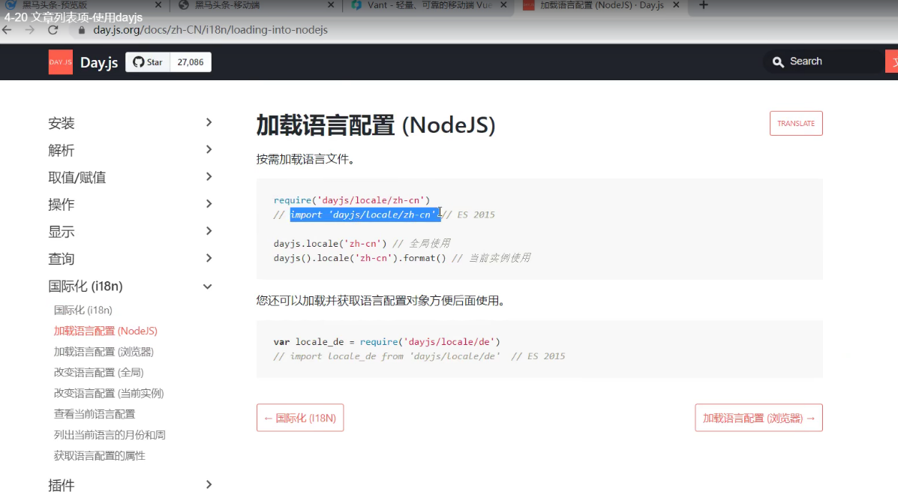

    

    

    

  + 下面是处理相对时间的全部操作：

    + 首先要在npm下载；

    + 新建一个dayjs.js的工具类模块，在模块里完成相关的配置，并且声明全局过滤器，来格式化时间，然后在main.js里直接导入代码即可，不用导出和导入成员；

      ```js
      import Vue from 'vue'
      // 初始化dayjs相关配置
      import dayjs from 'dayjs'
      import 'dayjs/locale/zh-cn'
      import relativeTime from 'dayjs/plugin/relativeTime'
      
      // 配置使用处理相对时间
      dayjs.extend(relativeTime)
      
      // 配置使用中文语言
      dayjs.locale('zh-cn')
      // 声明全局过滤器；把这个模块导入到main.js直接去加载，不用导出
      Vue.filter('relativeTime', (val) => {
        return dayjs(val).from(dayjs())
      })
      
      ```

      

  

  

> 注意：过滤器只有在vue2可以使用，在vue3已经没有这个功能了；

### watch侦听器

+ 要指明是侦听data或props里的哪个数据，把该数据名作为watch里的函数名，不用加this；

+ 侦听器是监听data或props里的数据，data里的数据一旦变化，就会立即执行处理函数；

+ 函数有两个形参，`newval`代表监听的数据变化后的新值，`oldval`代表监听的数据变化之前的旧值，新值在前，旧值在后；

  + 侦听器的典型应用场景：用户注册账户，时时判断该数据是否被注册，不用使用input事件；

  + ==方法格式的侦听器==：

    + 缺点1：一进入到页面不会触发执行处理函数，要侦听的数据变化才会执行处理函数；

    + 缺点2：如果侦听的data里的属性的值是一个对象或数组，对象中的属性值或数组的元素变化了，不会被侦听器侦听到（即只能侦听基本类型）；

      > 正常情况下是写成方法格式就可以了，除非方法格式侦听器满足不了我们的需求；

  ```html
  <body>
    <div id="app">
     
     <input type="text" v-model="username">
  
    </div>
  </body>
  <script src="../lib/vue.js"></script>
  <script src="../lib/jquery.js"></script>
  <script>
   
    const vm = new Vue({
      el: '#app',
      data: {
        username: ''
      },
      watch: {
        username(newval,oldval) {
          if(newval == '') return;//如果用户名为空就停止请求
  
          $.get('xxxxxxxxx' + newval,function(result){
            xxxxxxxxx
          })
  
        }
      }
    })
  </script>
  ```

  + ==对象格式的侦听器==；

    + 好处1：可以通过`immediate`选项为`true`让侦听器打开页面时自动触发一次，接着数据变化也同样触发处理函数；

      + 默认情况下，`immediate`的值是false;
      + `handler`是固定的写法；

      ```html
      <body>
        <div id="app">
         
         <input type="text" v-model="username">
      
        </div>
      </body>
      <script src="../lib/vue.js"></script>
      <script>
       
        const vm = new Vue({
          el: '#app',
          data: {
            username: 'admin'
          },
          watch: {
            //侦听username的变化
           username: {
      
             handler(newval, oldval) {  //处理函数
               console.log(newval, oldval)  //admin undefined
      
             },
            //  handler: function(newval, oldval){}
            immediate: true
           }
          }
        })
      </script>
      ```

    + 好处2：通过`deep`选项为`true`，开启深度监听，可以侦听到data里的属性的属性值是对象时，对象里的属性值变化会触发侦听器处理函数（可以侦听引用类型）；

      + 错误示范：

        ```html
        <script src="../lib/vue.js"></script>
        <script>
          const vm = new Vue({
            el: '#app',
            data: {
              username: {
                id: 1
              }
            },
            watch: {
              //侦听username的变化，这是方法格式侦听器，id变化侦听不到；
             username: function(newval, oldval){
              console.log(newval, oldval)
             }
            }
          })
        </script>
        ```

      + 正确示范：

        ```html
        <body>
          <div id="app">
            <input type="text" v-model="username.id">
          </div>
        </body>
        <script src="../lib/vue.js"></script>
        <script>
          const vm = new Vue({
            el: '#app',
            data: {
              username: {
                id: 1
              }
            },
            watch: {
              //侦听username的变化，这是对象格式侦听器，id变化可以侦听到；
              username: {
                handler(newval, oldval) {
                  console.log(newval.id, oldval.id)
                  //新值和旧值一样，都是新值，目前暂时不管；
                },
                //开启深度监听
                deep: true
              }
            }
          })
        </script>
        ```

+ 可以把深度监听的对象格式的侦听器改为方法格式的侦听器；

  + 开启深度监听是为了监听引用类型的数据（对象，数组）；如果直接监听对象的属性，且该属性是基本类型，就可以改为方法格式侦听器；

    ```html
    <body>
      <div id="app">
        <input type="text" v-model="username.id">
      </div>
    </body>
    <script src="../lib/vue.js"></script>
    <script>
      const vm = new Vue({
        el: '#app',
        data: {
          username: {
            id: 1
          }
        },
        watch: {
          //username.id是一个表达式，要加引号；
          'username.id'(newval, oldval) {
            console.log(newval, oldval)
          }
        }
      })
    </script>
    ```


### 计算属性

+ 计算属性是指经过一系列的运算之后return得到一个vue实例对象的属性；

+ 只要依赖的数据源发生了变化，计算属性就会重新进行计算；数据源可以是data里的数据；也可以没有data里的数据，全是字符串也可以；

+ 计算属性本质是一个函数，通过这个函数return出一个属性值；

+ 计算属性跟data里的属性一样，都是vue实例对象的属性，data里的数据怎么使用，计算属性就怎么使用；

+ 用途：当一个数据的值是由别的数据的变化决定的，就可以使用计算属性；

+ 主要应用场景：基于已经有的数据，衍生变形一些新数据出来，就可以使用计算属性；

+ 特点：主要是实现了代码的==复用==；

  ```html
  <body>
    <div id="app" >
      <!-- 计算属性可以被用在属性绑定指令里，可以被用在插值表达式里 -->
      <p :style="{backgroundColor: color}">{{ color }}</p>
  
      <input type="text" v-model.number="r">
      <input type="text" v-model.number="g">
      <input type="text" v-model.number="b">
  
      <button type="button" @click="print">点击输出rgb</button>
  
    </div>
  </body>
  <script src="../lib/vue.js"></script>
  <script>
    const vm = new Vue({
      el: '#app',
      data: {
        r: '',
        g: '',
        b: ''
     
      },
      methods: {
        print() {
          // 通过this可以拿到计算属性
          console.log(this.color)
        }
      },
      computed: {
        color() {
          return `rgb(${this.r}, ${this.g}, ${this.b})`;
        }
        // color: function(){}
      }
    })
  </script>
  ```

### axios

+ `axios`：是前端圈最火的，专门用来的做数据请求的库；

+ 在npm 装axios ，在后面加 -S，表示在生产环境也要用到；

+ 在vue中一般都会用`axios`来做数据请求；

+ `axios`方法返回值是一个`promise`对象；

+ `axios`就像是服务器和浏览器之间的中间人，帮助浏览器建立请求给服务器，并接受返回值加了一层壳给浏览器；返回的数据要`result.data`拿到；

+ `axios`方法里的`params`的值是一个对象，里面是以查询字符串的方式传递的参数；

+ `axios`方法里的`data`的值是一个对象，里面是以请求体的方式传递的参数；

+ 使用`axios`发起请求，不用手动设置请求头的`Content-Type:application/json`，会自动帮我们设置；如果是发送文件（包括图片文件）到服务器，请求头的要设置`Content-Type:multipart/form-data`，但是使用`axios`时也不用手动设置，我们需要做的是：

  ```js
  //上传文件是post请求
  let fd = new FormData()
  fd.append(需要上传的文件的属性名，需要上传的文件对象)
  //最后把fd当成一个对象当成请求体参数，即当成data的属性值；
  ```

  > 当做完上面的事情之后，axios就自动帮我们设置好了Content-Type:multipart/form-data；

  + GET请求：

  ```js
   axios({
      method: 'GET',
      url: 'http://localhost:8080/axios',
      params: {
        dd: 555
      },
       headers: {}
    }).then((result) => {
      console.log(result)
      console.log(result.data)//这个才是真实服务器返回的数据
    })
  
    // 因为axios方法的返回值是一个promise的对象，为什么要使用promise封装数据请求的方法，是为了不在请求完成
    // 之后回调函数嵌套回调函数；所以就要用.then()方法里面的成功之后的回调函数拿到返回的数据；
  ```

  + POST请求：

  ```js
   axios({
      method: 'POST',
      url: 'http://localhost:8080/axios',
      data: {
        dd: 555
      }
    }).then((result) => {
      console.log(result)
      console.log(result.data)
    })
  ```

  > 注意请求之前记得导入axios库文件；

+ `axios`请求的进化版本，使用`async await`：

  ```html
  <body>
    <button>点击发送请求</button>
  </body>
  <script src="./javascripts/axios.min.js"></script>
  <script>
    let btn = document.querySelector("button");
    btn.addEventListener('click', async function() {
        const result = await axios({
        method: 'POST',
        url: 'http://localhost:8080/axios',
        data: {
          dd: 555
        }
        })
      // 使用async await的好处就是可以直接得到resolve(数据)带出来的数据，不再使用then(function(数据){})，
      //去拿数据； 
        console.log(result)  
        console.log(result.data) //这便是服务器返回的数据  
  
    })
  </script>
  ```

+ `axios`请求的最终进化版本，使用`async await`加解构赋值：

  + 因为使用`async await`加`axios`方法最终的返回值是套了一层壳的响应值的对象，可以使用解构赋值得到这个对象里的服务器返回的真实值`data`，而省去用`.data`拿到；然后可以对`data`进行解构赋值重命名为`res`，服务器返回的对象还有一个`data`属性而出现`data.data`；

  ```html
  <body>
    <button>点击发送请求</button>
  </body>
  <script src="./javascripts/axios.min.js"></script>
  <script>
    let btn = document.querySelector("button");
    btn.addEventListener('click', async function() {
        const { data: res } = await axios({
        method: 'POST',
        url: 'http://localhost:8080/axios',
        data: {
          dd: 555
        }
        })
  
        console.log(res) //这个便是服务返回的真实值；
  
    })
  
  </script>
  ```

+ `axios`的get请求方法：

  + get方法里有两个参数，一个是url，一个是对象；如果要传参数就要写该对象，且该对象必须要有一个`params`属性，属性值也为对象；

    ```html
    <body>
      <button>点击发送请求</button>
    </body>
    <script src="./javascripts/axios.min.js"></script>
    <script>
      let btn = document.querySelector("button");
      btn.addEventListener('click', async function() {
    
        const { data: res } = await axios.get('http://localhost:8080/axios', { params: {
          id: 5
        } })
    
        console.log(res); //服务器返回的真实数据
      })
    </script>
    ```

+ `axios`的post请求方法：

  + post方法同样有两个参数，一个是url，一个是对象；如果要传参数就要写该对象，但是这个对象直接写要传递的参数就可以；

    ```html
    <body>
      <button>点击发送请求</button>
    </body>
    <script src="./javascripts/axios.min.js"></script>
    <script>
      let btn = document.querySelector("button");
      btn.addEventListener('click', async function() {
    
        const { data: res } = await axios.post('http://localhost:8080/axios', { id: 5 })
    
        console.log(res); //服务器返回的真实数据
      })
    </script>
    ```

    > 在`ajax`中：
    >
    > 1. `get`请求传递参数，只能以查询字符串的方式（在url的后面加`?xxx=xxx&xxx=xxx`），且不用设置`Content-Type`；
    > 2. `post`请求传递参数，既可以以查询字符串的方式，也可以以请求体的方式（正常都是请求体的方式）。
    >    + 以查询字符串的方式，同样不用设置`Content-Type`；
    >    + 以请求体的方式要设置请求头的`Content-Type`属性；
    >      + 传递的字符串为`xxx=xxx&xxx=xxx`格式，`Content-Type:application/x-www-form-urlencoded`；
    >      + 传递的字符串为对象的格式，`Content-Type:application/json`；

+ axios拦截器

  + 

  + 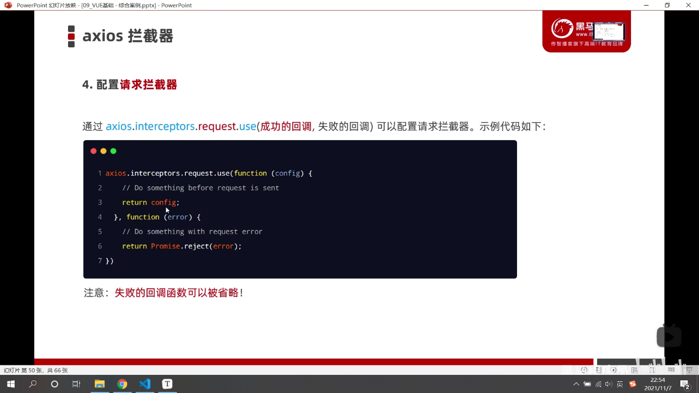

  + 

  + 

  + 

    + > 可以在响应拦截器把loading效果给关闭；

  + proxy跨域代理

    + 场景：如果后端给我们的接口没有开启CORS跨域资源共享，我们在开发时又不能因此耽误了进度，可以自己开启跨域代理；
    
    + 
    
    + 
    
    + 开启proxy跨域代理
    
      1. 如果==只有一个根路径==，可以用如下方式；
    
         + 封装一个工具类模块，创造一个小axios，配置好根路径为自己项目在自己服务器上的根路径，即在浏览运行时的地址栏的根路径；request.js
    
           ```js
           import axios from 'axios'
           
           const request = axios.create({
             // 本地的根路径
             baseURL: 'http://localhost:8081'
           })
           
           export default request
           
           ```
    
         + 在项目根路径新建一个 vue.config.js 文件，里面的根路径就是当会替换掉我们本地的根路径；
    
           ```js
           module.exports = {
             devServer: {
               // 是接口真正的根路径
               proxy: 'http://localhost:8080'
             }
           }
           
           ```
    
         + 发起请求时仍然没变；
    
           ```vue
           <template>
             <div>
               <button @click="getinfo">点击</button>
               <button @click="getinfo1">点击1</button>
             </div>
           </template>
           
           <script>
           // 导入小axios
           import request from '@/api/request.js'
           export default {
             methods: {
               async getinfo() {
                 // 请求的都是同一个根路径，因为配置文件只有一个根路径
                 const { data: res } = await request.get('/axios')
                 console.log(res)
               },
               async getinfo1() {
                 // // 请求的都是同一个根路径
                 const { data: res } = await request.get('/get')
                 console.log(res)
               }
             }
           }
           </script>
           
           <style></style>
           
           ```
    
      2. 如果实际开发中有多个根路径，就不要用上面的简单吗配置，使用这一种：
    
         + 由于实际开发中可能会有很多的根路径，所以就可以在vue.config.js里配置多条根路径；
    
           > 注意：一旦有多条根路径，就不能配置全局根路径了，转而代之是在uri前面用占位符替代；而上面的第一种，就可以配置全局根路径；
    
           ```js
           module.exports = {
             devServer: {
               proxy: {
                 //   /api任意取的名字
                 '/api': {
                   // 请求的真实根路径
                   target: 'http://localhost:8080',
                   ws: true,
                   // 开启代理，会在本地创建一个虚拟的服务器，虚拟服务器请求到的数据给浏览器；服务器和服务器的数据交互不会有跨域问题
                   changeOrigin: true,
                   // 把以/api开头的字符串替换成空
                   pathRewrite: {
                     '^/api': ''
                   }
                 },
                 // 这是另外一个根路径的代理
                 '/foo': {
                   target: 'http://localhost:100',
                   ws: true,
                   changeOrigin: true,
                   pathRewrite: {
                     '^/foo': ''
                   }
                 }
               }
             }
           }
           
           ```
    
         + 数据请求的写法
    
           ```vue
           <template>
             <div>
               <button @click="getinfo">点击</button>
               <button @click="getinfo1">点击1</button>
             </div>
           </template>
           
           <script>
           import axios from 'axios'
           export default {
             methods: {
               async getinfo() {
                 // 请求的都是不同的根路径，因为配置文件有两个根路径
                 // 最后，/api/axios会被编译替换为http://localhost:8080/axios，api会被替换为''；
                 const { data: res } = await axios.get('/api/axios')
                 console.log(res)
               },
               async getinfo1() {
                 // // 请求的都是不同根路径
                 // /foo/app2 => http://localhost:100/app2
                 const { data: res } = await axios.get('/foo/app2')
                 console.log(res)
               }
             }
           }
           </script>
           
           <style></style>
           
           ```
    
         > 注意：
         >
         > 1. 每次更改配置文件，就要重启打包服务器；
         > 2. vue.config.js是使用vue-cli创建的项目才有的配置文件；
         > 3. 配置好proxy跨域代理之后，即使项目发布也不用改动前端代码；后端要开启cors资源共享；
         > 3. ==开发环境用proxy，生产环境用nginx反向代理，需要在服务器上配置nginx.conf文件，然后重启nginx==


### 工程化开发的vue项目

#### vue-cli

+ 单页面应用程序：S(single)P(page)A(application)，顾名思义就是一个web网站只有唯一的一个html页面，页面的所有的功能与交互都是在这个唯一的页面完成的；

+ `vue-cli`：是vue.js开发的标准工具，简化了程序员基于webpack创建工程化的vue项目的过程，即不用自己去配置webpack；

+ 全局安装：`npm i -g @vue/cli`；

+ 基于`vue-cli`快速生成工程化的vue项目：`vue create 项目名称`；

  1. 选择一个想要放项目的文件夹；

  2. 点击进入文件夹，在路径上面输入`cmd`，回车；

     

  3. 在cmd面板输入`vue create 项目名称`；这个代码意思是在当前这个文件夹创建一个工程化vue项目文件夹；项目名称不要包含空格和中文；

  4. 初学者上下箭头选择`Manually select features`，代表自己选择要安装的模块等等；

  5. `) Choose Vue version   Babel  CSS Pre-processors`，目前先选择这三项；` Linter / Formatter`把这个去掉，这个是规范我们代码的格式的；

  6. `2.x`  `less`  `In dedicated config files`选择这三个；

  7. 项目文件夹创建好了之后，cd到这个项目的根目录，在终端输入`npm run serve`代表实时自动打包功能开启，并生成一个web服务器，输入网址就会出现`index.html`的页面；这个命令是在开发时使用的；在手动搭建的webpack里相当于`npm run dev`；

  8. 准备部署上线了就`npm run build`自动生成`dist`文件；

     > 1. 如果在npm下载包时不小心点击了cmd面板，会被冻结，此时，点击一下面板按下`ctrl+c`可解冻；
     > 2. 在vscode的终端面板，点×号代表终端被隐藏；点删除代表终端停止了运行了；
     > 3. `ctrl+ ~ `打开终端；

+ 项目的根目录里的组成文件：
  + `node_module`：模块的存放地方；
  + `public`：
    + `favicon.ico`：网站的图标；
    + `index.html`：单页面应用程序的唯一的页面；里面会自动注入打包好的`bundle.js`；
  + `src`：项目源代码存放的文件夹；
    + `assets`：存静态文件的文件夹，如图片，css样式表；
    + `components`：存放`.vue`组件的文件夹；
    + `App.vue`：==项目的根组件==，模板里的html片段代替vue实例绑定的页面的html片段（`index.html`里的`<div id="app"></div>`里的和包括它自己都会被完全替换掉）；
    + `main.js`：项目打包的入口文件；
+ vue项目的运行流程：
  + 在工程化项目中，vue做的事情很简单：通过`main.js`把`App.vue`的模板结构渲染( 使用`render`函数 )到`index.html`里vue控制的指定html区域；
  
    + render函数的写法：
  
      ```js
      let vm=new Vue({
        el:"#app",
        render:function(h){
          return h(App)
        }
      });
      ```
  
+ vue实例的`$mount()`方法和`el`的写法的作用完全一样；

#### .vue组件的组成部分

+ 组件化开发：根据封装的思想，把页面上可重用的ui结构封装为组件，从而方便项目的开发和维护；

+ `.vue`后缀的文件就是一个vue组件；

+ vue组件由三个部分组成：

  1. `template`标签：组件的模板结构，即html片段；
     + 只能有唯一的一个根元素；
  2. `script`标签：组件的js行为；
     + `export default {}`：默认导出，固定写法，对象里放vue组件实例的`data`,`methods`等这些属性，不用写el属性；
       + `data`的值不能是一个对象，必须是一个函数；函数要`return`出一个对象以存放数据源；
  3. `style`标签：组件的样式；
     + `style`标签没有写属性，默认使用的是普通的css语法；
     + `style`标签里如果要写`less`语法，就要指定`lang="less"`属性；

  ```vue
  <template>
    <div>
      <h1>{{ msg }}</h1>
    </div>
  </template>
  
  <script>
  export default {
  
    // data: function() {},
    data() {
        return {
        msg: 'hello'
      }
    },
    methods: {
      
    },
      //当前组件的过滤器
    filters: {
        
    },
      //当前组件的侦听器
    watch: {
        
    },
      //当前组件的计算属性
    computed: {
        
    }
      
    
  }
  </script>
  
  <style>
  h1{
    background-color: red;
  }
    
  </style>
  ```
  
  > 注意：在vue实例对象或vue组件的实例对象里的data,methods里定义的数据，方法，都是实例对象的属性；都可以通过this.xxx得到该数据或调用该方法；组件中的this是当前组件的实例对象；

#### vue组件的使用

> 注意：@就是代表src这一层目录，vue-vli生成的webpack项目已经帮我们配置好了；

+ 组件在被封装好了之后，彼此之间是互相独立；

+ 在使用组件的时候，根据彼此的嵌套关系，形成了父子关系，兄弟关系；

+ 使用组件的三个步骤：

  1. 使用 import 导入需要的组件；

  2. 使用 components 节点注册组件；这个节点与data , methods同级；

  3. 以标签的形式使用注册的组件；

     ```vue
     <template>
       <div class="a">
         这是根组件
         <!-- 3.以标签的形式使用组件 -->
         <Left></Left>
       </div>
     </template>
     
     <script>
     // 1.导入组件
     import Left from '@/components/Left.vue';
     
     export default {
       // 2.注册组件
       components: {
         // 完整写法
         // Left: Left
         Left
       }
     }
     </script>
     
     <style lang="less">
     .a {
       height: 200px;
       background-color: red;
     }
       
     </style>
     ```
  
+ 通过`components`节点注册的是==私有子组件==；即只能在当前注册的地方使用该组件；如果要到别的组件使用该组件，仍然需要导入，`components`节点注册，才可使用；

#### 注册全局组件

+ 场景：如果一个组件需要被多次使用，每次都要在使用的地方导入，注册，很麻烦；因此就需要一个全局的组件，一次导入，一次注册，全局使用；

+ 注册全局组件：

  + 过程：在vue项目的 main.js 入口文件中，通过`Vue.component()`方法，可以注册全局组件；

  + 在main.js中如下：

    ```js
    import Vue from 'vue'
    import App from './App.vue'
    // 导入组件
    import Count from '@/components/Count.vue'
    // 全局注册一次,注册好了之后再各个组件都可以使用
    Vue.component('MyCount', Count)
    
    Vue.config.productionTip = false
    
    new Vue({
      render: h => h(App),
    }).$mount('#app')
    ```

    > 注意：
    >
    > 1. 全局注册好之后，在各个组件中使用时就不需要再次导入和注册，直接以标签的形式使用即可；
    > 2. `Vue.component(参数一，参数二)`，里面的参数一是以字符串的格式，表示组件的注册名称；参数二是被全局注册的那个组件；
    > 3. 被全局注册好之后的组件，不能组件自己使用自己；

#### 自定义属性props节点

+ 场景：组件被使用时，使用组件者需要一个数值给组件实例对象的props属性，此时组件封装时就需要使用props（具体看下面的案例）；

+ props是组件的自定义属性，即自定义一个组件实例对象的属性，把属性的赋值权交给组件使用时，提高组件被使用的灵活性；在封装通用组件时，合理使用props可以极大提高组件的复用性；

+ 封装组件的语法格式

  ```vue
  export default {
      data() {
          return {
             
          }
      },
      props: ['自定义属性A', '自定义属性B', ...]
  
  }
  ```

  + props节点与data同级；

  + 数组里的元素是自定义的名字，必须是字符串；

  + 数组里的元素是当前组件实例对象的属性，跟data里的属性一样，在当前组件里，data里的属性怎么使用，数组里的元素就怎么被使用；

  + data里的属性有属性值，是封装者写死的，组件使用者无法初始化；props数组里的元素只是属性名，没有属性值，属性值要组件使用时被赋予；

  + **组件之间的传值，如果传递的是引用类型数据，两个组件共同指向同一个引用的数据，比如父组件向子组件传递数组，那么这两个组件就共同指向同一个数组，在子组件里对数组进行首尾操作或者splice，两个组件的数组都会同时变化；如果对子组件的数组进行替换，比如子组件里的props的数组被重新赋值为别的值，那就等于改变了子组件的数组指向，和父组件不是指向同一个数组，两个组件的数据不能保持同步，那么就会报错；因为通过props传值的方式，父组件里的传过去的值要和子组件里的props的值要保持同步，即要一样，一旦两个值不一样就会在终端发出警告；因此，如果要修改props里的数据，且数据是引用类型，且不想改变父组件的引用类型的数据，可以把值传给data里的数据，再去做修改；如果是基本类型的数据传递，要修改props里数据，只能传给data，因为基本类型的数据被改变，无法改变父组件里基本类型，数据不同步就会报警告；如果传递的是引用类型，且要父组件里的数据也变化，可以直接修改props里的数据，但是注意不能改变指向哦；**

    + 如果父组件通过props传值给子组件时，父向子传递的是基本类型，子组件得到的props数据，要修改时只能传给data里的数据，不能直接修改，否则父子组件的数据无法保持同步；当间接修改了数据之后，又想使父组件里的数据也同时和子组件里修改后的数据同步，那么只能通过自定义事件，子向父传值，去修改；即除了数组，对象以外的数据，是无法保持同步；只能是通过自定义事件去间接保持同步；但是每次都要在子组件标签监听事件，如果数据太多就会显得代码臃肿；因此可以用下面两种方式，但是原理还是一样的，只是可以简化代码的书写：

      + 使用到这两种技术的场景是：由父组件向子组件传递的数据，==既要被使用，又要被修改，且传递的数据是基本类型，且父子组件的数据保持同步==；

        1. v-model指令添加到子组件的标签上：（如果从父组件传递给子组件的有多个数据，且多个数据都要在子组件里被修改，且是基本类型，不能多次使用v-model，只能使用一次；）

           1. 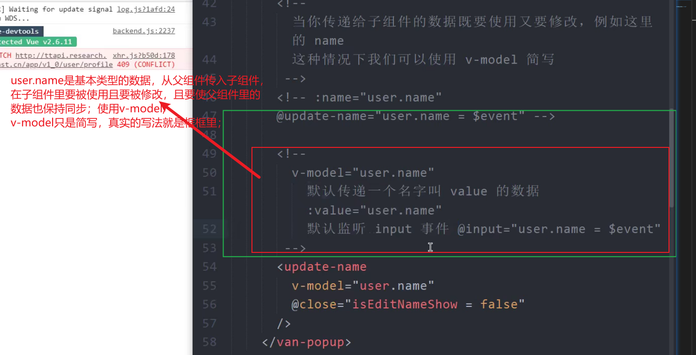

              

           2. 

              

+ 在父组件中使用组件的语法格式

  ```vue
  <template>
    <div class="a">
      <MyCount :自定义属性A="555"></MyCount>
    </div>
  </template>
  ```

  + 使用组件时，自定义属性要写在标签的位置，是以标签的属性的角色存在；
  + 如果需要自定义属性的值为数字，就必须绑定属性；因为vue指令的引号里是js语句，数字就是数字，否则的话数字会变成字符串；
  + 在组件使用时给自定义属性赋值，就相当于被使用的这个组件的自定义属性拥有了一个值；地位与data里数据同级；

+ 案例：组件的使用时，可以给通过自定义属性赋值，去初始化页面中数字的值：

  组件封装时：

  ```vue
  <template>
    <div class="count">
        <!-- data里的属性是可读和可写的 -->
        <p>{{ count }}</p>
        <!-- 由于vue指令里可以写简单的js语句，因此事件处理函数如果是一行，可以直接写即可； -->
        <button @click="count += 1">+1</button>
    </div>
  </template>
  
  <script>
  export default {
      data() {
          return {
              // 由于props里的属性是只能可读，可以把值赋给data里属性，然后对data里的值进行修改
              count: this.init
          }
      },
      // props节点与data同级，是数组，里面元素记得加引号
      props: ['init']
  
  }
  </script>
  
  <style lang="less">
     
  </style>
  ```

  组件使用时

  ```vue
  <template>
    <div class="a">
      <!-- Count组件的使用，直接在标签写属性和自定义属性值；给属性绑定，引号里写的就是js语句，
      数字就是数值类型；否则数字是字符串； -->
      <MyCount :init="99"></MyCount>
    </div>
  </template>
  
  <script>
  import MyCount from '@/components/Count.vue'
  
  export default {
    components: {
      MyCount
    }
  
  }
  </script>
  
  <style lang="less" >
  
  </style>
  ```

+ props的default默认值，type值类型

  + 场景：当我们使用props节点自定义组件实例对象属性时，props的属性值是数组时，就是当前这个组件只有属性，没有这个属性值，需要在使用组件时由用户在标签的位置赋值；如果用户没有在标签写这个自定义属性，也没传值，那么就是undefined，不会报错，不需要默认值可以直接使用数组形式即可；用户没传，我们需要默认值，那么就不能使用数组的形式了，以对象的形式；

  + 可以通过default来定义属性的默认值；封装组件时的示例代码：

    ```vue
    <script>
    export default {
       
        props: {
            init: {
                //指定默认值
                default: 0,
                //定义值类型；如果使用组件值为数值类型，要绑定属性；
                type: Number,
                //指定使用组件时，必须传入该属性
                required: true
                
            }
        }
    
    }
    </script>
    ```

  + 通过 type 来定义自定义属性的值类型，如果用户在使用组件时，传入的值与我们封装时定义好的值类型不同则会在终端报错提示，提高用户的使用组件体验；示例代码如上；

  + 通过 required 指明使用组件时，必须传入自定义的属性，即必须在标签里写自定义的属性，否则会终端报错，提示用户必须写，提高用户体验，代码如上；

+ ```vue
   props: {
      // 自定义属性时出现驼峰，在组件使用时，在标签上建议以cmt-count的形式出现；不这样也不会报错；
   	//在定义自定义属性时，如果出现xx-xxx，这种属性名，就要以引号包裹，或者转换成驼峰的形式；
      cmtCount: {
        // 值类型有两种可能时，可以这样子写；
        type: [Number, String],
        default: 0
     }
  }
  ```
  
+ 自定义定义属性的值类型是对象时，默认值要以函数形式返回一个对象：

  

+ props自定义属性的总结：

  + 封装组件时，通过props节点，设置自定义的属性名，该属性与data里的属性是同一级别的，data里的属性怎么用，它就怎么用；
  
  + 封装好的组件里的自定义属性没有属性值；需要在使用组件时，通过在标签上面以标签的属性的形式把属性值传入，此时的属性值就被传入到被使用的组件里的自定义属性；
  
  + 实际的应用，比如我们封装一个新闻的模块，这个组件需要被多次复用，且每次复用时，新闻的标题都是不一样的，那么就需要我们在封装组件时使用props节点自定义一个关于新闻标题的属性，每次使用组件时就直接在标签的自定义属性上传入标题即可；
  
  + > 做项目得出的重要结论：
    >
    > 通过路由显示的组件，如果要把这个组件的网络请求得到的数据传给它的子组件，以自定义属性的方式传时，第一次会出现undefined，然后第二次就会正常把值传过去（什么是第一次，第二次，就是父向子传值，如果父亲的数据变了，也会传给它的儿子，变化几次传几次；所以父亲第一次的数据是undefined，第二次请求到数据了才是正常的）；所以，如果在子组件自定义属性类型时，指定了数据类型是除了undefined之外的数据，就会报错；因此，除非万不得已，不要拿通过数据接口请求的数据，这是指在通过路由显示的组件是父组件的情况下，其他情况不用考虑；
    >
    > 

#### vue组件之间的样式冲突

+ 场景：在默认情况下，写在.vue组件中的样式是全局生效的，因为我们是单页面应用程序开发，只有一个html文件，组件都汇聚到一个页面之中，样式也一样；那么，当组件与组件之间的选择器选择相同的标签，就会出现样式冲突；

+ 解决：在组件的style标签加一个 scoped 属性，加了这个属性之后，当前组件的选择器只能选择当前组件的模板骨架的元素；组件之间的样式设置就会互相独立，不会冲突；

  ```vue
  <style lang="less" scoped>
  h3 {
    color: aqua;
  }
  
  </style>
  ```

+ 加scoped 解决样式冲突的底层原理

  + vue会自动给每个组件的每个标签都加相同的一个 data-v-xxx 的属性，比如A组件的所有标签都加相同的 data-v-001 属性，B组件的所有标签都加相同的 data-v-002 属性，当在当前组件的 style 标签里写样式时，会以交集选择器的形式自动给我们自己写的选择器加属性，比如，我们写 h3 {}，vue渲染后会变成 h3[data-v-001] {}；这样子每个组件的样式便是只给当前的组件的元素设置，相互独立；所以，每次都要给组件的样式设置 scoped；演示代码如下：

    + 加了scoped，我们手写的代码，未被渲染前如下：

      ```vue
      <template>
        <div>
            <h1 class="count">这是count组件</h1>
        </div>
      </template>
      
      <script>
      export default {
         
        
      }
      </script>
      
      <style lang="less" scoped>
      
      h1 {
          color: palegreen;
      }
         
      </style>
      ```

    + 加了scoped，被vue渲染后如下：

      ```vue
      <template>
        <div data-v-3f581d8f>
            <h1 class="count" data-v-3f581d8f>这是count组件</h1>
        </div>
      </template>
      
      <script>
      export default {
         
        
      }
      </script>
      
      <style lang="less" scoped>
      
      h1[data-v-3f581d8f] {
          color: palegreen;
      }
         
      </style>
      ```

      

    > 可以自定义给标签设置属性名，比如`<h3 bbb></h3>`；

+ /deep/ 样式穿透

  + 场景：当我们给每个组件都加 scoped 之后，我们使用的选择器都是默认会自动加一个属性选择器，形成交集选择器，这样子便不会造成样式冲突，把样式限制在局部生效；如果我们使用了某个组件，我们需要修改使用的这个子组件的样式，那么我们便要知道我们要修改这个组件的哪个元素，如果是我们自己写的组件，可以直接去组件看即可；如果是第三方组件，那么就要通过检查的方式查看；知道了要修改哪个元素之后，我们肯定不可以直接修改使用的组件的源码，不然组件就被我们破坏了；我们需要的是在当前使用子组件的父组件里修改子组件的样式，比如，我们知道需要修改的子组件的元素为 h5 ，那么在父组件里不能只写 h5 {} ，因为我们加了scoped ，h5 {} 会变成 h5[data-v-xxx] {} ，这个选择器便不是选中需要修改的子组件元素，而是选中父组件的元素；我们需要以 `/deep/ h5 {}`的形式，`/deep/`代表当前父组件的所有标签，即[ data-v-xxx ]，是属性选择器；父组件的后代 h5 便是需要修改的子组件的元素，把它限定在父组件的范围内样式生效；代码如下：

    被使用的子组件：

    ```vue
    <template>
      <div>
          <h5 class="count">这是count组件</h5>
      </div>
    </template>
    
    <script>
    export default {
       
      
    }
    </script>
    
    <style lang="less" scoped>
    
    h3 {
        color: palegreen;
    }
       
    </style>
    ```

    使用子组件的父组件：

    ```vue
    <template>
      <div>
        <h3>这是根组件</h3>
        <MyCount></MyCount>
      </div>
    </template>
    
    <script>
    import MyCount from '@/components/Count.vue'
    
    export default {
      components: {
        MyCount
      }
    
    }
    </script>
    
    <style lang="less" scoped>
    //  /deep/是属性选择器[data-v-xxx]，就是vue自动给当前组件所有标签加了的属性，所以/deep/选中当前组件所有标签；
        
    //不可以只写h5 {},这里的h5就会变成 h5[data-v-xxx]，选中的是当前父组件的h5；
        //  /deep/ h5被渲染后就是[data-v-xxx] h5
    /deep/ h5 {
      color: aqua;
    }
    
    </style>
    ```

  + /deep/的普遍应用在，使用第三方组件库时，修改组件的默认样式；或者使用自己写的组件时，只需要在某个场景需要特殊样式时；
  
  + 使用/deep/时，只能以css的格式，不能以less的格式；
  
  + 在父组件使用的子组件的根元素，修改样式时不用使用/deep/，因为子组件根元素会被加上父元素的属性；
  
    > 注意：每个组件的根元素都起一个类名以区别开，给组件的根元素设置样式时，不要直接使用div标签选择器，否则在父组件中使用时，父组件也使用div就会样式冲突；因为尽管加了scoped，但是子组件的根元素也会被加了一个和父组件一样的属性；

#### vue组件实例对象的理解

+ .vue的文件，我们叫做vue组件；
+ vue组件时不能直接被浏览器解析的，需要调用webpack里面的一个包vue-template-compiler，帮vue组件解析成js文件，然后引入index.html文件里，通过js代码里创造节点，插入节点等api，最后渲染到页面；
+ 在封装vue组件时，可以简单理解为是在写一个构造函数；
+ 在使用vue组件就是相当于以标签的形式new出一个组件的实例对象；组件被多次使用，实例对象都是不同的；

#### 组件实例对象的生命周期

+ 生命周期是指一个组件从==创建->运行->销毁==的整个过程，强调的是一个时间段；

+ 生命周期函数，是由vue框架提供的内置函数，会伴随着组件的生命周期，自动按次序执行；

+ 一旦有组件的使用，就会有生命周期伴随着组件，每到一个生命周期的时间点就会调用该时间点的生命周期函数，无论生命周期函数有没有写内容；

  

  

+ beforeCreate：这个时间点，组件什么都做不了，不重要；

+ created：在==内存==中创建好props,methods,data，最早可以操作它们的时候；组件的ui结构还未被渲染到浏览器里，不能操作dom元素；==重要；==

+ beforeMount：同样不能操作dom元素，不重要；

+ mounted：内存中编译好的组件html结构已经渲染到浏览器了，==最早可以操作组件dom节点的时候；==到这一步，说明组件三大阶段的第一阶段创建阶段已经完成，已经显示在浏览器上面了；==重要==

  > 注意：上面四个函数都是创建阶段；在组件的三大阶段之创建阶段，里面的生命周期函数只执行一次；

+ 接下来进入到三大阶段的组件运行阶段：

  + beforeUpdate：==当组件data里的数据改变时，才会执行这个函数；==  这个时间点data里的数据是最新的，而组件的UI结构里的data的数据和dom结构还没渲染，所以是旧的；

  + updated：data里的数据与组件的UI结构里数据都是最新的了，已经渲染完成；==能操作到最新的 dom 元素；==

    > 注意：运行阶段的函数如果data里的数据没有改变，那么运行阶段的函数就不会被执行，最少执行0次，最多执行无限次；

+ 三大阶段的组件销毁阶段（不重要）

组件的封装：

```vue
<template>
  <div>
      <h1>Count组件</h1>
  </div>
</template>

<script>
export default {
    props: ['init'],
    data() {
        return {
            message: 'hello'
        }
    },
    methods: {
        show() {
            console.log("show")
        }
    },
    beforeCreate() {
        //  console.log(this.init)  //会报错
      //    console.log(this.message)  //会报错
       //   this.show()  //会报错
        // 在组件生命周期的创建之前的时间点，props,data,methods还没被创建；因此在这里使用会报错；
    },
    created() {
        console.log(this.init) 
        console.log(this.message)  
        this.show()
        // 不会报错，这个时间点props,data,methods已经被创建好了
    },
    mounted() {
        //最早可以操作dom元素的时候
        const myh = document.querySelector("h1")
        myh.innerHTML='lll'
    }

}
</script>

<style lang="less" scoped>

</style>
```

组件被使用，相当于new出组件实例，组件的生命周期开始运行

```vue
<template>
  <div>
    <h3>这是根组件</h3>
    <!-- 组件的使用相当于new出一个组件实例对象，组件的出现就有八个时间点的生命周期； -->
    <MyCount init="初始化"></MyCount>
  </div>
</template>

<script>
import MyCount from '@/components/Count.vue'

export default {
  components: {
    MyCount
  }

}
</script>

<style lang="less" scoped>

</style>
```

+ created生命周期函数，可以在这个时间点发起请求，因为data，props,methods都可以用；当组件被以标签形式被使用，就会发起请求；组件封装案例如下：

  ```vue
  <template>
    <div>
        <!-- data里变量的使用 -->
        <h1>{{message}}</h1>
    </div>
  </template>
  
  <script>
  export default {
      data() {
          return {
              // 定义一个空变量
              message: ''
          }
      },
      methods: {
          // 封装一个请求函数
          getInfo() {
             let xhr = new XMLHttpRequest()
             xhr.open('get', 'http://localhost:8080/get') 
             xhr.send()
             xhr.addEventListener('load', () => {
                 this.message = JSON.parse(xhr.responseText)
             })
          }
      },
      created() {
         this.getInfo()
          //这个时间点props,data,methods已经被创建好了，直接调用函数，把请求到的值赋值给data里的数据
      },
  
  }
  </script>
  
  <style lang="less" scoped>
  
  </style>
  ```


#### 重复使用webpack项目技巧

+ 只要第一次使用vue-cli自动生成webpack项目之后，接下来就不用再每次生成了，只把生成的webpack项目除了node_module里的依赖包不用拷贝之外，其余全部拷贝过来，然后在终端npm install；

#### 父子组件之间的数据共享

+ 组件之间的关系

  + 父子关系
  + 兄弟关系（只要不是直接的父子关系，都可以认为是兄弟关系，比如，爷爷和孙子，可以变相的看成是兄弟关系，那么就可以看成是兄弟之间的数据共享）
  + 如果是一个爷爷向多个孙子传值，就用自定义属性；如果是多个孙子向一个爷爷传值，可以用eventBus的方式，也可以使用自定义事件，但是比较麻烦；

+ ==父组件向子组件传值==

  + 通过自定义属性的方式；

    + 在子组件使用props节点定义自定义属性名；

    + 在父组件使用子组件，并在标签上传入父组件的值给子组件；

    + 代码示例：

      子组件：

      ```vue
      <template>
        <div class="root">
            <h1>这是子组件</h1>
            
            <!-- 传过来的是基本类型的数据，父子组件数据之间相互独立，修改其中的一个数据，另一个不会变；
            但是，注意，props里的自定义属性的值是只读的，不可以修改；第5步 -->
            <h1>来自父亲的基本数据类型：{{ fromFaBasic }}</h1>
            <!-- 传过来的是引用类型的数据，父组件只是把对象的引用传过来，父子组件的属性都指向同一对象，修改
            其一，另一个也会跟着改变；同样，不要修改props里的属性； -->
            <h1>来自父亲的引用数据类型：{{ fromFaObj }}</h1>
        </div>
      </template>
      
      <script>
      export default {
          // 第1步：子组件自定义属性去接受父组件传过来的值；
          props: ['fromFaBasic', 'fromFaObj']
      }
      </script>
      
      <style lang="less" scoped>
      div.root {
          background-color: aqua;
      }
      
      </style>
      ```

      父组件

      ```vue
      <template>
        <div>
          <h1>父组件</h1>
          <hr>
          <!-- 第4步：子组件的使用，要绑定属性，里面的msg,user才是变量，否则是字符串； 在这里把父组件的数据
          传递给子组件；-->
          <Left :fromFaBasic="msg" :fromFaObj="user"></Left>
        </div>
      </template>
      
      <script>
      // 第2步：导入
      import Left from '@/components/Left.vue'
      export default {
        data() {
         return {
            msg: '中国',
            user: {
            id: 18,
            name: 'hlb'
          }
         }
      
        },
        // 第3步：注册
        components: {
          Left
        }
      
      }
      </script>
      
      <style lang="less" scoped>
      div {
        height: 200px;
        background: bisque;
      }
      
      </style>
      ```

+ ==子组件向父组件传值==

  + 通过自定义事件的方式；

    + 子组件使用`$emit()`触发自定义事件，并把值传递出去；

    + 在子组件中只要写了这句代码`this.$emit('事件名', 传递的数据)`，就相当于给子组件添加了一个自定义事件，当子组件在以标签被使用时，就可以在上面绑定该事件；当 $emit 触发该事件，就会执行事件处理函数，这个事件处理函数是在父组件中被定义的，定义事件处理函数时有一个形参，这个形参是用来接收 $emit 传过来的数据的，也就是说这个形参就是子组件传过来的数据；

    + 父组件在使用子组件时，绑定自定义事件，自定义事件触发时执行在父组件定义的事件处理函数，在处理函数里接收子组件传过来的值；

    + 代码示例：

      子组件：

      ```vue
      <template>
        <div>
            <p>{{ count }}</p>
            <button @click="add">+1</button>
        </div>
      </template>
      
      <script>
      export default {
          data() {
              return {
                  count: 0
              }
          },
          methods: {
              //第1步： 在子组件的一个函数里自定义事件，因为$emit是一个方法，必须写在函数里；
              add() {
                  this.count += 1
                  // 第2步：在这里自定义一个事件，并把子组件的值传出去；$emit是组件实例的一个方法，通过this拿到；
                  this.$emit('numchange', this.count)
              }
          },
      
      }
      </script>
      
      <style>
      
      </style>
      ```

      父组件

      ```vue
      <template>
        <div>
          <p>父组件接收到的子组件的值：{{ fromSon }}</p>
          <hr>
          <!-- 第5步：子组件的使用，绑定自定义事件； -->
          <Count @numchange="getinfo"></Count>
        </div>
      </template>
      
      <script>
      // 第3步：导入子组件
      import Count from '@/components/Left.vue'
      export default {
        data() {
          return {
            fromSon: null
          }
        },
        // 第4步：注册
        components: {
          Count
        },
        methods: {
          // 第6步：在事件处理函数里，接受子组件穿过的值，val是形参；事件处理函数调用时，不用写参数；
          getinfo(val) {
            // 把接收到的子组件的值传给父组件的变量
            this.fromSon = val
          }
        },
      
      }
      </script>
      
      <style>
      
      </style>
      ```

    + vue绑定事件的触发和事件对象的原理就是通过`$emit`实现的；比如点击事件，

      1. 某个元素绑定点击事件：`<button @click="add">点击</button>`；
      2. vue通过`$emit('click',{target:dom元素,...})`；，触发点击事件，并把事件对象传给事件处理函数的形参；
      3. 当我们在定义事件处理函数时，可以传入一个形参当做事件对象，那么我们可以`形参.target`得到按钮本身的dom元素；只是事件对象我们选择接受不接受都可以；而在子向父传值的时候，子向父的事件处理函数传递的是数值，而不是事件对象；

#### 兄弟组件之间的数据共享

+ $emit()方法的语法：`$emit('事件名', 发送出去的数据)`；

+ 对$emit() 方法的理解：

  + 每个vue实例对象或者vue组件实例对象(.vue文件)都有一个`$emit()`方法，调用该方法就要通过`this.$emit()`的形式；
  + `$emit('事件名', 发送出去的数据)`；一旦实例对象调用该方法并写了事件名和发送出去的数据，就是表示在该实例对象上添加了一个自定义的事件（事件名任意），并且要发送出去数据，这个数据的接受方是触发该事件时执行的事件处理函数定义时的一个形参；如果是组件实例对象调用$emit，那么就可以在组件使用的标签上面绑定这个自定义的事件，在父组件事件处理函数定义时的形参接受传过来的数据；如果是vue实例对象调用$emit() ，那么就要使用 $on(), 具体看  eventbus  方案；

+ 在vue2中，兄弟组件之间的数据共享是通过 EventBus方案，如下三步；

  1. 先创建一个 eventBus.js 模块，向外导出一个Vue实例对象；

  2. 在数据发送方组件，调用 `bus.$emit('事件名', 要发送的数据)`方法，触发自定义事件；

  3. 在数据接收方组件，调用  `bus.$on(事件名，事件处理函数)`方法去监听事件，并执行事件处理函数；

  4. 案例如下：

     eventBus.js模块：

     ```js
     // 导入vue模块得到Vue构造函数
     import Vue from 'vue'
     // 导出vue实例对象
     export default new Vue()
     ```

     数据发送方组件

     ```vue
     <template>
       <div>
           <p>{{ msg }}</p>
           <button @click="send">发送数据给兄弟组件</button>
       </div>
     </template>
     
     <script>
     // 导入eventBus模块，得到一个vue实例对象
     import bus from '@/components/eventBus.js'
     
     export default {
         data() {
             return {
                 msg: 'this is my info'
             }
         },
         methods: {
             send() {
                 // 每个vue实例对象都有$emit()方法，给这个实例对象添加sendmsg事件，$emit会触发该事件并把数据发送出去
                 bus.$emit('sendmsg', this.msg)
             }
         },
     
     }
     </script>
     
     <style>
     
     </style>
     ```

     数据接收方组件

     ```vue
     <template>
       <div>
           <p>{{ bromsg }}</p>
       </div>
     </template>
     
     <script>
     // 导入eventBus模块
     import bus from '@/components/eventBus.js'
     export default {
         data() {
             return {
                 bromsg: ''
             }
         },
         // 注意：数据接收方要最早可以操作data里数据的时候去监听事件，
         created() {
             // 导入的vue实例对象已经被添加了sendmsg事件，调用$on()监听该事件，事件触发执行处理函数，
             // 处理函数的形参是发送过来的数据的接受变量
             bus.$on('sendmsg', (val) => {
                 this.bromsg = val
             })
         }
     
     
     }
     </script>
     
     <style>
     
     </style>
     ```

     只有组件被使用了，才有兄弟关系存在：

     ```vue
     <template>
       <div>
         <!-- 发送方 -->
         <Left></Left>
         <hr>
         <!-- 接收方 -->
         <Count></Count> 
       </div>
     </template>
     
     <script>
     import Left from '@/components/Left.vue'
     import Count from '@/components/Count.vue'
     
     export default {
       components: {
         Left,
         Count
         
       }
     
     }
     </script>
     
     <style>
     
     </style>
     ```

+ ==总结：只要有用到 $emit() 方法，都是发送数据的一方；== 

+ > 注意：
  >
  > 使用eventbus传递数据，$emit是触发事件，当在某个组件先触发事件并传递数据过去时，如果接受数据的一方的组件还没有被创建，那么第一次触发事件，接受数据的组件就不会有接收到，因为这个接受的一方组件还没有被创建，那么就不能使用eventbus传递数据了；用自定义事件或者自定义属性；

#### 组件之间的数据共享之vuex

+ 场景：父向子传值通过自定义属性；子向父传值通过自定义事件；不相干的组件或者说兄弟组件之间的传值通过eventBus；这三种组件之间的数据共享方式都是小范围的，如果要大范围之间的频繁数据共享，就要用vuex；什么是大范围数据共享，比如一个组件的数据共享出去被多个组件使用，那就是大范围；

+ 

+ 

+ 

+ vuex的基本使用

  + vuex和vue-router一样，都是vue全家桶一部分，要安装vuex模块；

  + 以下的步骤是未通过vue-cli创建基于webpack的vue项目时，没有勾选安装vuex时，才要这么做：

    + 

    + 

      > 注意：如果通过vue-cli创建项目时，有勾选vuex就不必手写上面的代码了；

+ vuex的核心：

  + State

    

    组件中访问全局共享数据的第二种方式：（两种方式都可以使用，选择一种即可）

    

  + mutations

    + 如果要修改state里的数据，不可以直接在组件里获取到并修改，只能在Mutation里定义函数去修改state里的数据；也就是说，组件里获取到的state里的数据是可读的，但是不可以在组件里修改，要在组件里调用Mutation里的修改State数据的函数；

      

    + 调用mutations里的函数，传参的情况()

      

    + 以上是触发mutations里函数的第一种方式，接下来是第二种

      

  + actions

    + 场景：如果要对state里的数据进行异步操作，首先不能在组件里直接获取到数据去直接操作；也不可以在mutations里的函数对state里数据去异步操作；只能在actions里的函数去调用对state数据修改的mutations函数，然后异步代码写在actions里的函数；

      

      

      

      

      > 注意：需要对state里的数据去修改操作等，只能在mutations里；

      在组件中调用actions函数的第二种方式：

      

  + getters

    + 相当于vuex里的计算属性；
    + 
    + 

  + 总结：

    + 对全局共享的数据的一切操作，都需要在vuex模块里；在组件里就是直接调用函数；
    + 如果state里的数据要和组件里的表单元素实现数据双向绑定，当state里的数据被获取到时，可以绑定属性的形式绑定value赋值给它；再通过表单标签的change事件拿到事件对象的target的value，然后调用mutation里方法把value赋值给state里的数据；不能用v-model；因为一旦使用v-model，就等于在组件里直接修改state里的数据；

  + 案例：

    vuex模块（store文件夹里的index.js）

    ```js
    // 导入vue
    import Vue from 'vue'
    // 导入vuex
    import Vuex from 'vuex'
    // 把vuex安装为vue项目的插件
    Vue.use(Vuex)
    // 默认导出实例对象
    export default new Vuex.Store({
      // 存放公共数据的地方
      state: {
        count: 0
      },
      getters: {
        // 是vuex的计算属性
        showNum (state) {
          return '当前最新的数据' + state.count + '!'
        }
      },
      // mutations里的函数都有一个state形参
      mutations: {
        // 注意：在mutation里集中对state里的数据进行修改；
        add (state) {
          state.count++
        },
        // 定义一个在函数调用时可以传参的函数；
        addN (state, n) {
          state.count += n
        },
        sub (state) {
          state.count -= 1
        },
        subN (state, n) {
          state.count -= n
        }
      },
      // actions里的函数都有一个contetx形参
      actions: {
        // 在这里处理异步任务
        asyncAdd (context) {
          setTimeout(() => {
            // 调用mutations里的函数对数据去修改，不能直接在这里修改；在这函数里，主要是写异步任务；
            context.commit('add')
          }, 1000)
        },
        // 传递参数的情况
        asyncAddN (context, n) {
          setTimeout(() => {
            context.commit('addN', n)
          }, 1000)
        },
        asyncSub (context) {
          setTimeout(() => {
            context.commit('sub')
          }, 1000)
        },
        asyncSubN (context, n) {
          setTimeout(() => {
            context.commit('subN', n)
          }, 1000)
        }
      },
      // 暂时没涉及到，没学
      modules: {
      }
    })
    
    ```

    在组件里对state里数据间接操作的第一种方法：

    ```vue
    <template>
      <div>
        <!-- 在组件中使用全局共享的数据，可以通过this.$store.全局数据名；在这里不用使用this； -->
        <h1>{{$store.state.count}}</h1>
        <h1>{{$store.getters.showNum}}</h1>
        <button @click="btnHandler">+1</button>
        <button @click="btnHandler2">+n</button>
        <button @click="btnHandler3">+1 async</button>
        <button @click="btnHandler4">+n async</button>
    
        <hr>
      </div>
    </template>
    
    <script>
    export default {
      methods: {
        // 只能调用mutation里的函数对state里的数据进行修改，不能直接在组件里获取到state里的数据去修改；
        btnHandler () {
          this.$store.commit('add')
        },
        btnHandler2 () {
          // 调用addN函数并传递实参;commit是调用mutations里的函数；
          this.$store.commit('addN', 3)
        },
        btnHandler3 () {
          // 调用actions里的异步任务；通过dispatch调用函数；
          this.$store.dispatch('asyncAdd')
        },
        btnHandler4 () {
          // 调用actions里的函数传递实参
          this.$store.dispatch('asyncAddN', 20)
        }
      }
    
    }
    </script>
    
    <style>
    
    </style>
    
    ```

    在组件里对state里数据间接操作的第二种方法：

    ```vue
    <template>
      <div>
        <!-- 通过mapState函数把全局共享的state里的count数据，映射到计算属性里，以普通属性使用即可 -->
        <h1>{{count}}</h1>
        <!-- 使用getters里的属性 -->
        <h1>{{showNum}}</h1>
        <button @click="sub">-1</button>
        <button @click="subN(10)">-N</button>
        <button @click="asyncSub">-1 async</button>
        <button @click="asyncSubN(100)">-N async</button>
        <hr>
      </div>
    </template>
    
    <script>
    // 按需导入函数从vuex
    import { mapState, mapMutations, mapActions, mapGetters } from 'vuex'
    
    export default {
      computed: {
        // 在计算属性里使用mapState函数，把count变成一个计算属性；
        ...mapState(['count']),
        // 把getters里的属性映射到组件里
        ...mapGetters(['showNum'])
      },
      methods: {
        // 直接把mutation里的函数映射到组件里就可以直接使用
        ...mapMutations(['sub', 'subN']),
        // 把actions里的函数直接映射成为methods里的函数，可以直接使用
        ...mapActions(['asyncSub', 'asyncSubN'])
      }
    
    }
    </script>
    
    <style>
    
    </style>
    
    ```

    根组件

    ```vue
    <template>
      <div>
        <h1>根组件</h1>
        <hr>
        <Add></Add>
        <Sub></Sub>
    
      </div>
    </template>
    
    <script>
    import Add from '@/components/add.vue'
    import Sub from '@/components/sub.vue'
    export default {
      components: {
        Add,
        Sub
      }
    
    }
    </script>
    
    <style>
    
    </style>
    
    ```

    

    

    

    

#### ref引用

+ jquery 简化了程序员操作dom的过程；

+ vue ：基于MVVM原理，在vue中，程序员不需要操作dom，程序员只要把数据维护好就可以，数据变了，页面的数据就自动变了，即数据驱动视图，不需要操作dom来渲染页面的数据；所以，在vue中不建议使用jquery；

+ 场景：如果在vue中需要操作dom元素，在不调用操作dom的api和jquery的前提下，如何去获取dom元素并操作dom；

+ 解决：

  + 在vue中，可以使用 `ref` 来辅助开发者在不依赖于jquery的情况下，==获取dom元素或组件的引用==；
  + 在每个vue组件实例上都有一个`$refs`对象，里面存储着 dom 元素或组件的引用。
  + 默认情况下，组件的`$refs`指向一个空对象；只有在标签或者组件上加了`ref`属性并赋值，`$refs`对象才有属性和属性值；

+ 注意：`ref`和`$refs`的区别；

+ 案例一：通过 ref 引用操作 dom 元素：

  + ```vue
    <template>
      <div class="appcontent">
        <!-- 给dom元素加ref引用 -->
        <h1 ref="myh1">根组件</h1>
        <button @click="color">变色</button>
        <hr>
      </div>
    </template>
    
    <script>
    
    export default {
      methods: {
        color() {
          // 通过组件实例对象的$refs属性拿到所指向的对象，再通过对象的属性名拿到dom元素
          this.$refs.myh1.style.color = 'red'
        }
      },
     
    }
    </script>
    
    <style>
    
    </style>
    ```

+ 案例二：通过 ref 引用拿到组件的实例对象：

  子组件：

  ```vue
  <template>
    <div>
        <h1>Count组件</h1>
        <p>{{ count }}</p>
        <button @click="count += 1">+1</button>
        <button @click="reset">重置</button>
    </div>
  </template>
  
  <script>
  export default {
      data() {
          return {
              count: 0
          }
      },
      methods: {
          reset() {
              this.count = 0
          }
      },
  
  }
  </script>
  
  <style>
  
  </style>
  ```

  父组件：

  ```vue
  <template>
    <div>
      <h1>根组件</h1>
      <!-- 在父组件中重置子组件的数字 -->
      <button @click="resetfa">在父组件的重置按钮</button>
      <hr>
      <!-- 给子组件添加ref引用，就可以通过$refs拿到组件的实例对象 -->
      <Count ref="myCount"></Count>
  
    </div>
  </template>
  
  <script>
  import Count from '@/components/Count.vue'
  export default {
    components: {
      Count
    },
    methods: {
      resetfa() {
        // 拿到子组件的实例对象，便可以调用子组件的方法或操作子组件data里的数据
        this.$refs.myCount.reset()
  
  
        // 这也是另外一种方法
        //  this.$refs.myCount.count = 0
      }
    },
  
  }
  </script>
  
  <style>
  
  </style>
  ```

+ $nextTick(callback)方法

  + `$nextTick(cb)`是组件实例的方法，跟methods里方法一样，通过`this.$nextTick(cb)`调用；

  + 作用：会把方法里的cb回调函数推迟到下一个dom更新周期之后，即等组件的dom结构在页面更新渲染完了之后，再执行cb回调函数，从而保证cb回调函数可以操作到最新的dom元素；

  + 案例：点击按钮显示输入框，隐藏按钮；输入框失去焦点显示按钮，隐藏输入框：

    ```vue
    <template>
      <div>
        <!-- 点击按钮显示输入框 -->
        <button v-if="flag" @click="showIpt">点击显示输入框</button>
        <!-- 输入框失去焦点显示按钮，通过ref引用去操作dom元素，使输入框显示时自动获取焦点 -->
        <input type="text" v-else @blur="showBtn" ref="iptRef">
        <!-- 定义ref引用时最好加一个Ref结尾比较好维护，如iptRef -->
      </div>
    </template>
    
    <script>
    export default {
      data() {
        return {
          // 定义一个布尔值，通过v-if，v-else去控制元素的显示与隐藏
          flag: true
        }
      },
      methods: {
        showIpt() {
          this.flag = false
          // 在显示输入框时要自动获取焦点，就需要先拿到输入框元素，并调用该元素的focus方法，由于
          // 组件的flag布尔值改变，就是在beforeUpdate时刻，在这里直接对输入框dom元素
          // 进行操作是不可以的，因为是属于更新前，data里的数据是最新的，但是页面的dom元素和数据还没渲染，
          // 输入框元素还不能拿到；所以就要调用$nextTick(cb)方法；
          this.$nextTick(() => {
             this.$refs.iptRef.focus()
          })
         
        },
        showBtn() {
          this.flag = true
        }
      },
    
    }
    </script>
    
    <style>
    
    </style>
    ```

  + 上面的案例对输入框获取焦点的代码为什么不在 `updated`生命周期函数里执行?

    + 原因：如果把`this.$refs.iptRef.focus()`放在updated生命周期函数里执行，当显示输入框时，不会报错；当输入框隐藏时，同样date里的布尔值也是改变了，就会再次执行调用updated生命周期函数，此时输入框元素已经被移除了，就无法对它进行操作了，代码就会报错；

#### 动态组件`<component>`

+ 动态组件是指动态切换组件的显示与隐藏；

+ vue提供了一个内置组件`<component>`，是组件的占位符，专门用来实现组件的动态渲染；

+ `is`属性值是要渲染替换占位符的组件名字；

+ 组件名字写在is属性值上之前，要导入和注册组件；

+ 案例：

  ```vue
  <template>
    <div>
      <h1>这是根组件</h1>
      <hr>
      <!-- 这样子组件是写死的，无法完成动态的切换 -->
      <!-- <Left></Left> -->
      <!-- <Right></Right> -->
  
      <!-- 使用<component></component>组件 -->
  
      <!-- 这样子写没有绑定属性，也是写死的 -->
      <!-- <component is="Left"></component> -->
  
      <!-- 绑定属性，动态改变comName -->
      <component :is="comName"></component>
      <button @click="comName = 'Left'">显示Left</button>
      <button @click="comName = 'Right'">显示Right</button> 
  
  
    </div>
  </template>
  
  <script>
  import Left from '@/components/Left.vue'
  import Right from '@/components/Right.vue'
  export default {
    data() {
      return {
        comName: 'Left'
      }
    },
    components: {
      Left,
      Right
    }
  
  }
  </script>
  
  <style>
  
  </style>
  ```

+ `<keep-alive>`

  + 场景：当使用`<component>`对创建动态组件时；组件显示是相当于新创建一个vue组件实例；组件隐藏是对组件实例的销毁；当组件被销毁和重新创建，组件里的数据都是会被销毁和重建，上一个实例和下一个实例是不同的；

  + 作用：可以在组件被隐藏时是以缓存的形式，而不是被销毁了；当被显示时，缓存里的组件会被重新激活，那么当这个组件再次显示时，仍然是同一个组件，那么组件里的数据还是原来的数据；

  + 使用keep-alive才会有`activated`（被激活时调用，即显示）和`deactivated`（被缓存时调用，即隐藏）两个生命周期函数，写在被显示与隐藏的组件里，与八大生命周期同级；

  + 案例：

    Left组件

    ```vue
    <template>
      <div class="left">
          <h1>left组件---------{{ count }}</h1>
          <button @click="count += 1">+1</button>
      </div>
    </template>
    
    <script>
    export default {
      data() {
        return {
          count: 0
        }
      },
      // Left组件的生命周期，当第一被创建时，会执行，当再次被激活时，就不会执行了，因为激活是从缓存中激活已经存在的组件，
      // 并不是创建组件；
      created() {
        console.log("被创建了")
      },
      // 使用keep-alive有激活的生命周期，被显示时会执行，第一次创建组件时也会执行；
      activated() {
        console.log('被激活了')
      },
      // 使用keep-alive有缓存的生命周期，被隐藏时会执行；
      deactivated() {
        console.log('被缓存了')
      },
    
    }
    </script>
    
    <style>
    
    </style>
    ```

    Right组件

    ```vue
    <template>
        <div>
            <h1>这是Right组件</h1>
        </div>
    </template>
    
    <script>
    export default {
    
    }
    </script>
    
    <style>
    
    </style>
    ```

    这是根组件

    ```vue
    <template>
      <div>
        <h1>这是根组件</h1>
        <hr>
    
        <!-- 没有使用keep-alive之前，组件原来的数据是某一个数，当被隐藏并再次显示时，数据就会归零，
        因为这个已经是新组件了； 使用keep-alive组件不会被销毁，是被缓存，还是原来的组件，组件里数据还是保存原样；-->
        <keep-alive>
          <component :is="comName"></component>
        </keep-alive>
    
        <button @click="comName = 'Left'">显示Left</button>
        <button @click="comName = 'Right'">显示Right</button>
    
    
      </div>
    </template>
    
    <script>
    import Left from '@/components/Left.vue'
    import Right from '@/components/Right.vue'
    export default {
      data() {
        return {
          comName: 'Left'
        }
      },
      components: {
        Left,
        Right
      }
    
    }
    </script>
    
    <style>
    
    </style>
    ```

  + keep-alive 的属性
  
    + 场景：使用keep-alive 标签包裹的 component 组件，默认情况下，组件都是被缓存的；如果只要某些个别的组件被缓存或者不被缓存，就使用下面的属性指定；
  
    + `include`： 指定哪些组件需要被缓存，属性值为组件的名字；可以指定多个组件，用逗号分隔开；
  
    + `exclude`：指定哪些组件不需要被缓存；
  
    + include 或 exclude 不能同时使用；
  
    + ```vue
      <template>
        <div>
          <h1>这是根组件</h1>
          <hr>
      <!-- 指定Left组件可以被缓存；Right组件不会被缓存，隐藏时就是被销毁，显示时就是被激活； -->
          <keep-alive include="Left">
            <component :is="comName"></component>
          </keep-alive>
      
          <button @click="comName = 'Left'">显示Left</button>
          <button @click="comName = 'Right'">显示Right</button>
      
      
        </div>
      </template>
      
      <script>
      import Left from '@/components/Left.vue'
      import Right from '@/components/Right.vue'
      export default {
        data() {
          return {
            comName: 'Left'
          }
        },
        components: {
          Left,
          Right
        }
      
      }
      </script>
      
      <style>
      
      </style>
      ```
  
  + 组件的 name 节点，即组件的名称：
  
    + 组件名称 name：
  
      + 默认情况下，没有指定组件的 name 节点，就是以组件注册的名称作为组件的名称；
      + name 节点与 data ，methods 节点同级；用来声明组件的名称；名称首字母最好大写；
      + 在组件封装时可以使用 name 节点给组件起一个名称；
      + 用法：在使用keep-alive 标签时，可以用在 include 或 exclude 的属性值上面；或者调试工具会以组件的名称显示；
      + 每次封装组件的时候可以顺便写上组件的名称；
  
    + 组件的注册名称：
  
      + 用法：在组件使用时，以该注册的名称作为标签名使用；在 component 组件的 is 属性值上仍然要使用组件的注册名称；
  
    + 案例：
  
      myleft 组件
  
      ```vue
      <template>
        <div class="left">
            <h1>left组件---------{{ count }}</h1>
        </div>
      </template>
      
      <script>
      export default {
        // 定义组件名称，跟data同级
        name: 'Myleft',
      
      }
      </script>
      
      <style>
      
      </style>
      ```
  
      myright 组件
  
      ```vue
      <template>
          <div>
              <h1>这是Right组件</h1>
          </div>
      </template>
      
      <script>
      export default {
          // 定义组件名称
          name: 'Myright'
      
      }
      </script>
      
      <style>
      
      </style>
      ```
  
      根组件
  
      ```vue
      <template>
        <div>
          <h1>这是根组件</h1>
          <hr>
      <!-- 在组件封装时已经定义好组件的名称，在使用keep-alive时就不能使用组件的注册名称了 -->
          <keep-alive include="myleft">
            <component :is="comName"></component>
          </keep-alive>
      
      <!-- 尽管定义了组件的名称，在这里仍然要使用组件的注册名称 -->
          <button @click="comName = 'Left'">显示Left</button>
          <button @click="comName = 'Right'">显示Right</button>
      
      
        </div>
      </template>
      
      <script>
      import Left from '@/components/Left.vue'
      import Right from '@/components/Right.vue'
      export default {
        data() {
          return {
            comName: 'Left'
          }
        },
        components: {
          Left,
          Right
        }
      
      }
      </script>
      
      <style>
      
      </style>
      ```

#### 插槽

+ 插槽（Slot）是vue为组件的封装者提供的功能；允许开发者在封装组件时，把不确定的，希望由用户指定的 ui 结构定义为插槽；

+ 使用场景：当我们使用组件库时，就是库作者提前封装好组件，组件的某些区域使用插槽占位并有后备内容，当我们使用该组件时就可以自定义在组件标签的内容区域填入要替换插槽占位的 ui 结构；和自定义属性有点类似，只不过自定义属性是传入数据；而插槽是传入ui结构；

  

+ 默认插槽使用：

  1. 封装组件时，声明一个插槽区域，该区域的内容由组件的使用者自定义，并传入替换插槽区域；
     + vue规定每一个插槽都要有一个`name`名称，如果没有写`name`属性，则默认`name`是 `default`；
     + 插槽的后备内容：即如果用户使用组件的时候，没有在组件标签的内容区域填入插槽的替换内容，那么封装组件时可以指定默认内容；

  ```vue
  <template>
    <div class="left">
        <h1>left组件</h1>
        <!-- 声明一个插槽区域，相当于一个占位符 -->
        <!-- name 默认没写就是 default -->
        
        <!-- 默认插槽里是后备内容 -->
        <slot><p>这是默认内容</p></slot>
  
    </div>
  </template>
  
  <script>
  export default {
  
  }
  </script>
  
  <style>
  
  </style>
  ```

  2. 使用组件时，自定义插槽的 ui 结构

     + 使用组件时，默认没有指定该替换的内容要到哪个插槽，就是替换到name为default的插槽；

     ```vue
     <template>
       <div>
         <h1>这是根组件</h1>
         <hr>
     	<!-- 组件的使用 -->
         <Left>
           <!-- 使用组件时，默认没有指定该替换的内容要到哪个插槽，就是替换到name为default的默认插槽；这是默认情况下：-->
        
             <p>这是我替换的内容</p>
          
             
         </Left>
       </div>
     </template>
     
     <script>
     import Left from '@/components/Left.vue'
     export default {
       data() {
         return {
           comName: 'Left'
         }
       },
       components: {
         Left,
       }
     
     }
     </script>
     
     <style>
     
     </style>
     ```

+ 具名插槽：

  + 场景：当我们的一个组件里有多个插槽，如果还是不指定 name 属性，就是默认插槽；当我们使用组件时，在组件标签里 ui 结构不知道要替换哪一个插槽；因此，要给插槽指定具体的名字，在组件使用时也给组件标签内容区域的 ui 结构用 template 指定要替换哪个插槽；
  + 具名插槽是指给插槽指定`name`属性并赋值，那么属性值就是该插槽的名字；

  1. 组件的封装：

     ```vue
     <template>
       <div class="left_container">
           <h1>left组件</h1>
           <hr>
           
           <div class="title">
             <!-- 给插槽指定名字 -->
             <slot name="mytitle">如果不替换就显示这行文字</slot>
           </div>
     
           <div class="article">
             <slot name="myarticle">默认文本</slot>
           </div>
     
           <div class="footer">
             <slot name="myfooter">默认文本</slot>
           </div>
     
       </div>
     </template>
     
     <script>
     export default {
       name: 'Myleft',
     
     }
     </script>
     
     <style>
     
     </style>
     ```

  2. 组件的使用：

     + 使用组件时，如果要指定该内容要替换到哪个插槽，就要使用`template`标签包裹，并在`template`标签上使用`v-slot:插槽名字`的形式；
     + `template`标签是起到包裹替换内容的作用，不会被渲染出来，`v-slot`也只能写在==`template`上或者以标签形式使用组件的标签上面==；
     + `v-slot:`指令的简写形式是`#`；

     ```vue
     <template>
       <div>
         <h1>这是根组件</h1>
         <hr>
     <!-- 组件的使用 -->
         <Left>
           <!-- 在组件的内容区域，填入要替换哪个插槽的模板结构，这部分内容由用户决定； -->
           <template #mytitle>
             <p>文章标题</p>
           </template>
     
           <template #myarticle>
             <p>文章内容</p>
           </template>
     
           <template #myfooter>
             <p>文章底部</p>
           </template>
             
         </Left>
       </div>
     </template>
     
     <script>
     import Left from '@/components/Left.vue'
     export default {
     
       components: {
         Left,
       }
     
     }
     </script>
     
     <style>
     
     </style>
     ```

     > 自定义属性，是由使用组件的用户自定义传入数据，并把传入的数据渲染到页面上；
     >
     > 插槽，由用户自定义传入ui模板结构，然后渲染到页面上；

+ 作用域插槽

  + 在封装组件的时候，给插槽加了任意属性和属性值，那么这个插槽就叫作用域插槽；一个插槽既可以是具名插槽，也可以是作用域插槽；

  + 作用：子组件里的插槽的属性和属性值可以被传递到使用该组件的父组件里，在自定义模板结构替换插槽时使用该数据；

    子组件的封装：

    ```vue
    <template>
      <div class="left_container">
          <h1>left组件</h1>
          <hr>
          <!-- 既是具名插槽，也是作用域插槽 -->
          <slot name="first" msg="hello"></slot>
    
          <!-- 这个插槽传了两个属性，一个有绑定属性传入的是data里的数据，一个是没有绑定属性 -->
          <slot name="second" :info="user" age="18"></slot>
         
      </div>
    </template>
    
    <script>
    export default {
      name: 'Myleft',
      data() {
        return {
          user: {
            id: 1,
            name: 'zs'
          }
        }
      },
    
    }
    </script>
    
    <style>
    
    </style>
    ```

    在父组件使用子组件

    ```vue
    <template>
      <div>
        <h1>这是根组件</h1>
        <hr>
        <!-- 组件的使用，该组件已经预留了插槽 -->
        <Left>
          <!-- 使用template包裹要去替换first插槽的内容，并接收一个由first插槽传递过来的对象；
          插槽的属性就是对象的属性，插槽的属性值就是对象的属性值；规范接受到对象就用scope变量,非必须，
          但是这样子好知道这个变量是作用插槽传递过来的； -->
          <template #first="scope">
            <h5>这是作用域插槽11111</h5>
            <!-- scope这个对象只能在这个模板结构里使用, 用法与data里的数据一样，只是传递过来的数据
            只能在这里用； -->
            <p>{{ scope.msg }}</p>
            <hr>
          </template>
    
          <!-- 由于传递过来的数据是对象，可以用解构赋值的方式得到对象的属性，然后直接使用属性即可； -->
          <template #second="{ info, age }">
            <p>{{ info.name }}</p>
            <p>{{ age }}</p>
          </template>
         
        </Left>
      </div>
    </template>
    
    <script>
    import Left from '@/components/Left.vue'
    export default {
    
      components: {
        Left,
      }
    
    }
    </script>
    
    <style>
    
    </style>
    ```

+ 总结：

  + 在父组件的子组件的内容区域填入==组件或者ui模板结构==，就必须在子组件预留插槽；
  + 当涉及到爷爷与孙子组件之间的数据传递，可以尝试使用插槽的方式，案例就是cart_2购物车案例的重构，是cart_1的升级；
    + 如果爷爷向孙子传递数据，只能是爷爷到爸爸，爸爸到孙子，这种父传子的方式；如果给爸爸加一个插槽，在爷爷组件那里使用爸爸组件时，可以在爸爸组件的内容区域传入孙子组件，那么爷爷和孙子的关系，就变成了父子关系，传值就是父子传值的方法；

+ 插槽的具体应用在c盘的黑马资料的cart_2文件；

#### 自定义指令

+ 除了vue提供的指令，我们还可以自定义；

+ 私有自定义指令：

  + 只能在当前的组件使用；

  + 在`directives`节点下声明私有自定义指令，基本使用如下：

    ```vue
    <template>
      <div>
        <!-- 使用自定义指令时要加一个 v- -->
        <h1 v-color>你好</h1>
      </div>
    </template>
    
    <script>
    export default {
      // 这个节点与data同级
      directives: {
        // 自定义指令的名字
        color: {
          // bind: function(el) {}
    
          // es6简写形式
          bind(el) {
            // 第一次元素绑定指令时调用该函数；函数体是指令的功能；
            // el是绑定了指令的原生dom对象,el是固定写法，必须是叫el
            el.style.color = 'red'
          }
        }
      }
    
    }
    </script>
    
    <style>
    
    </style>
    ```

  + 获取自定义指令绑定的值：

    + 自定义指令在使用时，可以不传值，也可以传值；

    + binding.value就是自定义指令传入的值，用法如下：

      ```vue
      <template>
        <div>
          <!-- 自定义指令传值的形式，指令引号里是js表达式，可以是变量，也可以是字符串 -->
          <h1 v-color="color">你好</h1>
          <h1 v-color="'red'">hello</h1>
        </div>
      </template>
      
      <script>
      export default {
        data() {
          return {
            color: 'blue'
          }
        },
        directives: {
      
          color: {
      
            bind(el, binding) {
          //  el是固定的，binding是任意取的，但是建议使用binding即可，它是一个对象
          // 对象的属性value的值是自定义指令传入的值，.value是固定写法；这样子就可以不用写死；
              el.style.color = binding.value
            }
          }
        }
      
      }
      </script>
      
      <style>
      
      </style>
      ```

  + 自定义指令的update函数

    + 场景：当元素第一次绑定自定义指令时会调用 bind() {} 函数；当组件的 data 数据变化，调用 beforeUpdate 和 updated 生命周期函数，dom元素就会更新；当dom元素更新后，`bind`函数不会再次被调用了，那么就要调用`update`函数去执行自定义指令的功能；update函数会在每次dom更新后被调用；有update函数，不能没有bind函数，否则dom元素没更新之前指令没作用；代码如下：

      ```vue
      <template>
        <div>
          <h1 v-color="color">你好</h1>
          <!-- 点击修改data里值就会更新dom元素 -->
          <button @click="color = 'green'">点击改变颜色</button>
        </div>
      </template>
      
      <script>
      export default {
        data() {
          return {
            color: 'blue'
          }
        },
        directives: {
      
          color: {
            // 第一次绑定被调用，只被调用一次
            bind(el, binding) {
         
              el.style.color = binding.value
            },
            // dom更新后被调用
            update(el, binding) {
               el.style.color = binding.value
            }
          }
        }
      
      }
      </script>
      
      <style>
      
      </style>
      ```

  + bind 函数和 update 函数的简写：

    + 场景：如果bind 函数和 update 函数的业务逻辑一样，那么对象格式的自定义指令可以简写为函数格式；如下：

      ```vue
      <template>
        <div>
          <h1 v-color="color">你好</h1>
          <!-- 点击修改data里值就会更新dom元素 -->
          <button @click="color = 'green'">点击改变颜色</button>
        </div>
      </template>
      
      <script>
      export default {
        data() {
          return {
            color: 'blue'
          }
        },
        directives: {
          // 对象格式：
          // color: {
            
          //   bind(el, binding) {
         
          //     el.style.color = binding.value
          //   },
          //   update(el, binding) {
          //      el.style.color = binding.value
          //   }
          // }
      
          // 函数格式：这样子写相当于bind函数和update函数都各自写一份；
          color(el, binding) {
            el.style.color = binding.value
          }
        }
      
      }
      </script>
      
      <style>
      
      </style>
      ```

+ 全局自定义指令：

  + 全局自定义指令：在 main.js 声明一次，所有的组件都可以使用，语法格式跟过滤器一样；一般像过滤器，自定义指令都是在全局声明的；

  + 在 main.js 写，语法如下：

    ```js
    // 这是不简写的写法
    Vue.directive('color', {
      bind(el, binding) {
        el.style.color = binding.value
      },
      update(el, binding) {
        el.style.color = binding.value
      }
    })
    // 这是上面的简写
    Vue.directive('color', function(el, binding) {
      el.style.color = binding.value
    })
    ```

#### main.js的提示

+ 在main.js中有这行代码：`Vue.config.productionTip = false`；如果是`true`代表打开浏览器在检查时，在 Console 面板会提示当前的webpack项目正在以开发的模式运行，打包时不会压缩代码，打包运行速度快；提示你如果要生产发布，要打开生产模式去打包代码；所以这句代码没什么意义；加了这行代码就是关掉提示；

#### eslint（创建基于webpack的vue项目，多配置了eslint）

+ vscode代码规范的设置：

  

  

  

+ eslint 的作用：约束团队的代码风格，比如代码缩进是两个空格还是四个空格，等等之类的，并不会改变代码的功能；

+ 使用 vue-cli 创建基于 webpack 的vue项目的步骤，这次多配置了一个 eslint ：

  

  

  

  

  

  

  

  

  

+ `eslintrc.js`配置文件的`rules`规则的作用：

  + `no-console`：代表在开发环境时，这个功能会被关掉，可以使用`console`去调试代码；在生产环境，如果代码有`console`会发出警告；

  + `no-debugger`：开发环境，可以在代码中使用`debugger`去打断点调试（让代码执行到某一步就停止执行，可以在检查面板的Sources查看变量的值）;在生产环境，如果代码有`debugger`就会发出警告；

    > 开发环境：运行`npm run serve`此时是开发环境；
    >
    > 生产环境：运行`npm run build`；
    >
    > 如果要子自定义配置规则规范代码，可以去`eslint`文档，用户指南，规则，去查看配置选项并设置；

+ `eslint`语法规则：

  + 一旦安装了`eslint`模块，我们的代码书写就必须按照它的规范来；一旦不符合规则就会在项目或者终端报错，出现下面这种的错误就是代码规范出错：

    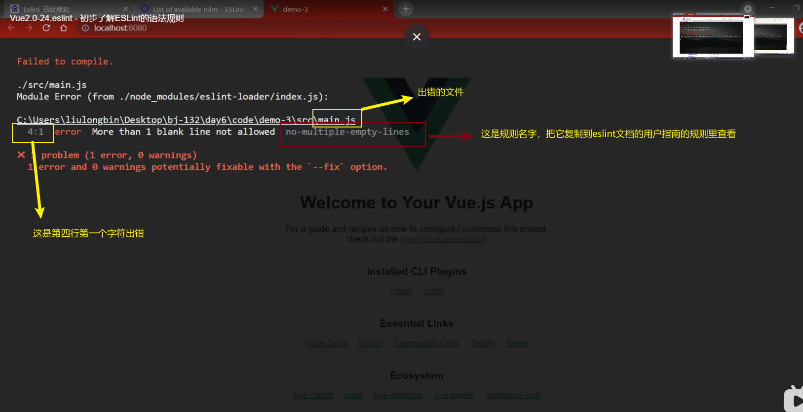

  + 常见的语法规则：

    ​	

    + 如果对于`eslint`默认的语法规则不满意，想要修改语法规则，可以去官方文档找到对应的规则并在eslint配置文件修改：

      + 下面是修改写函数时，eslint默认要这种格式：`add () {}`；但是我们习惯这种`add() {}`；所以就按照下面的步骤修改下：

      

      

  

  

  + 配置vscode使代码自动格式化满足eslint的代码规范：

    + 注意：eslint 只会对我们书写的代码是否符合它的要求进行检查报错，并不会帮我们修改，我们还要找到错误，去查看eslint官方文档，才知道去哪里修改我们的什么错误；因此，我们需要配置vscode的插件，帮我们解决大部分语法规范，如果个别问题插件解决不了的，还需要我们自己动手；

    + 安装vscode插件:

      ESLint插件：

      

      在设置里的配置文件做如下配置：

      

      安装Prettier-Code formatter插件并配置：

      1. 

      2. 配置文件做如下配置：

         

      3. 在用户的文件里放这个配置文件：

         

      4. 接着也在配置文件写它：

         
         
         > 注意：
         >
         > 1. vscode安装了很多插件了，要开发哪个项目，就直接在vscode打开那个项目，不要打开项目外围的文件，否则插件会不生效；
         > 2. 安装好插件之后，要在App组件和main.js里，右键打开选项，选择 使用...格式化文档，点击 配置默认格式化程序，然后再点击 prettier code-formata；
         > 3. 安装完上面的插件并配置好后，插件就会帮我们按eslint的规范格式化文档，符合代码eslint的规范，就不会报错；那么，我们写代码就不需要关注格式问题了，只要逻辑没错，格式想怎么写就怎么写；
         > 3. ==已经把prettier关闭了，如果要打开需要在设置里，把Format On Save勾上；==
    
    

#### axios挂载到vue原型上并配置请求根路径

+ 场景：当在不同的组件使用axios时，都要导入一遍，如果多个组件需要使用就要重复导入；并且每次请求的根路径是相同的，重复写很麻烦；

+ 解决：

  + 在main.js，把axios挂载到vue原型对象上；因为每个组件就是一个vue实例：

    ```js
    import axios from 'axios'
    // $http是自定义的名字，推荐使用$http
    Vue.prototype.$http = axios
    // 配置请求的根路径，包括协议，域名，端口
    axios.defaults.baseURL = 'http://liulongbin.top:3006'
    ```

  + 在组件中的使用

    ```vue
    <template>
      <div>
        <button @click="get">点击</button>
      </div>
    </template>
    
    <script>
    export default {
      methods: {
        get() {
          // 直接以组件实例对象的属性使用axios即可，不用再次导入axios模块；而且，也不用重复写根路径，只需要写对象的uri
          this.$http.get('/get', { params: { id: 1 } })
        }
      }
    }
    </script>
    
    <style></style>
    
    ```

    > 使用上面的方法不利于axios的复用；如果一个项目中，有多个请求地址，且请求的根路径都是不同的，当你在main.js配置好根路径，只是一个根路径，根路径换了，就不利于复用了；

#### 实际开发中，axios的封装

+ 场景：在实际开发中，会有很多不同的请求根路径，如果只是配置一个根路径，显然是不可以的；所以，在实际开发中，会独立封装axios的模块，每一个对应是一个请求根路径，如果有多个请求根路径就封装多个模块；

+ 好处：对于不同的请求根路径，可以使用其对应的模块，提高了复用性，不必再写根路径，只要写uri；

+ 每个导入的axios的模块的使用都跟axios的使用是一样的；

  + 在src目录下新建一个utils文件夹，这个文件夹里存放工具类模块；封装axios模块，我们叫request.js：

    ```js
    import axios from 'axios'
    
    // 通过create创建出来的每个小axios都是独立；
    const request = axios.create({
      // 指定请求根路径
      baseURL: 'https://www.escook.cn'
    })
    
    export default request
    ```

    > 注意：一旦进入一个页面就需要请求数据，具体的步骤是：
    >
    > 1. 现在methods里封装一个请求的方法；==把请求的数据，存到data里==；
    > 2. 在created里调用这个请求的方法；

+ 在实际的开发中，会请求同一个接口多次，每次请求的代码都一样；因此，可以给每个请求封装一个api，把相同类型的，不同请求接口放到一个模块里按需导出；比如，我们可能会有很多关于文章类的接口需要请求，可以创建一个文章类的模块，这个模块的成员有获取文章列表的api，获取文章详情的api，获取文章作者的api等等；案例如下：

  未封装时，我们在首页组件需要请求文章列表，要如下写法：

  ```vue
  <script>
    //导入封装好，配置的根路径的请求模块  
  import request from '@/utils/request.js'
  export default {
    created() {
      // 在created生命周期函数调用请求文章列表的方法
      this.initArticleList()
    },
    methods: {
      // 定义一个请求文章列表的方法
      async initArticleList() {
        const { data: res } = await request.get('/articles', {
          params: {
            _page: this.page,
            _limit: this.limit
          }
        })
        console.log(res)
      }
    },
    data() {
        //页数和请求的条数
      return {
        page: 1,
        limit: 10
      }
    }
  }
  </script>
  ```

  未封装时，我们在另外的组件需要请求文章列表，也同样如下写法，唯一的区别就是页数和请求的条数不一样，而`await`后面接的`promise`实例对象，都是一样的：

  ```vue
  <script>
    //导入封装好，配置的根路径的请求模块  
  import request from '@/utils/request.js'
  export default {
    created() {
      // 在created生命周期函数调用请求文章列表的方法
      this.initArticleList()
    },
    methods: {
      // 定义一个请求文章列表的方法
      async initArticleList() {
        const { data: res } = await request.get('/articles', {
          params: {
            _page: this.page,
            _limit: this.limit
          }
        })
        console.log(res)
      }
    },
    data() {
      return {
          //页数和请求的条数
        page: 2,
        limit: 5
      }
    }
  }
  </script>
  ```

  基于上面代码的臃肿，我们可以单独新建一个api的文件在src目录，给每个请求大类就是一个模块，模块里有许多和这个大类相关的成员，比如在api里新建一个文章相关的请求模块 articleAPI.js ，模块里有文章请求列表成员 ，代码如下：

  

  封装getArticleListAPI

  ```js
  // 默认导入封装配置好的axios请求模块
  import request from '@/utils/request.js'
  
  // 按需导出；建议导出的名字都有一个API后缀；
  export function getArticleListAPI(_page, _limit) {
    // 注意：一定要return ,才能调用时得到返回值
    return request.get('/articles', {
      params: {
        // _page: _page,
        // _limit: _limit
        _page,
        _limit
      }
    })
  }
  
  ```

  封装之后，如果多个组件请求同一个接口，就直接导入api即可，不用写重复的内容；

  ```vue
  <script>
  // 按需导入封装好的api
  import { getArticleListAPI } from '@/api/articleAPI.js'
  export default {
    created() {
      // 在created生命周期函数调用请求文章列表的方法
      this.initArticleList()
    },
    methods: {
      // 定义一个请求文章列表的方法
      async initArticleList() {
        // 未封装的写法
        // const { data: res } = await request.get('/articles', {
        //   params: {
        //     _page: this.page,
        //     _limit: this.limit
        //   }
        // })
  
        // 封装之后的写法，由于导入的是一个promise对象，同样适用async  await
        const { data: res } = await getArticleListAPI(this.page, this.limit)
        console.log(res)
      }
    },
    data() {
      return {
        page: 1,
        limit: 10
      }
    }
  }
  </script>
  ```

  

#### 前端路由

+ 锚链接：会跳转到当前页面的不同位置，但是不会进行页面刷新，会有历史记录，可以返回；

  + ```html
    <!DOCTYPE html>
    <html lang="en">
    <head>
      <meta charset="UTF-8">
      <meta http-equiv="X-UA-Compatible" content="IE=edge">
      <meta name="viewport" content="width=device-width, initial-scale=1.0">
      <title>Document</title>
      <style>
        .box {
          height: 800px;
    
        }
        #b1 {
          background-color: burlywood;
        }
        #b2 {
          background-color: red;
        }
        #b3 {
          background-color: green;
        }
        #b4 {
          background-color: yellow;
        }
        .bar {
          position: fixed;
        }
      </style>
    </head>
    <body>
      <div class="bar">
        <a href="#b1">111</a>
        <a href="#b2">222</a>
        <a href="#b3">333</a>
        <a href="#b4">444</a>
      </div>
     
      <div class="box" id="b1"></div>
      <div class="box" id="b2"></div>
      <div class="box" id="b3"></div>
      <div class="box" id="b4"></div>
    </body>
    </html>
    ```

+ 路由就是对应关系：

  + 前端路由就是 Hash 地址与组件的对应关系；
    + Hash地址：就是URL最后面的`#xxxx`的字符串；
    + 前端路由和锚链接本质上是一样的，都是`#xxxx`的形式；
    + 一个组件对应一个Hash地址；
    + 前端路由和锚链接一样，都会改变地址栏Hash值，但是页面不会刷新；

+ 路由的基本使用：

  + 路由的工作原理：

    1. 用户点击页面的路由链接；
    2. 导致了URL地址栏中Hash值发生了变化；
    3. 前端路由监听到了Hash值的变化；
    4. 前端路由把当前的Hash值对应的组件渲染到浏览器中；

  + 前端路由的使用步骤：

    1. 安装 `npm i vue-router@3.5.2 -S`  ；（vue2x安装这个版本）

    2. 在src目录新建一个router文件夹，并 index.js ，创建路由模块；（==路由模块可以使用vue-cli自动安装==）

       ```js
       // 导入vue模块
       import Vue from 'vue'
       // 导入vue-router模块得到VueRouter构造函数
       import VueRouter from 'vue-router'
       // 导入Hash值对应的组件
       import Home from '@/components/home.vue'
       import Movie from '@/components/movie.vue'
       import About from '@/components/about.vue'
       // 把VueRouter安装为vue插件
       Vue.use(VueRouter)
       // 创建路由实例对象
       const router = new VueRouter({
         // 路由规则，里面是Hash值对应的组件
         routes: [
           // 路由重定向；由于刚进页面，Hash值为#/,由于在路由规则中没有对应的组件与之联系，所以就会显示为空页面；
           // 因此，可以使用路由重定向，一旦Hash值为#/，就立马改为#/home，那么就有了与之对应的组件显示；
           { path: '/', redirect: '/home' },
           { path: '/home', component: Home },
           { path: '/movie', component: Movie },
           { path: '/about', component: About }
         ]
       })
       // 导出路由实例对象
       export default router
       
       
       ```

       

    3. 在 main.js 导入并挂载路由模块，那么vue项目中所有的组件都可以使用路由；

       ```js
       import Vue from 'vue'
       import App from './App.vue'
       // 导入路由模块，得到路由实例对象
       import router from '@/router/index.js'
       // 上面的导入也可以下面的写法，直接导入的路径为文件夹，那么文件夹里的index.js就会被自动导入
       // import router from '@/router'
       
       Vue.config.productionTip = false
       
       new Vue({
         // 这是把路由实例对象挂载到vue实例对象，那么vue项目中的路由便可以被使用；
         // router:router,
         // 这是上面的简写
         router,
         render: (h) => h(App)
       }).$mount('#app')
       
       ```

       

    4. 在组件中，声明路由链接和占位符；

       ```vue
       <template>
         <div class="app_container">
           <h1>根组件</h1>
           <hr />
       
           <!-- 路由链接：改变地址栏的Hash值，页面不会刷新；to的值为Hash值，省略#；-->
           <router-link to="/home">首页</router-link>
           <router-link to="/movie">电影</router-link>
           <router-link to="/about">关于</router-link>
           <!-- 占位符，组件会被渲染到这个位置；只有在项目中安装了 vue-router 才可以使用这个router-view组件； -->
           <router-view></router-view>
         </div>
       </template>
       
       <script>
       export default {}
       </script>
       
       <style lang="less" scoped>
       .app_container {
         height: 400px;
         background: #ccc;
       }
       </style>
       
       ```
       
       > 注意：URL地址栏不要出现大写的字符，包括Hash地址；

+ 嵌套路由：

  + 显示在页面的组件是通过路由链接控制显示的，要在当前的组件里再嵌套路由链接和路由占位符，这就是路由嵌套；

  + 注意：路由链接的hash值要写完整的，父路由规则的hash值也要写完整的；子路由规则的hash只需要写一半，且不能有`/`；

  + 嵌套路由时，子路由的路由链接不一定要写在父路由的组件上，可以写在父路由组件的子组件里；

    

  + 案例如下：

    要在哪个组件里嵌套路由，就在该组件里声明路由链接和占位符：

    ```vue
    <template>
      <div class="about_container">
        <h1>关于</h1>
        <hr />
        <!-- 在父级路由模板里声明子级路由链接和占位符；注意：to的值是要改变地址栏的Hash，
        要在父级Hash的基础上加子级的Hash值 -->
        <router-link to="/about/tab1">tab1</router-link>
        <router-link to="/about/tab2">tab2</router-link>
        <router-view></router-view>
      </div>
    </template>
    
    <script>
    export default {}
    </script>
    
    <style lang="less" scoped>
    .about_container {
      height: 200px;
      background: green;
    }
    </style>
    
    ```

    在router文件夹里的index.js里，声明子路由规则：

    ```js
    import Vue from 'vue'
    import VueRouter from 'vue-router'
    import Home from '@/components/home.vue'
    import Movie from '@/components/movie.vue'
    import About from '@/components/about.vue'
    // 导入子级路由的组件
    import Tab1 from '@/components/tab1.vue'
    import Tab2 from '@/components/tab2.vue'
    Vue.use(VueRouter)
    const router = new VueRouter({
      routes: [
        { path: '/', redirect: '/home' },
        { path: '/home', component: Home },
        { path: '/movie', component: Movie },
        {
          path: '/about',
          component: About,
          // 当点击父级路由链接时，地址栏的Hash值是父级的Hash，并不是子级路由规则里的Hash，
          // 就不会显示子级路由里的第一条规则里的组件，因此要路由重定向；
          redirect: '/about/tab1',
          // 通过children属性声明子级路由规则，在某条父级路由规则下声明；
          children: [
              //在子路由规则里,path只需要写/about/tab1的一部分即可，不能加/；
            { path: 'tab1', component: Tab1 },//访问#/about/tab1，展示Tab1组件
            { path: 'tab2', component: Tab2 }
          ]
        }
      ]
    })
    export default router
    
    ```

  + 如果路由嵌套时，父级路由规则没有路由重定向，可以使用默认子路由的方式（不建议，别人写看得懂就可以），两种选一种；

    

+ 路由传参

  + 特点：嵌套路由的特点是：切换到嵌套路由的父组件，可以在父组件切换子路由里的组件，仍然可以看到父组件；使用路由传参的特点：不是路由嵌套，而是不同的路由链接对应的是同一个组件，只是这个组件里的信息，数据发生了变化，组件结构不变，数据之所以会变化，是这个组件通过路由链接的Hash值拿到Hash值里的参数，根据拿到的参数去后台请求数据并把数据渲染出来；

  + 注意：==多个hash值对应一个组件（动态路由），或者一个hash值对应一个组件都会出现路由传参；==

  + 注意：

    + 以params的形式，路由规则必须要有占位；以query的形式则不用。
    + 如何制定params参数可传可不传？
      + 
      + 
    + 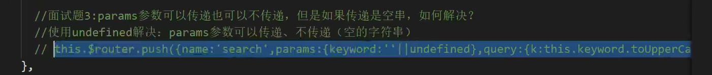
    + 配置路由规则时，开启props。
      + 
      + 
      + 

  + 路由传参之动态路由（params的方式），把要传递的参数放到`/`后面，这个参数叫路径参数；

    + 如果多个hash值对应一个组件，使用下面这种方法可以生命路由，但是复用性差：

    

    + 因此，使用下面这种提高路由规则的复用性： 
  
    

    + 通过动态路由的方式，把路由规则中可变部分变为参数项，提高了路由规则的复用性；`:参数`相当于是一个占位符；只要路由链接的Hash值满足动态路由规则的形式，就会展示对应的组件；==多个Hash值对应一个组件；==

  + 1. 通过`$route`，这个路由的参数对象，组件可以拿到Hash值可变部分的路径参数，进而通过参数获取该参数所对应的数据渲染到页面，但是组件是同一个，数据不同；现实中的应用：比如每部电影都有其对应的详情信息，可以通过路由传参的方式把这步电影的 id 传进去给组件，组件拿到 id 就可以获取到这部电影的详情信息；(看下面的案例演示)
  
    2. 除了上面的通过`$route`拿到动态参数值之外，还可以通过`props`拿到路径参数值；这两种方法都可以，推荐使用第二种比较简单；
  
       在路由规则里开启`props`属性，只有在有动态参数时使用`props`才有意义；
  
       ```js
        { path: '/movie/:mid', component: Movie, props: true },
       ```
  
       开启之后就可以在这条路由规则的组件里定义一个自定义属性，属性名与动态参数名一样；
  
       ```vue
       <template>
         <div class="movie_container">
           <h1>电影-------{{ mid }}</h1>
         </div>
       </template>
       
       <script>
       export default {
         // 自定义属性接受动态参数的值，属性名与动态参数名一样；动态参数名在路由规则是任意取的；
         props: ['mid']
       }
       </script>
       
       <style lang="less" scoped>
       .movie_container {
         height: 200px;
         background: aqua;
       }
       </style>
       
       ```
  
       
  
    + 注意：动态路由只是在配置路由规则时是动态的形式，在写路由链接的Hash值时，并不能写动态的，要写具体的Hash值，因为组件要通过这里的Hash值获取到参数；
  
    + 案例：
  
    电影组件
  
    ```vue
    <template>
      <div class="movie_container">
        <!-- $route是组件实例对象的一个属性，可以通过this.$route.params.参数名，拿到当前Hash值的可变部分参数值；
        这里不一定要mid，这个名字是在路由模块里的路由规则那里随便取的； -->
        <h1>电影---{{ $route.params.mid }}</h1>
      </div>
    </template>
    
    <script>
    export default {}
    </script>
    
    <style lang="less" scoped>
    .movie_container {
      height: 200px;
      background: aqua;
    }
    </style>
    
    ```
  
    路由模块的路由规则
  
    ```js
    import Vue from 'vue'
    import VueRouter from 'vue-router'
    import Home from '@/components/home.vue'
    import Movie from '@/components/movie.vue'
    import About from '@/components/about.vue'
    
    Vue.use(VueRouter)
    const router = new VueRouter({
      routes: [
        { path: '/', redirect: '/home' },
        { path: '/home', component: Home },
        // 由于多个Hash值对应同一个组件，就可以以动态的形式设置路由规则，用 :xxx 的形式代替可变的部分；
        { path: '/movie/:mid', component: Movie },
        {
          path: '/about',
          component: About
        }
      ]
    })
    export default router
    
    ```
  
    根组件
  
    ```vue
    <template>
      <div class="app_container">
        <h1>根组件</h1>
        <hr />
    
        <router-link to="/home">首页</router-link>
        <!-- 动态路由的路由链接；多个Hash值对应同一个组件，传入路径参数； -->
        <router-link to="/movie/1">电影1</router-link>
        <router-link to="/movie/2">电影2</router-link>
        <router-link to="/movie/3">电影3</router-link>
    
        <router-link to="/about">关于</router-link>
        <router-view></router-view>
      </div>
    </template>
    
    <script>
    export default {}
    </script>
    
    <style lang="less" scoped>
    .app_container {
      height: 400px;
      background: #ccc;
    }
    </style>
    
    ```
  
    > ==规定：路由传参就用路径参数的形式，动态路由也用路径参数的形式；以免和查询参数的形式混了；==
    >
    > ==动态路由就是多个hash值或者多个路由链接对应一个组件；==
    >
    > ==配置路由规则时，只要没有默认子路由，就都加name属性；所有的子路由的第一条都用默认子路由的形式；==
    >
    > ==在写路由链接的hash和路径参数时，有下面{}的方式，这是第二种写法，见下面的案例；params里的属性名要和路由规则里的自定义的参数名一样；==
    >
    > ```vue
    > :to="{name:'articledetail', params: {articleId: artId}}"  记得绑定属性
    > ```
    >
    > ```js
    >   {
    >     // 因为不知路径参数是什么，就只能自定义参数表示；推荐开启props属性，组件就可以自定义属性，自定义属性名也要和自定义参数名一样
    >     path: '/articledetail/:articleId',
    >     name: 'articledetail',
    >     component: () => import('@/views/ArticleDetail/ArticleDetail.vue'),
    >     props: true
    >   }
    > ```
    >
    > > 注意：通过路由显示的组件，没有和哪个组件是父子关系或者兄弟关系，所以从一个组件传递参数给路由组件只能是以路由传参的形式；而普通的组件，则有父子关系和兄弟关系，所以可以通过自定义属性和自定义事件等方式传递参数；
    >
    > 

  + 路由传参之 query 的方式；
  
    + 在路由链接传入查询参数，`?xx=xx&xx=xx`；
  
      > `/xx`这个叫路径参数；
  
    + 在声明路由规则时，只需要写一条路由规则即可，因为查询参数不会影响到前端路由在地址栏识别hash值，查询字符串相当于不存在；
  
    + 在组件中获取参数，仍然要使用路由参数对象`$route`；
  
    + 在写路由链接的hash值和要传递的参数的第二种写法：
  
      + ```vue
            <div class="not-login" v-else>
              <!-- 从我的页面去到登录页，由于登录页的代码不是设置this.$router.back()；因此为了能回到
              我的页面，就要通过路由传参的方式，把当前的页面的hash值给传到登录页面的hash值；以query查询参数的方式；
              -->
              
              <p>登录/注册</p>
            </div
        ```
  
      + 
  
    + 案例：
  
      路由模块
  
      ```js
      import Vue from 'vue'
      import VueRouter from 'vue-router'
      import Home from '@/components/home.vue'
      import Movie from '@/components/movie.vue'
      import About from '@/components/about.vue'
      
      Vue.use(VueRouter)
      const router = new VueRouter({
        routes: [
          { path: '/', redirect: '/home' },
          { path: '/home', component: Home },
          // 在配置路由规则时，什么都不用变
          { path: '/movie', component: Movie },
          {
            path: '/about',
            component: About
          }
        ]
      })
      export default router
      
      ```
  
      电影组件
  
      ```vue
      <template>
        <div class="movie_container">
          <!-- 通过query的形式拿到传递的参数 -->
          <h1>电影-------{{ $route.query.mid }}</h1>
        </div>
      </template>
      
      <script>
      export default {}
      </script>
      
      <style lang="less" scoped>
      .movie_container {
        height: 200px;
        background: aqua;
      }
      </style>
      
      ```
  
      在根组件声明路由链接并传递参数进去
  
      ```vue
      <template>
        <div class="app_container">
          <h1>根组件</h1>
          <hr />
      
          <router-link to="/home">首页</router-link>
          <!-- 动态路由的路由链接；多个Hash值对应同一个组件，参数从这里传进去； -->
          <router-link to="/movie?mid=1">电影1</router-link>
          <router-link to="/movie?mid=2">电影2</router-link>
          <router-link to="/movie?mid=3">电影3</router-link>
      
          <router-link to="/about">关于</router-link>
          <router-view></router-view>
        </div>
      </template>
      
      <script>
      export default {}
      </script>
      
      <style lang="less" scoped>
      .app_container {
        height: 400px;
        background: #ccc;
      }
      </style>
      
      ```
  
      > 注意：
      >
      > 1. `$route`是路由的==参数对象；==
      > 2. 通过`this.$route`拿到这个对象；
      > 3. 这个对象里的`fullPath`是完整的路由链接传入的字符串；
      > 4. 对象里的`path`属性值是Hash值；
      > 5. 路由传参可以只用params或者query的形式，两种用其中一种即可；
      > 5. ==非组件的router.currentRoute就是在组件里的this.$route==；
      > 5. ==在非组件中，router.push就是组件中的this.$router.push；==
      
      

#### 编程式导航

+ 在浏览器中，点击链接实现页面切换的导航的方式，叫做声明式导航；如，在普通页面中，点击a链接，在vue项目中点击router-link都属于声明式导航；**即声明标签，并在标签上加地址的形式；**

+ 在浏览器中，**调用api的方法，写js代码**，实现导航的方式，叫做编程式导航；

  + `$router`是组件实例对象的属性，通过this获得；叫做路由的==导航对象；==

  + 在 vue-router 中编程式导航的API:

    + `this.$router.push('hash地址')`

      + 跳转到指定的hash地址，前端路由监听到地址栏的hash值的变化，就显示对应的组件；会增加一条历史记录；

      + ```vue
        <template>
          <div class="movie_container">
            <h1>电影-------{{ $route.query.mid }}</h1>
            <!-- 点击跳转到about组件 -->
            <button @click="jump">跳转</button>
          </div>
        </template>
        
        <script>
        export default {
          methods: {
            jump() {
              // 调用导航对象，改变地址栏的hash值
              this.$router.push('/about')
            }
          }
        }
        </script>
        
        <style lang="less" scoped>
        .movie_container {
          height: 200px;
          background: aqua;
        }
        </style>
        
        ```

    + `this.$router.replace('hash地址')`

      + 跳转到指定的hash地址，并替换掉当前的历史记录；也就是说不能返回；

    + `this.$router.go(数值n)`

      + 调用这个方法，可以在浏览器历史中前进和后退，也就是说有历史记录才可以前进和后退；

        ```vue
        <template>
          <div class="movie_container">
            <h1>电影-------{{ $route.query.mid }}</h1>
            <!-- 在历史记录中后退一步，可以是2步，只要不超过能退的步数，超过就会原地不动；
            写在行内时，不能以this.$router.go()这种形式，把this去掉； -->
            <button @click="$router.go(-1)">后退</button>
            
            <button @click="$router.go(1)">前进</button>
          </div>
        </template>
        
        <script>
        export default {}
        </script>
        
        <style lang="less" scoped>
        .movie_container {
          height: 200px;
          background: aqua;
        }
        </style>
        
        ```

    + 在实际开发中只会在历史记录中，后退和前进一层页面，所以可以用下面的api即可；

      + `this.$router.back()`：在历史记录中，后退到上一个层页面；
      + `this.$router.forward()`：在历史记录中，后退到下一个层页面；

#### 导航守卫

+ 导航守卫可以控制路由的访问权限；

  

+ 只要在路由模块里，声明全局前置守卫，每次点击路由链接进行跳转之前，都会触发全局前置守卫的回调函数，在这个回调函数里写代码判断进行控制路由跳转的权限；如果不声明全局前置守卫，默认点击路由链接都会跳转到对应的组件页面，就相当于声明了全局前置守卫时，直接调用了`next()`；

  

+ `to`是将要去的组件的信息对象，包含将要去的组件的hash值，通过`to.path`获得，如果是在忘记，可以打印出这个对象去查看；`from`是将要离开的组件的信息对象，同样可以通过`path`属性得到其对应的hash值；`next`是一个函数，调用这个函数表示可以路由导航；每次写全局前置守卫的时候，先调用`next()`方法，先放行，不然页面都不会跳转；

  

+ `next`函数的三种调用方式

  

+ 控制后台主页的访问权限

  

+ 判断一个账户有没有登录是看本地存储`localStorage.getItem('token')`有没有存在；如果没有`token`就是未登录；退出登录就是`localStorage.remove('token')`，把`token`在本地存储删除掉；

+ 如果要控制的路由访问权限有很多，可以下面这么写，但是很多的话就会很麻烦：

  ```js
   if(to.path === '/home' || to.path === '/main' || to.path === '/xxxx') {
  
    }
    else {}
  ```

  因此可以这么写：

  ```js
   let arr = ['/home', '/main', '/xxxx']
   if(arr.includes(to.path)) {} else {}
  ```

  或者可以单独写一个js模块，里面专门放一个数组，然后导出数组，使用的时候导入；

  ```js
  export default ['/home', '/main', '/xxxx']
  ```

#### vue-cli安装路由模块时注意点

​	

> 注意：通过vue-cli自动安装了路由模块之后，会在项目根目录自动生成 views 文件夹，这个文件夹里放着通过路由切换显示与隐藏的组件；components文件夹里放着除了view文件里那种类型的组件之外的组件；


#### 配置@的路径提示

+ 安装这个插件

  

+ 打开设置，点击打开右上角的settings.json

  

+ 在json文件的{}里输入如下的配置信息

  ```js
   //导入文件时是否携带文件的扩展名
      "path-autocomplete.extensionOnImport": true,
      //配置@的路径提示
      "path-autocomplete.pathMappings": {
          "@": "${folder}/src"
      },
  ```

  > 注意：当我们要开发哪个项目就在vscode打开哪个项目目录，这个路径提示才会生效；

#### vue项目中书写代码自动生成的技巧

+ 在安装了vetur和vue3插件后，在组件里直接按下`<`，就可以生成组件的骨架；
+ 使用组件时，书写标签自动闭合插件：Auto Close Tag；

#### 黑马头条移动端制作

+ ==每次数据持久化都最后再操作；只要有对请求到data里的数据进行过修改操作，就要把数据持久化；数据持久化有两种，已经登录的，就通过调用接口把数据持久化到线上，那么在不同的设备登录，数据就会同步；如果未登录，就把数据持久化到本地==；

+ ==为了防止网络慢，用户多次行为导致会发起多个请求时，一定要添加loadding效果，在准备发起请求之前开启loadding，在请求结束后关闭loadding；比如，点击某个按钮发起请求时；==至于函数防抖，防止发起多次请求的使用场景在于，不能开启loadding的场景使用，因为开启loadding 就代表不能再使用这个功能了；比如，在搜索联想建议时，输入框每变化一次就会发起一次请求，这时为了防止多次没意义的请求，就要开启函数防抖，不能开启loadding，开启loaading之后，用户的输入框就不能键入文字了，用户体验极差；除了可以开启loadding，开启toast提示操作中，然后禁止背景点击，把时长延长，等到操作成功了就开启第二个toast，那么第一个toast就会自动关闭，这也是跟loadding相同的作用，可以防止网络慢用户多次点击发起多次请求；

+ ```js
  `${这里面跟vue指令里面一样，都是些js表达式的}`
  ```

+ popup弹出层组件，当打开时会创建组件，当关闭时组件并不会被销毁，因此当再次打开时组件里面的数据还会一样，如果在实际开发中发现使用弹出层里面的数据并不是我们想要的样子，可能就是这个原因，要使用v-if条件渲染，动态的创建和销毁组件；

+ 在调用数据请求api时，传入的数据都要在data里定义或者在data里拿；即data有就从data拿，data里没有就自己定义一个变量；

+ 使用flex布局，如果不给子元素设置宽度（主轴为x），这个不设置宽度的内容越多就会撑开自身，如果另外一个兄弟盒子有设置宽度也会被挤压，因为一旦父元素设置flex，子元素默认都是flex-shrink:1；就是超出父元素宽度会自动缩小；比如，

  + 

+ flex-grow就是分配剩余空间的多少；flex-shrink就是减小自身的宽度的多少去不至于超出父元素的宽度（主轴为x）；

+ 动态添加类名设置样式

  + 

+ 使用`vant`组件库：
  + 安装`vant`包；
  + 直接一次性导入所有的组件，开发时不用在意代码臃肿；等到要项目发布后，就会进行优化；一次性导入所有组件之后，就相当于全局注册好了，可以直接使用，下次使用别的组件也不用导入了；
  
+ 项目初始化：

  + 创建vue项目时，这个最好也勾上
    + 

  + 初始化项目目录
    + 删除不要的文件；
    + 在 src 目录下新增 api 文件夹（请求的数据的api），utils 文件夹（工具类模块），styles文件夹并新建index.less文件（全局样式表）；
    + 每完成一个一个模块，就可以把项目提交到码云的远程仓库；

  + rem适配

    + [postcss-pxtorem](https://github.com/cuth/postcss-pxtorem) 是一款 PostCSS 插件，用于将自动 px 单位转化为 rem 单位，代码仍然使用px即可，打包时会自动转换；

      + 安装`npm install postcss-pxtorem -D`；

      + 项目根目录新建`postcss.config.js`的配置文件；

        + ```js
          // 先安装npm install postcss-pxtorem -D
          // 新建这个配置文件，去vant文档的rem适配那里，复制下面的代码
          // 这个postcss-pxtorem插件的作用是把项目里以px为单位自动转化为rem；也会把组件的单位给转化了；
          
          // postcss.config.js
          module.exports = {
            plugins: {
              // 这些vue-cli已经帮我们配置好了
              // autoprefixer: {
              //   browsers: ['Android >= 4.0', 'iOS >= 8']
              // },
              'postcss-pxtorem': {
                  //设置根字体大小，把px转化为rem
                rootValue: 37.5,
                // 所有属性都转换
                propList: ['*']
              }
            }
          }
          
          ```

        + 在`.browserslistrc`配置文件，修改如下：

          + ```js
            # > 1%
            # last 2 versions
            # not dead
            # 把上面的注释掉，正常上面就可以满足，只是可以兼容更细
            
            Android >= 4.0
            iOS >= 8
            
            ```

    + [lib-flexible](https://github.com/amfe/lib-flexible) 用于设置 rem 基准值，自动根据屏幕的变换设置html字体的大小，分成十份；

      + 安装`npm i amfe-flexible`;
      + - 在main.js导入，`import 'amfe-flexible'`；

    + 注意：

      + vant组件库是基于逻辑像素375px设计的组件，所以当在配置文件里把根字体大小设置为37.5px，组件正常显示；
      + 而我们拿到的设计稿是750px的手机物理像素，即在手机显示的页面就是750px宽，但是在电脑同样的宽度只有375px宽；为了在开发时显示的与实际的手机宽度一样，我们采用的是电脑逻辑像素的375；由于我们安装了导入了flexible.js，在电脑的逻辑像素下，根字体大小为37.5；那么我们量取的设计图也必须是375px宽，但是我们的是750px；因此，要把设计图给缩小一半；但是，不能在ps里通过像素为单位缩小一半，否则设计稿里的图片就不是二倍图了；要在ps里的，在 Photoshop 中打开单位与标尺设置面板：菜单栏 -> 编辑 -> 首选项 -> 单位与标尺。将单位中的标尺和文字的单位修改为`点`；打开设置图像大小面板：菜单栏=》图像=》图像大小；关闭重新采样；将宽度单位设置为`点`；将高度单位设置为`点`；将宽度修改为 `375`，高度不用动（它会适应宽度自动调整）；点击确定完成修改。
      + 调整之后，我们可以看到图像的大小变成了 375 点 x 667 点（144 ppi）。在 iPhone 6/7/8 设备下，1个点 = 2个物理像素，所以你看到我们导出的图片还是原来的二倍图。

  + 把ui给我们的svg图标制作成字体图标，步骤（借助iconfont网站）：

    1. 

    2. 

    3. 

    4. 

    5. 

    6. 

    7. 

    8. 

    9. 

    10. 

    11. 直接使用，字体类名就是icon.less文件里的`font-family: "xxx"`；

    12. 去iconfont网站我的项目里，复制图标名使用

    13. 

    14. 

        注意：

        1. 在less文件中导入less文件，路径不能使用@，要使用相对路径的形式，否则会报错；
        2. 在制作字体图标时，把图标类名和前缀名设置成一样的，在vant中才可以使用自己的图标和组件配合；

  + vant组件库也有自己的图标，它们的图标可以单独用；也可以与它们的组件一起用；我们的图标也可以与它们的组件配合一起用；

    + 

  + 配置路由页面，即先配置好路由规则，和创建由路由控制的空组件；

    + 把每个由路由控制的组件都放在一个文件夹里，因为那个文件夹里可能还会放和那个组件相关的文件；

    + 封装每个路由时，都给路由加名字，当使用vue调试工具时可以看到对应的名字；

    + 配置路由规则时，也给路由规则起名字；如果有默认子路由，就不需要给路由规则加名字了；

    + 配置路由规则使用懒加载导入；因为可以提高用户体验，加载速度会更快；

      ```js
      { path: 'problem', name: 'problem', component: () => import('@/views/Problem/Problem.vue') }
      ```

  + 给组件设置样式时，可以直接给组件加类名，那么该类名就是被加在组件模板的根元素上面；但是推荐直接在组件的style标签里使用/deep/，这样子代码看起来更干净；如果要给组件设置全局的样式，可以在全局样式表里设置一个类名，每次用到这个样式就直接给组件加这个类名，但是这样子更麻烦；可以定制主题；

+ **首页**：

  + 顶部和底部的组件是导航组件的tabbar和navbar；

  + tabbar有路由模式；

  + 使用vant组件库时，如果一个属性的值是布尔值，默认值为false；要设置为true，可以这样子写`:fixed='true'`，但是也可以简写`fixed`即可；

  + 使用组件库时，要审查元素，去查看样式和类名；

  + 在写一个组件时，这个组件要被复用，且结构有多种；那么在这个组件里把三个结构都写出来，然后通过`v-if`去动态的隐藏其他不要的结构，留下需要的结构；比如黑马头条移动端首页的文章列表模块，图片有三张，一张，零张的结构；就在这个组件里，把三种结构都写出来，通过`v-if`去判断隐藏；

  + vant加载数据组件（配合文档说明）

    + 使用vant组件库的展示组件里的List列表；

    + 上拉加载组件：

      + 把加载组件套在需要渲染出列表的组件之外；
      + 要在data里定义，loading, finshed；onload处理函数在methods里定义；
      + loading为true代表不能触发load事件；finshed为true代表数据请求完毕，显示没有更多了；
      + 原理：当页面上拉，会触发load事件执行onload处理函数；第一次打开页面也会触发load事件，所以要在data里定义loading时把值改为true；当在created的生命周期函数里第一次数据请求之后，在请求函数里把loading设置为false，才可以当页面上拉可以触发load事件；在onload处理函数需要首先把loading设置为true，代表请求数据完成之前不能再次触发load事件，否则会重复请求数据；然后，接着在处理函数里把页码加一，请求下一页的数据；当请求完成之后要把finshed设置为true；
      + 

    + 下拉刷新(vant组件库里的反馈组件里的PullRefresh)：配合上拉加载一起使用；

      ```vue
      <template>
        <div class="home_container">
          <van-nav-bar title="黑马头条" fixed />
          <!-- 下拉刷新组件 -->
          <!-- 使用disabled属性，当finshed为true代表数据加载完成；disabled为true停止下拉刷新； -->
         <van-pull-refresh v-model="isLoading" @refresh="onRefresh">
         <!--上拉加载组件-->      
          <van-list v-model="loading" :finished="finished" finished-text="没有更多了" @load="onLoad">
            <!-- 使用文章信息组件 -->
            <Articleinfo
              v-for="item in articlelist"
              :key="item.id"
              :title="item.title"
              :author="item.aut_name"
              :cmt-count="item.comm_count"
              :cover="item.cover"
            ></Articleinfo>
          </van-list>
          </van-pull-refresh>
        </div>
      </template>
      
      <script>
      // 按需导入封装好的api
      import { getArticleListAPI } from '@/api/articleAPI.js'
      
      import Articleinfo from '@/components/Articleinfo.vue'
      export default {
        created() {
          // 在created生命周期函数调用请求文章列表的方法
          this.initArticleList()
        },
        methods: {
          // 定义一个请求文章列表的方法
          async initArticleList(isRefresh) {
          
            const { data: res } = await getArticleListAPI(this.page, this.limit)
          // 如果isRefresh为true则把新数组拼接在旧数组前面；如果没有传入参数，就是undefined，把新数组拼接在旧数组后面
            if (isRefresh) {
              this.articlelist = [...res, ...this.articlelist]
              // 把这个关掉才可以再次下拉刷新
              this.isLoading = false
            } else {
              this.articlelist = [...this.articlelist, ...res]
              // 第一次请求数据之后把loadiing关了，才可以上拉触发load事件；
              this.loading = false
            }
            if (res.length === 0) {
              this.finished = true
            }
          },
          onLoad() {
            // 触发load事件，把loading开起来，数据请求完成之前无法反复触发load事件
            this.loading = true
           
            // 请求下一页的数据
            this.page++
              //调用数据请求的方法
            this.initArticleList()
          },
             // 下拉刷新处理函数
          onRefresh() {
            // 页码加一
            this.page++
            // 如果布尔值为true，数组的拼接与上拉加载相反
            this.initArticleList(true)
          }
        },
        data() {
          return {
            page: 1,
            limit: 10,
            articlelist: [],
            // 是否触发load事件执行onload处理函数请求数据，true代表在请求数据;由于刚进页面会触发load事件，所以把loading开起来就不会触发；
            loading: true,
            // 是否完成了数据请求，即是否数据已经没有了；true代表已完成；
            finished: false,
              // 是否是下拉刷新的状态
            isLoading: false
          }
        },
        components: {
          Articleinfo
        }
      }
      </script>
      ```

    + vant定制主题
    
      + 场景：当我们使用组件库封装好的组件，如果需要修改默认样式；可以在使用组件的父组件里的style标签里使用/deep/修改；但是这样子修改有一个缺点，就是如果在别的父组件还是要使用这个子组件，那么就还需要修改一次样式；
    
      + 解决：使用vant定制主题：
    
        + 原理：使用的组件的样式都是因为我们引入了`import 'vant/lib/index.css'`；如果要定制主题就要引入`import 'vant/lib/index.less'`的less文件；因为可以通过组件的样式都是通过less变量去定义的；可以修改某个样式的less变量，就可以修改这个样式；比如：某个标签的字体颜色的less变量为`@color:red`，即`p{color:@color}`；那么我们就只要修改这个变量`@color:blue`即可；如果是引入css文件，修改某个标签的样式还要拿到某个标签，然后修改该标签的样式，还会有权重的问题，而less文件，就只要修改一个变量就搞定了，不需要通过选择器拿到标签；
    
        + 步骤(打开vant文档)：
    
          1. 在main.js引入less文件（无论是引入css还是less，样式都一样，因为打包时会自动编译为css）；
    
             
    
             ```js
             import 'vant/lib/index.less'
             ```
    
          2. 由于是通过vue-cli创建的项目，在项目根目录里配置vue.config.js文件；（代码可以去文档复制）
    
             
    
             
    
             文件内容如下：
    
             ```js
             // 这个文件是vue-cli 创建出来的项目的配置文件
             // 在这个文件中，可以对整个项目的打包，构建进行全局性的配置
             
             // 导入path模块，去得到绝对路径
             const path = require('path')
             
             // 定制主题修改vant样式的less文件的绝对路径
             const themePath = path.join(__dirname, './src/theme.less')
             
             // vue.config.js
             module.exports = {
               css: {
                 loaderOptions: {
                   less: {
                     modifyVars: {
                       // 直接覆盖变量（这是方法其一，如果直接覆盖变量，就是修改配置文件，每次都要重启打包服务器，很麻烦，不要用这种）
                       // 'nav-bar-background-color': 'red',
             
                       // 或者可以通过 less 文件覆盖（文件路径为绝对路径）（使用这一种，导入新建的less文件，在文件里对样式变量去修改，
                       // 每次修改的是less文件，不是配置文件，就不需要重启打包服务器）
                       // 相对路径： ./   ../
                       // 绝对路径：从盘符开始  C:\\Users\\...
                       // 这里要求路径为绝对路径，要借助node.js里的 path模块
                       hack: `true; @import "${themePath}";`
                     }
                   }
                 }
               }
             }
             
             ```
    
          3. 单独在src目录新建一个`theme.less`的文件，里面是要修改vant样式变量的less变量；把这个文件的在vue.config.js中导入；
    
             ```less
             // 在这里覆盖vant官方的less变量值
             
             
             
             @blue: red;
             
             // 覆盖Navbar的less样式
             // 去官方文档对应的组件里找样式变量，比如@nav-bar-background-color在文档里的Navbar组件里的样式变量里
             @nav-bar-background-color:@blue;
             
             
             ```
    
    + 打包发布后生成的dist文件，打开index.html是打不开内容的，因为这个文件默认只能在web服务器才可以使用；那么。就要在vue.config.js文件里，新增 `publicPath:'./'`；
    
      
    
      
  
+ **登录页**

  + vant用到的组件：Toast，NavBar，CountDown，Field输入框，Form表单，button组件；
  + 全局的样式放在第三方组件的样式后面，不然可能会被覆盖；
  + 点击登录按钮
    + 首先需要使用form表单组件包裹输入框和登录按钮；
    + 表单里的登录按钮被点击有默认行为，会先校验输入框的格式；如果校验成功就会触发submit事件，处理函数的内容就是发起登录请求；
    + 校验失败会有默认的错误提示，我们可以自定义错误提示，以toast提示的形式；

  + 点击发送验证码
    + 由于点击发送验证码的按钮也是form表单里的按钮，有默认行为就是校验表单里的所有输入框，触发submit事件；因此先用prevent把默认行为禁止；
    + 可以通过ref拿到form组件的实例调用validate函数，单独校验手机号码是否正确；返回promise实例，可以使用try  catch，去处理失败后的事情；
    + 校验成功就给按钮使用loading，禁止按钮点击，防止网络慢多次点击按钮，造成多次请求；等请求成功了就显示倒计时，把按钮隐藏；
    + 校验失败了，就把loading效果关闭；
  + 具体案例看项目源码；

  

  

  + 登录请求时，要判断失败之后的处理方法，使用`try{}catch(e){}`；

    + 

  + 在给标签的某个属性添加布尔值时，记得绑定属性，才是布尔值，否则就是字符串；

  + token存储 ：

    + token是向后端发起登录请求时，会响应到浏览器的数据，用于身份认证；

    + 把token存在vuex容器最大的好处就是，数据是响应式的，只要state里的token数据发生了变化，就会驱动视图更新；如果存在本地存储，当token被清除了之后，页面与token相关的视图并不会马上更新，而是要经过刷新；因此，必须存在vuex容器；

    + 由于token数据是会被大范围使用，就vuex容器来存储：

      + 先封装本地存储的工具类模块；

        ```js
        // 设置本地存储
        export const setItem = (name, value) => {
          // 本地存储只有字符串才可以被存入；先判断下是不是字符串；
          if (typeof value === 'object') {
            value = JSON.stringify(value)
          }
          localStorage.setItem(name, value)
        }
        // 读取本地存储
        export const getItem = (name) => {
          let data = localStorage.getItem(name)
          // 由于本地存储拿出来的数据也是字符串，如果是对象格式的字符串，就转为对象格式的；
          try {
            data = JSON.parse(data)
            return data
          } catch (e) {
            return data
          }
        }
        
        // 删除本地存储
        export const removeItem = (name) => {
          localStorage.removeItem(name)
        }
        
        ```

      + 点击登录会获取到token，先把token赋值给state，再存入本地；

        ```js
        import Vue from 'vue'
        import Vuex from 'vuex'
        
        import { setItem, getItem } from '@/utils/storage.js'
        
        Vue.use(Vuex)
        // 避免字符串写错没提醒
        const KEY = 'userToken'
        
        export default new Vuex.Store({
          state: {
            userToken: getItem(KEY)
          },
          mutations: {
            setState(state, data) {
              // 拿到token,第一时间把把token存到容器中，否则第一次进入页面容器中是没有token的，要刷新页面才有；
              state.userToken = data
              // 把token存到本地存储中，以防刷新数据，vuex容器中就没有了数据，可以通过本地存储拿到放到容器中；
              setItem(KEY, data)
            }
          },
          actions: {},
          modules: {}
        })
        
        ```

        在登录的处理函数里调用setState函数

        ```js
         this.$store.commit('setState', res.data)
        
        ```

+ **我的页面**

  + 使用的组件，button组件，image组件，cell单元格，grid宫格，dialog弹出框；

  + 有时候修改组件的样式没生效，可能是权重问题，也可能是被覆盖了；比如，background-color:unset；可以这么设置把覆盖的颜色给重置掉；

  + 登录状态时，我的页面有用户信息显示；未登录时，我的页面没有用户信息，用手机图标显示；

    + 原理：通过判断在vuex容器中是否有token数据，有的话就是已经登录状态；无就是未登录；显示与隐藏就是通过v-if和v-else控制；点击登录通过路由导航到登录页面；登录成功就要返回上一级，从哪里来回哪里去；

  + 用户退出登录

    + 点击退出登录之后会弹出框，然后把vuex容器的token给修改为null；当vuex容器里的token修改为空之后，页面中使用到容器里token就会立即更新，因为数据驱动视图，容器里的数据也是响应式的；然后再把本地存储也设置为null；

  + 我的页面用户个人资料渲染

    + 原理：

      1. 封装用户请求数据api；请求当前用户的个人资料需要token认证，即需要从state里拿到token并以请求头的形式发给后端；

         > 注意：由于很多请求都需要token认证，因此可以通过axios请求拦截器统一配置；不然每次请求都配置一次很麻烦；

      2. 在methods里写一个请求的方法；

      3. 在created里调用方法；

+ **首页**

  + 如果要想加载过的页面，不会因为离开页面之后页面数据就消失，就数据就必须在离开页面之后还存在，那么就可以使数据存在不同的组件；这里的不同组件是指被重复使用多次就等于new出多个不同的实例对象，因此，数据被存在不同的组件里，即使这个组件没在页面显示，但是数据仍然存在，再次打开那个页面时，就不必要重新加载；这就是首页不同频道切换的原理；
  
  + 使用到的组件：tab标签页，navbar，button，icon，下拉刷新，上拉加载；
  
  + 步骤：
  
    1. 使用tab标签页布局频道展示；
  
    2. 新建文章列表，使用自定义属性把频道信息传给对应的组件；
  
    3. 由于navbar默认不是固定定位，如果文章列表太长会滑动把navbar带走；底部的tabbar组件默认是固定定位，当文章列表组件使用list组件展示文章时，下面的加载更多样式会被tabbar覆盖住；有两种办法，1. 给navbar固定定位，且给最外层的盒子padding-top和padding-bottom；2. 单独给文章列表设置固定定位，里面的列表只会在里面滚动，不会带走navbar，且最大的好处是，滚动条只在文章列表区域显示，不然用第一种滚动条会在整个大盒子区域显示；由于固定定位盒子的宽高由内容决定，可以设置如下，滚动条也是如下设置，超出部分显示滚动条，不超出不显示；
  
       
  
    4. 上拉加载更多和下拉刷新看源代码解释；
  
    5. 可以使用vant内置样式设置超出部分省略号效果；
  
    6. 文章项单独制作一个组件，布局能用flex最好用flex，巧妙使用v-if去根据条件判断显示样式与隐藏；
    
    7. vant组件的图片组件的样式有时候宽高设置在行内，要修改为在style标签设置样式；因为postcss把px转为rem的插件不能转行内样式的px；

+ 频道编辑页面
  + vant使用的组件：popup弹出层，cell单元格，grid宫格，button；
  + 给首页频道列表加汉堡按钮：
    + 当加了按钮，把频道往左拉到底，由于按钮是固定定位，会把频道名给遮住一部分；这时就要给频道列表的最后位置加一个占位方块，这个占位的宽度要跟按钮一样宽；使用tabs标签页的插槽；
    + 当设置占位元素时，由于父元素设置display:flex，其他的子元素已经把父元素的空间占满了，而我们写的弹性子盒子默认fle-shrink是1，即超过父元素就缩小自己本身，那么这个元素就会缩小到没有宽度，所以要设置为flex-shrink为0；
  + 点击汉堡按钮出现弹出层
    + 直接点击修改弹出层状态即可；
  + 频道项的宽度不要设置，设置一个最小宽度；
  + 如果是基于原有数据衍生出来的新数据，记得多多使用计算属性；推荐频道项数据就是通过计算属性得来的；由于计算属性会因为依赖的数据源发生了变化而重新求值的特点，当在频道编辑时，对推荐频道进行点击，把数组的某一项给添加到用户的数组里，依赖的用户的频道数组的数据发生了变化，推荐频道就会自动减少；不用再次手动删除推荐频道的数组；但是页面刷新数据就会没了，还要做数据的持久化；
  + 
  + 首页的频道列表加载模式；
    + 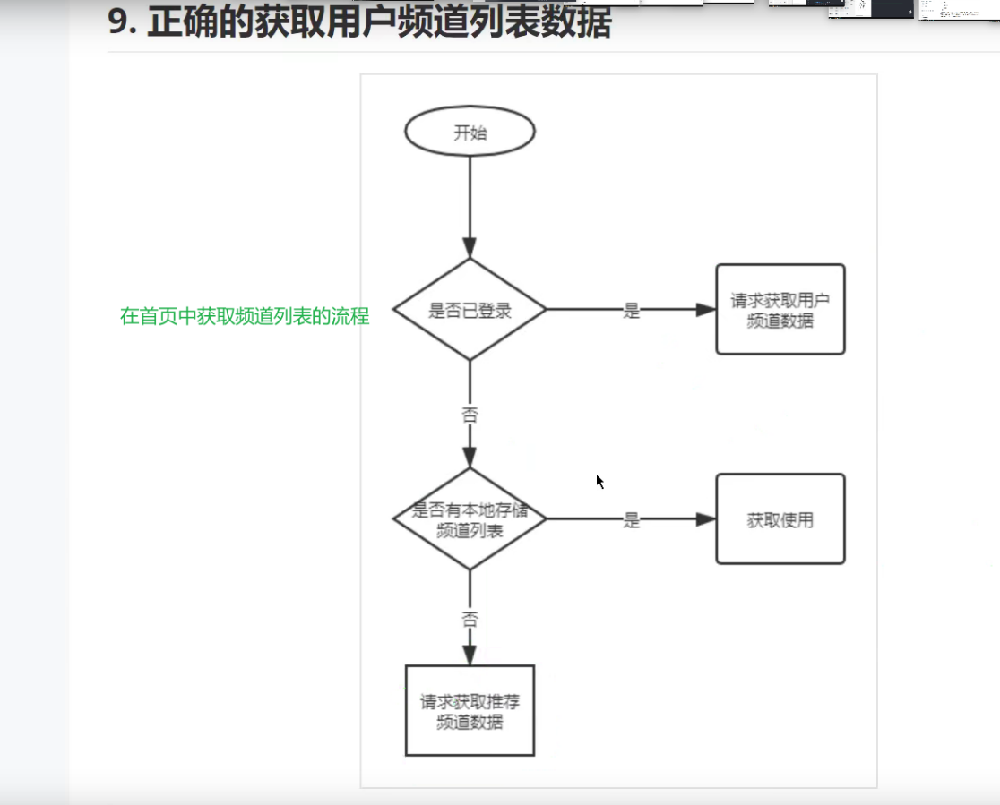

+ **搜索页面**

  + 主要使用到的组件：search搜索组件，list组件；

  + 按钮组件有路由链接功能；

  + 在单页面应用程序中，实现整体页面的切换，都是会用路由，不能使用a标签的url，因为只有一个页面；

  + 如果要动态实现元素的显示与隐藏，就使用v-if配合布尔值；或者三元运算符；

  + 如果实现某部分的页面的切换，即页面的小部分，可以使用动态组件component标签；也可以使用v-if；用v-if比较多；优先考虑v-if；

  + 使用侦听器监听输入框的关键字，每变化一次就请求一次后台的数据，请求太频繁，要使用鲁大师的函数防抖；

    + // 函数防抖的意思是：当被防抖函数包裹的内容和防抖函数，整体会返回一个函数，设置一个时间；每次调用一次被包裹的函数，

        // 就会开始计时，规定时间到达后才会执行那个被调用的函数；如果在这个规定的时间内又调用了一次被包裹的函数，则重新计时，

        // 那么第一次被调用的函数就不再被执行了，作废；从第二次被调用的函数开始计时，如果规定时间到了，就执行第二次函数的内容；

        // 如果时间还是没到规定时间，又调用一次函数，那么又重新计时，前一次的函数调用就作废；以此类推；

    + ```js
      npm i lodash
      ```

    + ```js
      默认全部导入,一般是使用按需导入；
      import _ from 'lodash'
      ```

    + ```js
      // 按需导入防抖函数
      import {debounce} from 'lodash'
      ```

  + 搜索结果面板给固定住，以免滚动滚动条把顶部的搜索框给带走了；

    + 

  + 搜索关键词高亮
  
    + 使用字符串替换的api，`str.replace()`和正则表达式的构造函数；
  
  + 每次数据持久化都最后再操作；搜索历史记录，未登录就把历史记录放在本地存储；如果登录了就放到线上；这个项目的历史记录不需要我们手动去存储到线上，后端会帮我们存；我们只需要调用历史记录接口即可，但是后端存储的历史记录如果比较少，可以跟后端说；未登录的历史记录就从本地获取；
  
  + 也可以登录和未登录的搜索历史都保存在本地；

+ **文章详情页**
  + 用到了动态路由；路由传参；
  + 下面的图片是，文章的样式，因为文章请求到的数据是html标签包裹着的文字的形式，但是我们要设置样式；通过下载样式文件的形式；这种方式是因为设计图不完整才这样子使用的；
  + 
  + 
  + 
  + 
  + 
  + 
  + 
  + 图片的预览
    + 图片预览组件比较特殊，要单独加载；如果是其他的组件直接以this得到即可或者以标签的形式使用，不必单独导入，因为已经全部导入了；
    + 首先要拿到最外层的dom元素，通过xx.querySelectorAll('img')拿到所有的图片元素，并添加点击事件，使用vant组件的图片预览组件；涉及到$nextTick(cb)和ref；（由于后端接口有问题，图片显示不出来；因此在项目中源码无法操作；下面的图片是具体操作的过程）
      + 
      + 由于我们请求到的文章内容是含有标签的字符串，因此要先拿到包裹文章字符串的最外层dom元素；使用ref引用；
      + 
      + 
      + 在拿到最外层的dom元素之后，使用`querySelectoAll`拿到最外层元素里面的所有`img`标签；
      + 
      + 对所有的img标签进行遍历，并添加点击事件，在点击事件里处理函数里，调用图片预览组件；
      + 
  
+ **评论模块**

  + 还是用到了list组件，
  
  + 
  
  + 使用popup 组件时，发现每当重新开启弹出层，里面的数据都是一样的；
  
    + 原因：因为popup组件关闭时并不是把组件给销毁了，而是隐藏而已，所以组件再次出现时并没有被重新创建，所以当第一次发起数据请求之后，就没有再次发起，因此不论怎么样数据还是原来的数据；因此，需要当组件关闭时给它销毁，可以通过v-if来进行条件判断；
  
  + ==在父组件里间接修改子组件里的数组；==如下：
  
  + 下面是父组件
  
  + ```vue 
    在父组件的data定义一个空数组，把这个空数组传递给子组件的自定义属性；那么两者的数组就会保持同步；如果在某些情况下要添加或者删除子组件里的数组元素，在父组件操作就是等于在操作子组件里的数组；
    commList: []
    
    通过自定义属性传入
    <Commends  :comm-list="commList"></Commends>
    ```
  
  + 下面这个是子组件
  
  + ```vue
    <template>
      <van-list
    
      >
        <CommendItem
          v-for="(item, index) in commList"
          :key="index"
    
        ></CommendItem>
      </van-list>
    </template>
    
    <script>
    import { getCommends } from '@/api/commend.js'
    
    export default {
      name: 'Commends',
      props: {
    //定义自定义属性 
        commList: {
          type: Array,
          default: () => []
        }
     
      },
    
      data() {
        return {
            //不要在这里定义空数组，是直接拿由父组件传递过来的空数组，这样子这里的数据就会和父组件里数据保持一样，因为都是引用类型；
          // commList: [],
    
        }
      },
      methods: {
     
        async onLoad() {
          const { data: res } = await getCommends()
          
          this.commList.push(...res.data.results)
       
      },
    
    }
    </script>
    
    <style lang="less" scoped></style>
    
    ```
  
+ **编辑个人资料页面**

  + 用到了picker和datepicker组件；

  + 更换头像（重点）

    + 点击头像实际是点击文件选择表单；因为只有这个元素才有打开本地文件的能力；因此可以在紧邻被点击的元素旁放一个input，类型为file；

      + ```vue
        <input type="file" hidden ref="fileRef" accept="image/*" @change="onChange" />
            <van-cell title="头像" is-link center @click="$refs.fileRef.click()">
              <van-image :src="user.photo" fit="cover" round />
            </van-cell>
        
        
        
        ```

    +  hidden是把当前这个元素给隐藏了，就是添加了display:none;只是本身有这个属性，直接写即可； 当隐藏了之后，元素还是在的，只是看不到而已； 

    +  由于要通过操作dom的方式对这个标签进行间接触发点击事件；给input添加ref引用；

    + accept属性可以限制它选择的文件类型；

    + change事件：由于当选择的文件没有变化时，这个事件不会触发；比如第一次选择这个文件，下次打开又是同一个文件，那么这个事件就不会被触发；为了避免这个现象，可以在这个在事件处理函数的最后添加这个代码：`e.target.value = ''`；

    + 拿到的文件对象是`e.target.files[0]`这么表示；

    + 如果要把拿到的文件对象是图片，要做预览或者展示；先把文件对象转成一个url，`const blob = window.URL.createObjectURL(e.target.files[0])`，然后就可以把这个地址给img标签用了；

    + 当使用input的file类型拿到的文件，要上传到后端服务器，即调用接口，传递的请求参数，就要用下面的形式：

      + 

  + 图片裁切

    + 步骤：

      1. 下载插件：`npm install cropperjs`；

      2. 导入文件：

         ```js
         // 导入图片裁切的样式文件和库文件
         import 'cropperjs/dist/cropper.css'
         import Cropper from 'cropperjs'
         ```

      3. 把图片标签放到块级元素里，我们组建的根元素就是块级元素，所以不用处理；

         

      4. 给图片设置下面的样式

         

      5. 在data里定义一个空的变量，准备接受裁切实例对象；

         ```vue
           // 裁切图片的实例对象
           cropper: null
         ```

      6. 给要被裁切的图片标签添加ref引用；

         ```vue
         
         ```

      7. 在mounted里放下面的代码

         ```js
             const image = this.$refs.image
             const cropper = new Cropper(image, {
               viewMode: 1,
               dragMode: 'move',
               aspectRatio: 1,
               cropBoxMovable: false,
               cropBoxResizable: false,
               background: false,
               movable: true
             })
             this.cropper = cropper
         ```

      8. 在methods里封装一个方法，返回一个promise对象

         ```js
             // 定义这个函数是为了方便拿到toBlob(数据)，括号里的数据；因为通过返回一个promise实例对象，以async和
             // await配合，可以拿到resolve(数据)带出来的数据，不然代码还要写在回调函数里，不利于阅读；
         
             getCropperObj() {
               return new Promise((resolve) => {
                 this.cropper.getCroppedCanvas().toBlob((file) => {
                   resolve(file)
                 })
               })
             },
         ```

      9. ```js
             async onConfirm() {
               this.$toast.loading({
                 message: '更改中...',
                 forbidClick: true,
                 duration: 0
               })
               // 得到裁切后的文件对象
               const file = await this.getCropperObj()
               // 把裁切后的文件对象转成可以被图片的src用blob数据；
               const newBlob = window.URL.createObjectURL(file)
               // 传文件到后端注意一下
               const fd = new FormData()
               // fd.append(参数名, 文件对象)
               fd.append('photo', file)
               await editPhoto(fd)
               this.$toast.success('修改成功')
               this.$emit('changePhoto', newBlob)
               this.$emit('close')
             }
         ```
         
         > 注意：如果使用element做后台管理系统，看下下面的注意事项：
         >
         > ```js
         >  // 这个是弹框打开之后的事件函数，只有弹框出现之后才能拿到图片的dom元素；
         >     onOpened() {
         >       // 替换掉请一次的图片，不然会展示前一次的；
         >       if (this.cropper) {
         >         this.cropper.replace(this.blobdata)
         >         // 裁切器只能创建一次，所以代码要停止，不然会有多个裁切器存在；
         >         return
         >       }
         >       const image = this.$refs.imageRef
         >       const cropper = new Cropper(image, {
         >         aspectRatio: 1,
         >         viewMode: 1,
         >         dragMode: 'move',
         >         cropBoxMovable: false,
         >         cropBoxResizable: false,
         >         background: false,
         >         movable: true
         >       })
         >       this.cropper = cropper
         >     },
         > ```
         
         

+ **小智同学**

  + WebSocket

    + WebSocket 是一种数据通信协议，也是用于客户端和服务端数据通信，类似于我们常见的 http

    - 既然有 http，为啥还要 WebSocket

    - http 通信是单向的 

    - - 请求 + 响应

    - - 没有请求也就没有响应

    初次接触 WebSocket 的人，都会问同样的问题：我们已经有了 HTTP 协议，为什么还需要另一个协议？它能带来什么好处？

    

    答案很简单，因为 HTTP 协议有一个缺陷：通信只能由客户端发起。

    

    举例来说，我们想了解今天的天气，只能是客户端向服务器发出请求，服务器返回查询结果。HTTP 协议做不到服务器主动向客户端推送信息。

    

    这种单向请求的特点，注定了如果服务器有连续的状态变化，客户端要获知就非常麻烦。我们只能使用["轮询"](https://www.pubnub.com/blog/2014-12-01-http-long-polling/)：每隔一段时候，就发出一个询问，了解服务器有没有新的信息。最典型的场景就是聊天室。

    

    轮询的效率低，非常浪费资源（因为必须不停连接，或者 HTTP 连接始终打开）。因此，工程师们一直在思考，有没有更好的方法。WebSocket 就是这样发明的。

    

    WebSocket 协议在 2008 年诞生，2011 年成为国际标准。所有浏览器都已经支持了。

    

    它的最大特点就是，**服务器可以主动向客户端推送信息**，**客户端也可以主动向服务器发送信息**，是真正的**双向平等对话**，属于[服务器推送技术](https://en.wikipedia.org/wiki/Push_technology)的一种。

    简单理解：

    

    HTTP 打电话：

    

    - 我问一句

    - 你回答一句

    - 没有提问就没有回答，即便对方主动给你说话，我也是个聋子听不见

    

    WebSocket 打电话：

    

    - 双向对话

    

    

    其他特点包括：

    

    （1）和 HTTP 一样属于应用层协议，也是建立在 TCP 协议之上，服务器端的实现比较容易。

    

    （2）与 HTTP 协议有着良好的兼容性。默认端口也是 80 和 443，并且握手阶段（第 1 次建立连接）采用 HTTP 协议，因此握手时不容易屏蔽，能通过各种 HTTP 代理服务器。

    

    （3）数据格式比较轻量，性能开销小，通信高效。

    

    （4）可以发送文本，也可以发送二进制数据。

    

    （5）没有同源跨域限制，客户端可以与任意服务器通信。

    

    WebSocket 不是用来代替 HTTP 的，它是用来解决实时通信的业务场景。如果业务不需要实时性，那就没必要使用 WebSocket。

    

    WebSocket 也是有资源消耗的，因为它要实时通信，也是需要和服务端保持一定的通信连接。

    

    WebSocket 也是需要服务端配合才能使用。

    

    （6）协议标识符是`ws`（如果加密，则为`wss`），服务器网址就是 URL。

    

    （7）浏览器专门为 WebSocket 通信提供了一个请求对象 `WebSocket`

    

    - XmlHttPRequest 请求对象，发起 HTTP 协议请求

      - ```js
        ws://example.com:80/some/path
        
        http https
        ws   wss
        ```

    

  + 原生的WebSocket对象

    + 浏览器为 HTTP 通信提供了 `XMLHttpRequest` 对象，同样的，也为 WebSocket 通信提供了一个通信操作接口：`WebSocket`。

    + ```js
      <!DOCTYPE html>
      <html lang="en">
        <head>
          <meta charset="UTF-8" />
          <meta name="viewport" content="width=device-width, initial-scale=1.0" />
          <meta http-equiv="X-UA-Compatible" content="ie=edge" />
          <title>Document</title>
        </head>
        <body>
          <script>
            // WebSocet 通信模型
      
            // 1. 拨打电话（建立连接）
            // 注意：wss://echo.websocket.org 是一个在线的测试接口，仅用于 WebSocket 协议通信测试使用
            var ws = new WebSocket("wss://echo.websocket.org");
      
            // 当连接建立成功，触发 open 事件
            ws.onopen = function(evt) {
              console.log("建立连接成功 ...");
      
              // 连接建立成功以后，就可以使用这个连接对象通信了
              // send 方法发送数据
              ws.send("Hello WebSockets!");
            };
      
            // 当接收到对方发送的消息的时候，触发 message 事件
            // 我们可以通过回调函数的 evt.data 获取对方发送的数据内容
            ws.onmessage = function(evt) {
              console.log("接收到消息: " + evt.data);
      
              // 当不需要通信的时候，可以手动的关闭连接
              // ws.close();
            };
      
            // 当连接断开的时候触发 close 事件
            ws.onclose = function(evt) {
              console.log("连接已关闭.");
            };
          </script>
        </body>
      </html>
      ```

    + 

  + 小智同学的制作

    + 场景：这是一个可以实时通信的聊天界面，不能使用http协议；要使用websocket；实际开发中不会使用原生的对象，就跟我们不会使用原生的XMLHttpRequest对象做http请求一样，使用axios；在实际开发中，websocket请求使用`socket.io-client`；

    + 步骤：

      1. 安装`npm i socket.io-client`；

      2. 导入`import io from 'socket.io-client'`；

      3. 在data里放一个变量接受实例对象；

         ```vue
           data() {
             return {
               
               // 实时连接对象
               socket: null,
            
             }
           },
         ```

      4. 在created里

         ```vue
           created() {
             // 建立连接
             const socket = io('http://toutiao.itheima.net', {
               query: {
                 token: this.userToken
               },
               transports: ['websocket']
             })
             // 把连接成功的对象赋值给data里的数据，因为要在methods里使用；
             this.socket = socket
             // 连接成功触发connect事件
             socket.on('connect', () => {
               console.log('连接成功')
             })
             // 断开连接触发disconnect事件
             socket.on('disconnect', () => {
               console.log('断开连接')
             })
             // 监听message事件，接受服务器发过来的消息；接受消息的事件也是后端规定的；
             socket.on('message', (data) => {
               // 把发送的消息存到data里，为了遍历渲染
               this.allNews.push(data)
             })
           },
         ```

      5. ```vue
         methods: {
             // 点击按钮触发函数，发送消息给服务端
             onSendNews() {
               const data = {
                 // 发送的消息
                 msg: this.sms,
                 // 当前的时间戳
                 timestamp: Date.now()
               }
               // 向服务器发送消息;注意发送消息的事件是后端规定的；
               this.socket.emit('message', data)
               // 把发送的消息存到data里，为了遍历渲染
               this.allNews.push(data)
             }
           }
         ```

      > 聊天时，要实时把滚动条拉到最后；具体看源码；

  + **组件缓存**

    + 场景：当点击底部的tabbar的首页和我的，我们需要让组件加载一次之后，之后再次进去那个页面，为了显示的比较快，需要给组件缓存；即当组件切换时不是被销毁，而是被缓存；组件缓存只适合于动态组件，即使用component标签时可以使用组件缓存，路由切换也是动态组件，也可以组件缓存，实际开发中一般只有路由缓存；该项目中，还有当在首页的新闻列表处点击某篇文章进去，出来原来的位置也要做组件缓存；此时应该缓存entry组件，首页组件显示的内容是在entry组件；tab标签页切换会自动缓存，不用管；

    + 缓存路由的组件时，要在路由出口，即路由占位符的地方被包裹`keep-alive`；

      + 组件缓存带来的问题：

        + 我们用keep-alive包裹一级路由出口，即根组件的路由占位符；可以把通过这个路由出口显示的组件都给缓存起来，通过路由规则可以知道哪些是通过一级路由出口显示的组件；由于文章详情组件也是一级路由出口显示的组件，又因为文章详情的显示是多个hash值对应一个组件的形式，如果当前这个组件被缓存了，下次再进去这个组件就不会创建，不会执行created钩子函数，就不会根据路由传参的方式拿到的参数去请求数据渲染页面，那么每个文章详情的页面都是相同的；

          + 解决：用条件渲染的方式，给keep-alive指定include属性，指定只需要缓存entry组件，不缓存文章详情组件；

            ```vue
               <keep-alive :include="['Entry']">
                  <router-view></router-view>
                </keep-alive>
            ```

            

        + 由于上面我们指定缓存了entry组件，entry组件里有子路由出口，当我们切换到我的页面，或者首页，由于我们缓存了entry组件，那么在entry组件里显示的子路由组件的数据也会被缓存；当我们退出登录，重新登录会发现，登录页面的数据和首页的数据就没有变，因为虽然他们是子路由组件，我们也没有指定缓存他们，但是我们缓存了它们的父路由组件，切换子路由组件时，父路由组件还是会看得到它的页面，因此子路由组件的数据也会跟着缓存；

          + 解决：由此可见，上面的include里的数据不能写死，要动态的；在vuex容器定义一个专门存放需要被缓存的数组；把这个数组绑定给一级路由的出口的keep-alive的include属性；当把这个数组里的组件名删除就是把缓存删除；把组件名添加就是添加缓存；因为要在不同的组件操作同一数组。所以要在vuex容器定义；在即将登录成功之后把缓存删除，在entry的mounted里把缓存添加上；

    + 缓存之后，从文章列表点进去，出来之后要把滚动条保持在进去之前的位置；

      + 在文章列表的组件里的mounted里监听滚动条事件并记录到data里；由于每次滚动条变化就会触发事件，触发频率太高，可以使用防抖函数，但是不要时间设置太长，否则会导致记录不到；当组件被激活时，就使用`activated`钩子函数去处理设置原来的滚动条位置；

        ```vue
         // 组件缓存好了之后，监听滚动条事件
          mounted() {
            const list = this.$refs.articleListRef
            // 会频繁触发就使用防抖函数
            list.onscroll = debounce(() => {
              this.scrollTop = list.scrollTop
              // console.log(list.scrollTop)
            }, 50)
          },
          // 组件被激活时执行
          activated() {
            const list = this.$refs.articleListRef
            list.scrollTop = this.scrollTop
          },
        ```

        

    + > ==注意：只要是把某个组件给缓存之后，这个组件里的所有组件的数据都会被缓存；==

  + **token过期**
    
    + 场景：由于token的有效期仅为两个小时，过期了之后就会返回401；要么用户重新登录获取新的token，要么就在响应拦截器里统一处理；
    
      > 注意：
      >
      > 1. 以路由的形式切换的组件，由于路由模块已经在全局main.js里导入并注册，因此可以在组件里使用`this.$router`得到路由导航对象；同样，vuex容器，也在去全局导入和注册，可以在组件里`this.$store`得到容器；
      > 2. 在其他的js模块里，如果要使用路由的导航对象和vuex容器，就必须分别导入路由模块和vuex模块：`import router`
    
      + 处理401的步骤：
        1. 判断vuex容器中是否有token，如果没有就跳转到登录页面去重新登录；
        2. 如果有token，那么还请求返回401就是token过期了；
        3. 先使用axios新建一个区别于request的请求实例，不要使用原来的request请求实例，如果使用原来的request请求实例发起请求新的token，加入这个请求还是返回401，那么同样会走响应拦截器的去处理401，然后再次请求再次401，陷入了死循环；所以要使用axios去新create一个新的请求实例，单独使用`try{}catch(e){}`去执行此次请求失败的行为；每次请求都会有成功和失败，失败的情况可以全部统一到响应拦截器里去处理；如果要单独对某个请求去处理失败的情况，可以使用`try{}catch(e){}`；如果使用refresh_token这个参数去请求新的token失败，那么只能跳转到登录页面去重新登录了；如果新的token请求成功，那么就要把新拿到token放到vuex容器里，并存到本地；然后把刚才请求失败再重新返回出去，去重新请求，由于token已经更新，请求就会成功了，`return request(error.config)`；
    
      > 返回401不只是token过期，也可能是没有token，即没有登录；
    
    + 注：如果要配置拦截器可以直接去github官网搜索axios，去找文档复制即可；
    
    + 使用响应拦截器统一处理请求失败的情况；
    
      + ```js
        // 单独新建一个axios实例，去请求新的token；如果还是使用request去请求，如果请求返回401就会再次执行响应拦截器里
        // 的代码，然后请求又是401，如此循环就会出现死循环；
        const getNewTokenReq = axios.create({
          baseURL: 'http://toutiao.itheima.net'
        })
        
        // 响应拦截器
        request.interceptors.response.use(
          function (response) {
            // 响应成功之后进入这里
        
            return response
          },
          async function (error) {
            // 响应失败之后进入这里
            // console.dir(error)
            const status = error.response.status
            if (status === 401) {
              // token无效
              // 如果没有token就去重新登录
              const { userToken } = store.state
              if (!userToken || !userToken.token) {
                toLoginPage()
                return
              }
              try {
                const { data: res } = await getNewTokenReq({
                  method: 'PUT',
                  url: '/v1_0/authorizations',
                  // 请求头参数必须有refresh_token
                  headers: {
                    Authorization: `Bearer ${userToken.refresh_token}`
                  }
                })
                // 得到新的token之后要传给vuex容器
                userToken.token = res.data.token
                // 这里不能使用this.$store，因为不是在组件里；也不能使用mapMutaions；
                store.commit('setState', userToken)
                // 重新发起刚才请求失败的操作；注意是request发起请求；
                return request(error.config)
              } catch (e) {
                toLoginPage()
              }
            } else if (status === 4000) {
              Toast.fail('客户端请求参数异常')
            } else if (status === 403) {
              Toast.fail('没有权限操作')
            } else if (status >= 500) {
              Toast.fail('服务端异常')
            } else {
              Toast.fail('未知错误')
            }
        
            return Promise.reject(error)
          }
        )
        
        // 封装一个跳转登录页面得函数
        function toLoginPage() {
          // 使用push也可以，就是会有历史记录，但是在这里没必要有历史记录；
          router.replace('/login')
        }
        ```
    
  + 登录页面优化
  
    + 场景：当点击登录时，我们原本的代码是写，`this.$router.back()`，从哪个页面过来就返回哪个页面；但是，如果我们从其他的网站的网页去到那个登录页面，点击登录就会跳转到其他的网站的网页；因此，肯定不能用`this.$router.back()`；但是我们又要在我们自己网站的某个网页去到登录页，登录成功回到我们网站的网页；如果在别的网站的网页去到登录页，登录成功就去我们网站的首页；
  
    + 解决：在从其他页面去到登录页面时，路由传参以query的形式，把当前的hash值给传到登录页，登录页拿到之后就可以通过`this.$route.query.xxx`拿到前一个页面的hash值，然后通过`this.$router.push('拿到的前一个页面的hash值')`,如果前一个页面没有传它的hash值过来，说明不是本网站的页面，就跳转到首页；
  
      ```vue
       <div class="not-login" v-else>
            <!-- 从我的页面去到登录页，由于登录页的代码不是设置this.$router.back()；因此为了能回到
            我的页面，就要通过路由传参的方式，把当前的页面的hash值给传到登录页面的hash值；以query查询参数的方式；
            -->
            
            <p>登录/注册</p>
          </div>
      ```
  
      在request.js处理401情况时，有跳转到登录页面的情况，所以就有下面的代码，主要是要知道从非组件怎么获取本组件的hash值；
  
      ```js
      // 封装一个跳转登录页面得函数
      function toLoginPage() {
        // 使用push也可以，就是会有历史记录，但是在这里没必要有历史记录；
        // 从当前页面到登录页面都要记录，当前页面的hash值；由于这个代码是在request.js里写的，并不是组件，
        // 且我们不知道会在哪一个页面执行这个响应拦截器的代码，不知具体要传什么hash值；
        // 因此可以用router.currentRoute.fullPath得到当前页面的hash值；（前提得导入路由模块才可以使用router）
        // router.currentRoute就是在组件里的this.$route；
      
        router.replace(`/login?ReturnUrl=${router.currentRoute.fullPath}`)
      }
      ```
  
      
  
      ```js
        // 登录成功之后返回原来的页面；如果没有前一页的hash值，就跳转到首页；
              this.$router.push(this.$route.query.ReturnUrl || '/')
      ```
  
      > 只要是到登录页面，都要传递一个本页面的hash值到登录页面，以路由传参的query的方式；即查询参数；
      >
      > 如果是传递的是请求的参数就用params的方式，即路径参数；
      >
      > 为了写代码能更顺畅就按照上面的选择来，没有为甚么，其实都可以，但是会选择比较麻烦，所以就定死；
  
  + **导航守卫优化**
  
    + 如果要让某个页面跳转需要权限，比如小智同学需要登录才可以进入；那么可以直接在路由规则里加一个meta属性，属性值为对象；这个对象里的属性名和值可以自由定义；相当于一个标记；加了meta之后，to和from的路由信息对象就包含了meta的属性；
  
      ```js
        {
          path: '/chat',
          name: 'Chat',
          component: () => import('@/views/Chat/Chat.vue'),
          // 这个meta属性的对象里的属性名和属性值可以随便写，相当于这个路由规则的标记；
          meta: {
            requireLogin: true
          }
        }
      ```
  
      ```js
      router.beforeEach((to, from, next) => {
        if (!store.state.userToken) {
          if (to.meta.requireLogin) {
            Dialog.confirm({
              title: '登录确认',
              message: '该页面需要登录，是否登录？'
            })
              .then(() => {
                // on confirm
                router.push('/login?ReturnUrl=/chat')
              })
              .catch(() => {
                // on cancel
                next(false)
              })
          } else {
            next()
          }
        } else {
          next()
        }
      })
      ```
  
  + 打包移动端app
  
    + 
    + 
    + 
    + 
    + 
    + 
    + 
    + 
    + 
    + 
    + 
    + 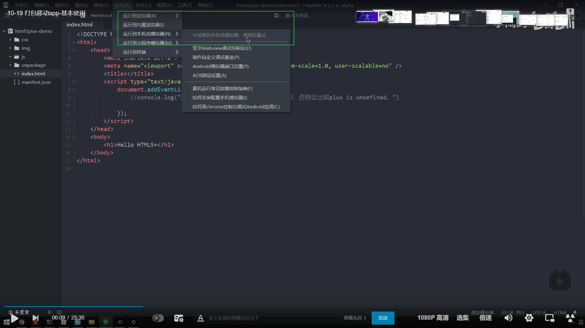
    + 
    + 
    + 
    + 
    + 
    + 
    + 
    + 
    + 
    + 
    + 
    + 
    + 
    + 
    + 
    + 
    + 
    + 
    + 
  

#### 头条号发布作品后台管理系统

+ 对于提交到后端的操作，比如登录，发布文章等，都是先做数据请求，即先做可以发送的效果，最后再去做表单验证，loadding等优化； 

+ 

+ 在标签上或者组件上监听绑定默认事件时，如果处理函数有形参，而在实际调用时不传参数，会默认传入事件参数或者事件对象$event，有时候方法出现错误要排查这个原因；

+ 做pc端项目，布局都用flex布局，百分比布局，宽度都是设置百分比或者flex等于多少；高度啊，字体啊，细微的调节间距等就直接用px即可；因为pc端的电脑屏幕分两种，有大屏幕和小屏幕的，水平方方向上就做个适配，垂直方向就不必了；毕竟两种电脑屏幕大小差距也不是很大；

+ 使用element的表格组件，只要是关于表单验证的，都统一模仿它在data里的数据的格式，就都是用一个对象包裹着数据；

+ 

+ 

+ **项目初始化**
  
  + 在码云中生成添加公钥（第一次注册需要添加即可）
    + 
    + 
    + 
    + 
    + 
    + 
    + 
    + 
    
  + 由于通过vue-cli创建的项目已经帮我们新建了本地的仓库，我们不用再次git init；只要把本地仓库的所有文件都添加到暂存区，然后连接远程仓库，推上去即可；每做好一个功能都推送一下；
  
  + **登录页**
    + 表单验证时，必须最外层有el-form包裹；每个表单项有el-form-item包裹；
    + 可以使用validator，去自定义检验规则；
    + 表单组件的表单项，如果添加了验证规则，如果对表单项进行操作，就会自动验证；如果不对表单项操作，默认是不会验证的，要手动调用validate方法进行验证；
    + 问题1：尽管使用element组件的表单验证的功能时，当输入内容会自动验证；但是如果输入内容不符合格式，点击登录也会发起请求，造成没必要的请求，怎么解决？
    + 解决1：可以手动对表单进行验证，通过ref引用拿到el-form的组件实例，调用validate方法；由于这个方法的参数为回调函数，在表单检验通过后就会调用这个回调函数，因此是异步的，所以就要把发起请求的操作都放到这个回调函数里；可以在回调函数里谈判是否检验通过，如果校验通过就发起请求；如果检验不通过就停止执行里面的代码；
    + 对解决1的代码优化：如果validate不存入回调函数就会返回promise实例对象；因此可以用async await的方法把异步变同步，且如果校验成功就会执行下面的代码，如果失败就停止执行下面的代码，但是失败了没处理会在终端报错，因此可以用try{}catch(e){}去处理；不论是promise还是async await，都是错误了，如果没处理就会停止代码的执行；
    
  + **素材管理**
  
    + `element-ui`的`radio单选框组件`没有点击事件，如果手动添加`.native`的事件修饰符，虽然有这个事件了，但是当点击一次会触发两次事件，因此，如果发起请求的话就会发起两次请求，造成没必要的服务器压力；根据绑定的值的变化来发起请求，绑定change事件；因此，使用如下的方式优化：
  
      ```vue
      <el-radio-group v-model="isCollect" size="mini" @change="onRadioChange">
                <el-radio-button :label="false">全部</el-radio-button>
                <el-radio-button :label="true">收藏</el-radio-button>
       </el-radio-group>
      ```
  
      ```js
      onRadioChange(val) {
            if (val) {
              this.currentPage = 1
              this.loadImages()
            } else {
              this.currentPage = 1
              this.loadImages()
            }
          }
      ```
  
    + 使用`dialog`组件，如果出现弹框被遮罩盖住了，要设置是这个属性；
  
      
  
    + 使用`upload`组件做文件上传；
  
      + 
  
      + 
  
        ```js
        //配置请求头，content-type不用配置
        data() {
            const user = JSON.parse(localStorage.getItem('user'))
            return {
        //请求头是对象，把这个对像绑定给headers属性；    
              token: {
                Authorization: `Bearer ${user.token}`
              }
            }
          }
        ```
  
      + 还要指定`name`属性，属性值为要上传的文件的属性名；
  
        
  
        
  
      + 通过这个属性，注意这个是属性，写函数把弹框给关了；
  
        
  
        
  
        
  
      + 如果要给数组的每个对象元素单独添加属性和值，可以以下面的方式
  
        
  
    + 使用分页需要注意的几个属性，事件等：
  
      
  
      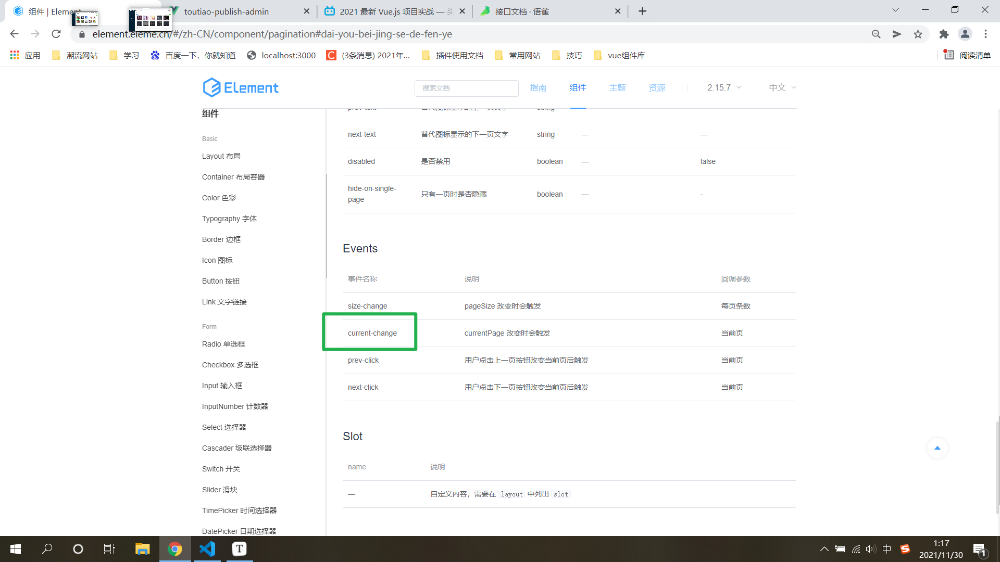
  
    + 
  
    
  
    
  
    
  
  + 项目的亮点
    + 使用富文本编辑器上传图片时，是base64格式，转化为在线地址，不认如果文件太多会加载缓慢；如果单纯是把本地资源上传到服务器就不会有这个问题；使用富文本编辑器是因为，我们先插入到富文本，会被解析成base64；如果是一步到位上传到服务器就不会有这个问题；
  
  

### 尚品汇---前台项目

#### 给src设置别名

+ 
+ 


## 扩展

#### 注意点：

1. 封装api接口函数时，形参直接是以对象的形式，实参也是对象的。因为如果有的参数可以传也可以不传。当调用函数时，对象的属性就可以比较自由。
2. 字符串0，在`if`语句的条件框里是`true`，是存在的意思。数字0才是`false`。


### （普通函数，匿名函数）和箭头函数的this的区别

+ 普通函数和匿名函数的this指的是它的直接调用者，如果没有直接的调用者，默认都是window调用的；

+ 箭头函数的this都是从父级的函数继承过来的，如果没有父级函数，那么this就是指向window；

  ```js
  function test111(){
      console.log(this)
    }
    test111();// window
  
  
    var test222 = function(){
      console.log(this)  // window
    }
    test222();
  
  
    var arr = [1, 2, 3];
    arr.forEach(function(value, index){
      console.log(this);  // window
    })
  
  
    setTimeout(function(){   
      console.log(this);  // window
    }, 3000);
  
  
    var obj = {
      f1: ()=>{
        console.log(this)  // window
        setTimeout(() => {
          console.log(this)  // window
        }, 3000)
      },
      f2: function(){
        console.log(this)  //obj
        setTimeout(() => {
          console.log(this)  //obj
        }, 3000)
      },
    }
    obj.f1();
    obj.f2();
  ```

  

  > `function(){}` 这是匿名函数；
  >
  > `function test(){}` 这是普通函数；
  >
  > `var f1 = function(){} `这也是普通函数；
  >
  > `f2() {} `这是vue里的普通函数, vue里的methods里普通函数的this指向vue实例，所以在vue里的普通函数里或者生命周期函数要再写一个函数必须以箭头函数的形式；

  ```html
  <body>
    <div id="app">
      <button @click="show">点击</button>
    </div>
    
  </body>
  <script src="../lib/vue.js"></script>
  <script>
    const vm = new Vue({
      el: '#app',
      data: {
        msg: 0
      },
      methods: {
        show() {
          console.log(this)  //指向vue实例
  
          setTimeout(()=>{
            console.log(this) //箭头函数继承父级函数的this,所以也指向vue实例；
          }, 3000)
        }
      },
      created() {
        console.log(this)
        let arr = [1,2]
        arr.forEach(()=>{
          console.log(this.msg)//只有使用箭头函数this指向vue实例，才可以拿得到data里的数据；
          //如果使用普通函数，这个函数没有直接的调用者，就默认是被window调用，this指向window,
          //this.msg是undefined
        })
      },
    })
  </script>
  ```

+ 事件处理函数使用普通函数和使用箭头函数获取事件绑定的主体的区别

  > 什么是事件处理函数：就是某个元素绑定某个事件，触发事件进而执行事件处理函数；

  ```html
  <body>
    <input type="text" id="input1"><br>
    <input type="text" id="input2">
  </body>
  <script>
    var input1 = document.getElementById('input1');
    var input2 = document.getElementById('input2');
  
    input1.oninput = function(){
      let info = this.value;
      console.log(typeof info)
      //普通函数的this就是指向函数的直接调用者，调用这个函数的是input1;
      //不管表单输入的值是数字还是字符串，最后通过.value拿到的最后都是字符串；
    }
  
    input2.onchange = (e)=>{
      //箭头函数的this指向是由父级函数的this继承过来的，如果没有父级函数，this指向window；
      let msg = this.value;
      console.log(msg) //undefined
  
  
      let info2 = e.target.value;
      //e是事件对象
      console.log(info2) //可以拿到表单的value
    }
  
   
  </script>
  ```


### 删除数组中间元素的两种方法

1. 使用过滤器filter方法

2. 使用修改数组splice方法

   ```js
    let arr = [1, 2, 3];
     //删除数组中间元素的方法一
     let newarr = arr.filter(function(value){
       return value !== 2
     })
     console.log(newarr)
   
   //删除数组中间元素的方法二
     arr.splice(1, 1)
     console.log(arr)
   ```


### 表单标签输入值之后，点击按钮处理业务逻辑的两种方式

1. 通过对按钮绑定点击事件，去处理业务逻辑，没有使用form标签包裹的方式；

   ```html
   <body>
     <div id="app">
       <input type="text" v-model="info">
      <button @click="f1">点击</button>
       
     </div>
   </body>
   <script src="../lib/vue.js"></script>
   <script>
     const vm = new Vue({
       el: '#app',
       data: {
         info: ''
       },
       methods: {
         f1() {
           alert(this.info)
         }
       },
     })
   </script>
   ```

2. 使用form标签包裹表单标签和按钮，且按钮默认情况下的类型是type="submit" ,一旦点击按钮就会触发form标签的默认事件submit；因此就不用对按钮再绑定点击事件，可以直接去阻止form标签的submit默认事件，然后执行事件处理函数去处理业务逻辑；

   ```html
   <body>
     <div id="app">
   
       <form action="" @submit.prevent="f1">
         <input type="text" v-model="info">
         <button>点击</button>  <!-- 默认是submit类型，如果指定 type="button"，
           就不会触发form标签的默认事件 -->
       </form>
       
     </div>
   </body>
   <script src="../lib/vue.js"></script>
   <script>
     const vm = new Vue({
       el: '#app',
       data: {
         info: ''
       },
       methods: {
         f1() {
           alert(this.info)
         }
       },
     })
   </script>
   ```

### 字符串的各种API

+ `substring()`：截取字符串，包前不包后（即从开始的索引算起到最后一个索引的前一个是截取的范围）；

  ```js
   let str = 'hello';
    console.log(str.substring(0, 2)); // he
  ```

+ `substr()`：截取字符串，括号的第一个参数是开始的索引，第二个是截取的字符串长度；

  ```js
  let str = 'hello';
    console.log(str.substr(1, 2)); // el
  ```

+ `charAt()`：截取单个字符，括号里是当前要截取的字符的索引；

  ```js
  let str = 'hello';
    console.log(str.charAt(2)); // l
  ```

+ `slice`：截取字符串，该方法也可以用来截取数组，包前不包后；

  ```js
   let str = 'hello';
    console.log(str.slice(1,2)); // e
    console.log(str.slice(1)); // ello
  ```

+ `toUpperCase()`：把小写变大写；

  ```js
  let str = 'hello';
    console.log(str.toUpperCase()); // HELLO
  ```
  
+ `trim()`：去除首尾空格；

  ```js
    let str = ' kkk  '
   
    // 去除字符串两端的空格，会返回一个新值
    const a = str.trim()
    console.log(str)  //还是有空格，trim()不会改变原字符串
    console.log(a)  //去除首位空格
  ```

+ `replace()`：替换某些字符为另外的字符；

  ```js
    let str = 'hello world'
    let newstr = str.replace('hello', 'nihao')
    // 会返回一个新字符串，原来的字符串不会修改；
    console.log(newstr)  //nihao world
  ```
  
+ `startsWith()`：判断字符串是否是以xx开头；`endsWith()`：判断字符串是否是以xx结尾；

  ```js
    var str = '今天是2022年2月26日'
  
    var flag1 = str.startsWith('今天')
    var flag2 = str.endsWith('日')
  
    console.log(flag1); // true
    console.log(flag2); // true
  
  ```

+ `repeat()`：表示将原字符串重复n次，返回一个新字符串；

  ```js
   var str = '胡'
    var newStr = str.repeat(3)
    console.log(newStr); // 胡胡胡
  ```

  

### 正则表达式的构造函数

```js
  let str = 'hello world hello HEllo'
  //   /hello/gi这是正则表达式的字面量写法；也可以这么写，两者等价；new RegExp('hello', 'gi')
  // g是全部匹配，i是忽略大小；
  let newstr = str.replace(/hello/gi, '你好')
  console.log(newstr)  //你好 world 你好 你好
```


### 数字显示小数的api

+ ```js
      let a = 555
      console.log(a.toFixed(2))  //555.00
  ```


### Promise

+ `Promise`是一个构造函数；

+ Promise是解决回调地狱的问题，但是我们为什么要写回调地狱的代码？因为比如异步任务的代码里的回调函数会被最后执行，因此我们如果需要把写的代码执行顺序在异步的回调函数之后就要把这个代码放在回调函数之内，如果回调函数太多，就会层层嵌套形成回调地狱；因此，使用promise和async await就是把异步代码按顺序执行会写成回调地狱变成同步的写法；

+ 所以，使用async await和axios请求的写法，就是把请求的异步执行顺序，变成同步的执行顺序；就是说请求执行完了，才可以走下面的代码；

+ `promise`是解决回调函数嵌套回调函数形成的回调地狱，不会减少代码量；

  + 回调地狱：

    ```js
     // 为了实现五秒之后打印1，五秒之后打印2，五秒之后打印3，只能用回调函数嵌套回调函数，即回调地狱；
     setTimeout(() => {
       console.log(1)
        setTimeout(() => {
        console.log(2)
            setTimeout(() => {
          console.log(3)
        },5000)
      },5000)
     },5000)
    
    ```

  + 异步任务：

    + 异步任务包含两个过程：

      1. 执行某些任务，比如加载文件，访问数据，setTimeout定时器几秒之后，等等。

      2. 上面的任务执行完了之后就会执行回调函数。之所以叫回调函数是因为，某些任务执行完了之后才会回来调用这个函数， 进而执行函数里的任务。

  + 异步任务的原理：

    + 代码从上往下加载时，遇到异步任务之后会把异步任务的第一步过程放到处理这个任务的模块里去执行，然后继续执行主线程上面的同步任务。异步任务的第一步执行完毕后会把第二步的回调函数任务放到子线程的队列里。等到主线程的所有的同步任务执行完之后，再依次去轮询子线程的回调函数并去执行，子线程先进先出。

+ `promise`的函数参数有两个参数，`resolve`：成功之后的回调函数,`reject`：失败之后的回调函数；

+ `promise`有一个公有的方法，`then()`，这个方法里面的两个参数分别是成功之后的回调函数的定义和失败之后的回调函数的定义；

+ 也就是只有在`promise`实例对象里对成功函数或者失败函数的调用，才会执行函数；

+ 在`promise`实例对象里只需要写成功的函数的调用即可；如果失败了，`promise`实例对象会自动调用失败的函数，以`try{}catch(e){reject(e)}`；

+ `.then()`方法里的两个回调函数只是识别前一个的结果是成功还是失败，如果前一个函数是失败的回调函数，但是执行过程并没出错，那么这个方法还是执行成功的回调函数；且每次都要写失败的回调函数；也就是说一个`Promise`实例对象只能配合一个`then()`方法才能解决回调地狱问题； `then`方法如果发现前一个的结果有`resolve()`或者`reject`，才会从上到下一步一步执行，否则就会跟没使用promise一样，失去使用promise解决回调地狱的初衷；显然并不是我们想要的结果；下面为错误示范：

  ```js
  new Promise((resolve, reject) => {
      setTimeout(() => {
        console.log(111)
        reject() //调用失败的回调函数
      },5000)
    }).then((s) => {
      setTimeout(() => {
        console.log(s, '成功之后的回调函数111')
      },5000)
     
    },(e) => {
      // 执行它，没出错，就会执行下面的then()成功的回调;
      console.log(e, '失败之后的回调函数111')
    
    }).then(() => {
      // 这个then方法发现前一个没有resolve或reject，就不会等前一个执行完再执行这个函数；而是跟平常一样执行；
      setTimeout(() => {
        console.log('成功之后的回调函数222')
      },5000)
     
    }, () => {
      console.log('失败之后的回调函数222')
    })
  ```

  正确示范：

  ```js
    new Promise((resolve, reject) => {
      setTimeout(() => {
        console.log(111)
        resolve(111)
      },5000)
    }).then((s) => {
      return new Promise((resolve, reject) => {
        setTimeout(() => {
        console.log(s, '成功之后的回调函数111')
        resolve(222)
      },5000)
      })
     
    }).then((s) => {
      return new Promise((resolve, reject) => {
        setTimeout(() => {
        console.log(s, '成功之后的回调函数222')
        resolve(333)
      },5000)
      })
     
    }).then((s) => {
      return new Promise((resolve, reject) => {
        setTimeout(() => {
        console.log(s, '成功之后的回调函数333')
        resolve()
      },5000)
      })
     
    }).catch(e => {
      console.log(e)
    })
    // 每次成功的回调函数都要return出一个新的Promise对象，这样每次then方法只执行前一个成功的回调函数，
    //失败在后面统一处理；如果每次return的promise对象都相同可以定义一个函数；
  ```
  
+ 


### async   await

+ `async`,`await`同样可以解决回调地狱问题；

+ 可以直观的把异步任务变成同步任务的执行顺序；

+ 相对于`promise`是es6的语法，`async await`是es7的语法，要结合`promise`一起使用；

+ 使用`async await`需要有两个方法或者说两个函数；

  + 先用`async`关键字声明一个方法或一个函数；
  + `await`放在返回值为`promise`对象的一个函数或方法的前面；必须是返回值为promise的方法;

+ `await`和被修饰的方法的整体的返回值为`resolve(数据)`带出的数据，不再用`then()`方法去定义形参而拿到数据；（axios使用async  await就是使用了这个功能）；

  ```js
        // 使用async await解决回调地狱，或者把异步任务变成同步任务；
  
        //async声明一个自调用函数，这就是创造一个方法让async修饰；
      (async function() {
  
        // await修饰一个返回值为promise对象的方法，使用自调用函数自己创造一个方法；
        let a = await (function() {
          let promise = new Promise((resolve, reject) => {
            setTimeout(() => {
              console.log(111)
                //带出数据
              resolve(666)
            },5000)
          })
          // 方法一定要return出一个promise实例对象才可以被await修饰；
          return promise
        })()
        
        console.log(a) //666,await的返回值是resolve()带出的数据；
  
        await (function() {
          let promise = new Promise((resolve, reject) => {
            setTimeout(() => {
              console.log(222)
              resolve()
            },5000)
          })
          return promise
        })()
  
        await (function() {
          let promise = new Promise((resolve, reject) => {
            setTimeout(() => {
              console.log(333)
              resolve()
            },5000)
          })
          return promise
        })()
  
  
      })()
  ```
  
+ 如果使用async  await，错误的捕捉就用try{}catch(e) {}；如果出错，错误没被捕捉就会终端报错，后面的代码也不会执行了；

### 解构赋值

+ 用法：

  ```js
  let obj = {
    id: 1,
    name: 'hulu',
    age: 25
  }
  
  //未使用解构赋值
  let myobj = obj;
  //使用了解构赋值
  let { name } = obj;
  
  console.log(myobj.name); //hulu
  console.log(name);  //hulu
  
  //解构赋值的重命名
  let { name: myname } = obj;
  
  console.log(myname);  //hulu
  ```


### Ajax

+ 是原生的请求数据的方式，不需要导入任何库文件；

+ 简单的ajax请求

  ```html
  <!DOCTYPE html>
  <html lang="en">
  <head>
    <meta charset="UTF-8">
    <meta http-equiv="X-UA-Compatible" content="IE=edge">
    <meta name="viewport" content="width=device-width, initial-scale=1.0">
    <title>Document</title>
  </head>
  <body>
    <h1>入</h1>
  </body>
  <script>
    /* ajax需要运行在网站的环境下，即运行于web服务器上面,才可以起作用。 */
  
    /* ajax的优点：
    ajax可以在页面不刷新的情况下更新页面的部分数据。
    传统的数据交互由浏览器发起请求和接受响应，因此当浏览器在发送请求和接受响应期间无法执行用户的其他操作，
    比如拉动页面等等，用户只能干等着。ajax相当于浏览器和服务器的一个中间人，接受浏览器发起的请求转发给服务器，
    接受服务器的响应转发给浏览器。使用ajax数据交互开发人员可控，可以在请求到响应期间为用户设置进度条。
    */
  
    /* ajax的应用场景：
    1.页面上拉加载更多的数据
    2.列表数据无刷新分页
    3.表单项离开焦点数据验证
    4.搜索框提示文字下拉列表
    
    */
    var xhr=new XMLHttpRequest();
    /* new出XMLHttpRequest实例对象，就是创建ajax对象 */
  
    xhr.open("get","http://localhost:8080/get");
    /* open是构造函数的一个方法，配置请求方式，请求地址 */
  
    xhr.send();
    /* 配置好ajax对象之后，就要发送请求 */
  
    xhr.onload=()=>{
      console.log(xhr.responseText);
    }
    /* 给ajax对象绑定一个load的事件，因为请求不会发送过去就会立马得到响应。当接收到响应之后就会触发load事件，
    xhr.responseText是响应的文本。 */
  
  </script>
  </html>
  ```

+ 由于请求的数据是以字符串的方式传递的，如果传过来的是对象字符串，要转化为对象；

  ```html
  
  <script>
    var xhr=new XMLHttpRequest();
  
    xhr.open("get","http://localhost:8080/responseData");
  
    xhr.send();
  
    xhr.onload=()=>{
      // 服务器发过来的数据是字符串的方式
      let responseData=JSON.parse(xhr.responseText);//把json字符串转化成json对象，JSON是挂在window全局对象下
      //可以省略window
      console.log(xhr.responseText);//服务器返回的数据都是以字符串的方式返回,因此要转化成json对象
    
    }
  </script>
  ```

+ get请求传递参数以查询字符串的方式；

  ```js
   let usernameValue=document.getElementById("username").value;
      let ageValue=document.getElementById("age").value;
      let params="username="+usernameValue+"&age="+ageValue;
  
      let xhr=new XMLHttpRequest();
      xhr.open("get","http://localhost:8080/get?"+params);
      //get请求的参数要写在网址问号的后面，且要以xx=xx&xx=xx的格式
      xhr.send();
      xhr.onload=function(){
        console.log(xhr.responseText);
      }
  ```

+ post请求传递参数以请求体的方式，要设置请求头；post请求传递的参数格式有两种，其一：

  ```js
   let username=document.getElementById("username");
      let usernameValue=username.value;
      let age=document.getElementById("age");
      let ageValue=age.value;
  
      let params=`username=${usernameValue}&age=${ageValue}`;//传递请求参数时必须是以字符串的形式
      /* post请求只要是这种格式的请求参数，都要在下面设置固定的请求头，
      请求头里的两个数一个时key,一个时value */
  
      let xhr=new XMLHttpRequest();
      xhr.open("post","http://localhost:8080/post");
      xhr.setRequestHeader("Content-Type","application/x-www-form-urlencoded");
      /* 设置请求参数的格式的类型 */
      xhr.send(params);//post请求参数的发送要到这里发送，就会存在请求体里发到后端
      xhr.onload=function(){
        console.log(JSON.parse(xhr.responseText));
        /* 后端发过来的是json字符串，要转化成json对象 */
      }
  ```

+ post请求传递参数格式其二：

  ```js
  let params={"name":"lisi","age":45}
    /* 如果post向后端传递json对象的格式参数，请求头就要设置成application/json ,
    且因为参数的传递只能以字符串的形式，因此要JSON.stringify()转化成字符串的形式。
    只有post能传递json对象的格式，get和传统的表单都只能是application/x-www-form-urlencoded的格式*/
    let xhr=new XMLHttpRequest();
    xhr.open("post","http://localhost:8080/json");
    xhr.setRequestHeader("Content-Type","application/json");
    xhr.send(JSON.stringify(params));
    xhr.onload=function(){
      console.log(xhr.responseText)
    }
  ```

+ 接受服务器响应的数据除了用 load 事件，还可以用另外一种，这不是重点，==必要时再看，了解即可；==

  ```js
  let xhr=new XMLHttpRequest();
    console.log(xhr.readyState);//ajax状态码，0表示已经创建了ajax对象，还没有配置
    xhr.open("get","http://localhost:8080/readyState");
    console.log(xhr.readyState);//1表示已经配置好ajax请求的方式和请求的地址，还没有发送请求
    xhr.onreadystatechange=function(){//监听ajax状态码的改变，一旦改变就触发该事件
      console.log(xhr.readyState)
      /* 
      2表示请求已经发送了
      3已经接收到服务器端的部分数据了
      4表示服务器端的数据已经接受完成了
      */
      if(xhr.readyState==4&&xhr.status==200)//通过对ajax状态码的判断来接受服务器端的数据
      {
        console.log(xhr.responseText)
      }
    }
    /* 注意上面的事件监听要放在send之前 */
    xhr.send();
  
    /* 
    接受服务器端的数据可以用onload事件监听，也可以用onreadystatechange事件监听状态码的改变，
    用onreadystatechange需要多次调用，所以使用onload比较方便，只调用一次
  
    注意：ie低版本的浏览器不支持onload事件接受响应的数据，要用onreadystatechange
    
    */
  ```

+ ajax请求错误处理，==必要时再看==；

  ```js
  let btn=document.getElementById("btn");
    btn.onclick=function(){
      let xhr=new XMLHttpRequest();
      xhr.open("get","http://localhost:8080/error");
      xhr.send();
      xhr.onload=function(){
        console.log(xhr.responseText)
        console.log(xhr.status)//200表示请求成功
        /* 
        这个函数里面都是处理网络畅通的
        */
      }
      xhr.onerror=function(){
      alert("网络中断，无法发送ajax请求")
      /* 这个函数里是处理网络中断的 */
    }
    }
  
    
    /* 
    1.网络畅通，http状态码是404，表示服务器端不能接受到请求。
    处理：检查请求地址是否出错
  
    2.网络畅通，服务器端能接受到请求，返回http状态码500
    处理：服务器端出错，找后端程序员处理
  
    3.网络中断，请求无法发送到服务器，会触发xhr对象下面的error事件，
    在事件处理函数中进行处理。
  
    ajax状态码表示ajax请求的过程，由ajax对象返回
    http状态码表示请求的结果，由服务器返回
  
    
    */
  ```

+ 解决ie浏览器低版本的ajax请求的缓存问题，==必要时再看；==

  ```html
  <body>
    <!-- 低版本的ie浏览器当第一次ajax请求时会发送请求到服务器端，然后接受服务器端的响应数据。
    当我们再次发送一个请求且请求的地址是跟第一次相同的，那么ajax就不会在到服务器端去请求，而是直接
    拿第一请求时的缓存数据当成响应的数据，如果服务器端的响应数据变化了，而响应的数据却没有变化。
  
    解决：给每次的请求的请求地址都加不同的参数，这样子请求地址就不一样，但是请求的仍然是同一个地址。
    -->
    <button id="btn">发送请求</button>
  </body>
  <script>
     let btn=document.getElementById("btn");
    btn.onclick=function(){
      let xhr=new XMLHttpRequest();
      xhr.open("get","http://localhost:8080/cache?t="+Math.random());
      
      xhr.onreadystatechange=function(){
        if(xhr.readyState == 4 && xhr.status==200)
        {
          console.log(xhr.responseText)
        }
      }
      xhr.send()
    }
  </script>
  ```


### 数组中的方法

> 使用下面数组方法的一个技巧：如果需要对数组的每一项进行判断，那么就直接在函数体里 return 出一个对所有元素进行判断的条件即可，或者那么就在函数体里，写条件再return true，停止循环；

+ `forEach()`：

  + 对数组进行从头到尾遍历；

  + 没有返回值；

  + 不能被`return true`或`break`或`continue`给终止循环，会直到数组的元素都遍历完才停止；性能不好；

  + 用途：用在需要对数组的每一项进行遍历的时候；

  + ```js
    let arr = ['中国','美国','英国','俄罗斯']
    
    let aaa = arr.forEach((item, index) => {
      //  会打印四个ok，即不会被终止
      console.log('ok')
    
      if(item == '英国') {
          // 没作用，停止不了
          return true
        }
     })
    //  返回值为undefined
     console.log(aaa)
    ```

+ `some()`：

  + 不终止的话会从头到尾遍历；

  + 如果添加条件，满足条件时可以终止遍历；性能比较好；

  + 返回值为布尔值；满足条件为true，不满足条件为false；

  + 用途：==用来寻找数组的某一项是否满足条件，只要有一项满足就是true；(相当于或)==

  + ```js
      let arr = ['中国','美国','英国','俄罗斯']
      
      let aaa = arr.some((item,index) => {
        // 打印三次ok
        console.log('ok')
      
        if(item == '英国') {
          // 可以被终止
          return true
        }
      })
    // 返回一个布尔值，数组元素有一个满足条件返回值为true
     console.log(aaa)
    ```

+ `every()`：

  + 默认只会循环一次，符合判断条件几个就循环几次；

  + 函数体里比较特殊，直接return返回一个判断条件；

  + 有返回值，返回值为布尔值；

  + **如果数组元素的每一项都满足这个条件，那么返回值为true，只要有一项不满足就是false；**

  + 用途：==用来判断数组里的每一项是否都满足某个条件，都满足就是true。（相当于且）==；

  + ```js
      let arr = ['中国','中国','中国','中国']
      
      let aaa = arr.every((item, index) => {
       
        // 判断条件，判断数组的每一项是不是都是 ‘中国’ ，如果是就是返回值为true，否则就是false；
        return item == '中国'
        
      })
      // 返回值为true
     console.log(aaa)
    ```

  + 可以简写：

    ```js
      let arr = ['中国','中国','中国','中国']
    
      let aaa = arr.every((item, index) => item == '中国')
      // 返回值为true
     console.log(aaa)
    ```

+ `filter()`：

  + 也是终止不了循环，会从头到尾遍历；

  + 返回值为一个新数组，不会修改原来的数组；

  + 同样在函数体里 return 出一个判断条件；根据这个判断条件，去筛选符合这个条件的数组元素，并把他们放到一个新数组里，最后返回这个新数组，起到过滤的作用；

  + 用途：用来过滤数组；

  + ```js
      let arr = [10, 20, 30, 40]
      
      let aaa = arr.filter(item => {
        return item > 20
      })
      
      // 返回值为一个新数组，[30, 40]
     console.log(aaa)
    ```

  + 可以简写：

    ```js
      let arr = [10, 20, 30, 40]
    
      let aaa = arr.filter(item => item > 20)
      
      // 返回值为一个新数组，[30, 40]
     console.log(aaa)
    ```

+ `find()`：

  + 不终止的话会从头到尾遍历；

  + 返回值为数组的元素；

  + 找到符合条件就停止；

  + 用途：用来找符合条件的第一个元素；

  + ```js
      let arr = [10, 20, 26, 40]
      
      let aaa = arr.find(item => {
        if(item > 20) {
          return true
        }
      })
      // 26
     console.log(aaa)
    ```

+ `findIndex()`：

  + 不终止的话会从头到尾遍历；

  + 返回值为数组元素索引；

  + 找到符合条件就停止；

  + 用途：用来找符合条件的第一个索引；

  + ```js
      let arr = [10, 20, 26, 40]
      
      let aaa = arr.findIndex(item => {
        if(item > 20) {
          return true
        }
      })
      // 2
     console.log(aaa)
    ```

+ `indexOf()`：

  + 返回值为索引；

  + 括号里只是单纯的元素值，不是函数；

  + 如果数组里没有括号里的值，返回-1，如果有返回对应的索引；

  + ```js
      let arr = [10, 20, 26, 40]
      
    // 20的索引为1
     console.log(arr.indexOf(20))
    ```

+ `includes()`：

  + 返回布尔值；

  + 可以用在字符串和数组；

  + ```js
      let arr = [10, 20, 26, 40]
      
      let str = 'kkllvc'
      
    // true,数组包含26
     console.log(arr.includes(26))
    
    //  true,字符串包含v
     console.log(str.includes('v'))
    ```

+ 截取数组：`slice(开始索引，结束索引)`，包前不包后；

+ `map()`：

  + 用来映射或者说拷贝数组，因为数组赋值是赋引用，数组被修改，持有引用者数组也会被修改，所以使用 map 方法可以解决；

  + 也可以对复制的数组进行修改；

  + ```js
      let arr = [10, 20, 26, 40]
      
      let newarr = arr.map(item => {
        return item
      })
      
      // [10, 20, 26, 40]
      console.log(newarr)
    ```

  + ```js
      // 对数组进行修改
      let arr = [10, 20, 26, 40]
      
      let newarr = arr.map(item => {
        return item + 1
      })
      
      // [11, 21, 27, 41]
      console.log(newarr)
    ```

+ `reduce()`：

  + 累加器，在要对数组项进行累加时使用；代码更简洁；

  + 返回值为累加的结果；

  + ```js
    //语法：刚开始累加时，初始值就是累加的结果；记得return出去，每次循环return的结果就是累加的结果，给下次循环继续累加
    arr.reduce((累加的结果, 数组的项) => {
        return xxxxx
    }, 初始值)
    ```

  + ```js
     
      let arr = [10, 20, 26, 40]
      
      // 这是基础写法
      let sum = 0
      
      arr.forEach(item => {
        sum += item
      })
      
      console.log(sum)
  
  
  ```js
  // 使用数组的累加器，高级写法
  
  const result = arr.reduce((sum, item) => {
  //要return
    return sum += item
  }, 0)
    
  console.log(result)
    
  // 上面的还可以简写,箭头函数{}里代码只有一行可以简写到一行，return可以省略，{}可以省略
  const result = arr.reduce((sum, item) => sum += item, 0)
    
  console.log(result)
  ```
  
  > 注意：
  >
  > + ==上面的所有的数组的方法都适合这个规则，比如find方法，return 条件，只要条件是true，就会停止循环，并把当前这次循环的数组元素返回出来；==
  >
  > ```js
  >   let arr = [1,2,3,4,5,6,7]
  >   const new1 = arr.filter(value => {
  >     // 每次循环，只要是return的是true，就表示本次循环的元素要被推进新数组
  >     // 因此，可以return 一个条件   只要这个条件最后的结果是true，就代表这次的元素要被放进新数组；
  >     return true
  >   })
  >   console.log(new1)  //[1, 2, 3, 4, 5, 6, 7]
  > ```
  >
  > 一个数组去除另外一个数组的元素
  >
  > ```js
  >   let arr = [1,2,3,4,5,6,7]
  >   let arr2 = [2,3,4]
  >   const new1 = arr.filter(value => {
  >     return !arr2.find(item => {
  >       return value === item
  >     })
  >   })
  >   console.log(new1)  //[1, 5, 6, 7]
  > ```
  >
  > 

### 数组拼接

+ 场景：如果要把两个数组里的元素合并为一个数组；

+ 错误示范：

  

+ 正确示范：

  ```js
   let arr1 = [1, 2, 3, 4]
    let arr2 = ['a', 'b', 'c']
  
    const newarr = [...arr1, ...arr2]
  
    console.log(newarr)  //[1, 2, 3, 4, 'a', 'b', 'c']
  
    arr1.push(...arr2)  //这样子也可以
  ```


### 数组的去重

+ ```js
  //这个方法是es6原生的方法  
  let arr1 = [1,2,3,4,5]
    let arr2 = [1,2,3]
    // 这是数组的合并
    let arr3 = [...arr1,...arr2]
    console.log(arr3)  //[1, 2, 3, 4, 5, 1, 2, 3]
    // 数组的去重
    let arr4 = [...new Set(arr3)]
    console.log(arr4)   // [1, 2, 3, 4, 5]
  ```

+ 也可以用lodash的方法

  + 

### 数组的排序

+ sort()方法是数组自带的一种排序方法，默认情况下会将元素按照字符串进行比较。

+ **当元素为字符串时**

  + 将元素从字符串从第一位开始比较，第一位相同时比较后一位。

  + ```js
    var arr = ["cb","a","g","cy"];
    arr.sort();
    console.log(arr); //["a","cb","cy","g"]
    
    ```

+ **当元素为数字时**

  + 默认将数字元素当做字符串来进行比较。先比较第一位，第一位相同时在比较后一位；

  + ```js
    var arr2 = [20,13,11,8,0,11];
    arr2.sort();
    console.log(arr2); //[0,11,11,13,20,8]
    
    ```

+ **控制sort()方法的排序方式**

  + ```js
    var arr2 = [20,13,11,8,0,11];
    
    //按升序排列
    
    arr2.sort(function(a,b){
    	//a,b表示相邻的两个元素
    	//若返回值>0,数组元素将按升序排列
    	//若返回值<0,数组元素将按降序排列
    	return a-b; 
    });
    console.log(arr2); //[0,8,11,11,13,20]; 新数组按升序排列
    
    
    //按降序排列
    
    arr2.sort(function(a,b){
    	//a,b表示相邻的两个元素
    	//若返回值>0,数组元素将按升序排列
    	//若返回值<0,数组元素将按降序排列
    	return b-a; 
    });
    console.log(arr2); //[20,13,11,11,8,0]; 新数组按降序排列
    
    
    //随机排序
    
    arr2.sort(function(a,b){
    	return Math.random()-0.5;  //返回值的正负概率分别为50%，故升降序排列是随机的
    });
    console.log(arr2); //新数组随机排序
    
    ```

  > 控制sort()的排序方式，只要记住return a-b 就是升序排列;return b-a 就是降序排列；但是在写形参时，a要在b前面；

### 本地存储

+ 本地存储的特点

  

+ `sessionStorage`的API

  

+ 在浏览器中的查看方法：

  

+ `localStorage`的API

  

+ 可以使用`localStorage`做记住用户名

  

### ES6模块化

1. 默认导出与默认导入

   + 默认导出语法：`export default 默认导出成员`；

     + ```js
       const n1 = 111
       const n2 = 222
       function test() {
         console.log('aaa')
       }
       
       // export default 默认导出只能使用一次；如果多个成员导出就以对象的形式导出；如果一个成员就不用以对象的形式，直接导出即可；
       export default {
         // n1: n1
         n1,
         n2,
         test
       }
       
       ```

   + 默认导入语法：`import 自定义变量 from '路径或包名'`；

     + ```js
       // 使用import默认导入，自定义一个变量接
       import t1 from './test.js'
       // 输出的结果是默认导出的对象，
       console.log(t1)
       // 导入的是一个对象，就用这种方式得到成员
       console.log(t1.n1)
       
       ```

2. 按需导出与按需导入

   + 按需导出语法：`export 按需导出的成员`；

     + ```js
       // export每导出一个成员被使用一次，可以被使用多次；
       export const n1 = 111
       export const n2 = 222
       export function test() {
         console.log('aaa')
       }
       
       ```

   + 按需导入语法：`import {按需导出的变量名,...} from '路径'`；

     + ```js
       // 按需导入，可以只导入一个，也可以导入多个，按自己需求；可以使用as对导入的变量重命名；
       // 按需导入的变量名必须和按需导出的变量名一样；
       import { n1, n2 as num2, test } from './test.js'
       
       console.log(n1)
       
       console.log(num2, test)
       
       ```

     + 

     + 一个模块中可以同时使用`export default`和`export`；

       

       > 建议：
       >
       > 如果只是导出一个成员，建议使用默认导出；
       >
       > 如果导出多个成员，比如封装的API，建议使用按需导出，要使用哪个API就按需导入哪个；

3. 直接导入并执行模块中的代码

   

### 解决后端返回数据中大数字的问题

+ 后端返回的数据一般都是 **JSON 格式的字符串**。

  + ```js
    '{ "id": 9007199254740995, "name": "Jack", "age": 18 }'
    ```

+ 如果这个字符不做任何处理，你能方便的获取到字符串中的指定数据吗？非常麻烦。所以我们要把它转换为 JavaScript 对象来使用就很方便了。幸运的是 axios 为了方便我们使用数据，它会在内部使用 `JSON.parse()` 把后端返回的数据转为 JavaScript 对象。

  + ```js
    // { id: 9007199254740996, name: 'Jack', age: 18 }
    JSON.parse('{ "id": 9007199254740995, "name": "Jack", "age": 18 }')
    ```

+ 可以看到，超出安全整数范围的 id 无法精确表示，这个问题并不是 axios 的错。了解了什么是大整数的概念，接下来的问题是如何解决？

+ [json-bigint](https://github.com/sidorares/json-bigint) 是一个第三方包，它可以帮我们很好的处理这个问题。使用它的第一步就是把它安装到你的项目中。

  + ```js
    npm i json-bigint
    ```

+ 下面是使用它的一个简单示例。

  + ```js
    import JSONbig from 'json-bigint'
    
    const str = '{ "id": 1253585734669959168 }'
    
    console.log(JSON.parse(str)) // 1253585734669959200
    
    // 它会把超出 JS 安全整数范围的数字转为一种类型为 BigNumber 的对象
    // 我们在使用的时候需要把这个 BigNumber.toString() 就能得到原来正确的数据了
    console.log(JSONbig.parse(str))
    console.log(JSONbig.parse(str).id.toString()) // 1253585734669959168
    
    const data = JSONbig.parse(str)
    
    console.log(JSON.stringify(data))
    console.log(JSONbig.stringify(data))
    ```

  + > json-bigint 会把超出 JS 安全整数范围的数字转为一个 BigNumber 类型的对象，对象数据是它内部的一个算法处理之后的，我们要做的就是在使用的时候转为字符串来使用。

+ 了解了 json-biginit 怎么回事儿之后，下一步是如何配置到我们的项目中？

  + ```js
    解决思路：
    
    Axios 会在内部使用 JSON.parse 把后端返回的数据转为 JavaScript 数据对象。
    
    所以解决思路就是：不要让 axios 使用 JSON.parse 来转换这个数据，而是使用 json-biginit 来做转换处理。
    
    axios 提供了一个 API：transformResponse
    
    
    ```

+ 所以我们在 request.js 请求模块中添加处理代码：

  + ```js
    /**
     * 基于 axios 封装的请求模块
     */
    import axios from 'axios'
    import JSONbig from 'json-bigint'
    
    // 创建一个 axios 实例，说白了就是复制了一个 axios
    // 我们通过这个实例去发请求，把需要的配置配置给这个实例来处理
    const request = axios.create({
      baseURL: 'http://ttapi.research.itcast.cn/', // 请求的基础路径
    
      // 定义后端返回的原始数据的处理
      // 参数 data 就是后端返回的原始数据（未经处理的 JSON 格式字符串）
      transformResponse: [function (data) {
        // Do whatever you want to transform the data
        // console.log(data)
    
        // 后端返回的数据可能不是 JSON 格式字符串
        // 如果不是的话，那么 JSONbig.parse 调用就会报错
        // 所以我们使用 try-catch 来捕获异常，处理异常的发生
        try {
          // 如果转换成功，则直接把结果返回
          return JSONbig.parse(data)
        } catch (err) {
          console.log('转换失败', err)
          // 如果转换失败了，则进入这里
          // 我们在这里把数据原封不动的直接返回给请求使用
          return data
        }
    
        // axios 默认在内部使用 JSON.parse 来转换处理原始数据
        // return JSON.parse(data)
      }]
    })
    
    // 请求拦截器
    request.interceptors.request.use(
      // 任何所有请求会经过这里
      // config 是当前请求相关的配置信息对象
      // config 是可以修改的
      function (config) {
        const user = JSON.parse(window.localStorage.getItem('user'))
    
        // 如果有登录用户信息，则统一设置 token
        if (user) {
          config.headers.Authorization = `Bearer ${user.token}`
        }
    
        // 然后我们就可以在允许请求出去之前定制统一业务功能处理
        // 例如：统一的设置 token
    
        // 当这里 return config 之后请求在会真正的发出去
        return config
      },
      // 请求失败，会经过这里
      function (error) {
        return Promise.reject(error)
      }
    )
    
    // 响应拦截器
    
    // 导出请求方法
    export default request
    ```

    

### 自定义代码段

+ 
+ 
+ 
+ 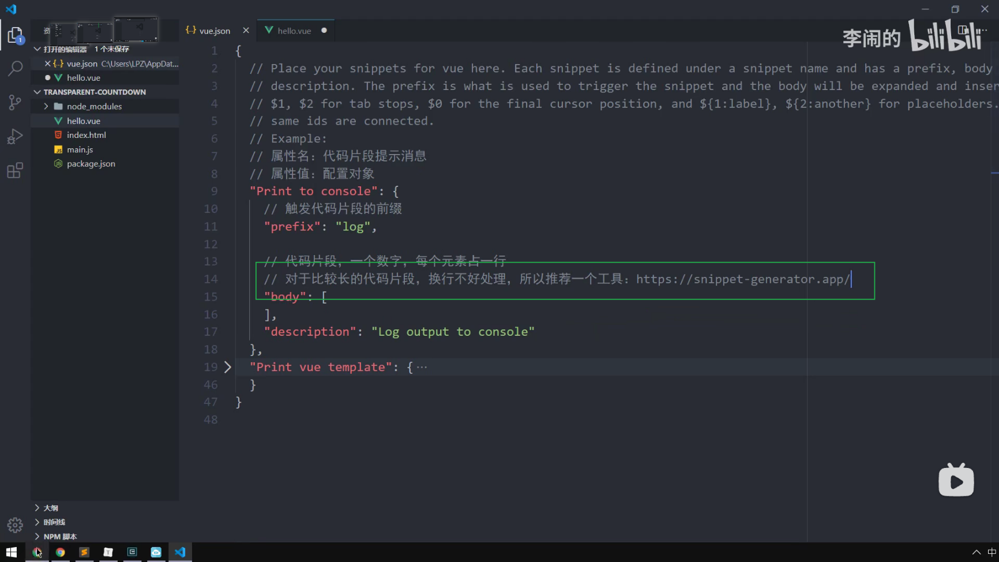
+ 
+ 
+ 
+ 
+ 
+ 

### iconfont的使用

+ 
+ 
+ 
+ 
+ 
+ 
+ 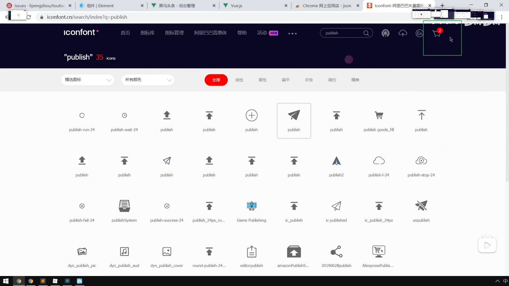
+ 
+ 
+ 
+ 
+ 
+ 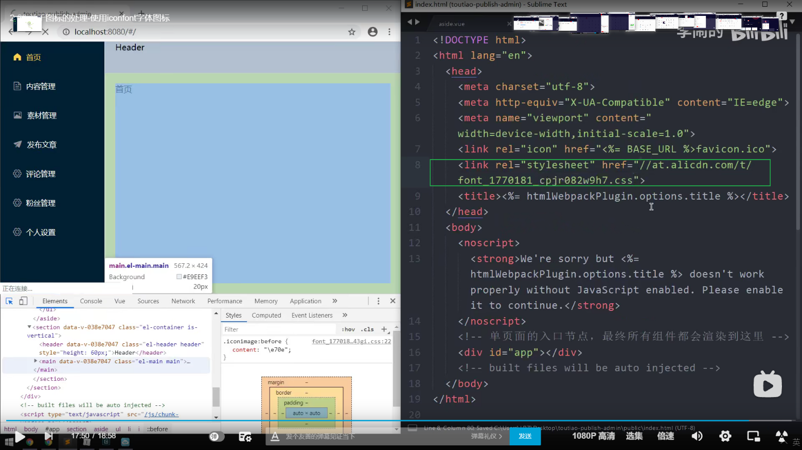

### .json的文件

+ vue项目可以新建一个.json的文件，不用导出，当你导入时可以用一个变量接，会得到对象；.json文件也不可以写导出的代码，key和value都要加引号；当导入时会把这个json文件转化为对象；如果当一个对象的属性很多，可以单独新建一个.json的模块；

### 富文本编辑器

+ 什么是富文本编辑器：
  + 通过使用富文本编辑器可以使文本有格式，或者说有响应的样式；原理就是以按钮的形式对输入的文本进行html标签化的处理，而不是让用户去写html标签才能使文本有样式；所以当看到的具有响应样式的文本，其本质就是一堆用户输入的文本加html标签的字符串；

+ 

+ 

+ 

+ eltiptap富文本编辑器的使用链接：[链接](https://github.com/Leecason/element-tiptap/blob/master/README_ZH.md)
  + 使用步骤（以下是局部引入，即在某个组件中引入）：
  
    1. ```js
       npm install --save element-tiptap
       ```
  
    2. ```js
       引入样式
       import 'element-tiptap/lib/index.css'
       
       ```
  
    3. ```js
       // 局部引入富文本编辑器插件和相关的扩展，需要什么扩展就在这里导入；
       import {
         ElementTiptap,
         // 需要的 extensions
         Doc,
         Text,
         Paragraph,
         Heading,
         Bold,
         Underline,
         Italic,
         Strike,
         ListItem,
         BulletList,
         OrderedList,
         Image,
         Fullscreen
       } from 'element-tiptap'
       ```
  
    4. ```js
       //在data里定义这些扩展
       extensions: [
               new Doc(),
               new Text(),
               new Paragraph(),
               new Heading({ level: 5 }),
               new Bold({ bubble: true }), // 在气泡菜单中渲染菜单按钮
               new Underline({ bubble: true, menubar: false }), // 在气泡菜单而不在菜单栏中渲染菜单按钮
               new Italic(),
               new Strike(),
               new ListItem(),
               new BulletList(),
               new OrderedList(),
               new Image(),
               new Fullscreen()
             ]
       ```
  
    5. ```js
       //注册组件
        components: {
           'el-tiptap': ElementTiptap
         }
       ```
  
    6. ```js
                 <!-- 富文本编辑器的使用，如果是局部引入需要添加lang属性 -->
                 <el-tiptap
                   v-model="article.content"
                   :extensions="extensions"
                   lang="zh"
                   placeholder="请输入文章内容"
                   height="300"
                 ></el-tiptap>
       ```
  
+ 对插入富文本编辑器的图片进行处理

  + 场景：

    1. 当使用富文本编辑器编辑文章时，如果有插入图片，且插入的图片是在线链接，那么编辑器会把这个链接和`img`标签的`src`属性结合，以标签字符串的形式和本文章的文本标签字符串一起发送到服务器；当发起请求得到这个文章时，也是以标签字符串的形式得到，最后渲染到页面；由于图片是链接的形式，因此当在渲染得到的文章时，文本会先显示，图片会单独去请求链接，然后渲染出来；即使，图片再多，也不会卡，文字总会最先出来，然后是图片；
    2. 如果，当我们插入图片选择插入的是本地资源，那么图片会以base64的形式变成一大堆字符串提交到服务器；当我们请求文章时，base64字符串和文章的其他文本标签字符串都是连在一起的，即会把所有的字符串都请求完成才会渲染出来；如果图片很多，base64字符串就会非常多，那么发起一次请求，就需要请求很多字符串；最后文字会和图片一起出现，那么就要用户等待，用户体验差；

  + 解决场景2出现的问题：

    + 思路：就是把本地资源的图片发送到服务器得到对相应的在线图片链接，然后再以`img`的形式提交到服务器；

    + 原理：`new Image()`实例对象里有一个`uploadRequest() {}`函数，当点击插入本地图片按钮并选择确认时，会调用这个函数，并把选中图片地址`return`出来，那么这个地址就会被放到`img`的`src`属性里；因此，可以在这个函数里把本地图片上传到服务器得到对应的在线链接，然后把这个在线链接给这个函数return出来；如果是插入网络图片链接不会执行`uploadRequest()`函数；

      ```js
           new Image({
                async uploadRequest(file) {
                  // 使用FormData才可以把文件上传，file是本地的文件对象；
                  const fd = new FormData()
                  fd.append('image', file)
                  const { data: res } = await uploadImage(fd)
                  // return出得到的图片在线链接，把这个链接添加到img标签的src属性；不然默认是base64；
                  return res.data.url
                }
              }),
      ```

### 文件对象，图片预览

+ 

### echarts的使用步骤

1. ```js
   npm install echarts --save
   ```

2. ```js
   import * as echarts from 'echarts'
   ```

3. 准备好一个具备宽高的容器

   ```html
   <div class="echarts-demo" ref="main"></div>
   ```

4. 在mounted里面，写如下的代码：

   ```js
         // 基于准备好的dom，初始化echarts实例
         var myChart = echarts.init(document.getElementById('main'));
   
         // 指定图表的配置项和数据
         var option = {
           title: {
             text: 'ECharts 入门示例'
           },
           tooltip: {},
           legend: {
             data: ['销量']
           },
           xAxis: {
             data: ['衬衫', '羊毛衫', '雪纺衫', '裤子', '高跟鞋', '袜子']
           },
           yAxis: {},
           series: [
             {
               name: '销量',
               type: 'bar',
               data: [5, 20, 36, 10, 10, 20]
             }
           ]
         };
   
         // 使用刚指定的配置项和数据显示图表。
         myChart.setOption(option);
   ```

   > 注意：每个图表的中间部分，**指定图表的配置项和数据**是不一样的，其他的都一样；在echarts官网点击示例，点击图表进去的代码只是中间的指定图表的配置项和数据代码；

### 在echarts里使用地图的步骤

1. 

2. 

3. 

4. 

5. 

6. 

7. 

8. 

9. 

10. 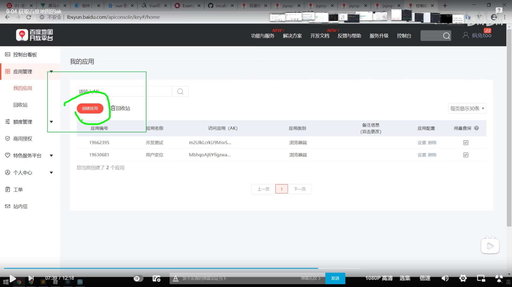

11. 

12. 

13. 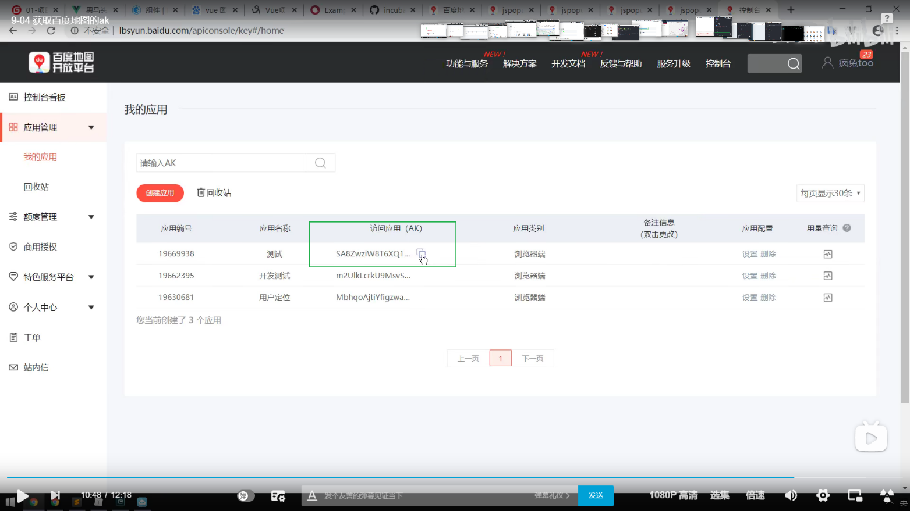

14. 

15. 在html文件引入在线的地图资源之后，就等于全局暴露了BMap，在其他组件使用要在前面加一个window；

    


### 接口文档下面这样子写就是代表是数组，且要在线链接

+ 


### 预览dist文件的方式

+ 


### axios的二次封装（前提是后端开启了跨域资源共享，如果未开启还是要配置proxy，那么就不可以这样子了）

+ 
+ 不同的运行命令就设置不同的环境，然后就可以调用不同环境的接口了；
  + 
+ 
+ 
+ 
+ 
+ 
+ 
+ 
+ 
+ 
+ 
+ 
+ 

### 文件下载

+ Blob是用来支持文件操作的。简单的说：在JS中，有两个[构造函数](https://www.zhihu.com/search?q=构造函数&search_source=Entity&hybrid_search_source=Entity&hybrid_search_extra={"sourceType"%3A"article"%2C"sourceId"%3A97768916}) File 和 Blob, 而File继承了所有Blob的属性。File对象可以看作一种特殊的Blob对象。[File对象](https://www.zhihu.com/search?q=File对象&search_source=Entity&hybrid_search_source=Entity&hybrid_search_extra={"sourceType"%3A"article"%2C"sourceId"%3A97768916})是一种特殊的Blob对象，那么它自然就可以直接调用Blob对象的方法。

+ 通过window.URL.createObjectURL方法可以把一个blob转化为一个Blob URL，并且用做文件下载或者图片显示的链接。

+ 我们可以通过window.URL.createObjectURL，接收一个Blob（File）对象，将其转化为Blob URL,然后赋给 a.href属性，把具体的下载的内容赋值给 a.download 属性，然后在页面上点击这个链接就可以实现下载了；

  ```js
  <!-- html部分 -->
  <a id="h">点此进行下载</a>
  <!-- js部分 -->
  <script>
      // new出blob对象，数组里的元素类型可以是数组中的每项元素可以是ArrayBuffer(二进制数据缓冲区), ArrayBufferView,Blob,DOMString这些类型；   
    var blob = new Blob(["Hello World"]);
  // 把要下载的文件转化成一个链接地址赋值给a的href
    var url = window.URL.createObjectURL(blob);
    var a = document.getElementById("h");
  // 给把文件名赋值给a的download属性，非ie浏览器才有download属性；
    a.download = "helloworld.txt";
    a.href = url;
  </script> 
  ```

  > 注意：(备注：download属性不兼容IE, 对IE可通过window.navigator.msSaveBlob方法或其他进行优化)；

### easycom模式使用vue组件

+ 传统[vue](https://so.csdn.net/so/search?from=pc_blog_highlight&q=vue)组件，需要安装、引用、注册，三个步骤后才能使用组件。`easycom`将其精简为一步。 只要组件安装在项目的components目录下，并符合`components/组件名称/组件名称.vue`目录结构。就可以不用引用、注册，直接在页面中使用。

### window.location.search 返回值为空

+ window.location 对象用于获得当前页面的地址 (URL)，并把浏览器重定向到新的页面。

+ location.hash ：设置或返回一个URL的锚部分（从 `#` 号开始的部分）。

+ location.search ：设置或返回一个URL的查询部分（从 `?` 开始的部分）。

+ 1、示例1，url中`#`在`?`后面： `https://blog.csdn.net/article?id=94458654#first`

  | 属性            | 结果                                          |
  | --------------- | --------------------------------------------- |
  | location.hash   | `'#first'`                                    |
  | location.search | `'?id=94458654'`。**注意：不包含#后面的内容** |

+ 2、示例2，url中`#`在`?`前面： `https://blog.csdn.net/article#first?id=94458654`

  | 属性            | 结果                                              |
  | --------------- | ------------------------------------------------- |
  | location.hash   | `'#first?id=94458654'`。**注意：包含?后面的内容** |
  | location.search | `''`。**值为空**                                  |

+ 为什么 location.search 会为空？
  + 在「示例2」中，因为`?id=94458654`是属于`location.hash`的内容，可以理解为这一部分内容先被`location.hash`取走了，`location.search`再取值就取不到了。

> 如果路由模式设置为history，那么就可以去掉 # ，那么使用 location.search 就可以直接拿到查询字符串的内容；

### new Map()

+ JavaScript的对象（Object），本质上是键值对的集合（Hash结构），但是传统上只能用字符串当作键。这给它的使用带来了很大的限制。为了解决这个问题，ES6提供了Map数据结构。它类似于对象，也是键值对的集合，但是“键”的范围不限于字符串，各种类型的值（包括对象）都可以当作键。

+ ```js
   var obj = new Map() //定义一个空的map
   obj.set('name','tom')
   obj.set('0','tony')
   obj.set(1,'jerry')
  console.log(obj)
  ```

  打印结果：

  

  可以看到，map对象的key可以为任何值，包括数字，不仅限于字符串。

+ new出来的实例对象的实例的属性和操作方法：

  1. size属性：size属性返回Map结构的成员总数。

     ```js
     var obj = new Map([['name', 'tom'], ['age', 12], ['sex', '男']])
     obj.size  //3
     ```

  2. set(key, value)：set方法设置key所对应的键值，然后返回整个Map结构。如果key已经有值，则键值会被更新，否则就新生成该键。

     ```js
     // 常用写法
     var obj = new Map()
     obj.set("age", 12)        // 键是字符串
     obj.set(0, "standard")     // 键是数值
     obj.set(undefined, "nah")     // 键是undefined
     
     //set方法返回的是Map本身，也可以采用链式写法。
     var map = new Map()
     .set(1, 'a')
     .set(2, 'b')
     .set(3, 'c');
     ```

  3.  get(key) ：get方法读取key对应的键值，如果找不到key，返回undefined。

     ```js
     var obj = new Map()
     obj.set("hello", 'Hello ES6!')
     obj.get('hello')  // Hello ES6!
     obj.get('word')  // undefined
     ```

  4. has(key) ：has方法返回一个布尔值，表示某个键是否在Map数据结构中。

     ```js
     var obj = new Map()
     obj.set("hello", 'Hello ES6!')
     obj.has('hello')  // true
     obj.has('word')  // false
     ```

  5. delete(key) ：delete方法删除某个键，返回true。如果删除失败，返回false。

     ```js
     var obj = new Map()
     obj.set("hello", 'Hello ES6!')
     obj.has('hello')  // true
     obj.delete('hello')
     obj.has('hello')  // false
     ```

  6. clear() ：clear方法清除所有成员，没有返回值。

     ```js
     var obj = new Map()
     obj.set("hello", 'Hello ES6!')
     obj.size // 1
     obj.clear()
     obj.size // 0
     ```

### 获取对象属性值的两种写法

```js
let obj = {name: 'hulubin'}
  console.log(obj.name)  // hulubin
  console.log(obj['name'])   // hulubin
```

### git（详细版，以后都看这里）

+ 为什么要使用版本控制？

  + 对于个人开发，需要历史记录的存在。
  + 对于团队的开发，为了避免不同的成员开发的代码被覆盖，影响效率。

+ 版本控制工具应该具备的功能

  1. 协同修改
     + 多人并行不悖的修改服务器端的同一个文件。
  2. 数据备份
     + 不仅保存目录和文件的当前状态，还能够保存提交过的每一个历史状态。
  3. 版本管理
     + 在保存每一个版本文件信息时做到不保存重复的数据，以节约存储空间。
  4. 权限控制
     + 对于团队中参与开发的人员进行权限控制。
  5. 历史记录
     + 查看修改人，修改时间，修改内容，日志信息。
     + 将本地文件恢复到某一历史状态。
  6. 分支管理
     + 允许开发团队在工作过程中多条生产线同时推进任务，进一步提高效率。

+ 版本控制工具（是一个软件）

  + 集中式版本控制工具：svn。
    + 特点：文件的所有历史记录都保存在服务器中，程序员电脑只保存当前状态的文件信息。
    + 缺点：如果服务器坏了，那么所有的历史版本都将消失，只有程序员的电脑里的当前状态的版本。
  + 分布式版本控制工具：git。
    + 特点：每一个程序员的电脑的本地库都存着当前项目的所有版本记录。
    + 好处：如果某个程序员的电脑出故障，历史记录都不见了，可以拿参与这个项目的程序员的版本历史记录。但是常规的操作并不是程序员与程序员本地库之间的互传，而是需要一个远程库。

+ git优势

  + 由于本地有自己的版本库，大部分操作在本地操作，不需要联网。
  + 完整性保证（hash）。
  + 尽可能添加数据而不是删除或者修改数据。
  + 分支操作非常快捷流畅。
  + 与Linux命令全面兼容（因为是Linux系统的发明者发明的）。

+ git程序的安装

  + 下载地址：https://git-scm.com/

  + 安装步骤

    1. 

    2. 

    3. 

    4. 

    5. 

    6. 

    7. 

    8. 

    9. 

    10. 

    11. 装好了之后，在任何一个文件夹点击右键都会有如下的效果。

        

    12. 点击如下就可以使用git

        

        

+ git在==本地==的结构

  1. 工作区：写代码的地方，在工作区就是做比如代码的修改，文件的新建等等。就是版本的当前状态。
  2. 暂存区：临时存储。打算提交的，但是还没提交，暂时存放在这里。可以去提交到本地库，也可以去撤销回来。暂存区存在的意义就是如果提交到这里后悔了可以撤销，暂时不会形成版本。一旦提交到本地库就会形成版本，这个版本就固定了，无法撤销。
  3. 本地库：存储历史版本。每次提交就会产生历史版本。有本地库的分支。

+ 代码托管中心

  + 我们本地库已经有了历史版本，为什么需要代码托管中心？
    + 代码托管中心的任务：维护远程库。
  + 在局域网（公司内网）的环境下
    + 可以搭建一个GitLab服务器作为代码托管中心。
  + 在外网环境下
    + GitHub或者码云作为代码托管中心。

+ 本地库和远程库的交互方式

  + 团队内部协作
    1. 项目经理先在本地初始化一个本地库（一个文件夹），并且这个本地库有项目的所有代码。
    2. 然后项目经理在代码托管中心（比如GitHub）创建一个远程库。
    3. 项目经理把本地库的某个分支推送到远程库，远程库和本地库就具有了相同的代码。
    4. 程序员甲从远程库克隆clone项目经理的远程库，在克隆时Git会自动在程序员甲的电脑初始化一个本地库，那么这个本地库就有了远程库的数据和历史版本。
    5. 如果程序员甲在克隆下来的代码做了修改，想要推送到远程库，那么要得到项目经理的权限加入团队才可以。
    6. 当程序员甲推送完成之后，项目经理想要看他做的修改。就要从远程库拉取下来代码到项目经理的本地库。
  + 跨团队协作
    1. 如果项目经理有一个任务交给程序员甲，然而他不会。但是他另外一个公司的朋友会，他就邀请他帮忙。
    2. 首先，他朋友并不是程序员甲公司的人，没有权限加入团队。因而就不能通过克隆项目经理的远程库并做push。
    3. 他朋友可以通过fork项目经理的远程库，即相当于复制一份项目经理的远程库变成他朋友自己的远程库。
    4. 他朋友的远程库和项目的经理的远程库里面的代码完全相同。
    5. 他朋友得到远程库之后，先克隆到本地库。做了修改之后再推送到自己的远程库。由于是他朋友的远程库，因此就有了对远程库做push的权限。
    6. 任务完成之后，他朋友向项目经理的远程库发起pull reuqest，项目经理审核代码。审核通过就merge合并他朋友远程库的代码到项目经理的远程库。
    7. 然后，项目经理和程序员甲就可以拉取远程库去看并运行。

+ git命令行操作

  > `unstage`可以理解为不暂存。
  >
  > 空格向下翻页。
  >
  > `b`向上翻页。
  >
  > `q`退出。

  + **本地库操作**

    + 本地库初始化

      1. 打开项目的文件夹

      2. 在空白的地方右键，点击Git Bash Here

      3. 在命令行输入`git init`，初始化一个本地库

      4. 它说创建一个空本地库在`.git`文件夹里

         
  
      5. 这个`.git`文件夹存放的是本地库文件夹里面的子目录和文件，不要删除，也不要修改
  
    + 设置签名
  
      > 作用：区分不同的开发人员。不然团队协作时，大家都提交代码就不知道是谁操作的。设置哪个邮箱，就可以看到是哪个github账号提交的代码。
      >
      > 辨析：代码托管中心（GitHub）的用户名，密码等和Git设置的签名一点关系也没有。
      >
      > 级别：分为项目级别（仓库级别）和系统用户级别。
      >
      > + 项目级别的签名只在当前设置的项目生效。
      > + 系统用户级别的签名就是登陆当前系统的用户。
      > + 二者都没有是不允许，至少设置一个。
  
      + 项目级别：通过`git config user.name xxx`设置用户名。通过`git config user.email xxx@qq.com`设置邮箱。
      + 系统用户级别：通过`git config --global user.name xxx`设置用户名。通过`git config --global user.email xxx@qq.com`设置邮箱。==设置系统用户级别就够了==。
  
    + 查看签名
  
      + git config user.name     git config user.email     git config --global user.name

    + 基本操作
  
      + 查看工作区和暂存区的状态：`git status`
  
        + 如果是红色的代表工作区有文件新增或者修改，没有添加到暂存区。
          + （不用记，会提示，看得懂就可以）在工作区撤销所做的修改：`git checkout -- <file>`。
        + 绿色代表是存放在暂存区的文件，等待被提交到本地库。
          + （不用记，会提示，看得懂就可以）从暂存区撤销新建的文件：`git rm --cached <file>`。
          + （不用记，会提示，看得懂就可以）从暂存区撤销新修改的：`"git reset HEAD <file>`。

      + 添加新的文件或者修改到暂存区：`git add 文件名`或者`git add .`

      + 添加到本地库形成历史版本：`git commit -m '日志'`（把暂存区的文件全部提交）或者`git commit -m '日志' 文件名`（只提交指定的文件到本地库）。
  
        + 出现了版本号，日志等就是代表提交到本地库成功，如下图
  
          
  
      + 查看本地库的历史版本
  
        + `git log`：详细显示本地库的历史版本。
        + `git log --pretty=oneline`：只显示完整的hash（版本号）和日志。
        + ==`git log --oneline`==：只显示部分的hash（版本号）和日志。（==直接用这个查看历史记录==）
        + ==`git reflog`==：显示部分的hash，到那个版本需要走几步，和日志。（==如果要回到最新版本的记录，要用这个查看，因为这个可以查看所有的记录==）
  
      + 前进或后退本地库历史版本的本质
  
        + Git本地库有一个名为`HEAD`的指针，当把指针前进或者后退就可以切换历史版本。
  
      + 前进或后退历史版本操作
  
        1. 基于版本号(hash)：`git reset --hard c62435e`
           + 注意：在版本切换之前，如果在工作区还做了修改等操作，先把工作区添加到暂存区，然后提交到本地库形成历史版本。因为如果不形成版本，当你切换到别的版本时，再切换回最近的版本，那你之前做的修改都会不见了，因为回到某个版本时，暂存区和工作区都是刚提交了这个版本的状态，即都初始化好了。
  
      + 前进或后退历史版本的作用
  
        + 如果当前的版本的某个文件被删除，可以回退到没有被删除那个版本。
        + 可以回到本地库中想要的版本。
  
      + 比较文件差异
  
        + 工作区文件与暂存区文件比较差异：`git diff`（比较所有的文件）或者`git diff 文件名`（某个文件的前后比较）。如果暂存区没有文件，就是当前工作区和上次提交暂存区后的状态的工作区比较。
        + 工作区文件与本地库历史版本的文件比较差异：`git diff 版本号`。
  
        
  
    + 分支管理
  
      + 什么是分支？
  
        + 在版本控制过程中，使用多条线同时推进多个任务。
        + 本地库初始化好后就有一个master分支，或者叫做主干。每一个分支都会有其历史版本的存在。
        + 如果要开发一个功能，不想在matser分支做开发，以免对它造成污染。可以从主分支新开辟一个分支，这个新分支刚开始创建时内容是和master分支一样的，即复制过来的。喜欢以feature_xx命名来代表某个功能。
        + 各个分支在开发过程中是彼此独立，互不影响，避免了不同功能的代码混杂在一起，互相干扰。如果某一分支开发失败了，直接把该分支删除就可以。方便去试错。
        + 各个分支可以齐头并进开发，提高开发效率。
        + 如果某一分支开发完了，可以合并到主干。对于主干来说相当于是一个版本的升级。
        + 如果主干在运行中出现bug，就要及时修复，往往会从主干新建出一个分支去单独修复。但是如果主干是正在运行的程序，不能停掉，那么这个分支名就可以叫做hot_fix，即热修复。停掉程序做修复叫做冷修复。等修复好了之后再合并到主干。
  
      + 分支的好处
  
        1. 同时并行推进多个功能的开发，提高开发效率。
        2. 各个分支在开发过程中，如果一个分支开发失败了，不会对于其他的分支造成影响。
  
      + 分支操作
  
        + 新建本地库分支：`git branch 分支名`
  
        + 查看本地库分支：`git branch -v`
  
        + 切换本地库分支：`git checkout 分支名`
  
        + 合并分支
  
          1. 切换到要合并到的分支
          2. 合并某个分支到当前的分支：`git merge 分支名`
  
        + 合并分支产生冲突的原因及解决
  
          + 由于不同的分支都可以做修改，会各自产生不同的历史版本。如果不同的分支==同时==改动的是==同一个文件的同一个位置==，Git在合并的时候就会拿不定注意，自动合并失败，要我们手动合并分支。如果==只有一个分支==做了修改两个分支的同一个地方，那么就会以做了修改的分支为主去合并。
  
          + 因此，不要使用自动格式化工具，否则当前分支的格式会变得与另外分支的格式不同，尽管你对代码没改动，但是只要两个分支的同一个文件的同一个位置内容不一样就会产生冲突。
  
          + 冲突的表现：
  
            + 
  
          + 解决冲突
  
            1. 由于可能是不同的人写的同一个位置，因此要去探讨或者自己决定要保留哪个分支的内容，是主分支的内容呢还是拿过来合并的内容。
            2. 把那些箭头和等号删除，那个只是一个标记，让你知道哪个内容是当前分支的，哪个内容是拿来合并分支的。
            3. 然后删除谁保留谁。或者不删除也可以，只删除箭头和等号。
  
            
  
  + **远程库操作**
  
    > 一：
    >
    > GitHub的登录用户名：hulubin111
    >
    > GitHub的登录邮箱：1442188062@qq.com
    >
    > GitHub的密码：1965324118HLb
    >
    > 二：
    >
    > GitHub的登录用户名：hulubin
    >
    > GitHub的登录邮箱：13615068398h@sina.com
    >
    > GitHub的密码：1965324118HLb
    >
    > 
    >
    > 
  
    + 先在本地初始化一个本地库。
  
    + 把本地库推到远程库。
  
      + 远程库的创建
  
        + 如果为公共库，别人都可以看和克隆，但是没有权限推送代码，默认只有绑定创建这个远程库的github账号的本地库有权限推送代码，可以添加成员。
  
      + 在本地给远程库地址起别名：`git remote add origin https://github.com/1hul/gitTest.git `。那么`origin`就是远程库的别名。
  
        > 创建好远程库之后，一串网址就是远程库的地址。
        >
        > ​	
        >
        > 但是每次要推送本地库的代码到远程库时，总要带这么一长串地址很麻烦，所以就要给它起个别名。
  
      + 查看本地的远程库地址的别名：`git remote -v`。
  
      + 把本地库的某个分支推送到远程库的某个分支：`git push 远程库地址别名 本地库分支名:远程库分支名 `，但是可以简写`git push 远程库地址别名 分支名`。如，`git push origin master`，就是把本地库的`master`分支推送到远程库的`master`分支，如果远程库没有`master`分支会立即自动创建。
  
        > 在推送到远程库时，会在本地登录代码托管中心的账号(GitHub或码云)，这样子本地库就与代码托管中心相绑定了。你就有权利对远程库进行推送代码。只要登录一次就会在凭据管理器保存你的登录信息。如果要切换代码管理中心的账号与本地库的绑定，就要去凭据管理器删除保留的账号信息，下次要推代码到远程库就会重新登录。有时候把凭据管理器的账号给删了，重新登录时还是自动登录原来的账号，要把浏览器的历史记录都删除了重新来。
  
      + 从远程库克隆到本地库：`git clone 远程库的地址`
  
        1. 只需要在本地创建一个文件夹，并执行克隆操作。
        2. 就会把远程库的分支里的所有内容都复制一份到本地库。
        3. 会自动在该文件夹初始化一个本地库。
        4. 会自动在该本地库创建一个origin的远程库地址别名。
  
      + 邀请别的GitHub账号加入团队
  
        > 由于每个本地仓库都绑定着一个GitHub(或码云)的账号，要想推送代码到远程仓库必须符合两个条件的其中一个：
        >
        > 1. 远程仓库所在的GitHub账户和本地库所绑定的GitHub账户相同。
        > 2. 远程仓库所在的GitHub账户授权想要推送代码到这个远程库的本地库所绑定的GitHub账户。
        >
        > 如果不满足以上其中一个条件，就报403的错误：
        >
        > 
  
        邀请别的账号进团队，使之有权对某个远程库进行推送代码：
  
        1. 
        2. 
        3. 
        4. 
        5. 
  
      + 接受邀请步骤
  
        1. 
        2. 
  
      + 
  
      
  
      
  
      


### for of和for in

遍历数组

```js
 //for of  遍历数组的元素
    for(let a of array){
        console.log(a)
    }

    //for in  遍历数组的索引
    for(let b in array){
        console.log(b) // 遍历索引
        console.log(array[b]) // 遍历元素
    }
```

遍历对象

```js
var obj = {
    id: 1,
    uname: 'hu',
    sex: 'nan'
}
for(var k in obj) {
    console.log(k) // 遍历对象属性名
    console.log(obj[k]) // 遍历对象属性值
}
```


### 关闭eslint

+ 

### 侧边栏导航，要使用到路由重定向，不使用默认子路由。


## js高级

### ES6中的类

+ 类：泛指某一大类，抽取对象公有的行为和特征。

+ 对象：特指某一具体的对象。

+ 创建类：
  
  + ```js
      // 创建类
      class Star {
          // 通过构造函数给类添加属性
        constructor(uname, age) {
          this.uname = uname
          this.age = age
        }
          // 给类添加方法，不需要逗号分隔
        sing(song) {
          // 在方法里可以直接使用实例对象的属性
          console.log(this.uname + song);
        }
      }
      
      // 通过类生成实例对象（使用new关键字就是调用constructor构造函数。）
      
      var ldh = new Star('刘德华', 18)
      
      console.log(ldh.uname); // 刘德华
      console.log(ldh.age);  // 18
      ldh.sing('冰雨')  // 刘德华冰雨
      
      var zxy = new Star('张学友', 20)
      
      console.log(zxy.uname); // 张学友
      console.log(zxy.age);  // 20
      zxy.sing('吻别')  // 张学友吻别
    ```
  
  + 
  
  + 
  
+ 类的继承：

  + 所谓的继承就是把要继承的父类的属性和方法拷贝一份到子类，从而省略了子类的代码量，免得重新书写。

  1. 子类下面这么写时：
  
     ```js
       // 创建父类
       class Father {
         constructor(x, y) {
           this.x = x
           this.y = y
         }
         add() {
           console.log(this.x + this.y);
         }
       }
     
       // 子类继承父类
       class Son extends Father {
         constructor(x, y) {
           this.x = x
           this.y = y
         }
     
       }
       // 通过new调用构造函数constructor
       var son = new Son(1, 2)
     
      
       console.log(son.x); // 报错，逻辑是没错，但是硬性要求必须要先使用super关键字在子类的this之前。
       console.log(son.y); // 报错
       son.add() // 报错，这个报错是因为父类的this.x和y没有数据。
     
     ```
  
  2. 上面的要如下写才不会报错：
  
     ```js
       // 创建父类
       class Father {
         constructor(x, y) {
           this.x = x
           this.y = y
         }
         add() {
           console.log(this.x + this.y);
         }
       }
     
       // 子类继承父类
       class Son extends Father {
         constructor(x, y) {
           // super关键字调用父类的构造函数，相当于constructor(x, y)；
           // 把子类的数据传递给父类，那么父类的this.x就是子类传递过去的数据。
           super(x, y)
         }
     
       }
       // 通过new调用构造函数constructor
       var son = new Son(1, 2)
     
       // 如果子类里面写如1.的样子不可以，且当调用父类里面的方法时，
       // 父类的this是父类的实例对象，子类的this是子类的实例对象。
       // 要把子类的数据传给父类的构造函数，即调用父类的构造函数。通过super关键字可以调用父类的构造函数和普通函数。
     
       console.log(son.x); // 1
       console.log(son.y); // 2
       son.add() // 3
     ```
  
     > 注意：`super`可以调用父类的构造函数和普通函数。调用的方式有点区别。
     >
     > ```js
     > // 创建父类
     > class Father {
     >   say() {
     >     console.log('我是爸爸');
     >   }
     > }
     > 
     > // 子类继承父类
     > class Son extends Father {
     >   say() {
     >     console.log('我是儿子');
     >     // super可以调用父类的构造函数和普通函数
     >     super.say() // 我是爸爸
     >   }
     > }
     > 
     > var son = new Son()
     > // 如果子类中有这个方法就调用子类的。如果子类没有，父类有，就调用父类的。（就近原则）
     > son.say() // 我是儿子
     > ```
  
  3. 子类的`this`之前必须先使用`super`关键字。否则会报错。==super关键字会改变父类的this指向变为子类的实例对象==。使用`super`关键字就是调用父类的构造函数，把它里面的代码在子类的构造函数里执行一遍，并会自动改变this指向为子类实例对象。方法会自动继承。

     ```js
      // 创建父类
       class Father {
         constructor(x, y) {
           this.x = x
           this.y = y
         }
         add() {
           console.log(this.x + this.y);
         }
       }
     
       // 子类继承父类
       class Son extends Father {
         constructor(x, y) {
           // 子类继承时，在this之前必须先使用super关键字调用父类的构造函数。
           super(x, y)
           this.x = x
           this.y = y
         }
         sub() {
           console.log(this.x - this.y);
         }
     
       }
       // 通过new调用构造函数constructor
       var son = new Son(5, 2)
     
       son.sub() // 3
       son.add() // 7
     ```
  
+ ES6中类和对象的三个注意点：

  1. ES6中类没有变量提升，必须先定义类，才可以通过类实例化对象。

     ```js
      class Star {
        constructor(x, y) {
         this.x = x
         this.y = y
        }
      }
     // new就是调用constructor构造函数
      var ldh = new Star(1, 2)
     ```

  2. 类里面的共有属性和方法，必须通过`this`使用：

     ```js
      class Star {
        constructor(x, y) {
         this.x = x
         this.y = y
         // 要使用this
         this.sing()
        }
        sing() {
        
          console.log(this.x); 
        }
      }
     
     // 直接调用constructor构造函数
      var ldh = new Star(1, 2) // 1
     ```

  3. 类里面`this`的指向问题：

     类里面的`constructor`构造函数里的`this`就是实例对象。类里面的普通函数的`this`是函数的直接调用者(但是普通函数的`this.属性`都是指实例对象的属性，所以如果普通函数的`this`不是实例对象，要手动指向实例对象)。

     ```js
     <body>
       <button>点击</button>
     </body>
     <script>
       // 定义一个全局变量存构造函数的this，即实例对象。
       var that
      class Star {
        constructor(x, y) {
          that = this
         this.x = x
         this.y = y
         // 注意：这里的sing千万不能加括号，不然就是直接调用了。
         // this.sing的this是固定的写法，在类里面必须要有this才能使用属性和方法。
         document.querySelector('button').onclick = this.sing
        
        }
        sing() {
         // this是这个函数的直接调用者。在上面调用它的是button。所以打印出来是undefined
         //  console.log(this.x); 
     
         // 这个that就是实例对象
          console.log(that.x); 
     
        }
      }
     
     // 直接调用constructor构造函数
      var ldh = new Star(1, 2) // 1
     
     
     
     
     </script>
     ```
     
     > ==类的继承原理==：类的继承要`extends`和`super`一起配合使用。类的继承应该这样子理解：`extends`会把方法给继承过来到子类，会改变把父类构造函数调用到子类构造函数的`this`指向为子类的实例对象。普通函数的`this`指向不用改变，它的指向为这个函数的直接调用者。`super`的作用就是调用父类的构造函数，使父类的构造函数的代码运行到子类的构造函数里，那么子类的构造函数的代码就和父类构造函数的代码一样了，这样子实现了属性的继承。

### ES5中的构造函数（函数也是对象）和原型对象

+ 背景：在ES6之前是没有类的概念的，创造对象要通过构造函数。

+ 构造函数：

  + 用来初始化对象，把对象的公共属性和公共方法抽取出来。

  + `new`在执行时会做四件事：

    1. 在内存中会创建一个新的空对象。
    2. 让`this`指向这个空的新对象。
    3. 执行构造函数里的代码，给新对象添加属性和方法。
    4. 返回这个新对象。（构造函数不需要return）

  + ```js
     function Star(uname, age) {
       this.uname = uname
       this.age = age
       this.sing = function() {
         console.log('唱歌');
       }
     }
      
     var ldh = new Star('刘德华', 18)
     ldh.sing() // 唱歌
    ```

  + 构造函数里的属性和方法，称之为成员，成员是可以添加的。

    + 实例成员：通过`this`在构造函数里添加的。只能通过实例对象访问。

      ```js
       function Star(uname, age) {
        //  以下都为实例成员：
         this.uname = uname
         this.age = age
         this.sing = function() {
           console.log('唱歌');
         }
       }
      
       var ldh = new Star('刘德华', 18)
      //  通过实例对象访问
       console.log(ldh.uname); // 刘德华
       ldh.sing() // 唱歌
      ```

    + 静态成员：通过构造函数添加的，只能通过构造函数访问。

      ```js
       function Star(uname, age) {
        //  以下都为实例成员：
         this.uname = uname
         this.age = age
        
       }
      //  静态成员
       Star.sex = '男'
      //  只能通过构造函数访问
       console.log(Star.sex); // 男
      
       var ldh = new Star('刘德华', 18)
      //  通过实例对象访问
       console.log(ldh.uname); // 刘德华
      ```

+ 原型对象`prototype`：(是对象)

  + 

  + 如果在构造函数里通过`this`直接添加方法，由于每次实例化对象都会开辟一个空间用来存方法，太浪费内存。

  + 

  + ==总结：公共属性定义到构造函数里。公共方法放到原型对象上。==

  + ```js
     function Star(uname, age) {
      
       this.uname = uname
       this.age = age
      //  方法定义到原型对象上
      //  this.sing = function() {
      //    console.log('唱歌');
      //  }
      
     }
      
     Star.prototype.sing = function() {
        console.log('唱歌');
     }
      
     var ldh = new Star('刘德华', 18)
     ldh.sing() // 唱歌
    ```

+ 对象的`__proto__`属性：（是对象）

  + 

  + ```js
    function Star(uname, age) {
      
       this.uname = uname
       this.age = age
      
     }
    
     Star.prototype.sing = function() {
        console.log('唱歌');
     }
    
     var ldh = new Star('刘德华', 18)
    //  为什么实例对象可以访问到原型对象的属性和方法呢？
     ldh.sing() // 唱歌
    // 因为每一个对象都有一个__proto__属性，这个属性的属性值指向构造函数的prototype属性的属性值，两者是等价的。
    console.log(ldh.__proto__ === Star.prototype); // true
    
    ```

+ 构造函数的`prototype`属性的属性值和实例对象的`__proto__`属性的属性值都是对象，且是等价的。这两个对象都有一个`constructor`属性，属性值为生成这个对象的构造函数。其作用就是能够知道生成这个对象的构造函数是谁。

  + ```js
     function Star(uname, age) {
      
       this.uname = uname
       this.age = age
      
     }
      
     Star.prototype.sing = function() {
        console.log('唱歌');
     }
      
     var ldh = new Star('刘德华', 18)
      
     console.log(Star.prototype.constructor); // 指向构造函数
     console.log(ldh.__proto__.constructor); // 指向构造函数
    ```

  + `constructor`属性的作用：利用这个属性手动指回原来的构造函数：

    + ```js
       function Star(uname, age) {
        
         this.uname = uname
         this.age = age
        
       }
        
      // 如果公共方法太多了，用下面这么写太麻烦了。
      //  Star.prototype.sing = function() {
      //     console.log('唱歌');
      //  }
      //  Star.prototype.movie = function() {
      //     console.log('演电影');
      //  }
      
      
      // 采用对象的形式
      Star.prototype = {
        sing: function() {
          console.log('唱歌');
        },
        movie: function() {
          console.log('演电影');
        },
        // 由于原型对象有constructor这个属性指向构造函数，因此当以对象字面量的形式添加公共方法时，
        // 要利用constructor属性手动指回构造函数
        constructor: Star
      }
       var ldh = new Star('刘德华', 18)
      
       console.log(Star.prototype.constructor); // 指向构造函数
       console.log(ldh.__proto__.constructor); // 指向构造函数
      ```

  + 

  + 原型链（每个对象都有一个`__proto__`属性指向构造函数的原型对象）：

    + 当通过构造函数实例出一个对象之后，如果要访问某个成员（即属性或者方法）。如果构造函数里有这个成员，那么就是访问构造函数里的。如果构造函数里没有，就通过实例对象的`__proto__`属性访问构造函数的`prototype`原型对象里的成员。如果这个构造函数的原型对象里还是没有这个成员，那么就是接着通过构造函数的原型对象的`__proto__`属性访问`Obeject`的原型对象里的成员。如果在没有则`Obeject`的原型对象的`__proto__`属性指向就是空的，就真的没有这个成员了。这样子就形成一条原型链，==这条原型链是对象的成员查找规则==。如果多个原型对象都有某个成员，则按就近原则。
    + 

  + `this`指向问题：

    + 构造函数和原型对象里的`this`都是指向实例对象。

  + 原型对象的应用（拓展内置对象的方法或属性）：

    ```js
      // 数组没有求和的方法，可以手动添加
    Array.prototype.sum = function() {
      var sum = 0
      for(var i = 0; i < this.length; i++) {
        sum += this[i]
      }
      return sum
    }
    
    // 注意：不能通过下面这种方式。因为内置对象的原型对象还有其他的公共方法，一旦使用如下的方式添加新方法，
    // 就会把原来的内置对象的其他方法给覆盖掉了。只能用上面的方式。
    // Array.prototype = {
    //   sum: function() {
    //     var sum = 0
    //     for(var i = 0; i < this.length; i++) {
    //     sum += this[i]
    //     }
    //     return sum
    //   },
    //   constructor: Array
    // }
    
    var arr = [1, 2, 3]
    console.log(arr.sum()); // 6
    ```


+ `call()`方法：

  + 作用：可以调用函数，可以改变被调用的函数的`this`指向，可以传递函数实参。

  + ```js
      var obj = {
        uname: 'hulubin'
      }
      
    function fn() {
      console.log(this);
     
    }
    
    function fn1(x, y) {
      console.log(this);
      console.log(x);
      console.log(y);
    }
    
    // 正常函数的调用
    fn() // window
    
    // 使用call方法调用函数
    fn.call() // window
    
    // 使用call方法既可以调用该函数，又可以改变该函数的this指向
    fn.call(obj) // {uname: 'hulubin'}
    
    // 还可以给该函数传递实参
    fn1.call(obj, 1, 2) // {uname: 'hulubin'}  1  2
    ```

+ 构造函数里属性和原型对象里方法的继承：

  + 属性继承（就是把父构造函数的代码在子构造函数里执行一遍，并要改变this指向）：

    + ```js
      function Father(uname, age) {
        this.uname = uname
        this.age = age
      }
      
      function Son(uname, age, score) {
        // 继承父构造函数的原理：调用父构造函数，把它的代码在子构造函数执行，并通过call方法改变父构造函数的this为
        // 子构造函数的实例对象。
        Father.call(this, uname, age)
        // 子构造函数自己的属性
        this.score = score
      }
      
      var son = new Son('胡鹭斌', 26, 100)
      console.log(son); // {uname: '胡鹭斌', age: 26, score: 100}
      
      ```

  + 方法的继承：

    + 下面的方式是不对的：

      ```js
      function Father() {
       
      }
      Father.prototype.exam = function() {
        console.log('考试');
      }
      
      
      function Son() {
      }
      
      // 如果把父构造函数的原型对象直接赋值给子构造函数的原型对象，一旦给子构造函数的原型对象修改成员，
      // 父构造函数的原型对象也会被一起修改。
      Son.prototype = Father.prototype
      
      Son.prototype.sum = function() {
        console.log('求和');
      }
      
      var son = new Son()
      console.log(son);
      
      var fa = new Father()
      console.log(fa);
      ```

    + 这样子继承方法才是正确的：
    
      ```js
      function Father() {
        
      }
      Father.prototype.exam = function() {
        console.log('考试');
      }
      
      
      function Son() {
      }
      
      // 继承父构造函数的方法：把父构造函数的实例对象赋值给子构造函数的原型对象。
      // 因为父构造函数的实例对象和父构造函数的原型对象是不同的对象，不会父构造函数的实例对象一修改就
      // 修改父构造函数的原型对象。那么就可以自由对子构造函数的原型对象做修改。
      
      // 之所以可以访问构造函数的原型对象的原理是：如果一个对象有这个方法就直接访问这个方法。如果一个对象没有这个
      // 方法，那么只要这个对象有一个_proto__属性，这个属性值是一个对象，对象里有这个方法就可以直接访问。
      // 因此，父构造函数的实例对象有一个__proto__属性，这个属性指向父构造函数的原型对象。当实例化一个子构造函数的
      // 实例对象，它有一个__proto__属性指向子构造函数的原型对象，子构造函数的原型对象是父构造函数的实例对象，
      // 可以通过__proto__属性访问到父构造函数的原型对象的方法，这样子就实现了方法的继承。
      Son.prototype = new Father()
      // 一定要把子构造函数的原型对象的constructor属性指向子构造函数。
      Son.prototype.constructor = Son
      
      
      var son = new Son()
      son.exam() // 考试
      ```
    
      

### （类）和（构造函数，原型对象）的对比

+ 相同点：
  + 两者都可以实例出对象，实例对象同样具有属性和方法。
+ 不同点：
  + 类的属性和方法都是放在一个花括号里的，可以理解为是放在一个整体的。
  + 构造函数和原型对象，属性放在构造函数里定义，方法放在原型对象。感觉比较松散。

### 对象的方法

+ `Object.keys(对象)`

  + 把对象的属性名都放入一个数组里，相当于存入一个变量中，以后如果要使用可以直接遍历。

  + 使用for in也可以实现这种效果，但是比较麻烦。

  + Object是一个构造函数名，keys是构造函数的一个方法，属于静态成员。

    ```js
      var obj = {
        uname: '胡鹭斌',
        id: 1,
        sex: '男'
      }
    
      var arr = Object.keys(obj)
      console.log(arr);  // ['uname', 'id', 'sex']
    ```

+ `Object.defineProperty(哪个对象，对象属性，特性)`

  + 用来定义或者修改对象的属性。

  + 特性：

    1. value
    2. writable
    3. enumerable
    4. configurable

  + 使用传统方式修改或定义对象属性

    ```js
     var obj = {
        id: 1,
        pname: '苹果',
        price: 9999
       
      }
    
      // 修改或者增加对象的属性有两种方式：
    
      // 1. 第一种比较简单，且不能设置对象属性的特性
      // 增加对象属性
      obj.num = 888
    
      // 修改对象属性
      obj.num = 777
    
      // 删除对象属性
      delete obj.num
    ```

  + 使用对象的方法修改或者定义对象属性（更全面，可以定义属性的特性）

    ```js
    
      var obj = {
        id: 1,
        pname: '苹果',
        price: 9999
       
      }
      
      
    
      Object.defineProperty(obj, 'price', {
        // 特性1，修改属性的值。不写默认undefined。通过这个方法新增加的属性，不写默认是undefined。如果不是通过这个方法增加的属性，特性不写则默认为原来的值
        value: 1000
      })
      console.log(obj); // {id: 1, pname: '苹果', price: 1000}
    
    
    
      Object.defineProperty(obj, 'num', {
        value: 888,
        // 特性2，是否允许对象属性被修改。通过这个方法新增加的属性，不写默认是false。如果不是通过这个方法增加的属性，特性不写则默认为true
        writable: false,
        enumerable: true
      })
      obj.num = 777
      console.log(obj); // {id: 1, pname: '苹果', price: 1000, num: 888}
    
    
    
      Object.defineProperty(obj, 'pname', {
        // 特性3，这个属性是否可以被遍历出来。通过这个方法新增加的属性，不写默认是false。如果不是通过这个方法增加的属性，特性不写则默认为true
        enumerable: false
      })
      var arr = Object.keys(obj)
      // pname这个属性没有被遍历出来
      console.log(arr); // ['id', 'price', 'num']
    
      for(var k in obj) {
        console.log(k); // pname同样没有被遍历出来
      }
    
    
    
      Object.defineProperty(obj, 'id', {
        writable:false,
        // 特性4，这个属性能否被删除或者特性还能否被修改。
        configurable: false
      })
      delete obj.id
      // 删除不了这个属性
      console.log(obj); // {id: 1, price: 1000, num: 888, pname: '苹果'}
    
      // 由于这个属性上面已经设置configurable: false，接下来这个属性的特性不能再次被修改，否则报错。
      Object.defineProperty(obj, 'id', {
        writable:true,
        configurable: true
      })
    
     
    ```

### 函数进阶

+ 函数的定义方式

  ```js
    // 1. 命名函数
    function fn() {
  
    }
    fn()
  
  
    // 2. 函数表达式(匿名函数)
    var fn1 = function() {
  
    }
    fn1()
  
  
    // 3. Function构造函数的形式  new Function('参数1', '参数2', ..., '函数体')
    var fn2 = new Function('a', 'b', 'console.log(a + b)')
    fn2(1, 2) // 3
  
    // 总结：
    // Function里面的参数是以字符串的形式
    // 第三种方式了解即可，执行效率低，比较少用
    // 所有的函数都是Function构造函数的实例对象
  
  ```

  

+ 函数的调用

  ```js
  //  1. 普通函数
  function fn1() {
    console.log(123);
  }
  fn1()
  fn1.call()
  
  // 2. 对象的方法
  var obj = {
    fn2: function() {
      console.log(456);
    }
  }
  obj.fn2()
  
  // 3. 构造函数
  function Star() {
    console.log(789);
  }
  // 通过new调用构造函数
  new Star()
  
  // 4. 绑定事件的函数
  btn.onclick = function() {
    console.log(111);
  }
  // 按钮点击时被调用
  
  // 5. 定时器函数
  setInterval(function() {
    console.log(444);
  }, 1000)
  // 每隔一秒调用一次
  
  // 6.立即执行函数
  (function() {
    console.log(666);
  })()
  // 会立即执行自己调用
  
  
  ```

+ 函数内部的this指向，详细看C:\html+css笔记里的文件。

+ 改变函数内部的this指向

  + `call(对象，参数1, 参数2, ...)`

    1. 调用函数。
    2. 改变函数内部的this指向。
    3. 应用：主要用来做子构造函数继承父构造函数的属性。

    ```js
      var o = {
        uname: 'andy'
      }
    
    function fn() {
      console.log(this);
    }
    
    function fn1(a, b) {
      console.log(a+b);
    }
    
    fn.call() // window， 在全局作用域下定义的函数，是被添加为window的方法的，所以是被window调用。
    fn.call(o) // 改变函数内部的this指向为o对象
    fn1.call(o, 1, 2)  // 3， 还可以传递实参
    
    
    ```

  + `apply(对象, 数组)`

    1. 调用函数。
    2. 改变函数内部的this指向。
    3. 应用：可以利用`Math.max()`求出数组的最大值。

    ```js
      var o = {
        uname: 'andy'
      }
    
    function fn1() {
      console.log(this);
    }
    
    function fn2(a, b) {
      console.log(a + b);
    }
    // 调用函数并改变函数内部的this指向
    fn1.apply(o) // {uname: 'andy'}
    
    // 保持原来的window指向，第二个参数是数组
    fn2.apply(window, [1, 2]) // 3
    
    console.log(Math.max([55, 66, 1])); // NaN
    console.log(Math.max(55, 66, 1)); // 66
    
    
    // 可以使用apply这个方法，来求数组中的最大值。因为第二个参数必须是数组，在调用函数执行时，会把数组变为单个的参数。
    // 比如[55, 66, 100]会变为55, 66, 100的形式传入被调用的函数。
    // 巧妙运用apply传入参数的特性可以通过Math.max()方法求出数组中的最大值
    var arr = [55, 66, 100]
    console.log(Math.max.apply(Math, arr)); // 100
    ```

  + `bind(对象, 参数1, 参数2, ...)`

    1. 不可以调用函数。
    2. 有返回值，返回值为原来函数的拷贝，且是已经改变了this指向的拷贝函数。
    3. 原来的函数的this仍然没变。
    3. 实际开发中`bind`用的比较多。
    3. 应用：某个函数不需要立即调用，但是又想改变函数内部this指向。
    
    ```js
      var o = {
        uname: 'andy'
      }
    
    function fn1() {
      console.log(this);
    }
    
    // 1. 不会调用函数
    // 2. 可以改变原来函数里的this。但是会返回一个原来的函数的拷贝函数，且这个拷贝函数的this已经被修改了。
    var f = fn1.bind(o)
    fn1() // window
    f() // {uname: 'andy'}
    
    // 3. 可以传递参数
    function fn2(a, b) {
      console.log(a + b);
    }
    
    var f2 = fn2.bind(o, 1, 2)
    f2() // 3
     
    
    ```
    
    `bind`的灵活应用例子
    
    ```html
    <body>
      <button>按钮1</button>
      <button>按钮2</button>
      <button>按钮3</button>
     
    </body>
    <script>
      var btns = document.querySelectorAll('button')
      for(var i = 0; i < btns.length; i++) {
        btns[i].onclick = function() {
          this.disabled = true
          setTimeout(function() {
            // 定时器里的this是window
            // 但是也不可以使用如下的代码，三秒之后会报错。因为代码从上往下执行的时候for循环会先执行且一下子就执行完了
            // 当你点击按钮执行事件处理函数的代码时，i已经变成3了，成为btns[3],明显没有这个按钮就会报错。
            // 如果使用this代替btns[i]，但是this是指向window。此时可以通过函数的方法bind改变this指向。
            // 为什么不用call和apply方法呢，因为两个方法都会调用函数，明显我们并不想马上调用函数，而是要定时器三秒之后调用
    
            // btns[i].disabled = false
    
            this.disabled = false
          }.bind(this), 3000)
        }
      }
    
    </script>
    ```
    
    


### 严格模式

+ 什么是严格模式

  

+ 开启严格模式

  1. 为脚本开启严格模式

     ```js
      // 为脚本开启严格模式
      'use strict'
       //  下面的代码都将是按照严格模式执行
     ```

     为了防止如果有多个脚本合并时有的是严格模式有的是普通模式，可以先用立即执行函数创造出独立的局部作用域，在里面开启严格模式，那么就不会影响到别的脚本文件的模式。

     ```js
     
       (function() {
         // 为脚本开启严格模式
         'use strict'
          //  下面的代码都将是按照严格模式执行
       })()
      
     ```

  2. 为函数开启严格模式

     ```js
     function fn() {
         'use strict'
         // 下面的代码都将按照严格模式执行
       }
     ```

+ 严格模式下的变化

  + 变量规定

    + 普通模式下，变量没有声明直接赋值则是全局变量。

      ```js
      num = 10
      console.log(num); // 10
      ```

    + 严格模式下，变量必须先声明再使用。

      ```js
        'use strict'
        num = 10
        console.log(num); // 报错
      ```

    + 普通模式下，已经声明的变量可以删除。

      ```js
       var num = 10
        delete num
      ```

    + 严格模式下，已经声明的变量不可以删除。

      ```js
      'use strict'
        var num = 10
        delete num // 报错
      ```

  + 函数内部this指向问题

    + 普通模式下，全局作用域定义的函数默认是window对象的一个方法，所以再调用函数时是window调用的，this指向window。

      ```js
       function fn() {
          console.log(this);
        }
        fn() // window
      ```

    + 严格模式下，全局作用域定义的函数的this指向是undefined。但是这个函数仍然是window对象的一个方法。

      ```js
        'use strict'
        function fn() {
          console.log(this);
        }
        fn() // undefined
      ```

    + 普通模式下，构造函数如果不使用new关键字调用，则可以当做普通函数调用，由于是在全局作用域下定义的，this仍然指向window，所以不会报错。

      ```js
       function Star() {
          this.sex = '男' 
        }
        Star() 
        console.log(window.sex); // 男
      ```

    + 严格模式下，构造函数当做普通函数调用，那么this就是指向undefined，不能给undefined添加属性，会报错。

      ```js
       'use strict'
        function Star() {
          this.sex = '男' 
        }
        Star() // 报错
      ```

    > 总结：严格模式下的this指向，除了全局作用域下定义的函数的this指向与普通模式不一样之外，其余情况的this指向都不变。

  + 函数的变化

    + 普通模式下，函数形式参数可以重名（但是不会这样子写的）。
    + 严格模式下，不允许函数参数重名。
    + 严格模式下，函数的声明不能写在块级作用域（即if的花括号里，for的花括号里等非函数作用域里）。

### 高阶函数

> ```js
>  var num = 10
> 
>   // 这句话表示，如果num存在，那么就打印
>   num && console.log(num);
> ```
>
> 

+ 高阶函数是对其他函数进行操作的函数，它接受函数作为参数或将函数作为返回值。

  + 因为函数也是一个对象，是一种数据类型。

  + 典型的高阶函数就是一个参数里有回调函数的函数，如定时器，forEach等等。

    ```js
      // 1. 把函数作为参数
      function fn(a, b, callback) {
        console.log(a + b);
        callback && callback()
      }
    
      // 高阶函数的调用
      fn(1, 2, function() {
        console.log('我是回调函数');
      })  
    
    
    
      // 2. 把函数作为返回值
      function fun() {
        return function() {
          console.log('我被作为返回值');
        }
      }
      var func = fun()
      func() // 我被作为返回值
     
    ```

### 闭包(closure)

+ 变量作用域

  + 变量分为全局变量和局部变量。
  + 函数内部可以使用全局变量。
  + 函数外部不可以使用局部变量。
  + 当函数执行完毕，本作用域内的局部变量会被销毁。

+ 什么是闭包

  + **一个作用域能够访问另一个函数内部的局部变量**，被访问的变量所处的函数就是闭包，==闭包是一个函数==。

    > 闭包的原理就是子函数可以访问父函数的局部变量。一个函数内的变量如果被使用完了会被立即销毁，如果没有被使用完了是不会被销毁的，会保存着，直到被使用完毕。使用var定义变量，只有函数会产生局部作用域。要书写闭包就要函数嵌套函数。

    闭包1

    ```js
      function fn() {
        var num = 10
        function fun() {
          console.log(num);
        }
        fun()
      }
    
      // 全局作用域和与fn函数并列的函数的局部作用域是无法访问fn内部的局部变量的。
      // 但是fun是在fn函数里头，那么num就相当于fun里的全局变量，所以可以访问得到num。
      // 一旦形成一个作用域可以访问另一个函数作用域里的局部变量,就会形成闭包,闭包就是被访问的变量所处的函数.
      // 所以,fn函数是闭包。闭包是一个函数。
      fn() // 10
    ```

    闭包2

    ```js
      // 也可以在全局作用域中访问函数局部作用域内的局部变量。
      // function fn() {
      //   var num = 10
      //   function fun() {
      //     console.log(num);
      //   }
      //   return fun
      // }
    
      // var f = fn()
      // f() // 10
    
      // 上面的写法直接返回一个匿名函数即可，更简便。fn就是一个闭包。且这个闭包是一个高阶函数。
      function fn() {
        var num = 10
        return function() {
          return num
        }
      }
    
      var f = fn()
      console.log(f()); // 10
    
     
    ```

+ 闭包的作用

  + 正常情况下，函数作用域内的局部变量只能在同一个作用域内局部使用，使用完了就会被销毁。但是使用闭包，可以让函数内的局部变量在其他作用域被使用，等所有的作用域都使用完了才会被销毁。因此，闭包的作用就是，==延伸了变量的作用范围==。

+ 闭包的应用

  + 应用场景：不让函数一调用完毕就把变量给销毁了，延伸变量的作用范围。只有当闭包里的变量被使用完毕才会被销毁。但是如果一直没有用的话就会一直保存在内存中，造成内存泄露。有好有坏。
  + 立即执行函数又叫小闭包，经常使用它来形成函数嵌套函数。

  1. 经典面试题（请使用闭包的形式点击小li，输出小li的索引）

     ```html
     <body>
       <ul>
         <li>北京</li>
         <li>上海</li>
         <li>厦门</li>
         <li>漳州</li>
       </ul>
     </body>
     <script>
       // 方法1，使用自定义属性的做法给li元素设置索引值并保存着
       // var lis = document.querySelectorAll('li')
       // for(var i = 0; i < lis.length; i++) {
       //   lis[i].setAttribute('index', i)
       //   lis[i].onclick = function() {
       //     console.log(this.getAttribute('index'));
       //   }
       // }
     
     
       // 方法2，使用闭包的形式，延长函数内部的变量的作用范围，不要函数一调用就被立即销毁，先保存着，等闭包内的
       // 变量被使用完毕才销毁。
       var lis = document.querySelectorAll('li')
       for(var i = 0; i < lis.length; i++) {
         // 使用立即函数是为了函数嵌套函数，形成闭包，把立即执行函数里的变量给保存着。
         (function(i) {
           lis[i].onclick = function() {
             console.log(i);
           }
         })(i) // 这里是实参
     
       }
     
       
      
     </script>
     ```

  2. 使用闭包，依次输出li里面的内容。

     ```html
       <style>
         * {
           margin: 0;
           padding: 0;
         }
        
       </style>
     </head>
     <body>
       <ul>
         <li>北京</li>
         <li>上海</li>
         <li>厦门</li>
         <li>漳州</li>
       </ul>
     </body>
     <script>
      
       var lis = document.querySelectorAll('li')
       for(var i = 0; i < lis.length; i++) {
         (function(i) {
     
           setTimeout(function() {
           console.log(lis[i].innerHTML);
         }, i * 1000)
     
         })(i)
         
       }
       
     </script>
     ```

  3. ```js
       // 计算打车的价格：起步价13元（三公里内 含），超出3公里每公里5元。
       // 如果有拥堵再加10元。
        
       // 有时候为了独立出一个局部作用域，要在这个作用域里实现某个功能，既可以防止变量命名冲突，又可以使代码逻辑清晰。
       var car = (function() {
         // 在局部作用域里声明变量，可以放心使用，不用怕和全局作用域变量冲突。
         var start = 13
         var total = 0
         // 最后return出来是因为为了这个值能够全局使用。
         return {
           nomalPrice: function(n) {
             if(n > 3) {
               total = (n - 3) *5 + start
             } else {
               total = start
             }
             return total
           },
           ydPrice: function(flag) {
             return flag ? total + 10 : total
           }
         }
       })()
        
       console.log(car.nomalPrice(5)); // 23
       console.log(car.ydPrice(true)); // 33


  ​    

     ```

+ 思考题

  + 
  + 

### 递归

+ 什么是递归

  + 如果一个函数在内部可以调用其本身，那么这个函数就是==递归函数==。
  + 递归函数的作用和循环效果一样，都是重复执行某段代码。
  + 递归很容易发生栈溢出错误，所以必须加退出条件，通过==return==退出。

  ```js
   // 使用for循环实现的效果，也可以通过递归实现
    // for(var i = 1; i <= 6; i++ ) {
    //   console.log(i);
    // }
  
  
      // 递归函数
    var i = 1
    function fn() {
      console.log(i);
      if(i == 6) {
        return 
      }
      i++
      fn()
    }
  
    fn()
  ```

+ 递归案例：

  ```js
  // 利用递归实现1 * 2 * 3 * ....n的阶乘
    function fn(n) {
      if(n <= 0) {
        alert('输入大于0的数')
        return
      }
      if(n == 1) {
        return 1
      }
      return n * fn(n - 1)
    }
  
    console.log(fn(4));
  ```

  一般是想不出来的，了解即可，不要纠结

  ```js
    // 利用递归求斐波拉契数列（兔子序列）：前两个数的和等于后面一个1、1、2、3、5、8、13、21、、、、
    // 用户输入某个位置就可以得到对应的序列值，如输入4就可以得到3
    function fn(i) {
  
      if(i === 1 || i === 2) {
        return 1
      }
      return fn(i - 1) + fn(i - 2) 
    
    }
    
    console.log(fn(6)); // 8
  ```

  利用递归遍历有多层的数组或对象，减少了代码量。==同时，如果不知道数组或者对象到底有多少层，也只能使用递归函数。==

  ```js
    var json = [
      {
        id: 1,
        gclass: '服装',
        goods: [
          {
            id: 10,
            gname: 'ANB'
          },
          {
            id: 2,
            gname: 'thisneverthat'
          },
          {
            id: 15,
            gname: 'MujiLabo'
          }
        ]
      },
      {
        id: 2,
        gclass: '鞋子'
      }
    ]
  
    function getItemById(json, id) {
      json.forEach(function(value, index) {
        if(value.id == id) {
          console.log(value);
          
        }
        if(value.goods && value.goods.length > 0) {
            // 使用递归，再次调用自己遍历一次，省的再写一次数组的遍历
            // 不然正常情况下数组只会遍历最外层的元素
            getItemById(value.goods, id)
        }
  
      })
  
    }
  
    getItemById(json, 2)
  
   // 如果不使用递归，就会增加代码量
    // function getItemById(json, id) {
    //   json.forEach(function(value, index) {
    //     if(value.id == id) {
    //       console.log(value);
    //     }
    //     if(value.goods && value.goods.length > 0) {
    //       value.goods.forEach(function(value) {
    //         if(value.id == id) {
    //       console.log(value);
    //     }
    //       })
    //     }
    //   })
  
    // }
  
    //   getItemById(json, 2)
  ```

### 浅拷贝和深拷贝

+ 为什么要拷贝对象？

  + 因为对象如果用赋值的方式去复制，只是赋值引用。引用是存在栈中的，而对象的数据是存在堆中的。当赋值引用时，两个变量就同时指向同一个堆中的对象，当改变任何一个变量中的属性值，另一个对象也会跟着被改变。所以不能用赋值的方式去复制对象。要用拷贝的方式。

+ 浅拷贝：只拷贝==一层==，更深层次的==对象级别的只拷贝引用==。

  + 浅拷贝的实现方式1（通过遍历的形式）

    ```js
     // 对象的浅拷贝  
    var obj = {
          id: 1,
          uname: '胡鹭斌',
          age: 26
        }
    
        var o = {}
    
        // 遍历对象
        for(var k in obj) {
          o[k] = obj[k]
        }
    
        o.id = 6
        console.log(o); // {id: 6, uname: '胡鹭斌', age: 26}
        // 已经实现了浅拷贝，所以o和obj是两个不同的对象
        console.log(obj); // {id: 1, uname: '胡鹭斌', age: 26}
    
    
    // 数组的浅拷贝
        var arr = ['red', 'blue', 'pink', 'yellow']
    
        var a = []
    
        arr.forEach(function(value) {
          a.push(value)
        })
    
        a[0] = 'black'
        console.log(a); // ['black', 'blue', 'pink', 'yellow']
        console.log(arr); // ['red', 'blue', 'pink', 'yellow']
    ```

  + 浅拷贝的方式2（语法糖的形式）

    > 什么是语法糖：就是使用更简单的写法实现一个功能，比如是一个方法。还比如`i+=1`就是`i=i+1`的语法糖。

    ```js
    // 对象浅拷贝的语法糖   
    var obj = {
          id: 1,
          uname: '胡鹭斌',
          age: 26
        }
    
        var o = {}
    
        // 浅拷贝的语法糖：Object.assign(target, source)
        // 把obj拷贝到o
        Object.assign(o, obj)
        console.log(o); // {id: 1, uname: '胡鹭斌', age: 26}
    
    // 数组浅拷贝的语法糖
        var arr = ['red', 'blue', 'pink', 'yellow']
    
        var a = []
    
        Object.assign(a, arr)
    
        a[0] = 'black'
        console.log(a); // ['black', 'blue', 'pink', 'yellow']
        console.log(arr); // ['red', 'blue', 'pink', 'yellow']
    ```

    + 浅拷贝的缺点：更深层次的对象级别的只拷贝引用，如果修改更深层次的对象，会同时改变两个深层次的对象。

    ```js
        var obj = {
          id: 1,
          uname: '胡鹭斌',
          age: 26,
          msg: {
            sex: '男'
          }
        }
    
        var o = {}
    
        // 浅拷贝只拷贝一层
        Object.assign(o, obj)
        o.msg.sex = '女'
        console.log(o.msg.sex); // 女
        console.log(obj.msg.sex); // 女
    ```

+ 深拷贝：拷贝多层，每一级别的数据都会拷贝对应的数据，而非引用。

  + 使用递归函数，可以实现对象或者数组的多重遍历，达到深拷贝的效果。

    ```js
        var obj = {
          id: 1,
          uname: '胡鹭斌',
          age: 26,
          msg: {
            sex: '男'
          },
          color: ['pink', 'red', 'blue']
        }
    
        // var obj = [{id: 1, sex: '男'}, 'hu']
    
        if(obj instanceof Array) {
          var o = []
        } else {
          var o = {}
        }
        
    
       function deepCopy(newObj, oldObj) {
    
        // for in既可以遍历数组也可以遍历对象
        for(var k in oldObj) {
          // 判断对象第一层的属性值或者数组第一层的元素是什么数据类型
          var item = oldObj[k]
          // 一定要把判断数组类型放在上面，因为数组类型也是Object
          if(item instanceof Array) {
            newObj[k] = []
            deepCopy(newObj[k], item)
          }else if(item instanceof Object) {
            newObj[k] = {}
            deepCopy(newObj[k], item)
          } else{
            newObj[k] = item
          }
        }
       }
    
      
       deepCopy(o, obj)
      //  实现了深拷贝，无论怎么深层次修改o这个数据，都不会影响obj
       console.log(o);
       
    
    ```

    > `instanceof`：关键字，可以判断一个数据是数组类型还是对象类型。如果数组和对象同时判断，记得先判断数组。
    >
    > ```js
    > var arr = [1, 2 ,3]
    > var obj = {id: 1}
    > console.log(arr instanceof Array); // true
    > console.log(arr instanceof Object); // true
    > console.log(obj instanceof Array); // false
    >     
    > ```
    >

### 正则表达式

+ 什么是正则表达式？

  + 正则表达式（Regular Expression）是用于匹配字符串中字符组合的模式。
  + 在js中，正则表达式也是对象。
  + 作用：匹配，替换，提取。

+ 创建正则表达式对象

  ```js
    // 通过RegExp构造函数创建
    var reg = new RegExp(/123/)
    console.log(reg);
    
    // 通过字面量创建
    var reg1 = /456/
  
  ```

  > 正则表达式里不需要加引号，不论是数字型还是字符串型。

+ 正则表达式对象的`test`方法，返回值为布尔型。

  ```js
   // 通过字面量创建正则表达式对象
    var reg = /123/
  
    // 既然是对象就有方法，test方法是测试字符串是否符合正则表达式的规范。
    console.log(reg.test('123')); // true
  ```

+ 字符串的`replace`方法：`str.replace(string/RegExp, 替换成什么)`。会返回被替换后的新字符串。

  ```js
    // 字符串的写法
    var str1 = 'andy和sunny与andy'
    var newStr1 = str1.replace('andy', 'baby')
    console.log(newStr1); // 'baby和sunny与andy'，只替换第一个
  
  
    // 正则表达式的写法
    var str2 = '激情乔丹和科比,激情吗，你是gay吗，是gay'
    // 注意正则表达式里不能加引号，且在替换时也不要加边界符^$。
    // 加g是全局匹配，i是忽略大小写，gi是既忽略大小写又全局匹配
    // 要匹配多个词汇就用|
    var newStr2 = str2.replace(/激情|gay/g, '**')
    console.log(newStr2); // **乔丹和科比,**吗，你是**吗，是**
  
  ```

  

+ 正则表达式中的特殊字符

  + 正则表达式里的普通字符在被检测的字符串就是那个字符。但是也有特殊字符表示特殊意义。

  + `^`：以什么开头。`$`：以什么结尾。`^`和`$`一起使用就是精确匹配。

    ```js
      // 表示字符串只要有abc就符合规范
      var reg1 = /abc/
      console.log(reg1.test('abc')); // true
      console.log(reg1.test('adabc'));  // true
      console.log(reg1.test('abckl'));  // true
      console.log(reg1.test('addbckl'));  // false
      console.log('-----------------------------------------------');
    
    
      // 表示只要字符串以abc开头就符合规范
      var reg2 = /^abc/
      console.log(reg2.test('abc')); // true
      console.log(reg2.test('abckl')); // true
      console.log(reg2.test('kabckl')); // false
      console.log('-----------------------------------------------');
    
    
      // 表示字符串只要以abc结尾就符合规则
      var reg3 = /abc$/
      console.log(reg3.test('abc')); // true
      console.log(reg3.test('klkabc')); // true
      console.log(reg3.test('abcl')); // false
      console.log('-----------------------------------------------');
    
    
      // 表示字符串只能是abc，不能多也不能少。
      var reg4 = /^abc$/
      console.log(reg4.test('abc')); // true
      console.log(reg4.test('abcabc')); // false
      console.log(reg4.test('kabc')); // false
      console.log(reg4.test('kabckl')); // false
    
    ```

  + `[]`：字符类，表示一系列字符可供选择，只要选择其中一个。也就是说，这个写法最终的结果就是一个字符占位。如`[abc]`，最后只能选一个占位，即要么是`a`，或者`b`，或者`c`。

    ```js
    // 这个式子，可以拆解为/a/或者/b/或者/c/，只要字符串有abc其中一个字符就符合规则。
      var reg1 = /[abc]/
      console.log(reg1.test('color')); // true
      console.log(reg1.test('andy')); // true
      console.log(reg1.test('bob')); // true
      console.log(reg1.test('red')); // false
      console.log('---------------------------------------------');
    
    
      // 表示字符串只能是a或者b或者c
      var reg2 = /^[abc]$/
      console.log(reg2.test('a')); // true
      console.log(reg2.test('b')); // true
      console.log(reg2.test('c')); // true
      console.log(reg2.test('abc')); // false
      console.log(reg2.test('akl')); // false
      console.log('---------------------------------------------');
    
      
      var reg3 = /[469]/
      console.log(reg3.test('456')); // true
      console.log(reg3.test('9')); // true
      console.log('---------------------------------------------');
    ```

    `[-]`表示范围。

    ```js
    // 明显只要[]内写几个字符，就是从中挑一个。但是如果需要26个英文字符就需要写26个，那太麻烦了。
      // 可以用 - 表示范围
      // 表示a到z的26个小写英文字母。
      var reg4 = /^[a-z]$/
      console.log(reg4.test('a')); // true
      console.log(reg4.test('z')); // true
      console.log(reg4.test('g')); // true
      console.log(reg4.test('G')); // false
      console.log('---------------------------------------------');
    
    
      // 表示26个大写字母中的一个
      var reg5 = /^[A-Z]$/
      console.log(reg5.test('A')); // true
      console.log(reg5.test('a')); // false
      console.log(reg5.test('Z')); // true
      console.log('---------------------------------------------');
    
    
      // 表示0到9数字的一个
      var reg6 = /^[0-9]$/
      console.log(reg6.test(9)); // true
      console.log(reg6.test('1')); // true
    ```

    `[]`里面的字符组合。

    ```js
     // 表示字符串只要是所有大小写字母中的一个或者0到9数字中的一个或者是-字符或者是_字符就符合规范。
      var reg = /^[a-zA-Z0-9_-]$/
      console.log(reg.test('a')); // true
      console.log(reg.test('Z')); // true
      console.log(reg.test('5')); // true
      console.log(reg.test('-')); // true
      console.log(reg.test('_')); // true
      console.log(reg.test('!')); // false
    
    ```

    `[]`里的`^`表示取反，与`//`里的`^`不一样。

    ```js
      // 表示字符串只要不是所有大小写字母中的一个或者不是0到9数字中的一个或者不是-字符或者不是_字符就符合规范。
      var reg = /^[^a-zA-Z0-9_-]$/
      console.log(reg.test('a')); // false
      console.log(reg.test('Z')); // false
      console.log(reg.test('5')); // false
      console.log(reg.test('-')); // false
      console.log(reg.test('_')); // false
      console.log(reg.test('!')); // true
    ```

  + 量词符：用来设定某个模式可以出现的次数。

    `*`：可以出现0次或者多次，>=0。

    ```js
      var reg = /^a*$/
      console.log(reg.test('')); // true
      console.log(reg.test('a')); // true
      console.log(reg.test('aaaa')); // true
    ```

    `+`：可以出现1次或者多次，>=1。

    ```js
    var reg = /^a+$/
    console.log(reg.test('')); // false
    console.log(reg.test('a')); // true
    console.log(reg.test('aaaa')); // true
    ```

    `?`：可以出现1次或者0次，1 || 0。

    ```js
      var reg = /^a?$/
      console.log(reg.test('')); // true
      console.log(reg.test('a')); // true
      console.log(reg.test('aaaa')); // false
    ```

    `{n}`：可以出现n次。

    ```js
     var reg = /^a{3}$/
      console.log(reg.test('')); // false
      console.log(reg.test('a')); // false
      console.log(reg.test('aaaa')); // false
      console.log(reg.test('aaa')); // true
    
    var reg1 = /^abc{3}$/   // 表示c重复三次。即'abccc'才是符合规范的
    
    var reg2 = /^(abc){3}$/  // 小括号表示优先级。即'abcabcabc'是正确的
     
    ```

    `{n, }`：可以出现n次或者大于n次，>=n。

    ```js
      var reg = /^a{3,}$/
      console.log(reg.test('')); // false
      console.log(reg.test('a')); // false
      console.log(reg.test('aaaa')); // true
      console.log(reg.test('aaa')); // true
    ```

    `{n, m}`：可以出现n次到m次， >=n && <=m。

    ```js
      var reg = /^a{3,6}$/
      console.log(reg.test('')); // false
      console.log(reg.test('a')); // false
      console.log(reg.test('aaaa')); // true
      console.log(reg.test('aaa')); // true
      console.log(reg.test('aaaaaaa')); // false
    ```

    上面的例子只是单个字符搭配量词符。正常是模式搭配量词符。

    ```js
      // 表示[a-zA-Z0-9_-]这个模式出现次数为6到16次。
      var reg = /^[a-zA-Z0-9_-]{6,16}$/
      console.log(reg.test('sd53fd-')); // true
      console.log(reg.test('sd53f_d-')); // true
      console.log(reg.test('s!53f_d-')); // false
      console.log(reg.test('s-')); // false
     
    ```

    

    > 注意：使用量词符时，中间不能有空格。如`{3, 6}`是错的，要`{3,6}`才是正确。

  + 预定义类：是字符类`[]`的某些模式的简写，因此，也是表示==多个中取一个==。

    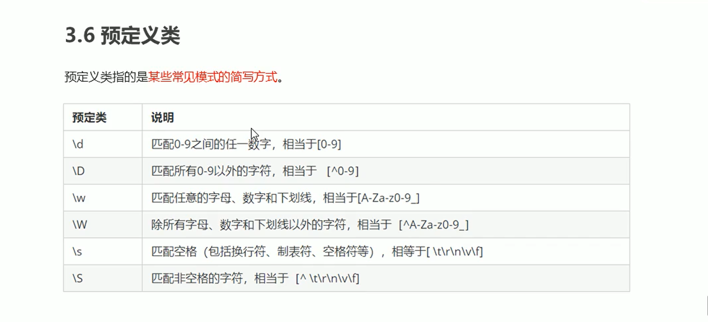

  + 正则表达式的或是`|`。

    验证全国座机号码案例：

    ```js
      // 010-12345678  或者 0530-1234567
      // 写法一
      var reg = /^\d{3}-\d{8}|\d{4}-\d{7}$/
    
      // 写法二
      var reg2 = /^\d{3,4}-\d{7,8}$/
    ```

    

+ 正则表达式做表单验证案例

  ```html
    <style>
      * {
        margin: 0;
        padding: 0;
      }
      .wrong {
        color: red;
      }
      .right {
        color: green;
      }
      
    </style>
  </head>
  <body>
    <input type="text">
    <span>请输入用户名</span>
  </body>
  <script>
    var inp = document.querySelector('input')
    var sp = document.querySelector('span')
  
    // 先顶一个正则表达式规则，通过这个规则去判断字符串是否符合格式。
    var reg = /^[a-zA-Z0-9-_]{6,16}$/
  
    inp.addEventListener('blur', function() {
      var content = inp.value.trim()
      if(content) {
        if(reg.test(content)) {
          sp.className = 'right'
          sp.innerHTML = '格式正确'
        }else {
          sp.className = 'wrong'
          sp.innerHTML = '格式不正确'
        }
  
      }else {
        sp.innerHTML = '内容为空'
        sp.className = 'wrong'
      }
    })
  
  </script>
  ```

### ES6

#### 变量let

> 1. 什么是块级作用域？就是大括号里面的就是块级作用域，比如`if(){}`，`for(){}`。ES6之前只有函数的大括号里的局部作用域和全局作用域。
>
> 2. 为什么需要局部作用域，或者说为什么需要块级作用域？为什么说可以防止变量的命名冲突？归根结底就是防止块级作用域变量覆盖全局作用域变量。

+ `let`

  + 是声明变量的关键字

  + 使用`let`声明的变量==具有块级作用域==。使用`var`声明的变量只有函数的局部作用域和全局作用域。

    ```js
      if(true) {
        let a = 10
        var b = 20
        console.log(a); // 10
        console.log(b); // 20
      }
      console.log(a); // 访问不到
      console.log(b); // 20
    ```

  + 使用`let`关键字做`for`循环，可以==防止类似于`i`变成全局变量==。

    如果使用`var`声明变量

    ```js
      // 使用var声明的变量不具备块级作用域，会变成全局变量。
      for(var i = 0; i < 2; i++) {
    
      }
      // 当循环结束i就不应该是全局变量，会有覆盖名字相同的全局变量的风险。
      console.log(i); // 2
    ```

    使用`let`声明变量

    ```js
     // 使用let声明的变量具备块级作用域，不会成为全局变量，是局部变量。
      for(let i = 0; i < 2; i++) {
    
      }
      // 当循环结束i始终是局部变量，不会污染全局变量，防止覆盖同名的全局变量。
      console.log(i); // 报错
    ```

  + 使用`let`声明变量==不存在==变量提升，即要先声明才可以使用。`var`声明变量存在变量提升。

    `var`声明变量

    ```js
      console.log(num) // undefined，表示已经声明，没有赋值操作。
      var num = 10
    
      // 上面的代码是如下运行的
      // 先变量提升
      var num
      console.log(num)
      // 在原地赋值
      num = 10
    ```

    `let`声明变量

    ```js
      console.log(num) // 报错，因为不存在变量提升
      let num = 10
    ```

  + 使用`let`声明的变量具有暂时性死区：就是使用`let`声明的变量已经和块级作用域绑定。

    ```js
     var num = 10
      if(true) {
        num = 20  // 会报错，因为会有暂时性死区，num这个变量已经属于这个块级作用域了。没有声明就使用会报错。
        let num
      }
     
    ```

  > `let`面试题：
  >
  > 1. ```js
  >     var arr = []
  >      for(var i = 0; i < 2; i++) {
  >        arr[i] = function() {
  >          console.log(i);
  >        }
  >      }
  >                    
  >      arr[0]() // 2
  >      arr[1]() // 2
  >                    
  >      // 上面的代码可以如下拆解:
  >      // 假设用{}代表一次循环体
  >      // 第一次循环
  >      {
  >                    
  >        var i = 0
  >        arr[0] = function() {
  >          console.log(i);
  >        }
  >        i++
  >                    
  >      }
  >    
  >    
  >      // 第二次循环
  >      {
  >                    
  >        var i = 1 // i已经是1
  >        arr[1] = function() {
  >          console.log(i);
  >        }
  >        i++ //循环结束i是2
  >                    
  >      }
  >                    
  >      // 由于使用var声明变量没有块级作用域，i是全局作用域下的全局变量。
  >      // 当循环结束调用函数，i是全局作用域的全局变量，且每次循环体的i都是同一个作用域下的变量，就会被覆盖。
  >    
  >    
  >    ```
  >
  > 2. ```js
  >     var arr = []
  >      for(let i = 0; i < 2; i++) {
  >        arr[i] = function() {
  >          console.log(i);
  >        }
  >      }
  >    
  >      arr[0]() // 0
  >      arr[1]() // 1
  >    
  >      // // 上面的代码可以如下拆解:
  >      // // 假设用{}代表一次循环体
  >      // // 第一次循环
  >      // {
  >    
  >      //   let i = 0
  >      //   arr[0] = function() {
  >      //     console.log(i);
  >      //   }
  >      //   i++
  >    
  >      // }
  >    
  >    
  >      // // 第二次循环
  >      // {
  >    
  >      //   let i = 1 // i已经是1
  >      //   arr[1] = function() {
  >      //     console.log(i);
  >      //   }
  >      //   i++ //循环结束i是2
  >    
  >      // }
  >    
  >      // // 由于使用let声明变量有块级作用域，i是局部作用域下的局部变量。
  >      // // 函数查找变量时，根据作用域链往上一层查找，i是不同作用域的变量，所以各自独立，输出的值就不一样。
  >    ```
  >
  >    


#### 常量const

+ `const`：声明常量，就是值(内存地址)不能变化的量。

  + 具有块级作用域。

    ```js
     if(true) {
        const a = 10
        console.log(a); // 10
    
      }
      console.log(a); // 报错，a is not defined
    ```

  + 使用`const`关键字声明常量时必须赋初始值。

    ```js
    const PI // 报错
    
    ```

  + 使用`const`关键字声明的常量的值不能修改。

    1. 如果这个常量是简单数据类型，值不能修改。

       ```js
       const PI = 3.14
        PI = 5 // 报错
       ```

    2. 如果常量的值是复杂数据类型，则不能重新赋值，不能改变存在栈中的地址。但是可以改变存在堆中的数据。

       ```js
       const arr = [100, 200]
       // 更改了内存地址
        arr = [1, 2] // 报错
       ```

       ```js
        const arr = [100, 200]
        // 没有更改内存地址，只是更改了堆中的数据
        arr[0] = 1
        arr[1] = 2
        console.log(arr); // [1, 2]
       ```

#### var let const 的区别

+ 

+ 声明函数时可以使用const关键字，js解析时不会实时监控这个常量，执行效率会比较高。

#### 结构赋值

+ 结构是指对复杂数据类型进行结构，赋值是指对变量进行赋值。用结构赋值是为了方便变量的赋值，省的多写代码而已。

+ 数组的结构赋值

  + 变量和数组元素要一一对应。如果找不到对应的元素，则变量就是undefined。

    ```js
      var arr1 = [1, 2, 3]
      // 注意：左边的是结构赋值，并不是数组，且里面的不用加引号，因为是变量。
      var [a, b, c] = arr1
      console.log(a); // 1
      console.log(b); // 2
      console.log(c); // 3
    
      var arr2 = [4]
      var [d, e] = arr2
      console.log(d); // 4
      console.log(e); // undefined
    ```

+ 对象的结构赋值

  ```js
    var person = {uname: 'hu', age: 15, sex: '男'}
  
    // 左侧的{}并不是对象，是解构赋值的写法。
    // myname是uname的别名
    var {uname: myname, age, sex} = person
    
    console.log(myname); // hu
    console.log(age); // 15
    console.log(sex); // 男
   
  
  ```

#### 箭头函数

+ 箭头函数是简化函数的定义方式而已。

+ 箭头函数的语法及特点

  + 语法：`() => {}`

  + 如果箭头函数的函数体内只有一句代码，且这句代码就是函数的返回值，可以省略大括号和return。

    ```js
     // var fn = (x, y) => {
      //   return x + y
      // }
      // console.log(fn(1, 2)); // 3
    
    
      // // 上面的代码可以简写
      const fn = (x, y) => x + y
      console.log(fn(2, 3)); // 5
    ```

  + 如果箭头函数的形参只有一个，可以省略小括号。如果没有形参，则小括号不能省略。

    ```js
      // 如果函数的形式参数只有一个，则可以省略小括号。
      const fn = x => x
      console.log(fn(9)); // 9
    
    
      // 如果没有参数则小括号不能省略。
      const fun = () => console.log(123)
      fun() // 123
    ```

  + 箭头函数内部的this指向。

    + 是由上一级作用域继承而来的。

      ```js
      const fn = () => {
        //  由上一级继承而来的，上一级是全局作用域，全局作用域的this指向window。
         console.log(this); 
       }
      
       fn() // window
      ```

      ```js
       var obj = {
         fn: function() {
      
           const fun = () => {
             console.log(this);
           }
           fun()
      
         }
       }
      
      // fn是一个匿名函数，匿名函数的this指向它的直接调用者，fun是箭头函数，箭头函数的this指向是由上一级作用域继承而来的
       obj.fn() // obj
      ```

#### 剩余参数（...arg）

> `arguments`是参数的意思。
>
> `...a`这个就是剩余参数的写法。这个a就是剩余参数形成的数组。而`...a`是一大堆变量或者参数的省略写法。`...a`可以看成`x, y, z, k...`等这些变量或者参数的省略写法，这些变量或者参数会形成一个数组`a = [x, y, z, k]`。

+ 在普通函数内部，有一个`arguments`伪数组，里面存放函数调用时的所有参数。`arguments`是伪数组，所以不能使用数组的方法，如果非要遍历这个伪数组，只能使用for循环的方式。

  ```js
  function fn(a) {
    // console.log(arguments[0]);
    // console.log(arguments[1]);
    // console.log(arguments[2]);
    console.log(arguments); // 是一个伪数组，存放函数参数的所有值 [1, 2, 3]
    console.log(a);// 1
  }
  fn(1, 2, 3) 
  ```

+ 在箭头函数内部没有`arguments`伪数组的存在，只能用剩余参数的形式。这个剩余参数变量是一个数组，可以使用数组的方法。

  + 如果只有一个剩余参数的形参，那么所有的函数调用时的实参都将存入arg这个数组里。

    ```js
    // 如果只有一个剩余参数的写法，那么所有的函数调用时的实参都将存入arg这个伪数组里。
    const fn = (...arg) => {
      console.log(arg); // [1, 2, 3]
      arg.forEach(function(v) {
        console.log(v);
      })
      
    }
    fn(1, 2, 3)
    ```

  + 如果除了arg这个剩余参数，还有其他的形参，那么这个arg将存放剩余的实参，不是所有的实参，区别于普通函数的`arguments`。

    ```js
    // 如果除了arg这个剩余参数，还有其他的形参，那么这个arg将存放剩余的实参。
    const fn = (a, ...arg) => {
      console.log(a); // 1
      console.log(arg); // [2, 3]
     
      
    }
    fn(1, 2, 3)
    ```

+ 剩余参数的应用

  + ==剩余参数==配合==数组的解构赋值==做数组的==浅拷贝==

    ```js
    var arr = [88, 77, 66]
    
    // 这个是数组的结构赋值，数组里的元素一一对应赋值给剩余参数的许多变量。
    // 这些变量会形成一个数组赋值给arr3.
    // 从而潜移默化形成数组的浅拷贝。
    var [...arr3] = arr
    arr[0] = 5
    console.log(arr3); // [88, 77, 66]
    console.log(arr); // [5, 77, 66]
    
    ```

#### 扩展运算符(展开语法)

+ 使用剩余参数的逆向思维(也叫数组的扩展运算符)做数组的拼接一

  ```js
  var arr1 = [1, 2, 3]
  var arr2 = [4, 5, 6]
  
  // 因为a,b,c,d...这些变量或者参数可以简写为...arr。
  // 那么arr = [a,b,c,d...]
  // 所以，一个数组的所有元素就可以用...数组名表示。
  // ...arr1就是 1, 2, 3
  
  var newArr = [...arr1, ...arr2]
  console.log(newArr); // [1, 2, 3, 4, 5, 6]
  ```

+ 使用扩展运算符做数组拼接二

  ```js
  var arr1 = [1, 2, 3]
  var arr2 = [6, 7, 9]
  arr2.push(...arr1)
  console.log(arr2); // [6, 7, 9, 1, 2, 3]
  ```

+ 利用扩展运算符可以把伪数组变为真数组。

  ```html
  <body>
    <ul>
      <li></li>
      <li></li>
      <li></li>
      <li></li>
    </ul>
  </body>
  <script>
    var ul = document.querySelector('ul')
    var lis = ul.querySelectorAll('li')
  
    // lis是一个伪数组
    // console.log(lis);
  
    // 利用扩展运算符把伪数组变为真数组，就可以使用数组对象的方法
    var arr = [...lis]
    console.log(arr);
   
  </script>
  ```

+ 扩展运算符不仅可以展开数组元素，还可以展开Set数据结构

  ```js
   
  var s1 = new Set([1, 2])
  
  // 虽然控制台输出{1, 2}，但是这不能直接使用{1, 2}去创建一个set数据结构。
  console.log(s1); // {1, 2}
  // ...s1就是 1, 2
  
    
  ```

  

#### 数组构造函数的方法

+ `Array.from()`：可以把伪数组转为真正的数组。

  + ```html
    <body>
      <ul>
        <li></li>
        <li></li>
        <li></li>
        <li></li>
      </ul>
    </body>
    <script>
      var ul = document.querySelector('ul')
      var lis = ul.querySelectorAll('li')
    
      // lis是一个伪数组
      // console.log(lis);
    
      // 把伪数组变为真数组，就可以使用数组对象的方法
      var arr = Array.from(lis)
      console.log(arr);
     
    </script>
    ```

  + ```js
     // 第一个参数可以是真数组，也可以是伪数组。第二个参数是一个回调函数，作用跟数组的map方法一样。
      // 是对数组元素进行加工。通过return返回
      var a = [1, 2]
      var arr = Array.from(a, v => v * 2)
      console.log(arr); // [2, 4]
    ```

#### 模板字符串

+ ```js
    // 1. 可以做字符串的拼接
    var uname = '胡鹭斌'
    var str = `我是模板字符串${uname}`
    console.log(str);  // 我是模板字符串胡鹭斌


    // 2. 如果字符串的内容比较多，可以换行。普通字符串的写法，即引号的方式，字符串是不可以换行的。
    var string = `你好啊！
    你是傻逼吗
    `
    console.log(string);

  


    // 3. 可以调用函数
    const fn = () => 123
    var s = `我是${ fn() }`
    console.log(s); // 我是123

  


```js
// 4. 可以写简单的js表达式,三元运算符
var x = 1
var y = 99
var str1 = `哈哈哈${x + y}`
console.log(str1); // 哈哈哈100
```
#### Set数据结构

>  数组，对象都是数据结构中的一种。

+ `Set`是一种数据结构，类似于数组，但是成员的值都是==唯一==的，==没有重复的值==。

  + 应用：可以根据Set数据结构的特点，里面的数据成员是唯一的，存用户搜索的记录。因为用户搜索数据可以关键词是一样的，但是历史记录不能重复。
  
  +  创建`Set`数据结构，只能通过构造函数的形式。
  
    ```js
    
      //  通过Set构造函数创建一个空的Set数据结构
       var s1 = new Set()
       console.log(s1.size); // 0
      
      //  可以接受一个数组作为参数
      var s2 = new Set([1, 2, 3, 3])
      console.log(s2); // {1, 2, 3}
      console.log(s2.size); // 3
    ```
  
    
  
  + 使用`Set`数据结构可以做数组的去重。
  
    ```js
      var arr = ['a', 'a', 'b', 'b']
      var s1 = new Set(arr)
      var newArr = [...s1]
      console.log(newArr); // ['a', 'b']
    ```
  
+ `Set`数据结构的实例成员的实例方法

  + `add(v)`：添加某个值，返回Set数据结构本身。

    ```js
      // 创建一个空的Set数据结构
      var s1 = new Set()
      // 由于返回的是Set数据结构本身，因此可以做链式操作。如果要多次添加可以用循环的做法
      s1.add('a').add('b')
      console.log(s1); // {'a', 'b'}
      console.log(s1.add('a')); // {'a', 'b'}
    
    
      var s2 = new Set()
      // 如果重复添加同一个数据，只会添加这个数据一次
      s2.add('a').add('b').add('a')
      console.log(s2); // {'a', 'b'}
    ```

  + `delete(v)`：删除某个值，返回一个布尔值。

    ```js
      var s1 = new Set()
      s1.add('a').add('b').add('c')
      console.log(s1.delete('a')); // true
      console.log(s1) // {'b', 'c'}
    ```

  + `has(v)`：表示v是否为Set成员，返回一个布尔值。

    ```js
      var s1 = new Set()
      s1.add('a').add('b').add('c')
      console.log(s1.has('a')); // true
    ```

  + `clear()`：清除所有成员，没有返回值。

    ```js
     var s1 = new Set()
     
      s1.add('a').add('b').add('a')
      console.log(s1); // {'a', 'b'}
      s1.clear()
      console.log(s1.size); // 0
    ```

  + `forEach()`：对Set数据结构进行遍历。

    ```js
     var s1 = new Set([1, 2, 3, 4])
     s1.forEach(value => {
       console.log(value);
     })
    ```

    


​	


